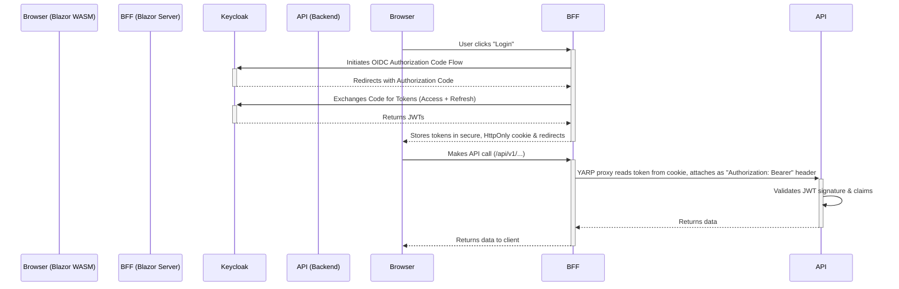

# Authentication & Authorization Patterns

> **Project-Agnostic Authentication & Authorization Guide**
>
> Placeholders use `{Placeholder}` syntax - see [../../../docs/TEMPLATE_GLOSSARY.md](../../../docs/TEMPLATE_GLOSSARY.md).

## Placeholder Substitutions

| Placeholder | Replace With | Example (ISLAMU Event) |
|-------------|--------------|------------------------|
| `{Project}` | Your solution name | `Explore` |
| `{Project}.Blazor` | Blazor Server (BFF) project | `Explore.Blazor` |
| `{Project}.Blazor.Client` | Blazor WASM project | `Explore.Blazor.Client` |
| `{Project}.API` | API project | `Explore.API` |

---

## 🎯 Purpose

This skill provides the standard patterns for implementing security in .NET Clean Architecture projects. It covers the OIDC/JWT authentication flow, the Backend-for-Frontend (BFF) security model, and authorization conventions.

## ⚡ When This Skill Activates

**Triggered by**:
- Keywords: "auth", "security", "jwt", "oidc", "keycloak", "authorize", "claim"
- File patterns: `*Controller.cs`, `*Program.cs` (for auth setup)

## 📚 Resources

| Resource | Description |
|----------|-------------|
| [user-id-extraction.md](resources/user-id-extraction.md) | The critical fallback pattern for extracting user ID from JWT claims. |
| [api-jwt-validation.md](resources/api-jwt-validation.md) | API-side JWT bearer validation, middleware order, and claim validation patterns. |

## 1. Authentication Architecture: BFF with OIDC & JWT

The project uses a **Backend-for-Frontend (BFF)** pattern to handle authentication, which provides a strong security posture by never exposing tokens to the browser.



*   **`{Project}.Blazor` (BFF)**: Is the OIDC client. It handles the redirect to the identity provider and manages the user's session via a cookie.
*   **`{Project}.Blazor.Client` (WASM)**: Is not OIDC-aware. It simply includes credentials (the cookie) with every request to its backend (the BFF).
*   **`{Project}.API`**: Is a stateless service that only trusts JWT Bearer tokens. It has no knowledge of the user's session cookie.

### Implementation Example: ISLAMU Event
- **`Explore.Blazor`**: BFF using Keycloak as the identity provider
- **`Explore.Blazor.Client`**: Blazor WASM client
- **`Explore.API`**: Stateless API validating Keycloak-issued JWTs

## 2. Authorization Conventions

### Controller Endpoint Authorization

A simple and strict convention is followed for API endpoints:
*   **`GET` requests are public**: Decorated with `[AllowAnonymous]`.
*   **`POST`, `PUT`, `DELETE` requests are protected**: Decorated with `[Authorize]`.
*   **Admin-only operations**: Decorated with `[Authorize(Roles = "Admin")]`.
*   **Resource ownership is enforced in handlers**: Controller attributes gate access, handlers enforce business-level ownership and permissions.

**Generic Template:**
```csharp
// ✅ Public read access
[HttpGet]
[AllowAnonymous]
public async Task<ActionResult<List<{Entity}ListDto>>> GetAll()
{
    var {entities} = await _mediator.Send(new Get{Entity}ListRequest());
    return Ok({entities});
}

// ✅ Authenticated write access
[HttpPost]
[Authorize]
public async Task<ActionResult<BaseCommandResponse<{IdType}>>> Create([FromBody] Create{Entity}Dto {entity})
{
    var command = new Create{Entity}Command { {Entity}Dto = {entity} };
    var response = await _mediator.Send(command);
    return Ok(response);
}

// ✅ Admin-only access
[HttpDelete("{id}")]
[Authorize(Roles = "Admin")]
public async Task<ActionResult> DeletePermanent({IdType} id)
{
    var result = await _mediator.Send(new Delete{Entity}PermanentlyCommand { Id = id });
    return result ? NoContent() : NotFound();
}
```

### Implementation Example: ISLAMU Event
```csharp
[HttpGet]
[AllowAnonymous]
public async Task<ActionResult<List<EventListDto>>> GetAll()
{
    var events = await _mediator.Send(new GetEventListRequest());
    return Ok(events);
}

[HttpPost]
[Authorize]
public async Task<ActionResult<BaseCommandResponse<Guid>>> Create([FromBody] CreateEventDto @event)
{
    var command = new CreateEventCommand { EventDto = @event };
    var response = await _mediator.Send(command);
    return Ok(response);
}
```

### Resource-Level Authorization

Resource-level authorization (e.g., "can this user edit *this specific* event?") is the responsibility of the **MediatR handler** in the Application layer, not the controller.

```csharp
// Example: DeleteEventCommandHandler
public async Task<bool> Handle(DeleteEventCommand request, CancellationToken cancellationToken)
{
    // The handler receives the UserId from the controller
    var @event = await _eventRepository.GetById(request.Id);

    if (@event == null)
        return false; // Not found

    // ✅ Handler enforces ownership logic
    var actor = await _actorRepository.GetById(@event.ActorId);
    if (actor == null || actor.UserId.ToString() != request.UserId)
    {
        // User does not own the event, deny deletion
        return false;
    }

    await _eventRepository.Delete(@event);
    return true;
}
```

## 3. User ID Extraction from JWT Claims

For the **CRITICAL PATTERN** for safely and consistently extracting the user ID from JWT claims, including the fallback mechanism for `sub`, `nameidentifier`, and `sid`, refer to [user-id-extraction.md](resources/user-id-extraction.md).

## 4. API JWT Validation and Middleware Order

For API-side JWT setup and common production safeguards, refer to [api-jwt-validation.md](resources/api-jwt-validation.md).

Key points:
- Configure JWT bearer auth with explicit issuer and audience validation.
- Use middleware in the correct order: exception handling, routing/cors, authentication, authorization, endpoint mapping.
- Normalize claim extraction through one shared helper/service instead of duplicating controller logic.
- Log auth failures with structured context, but never log raw tokens.

---
**Related Skills**:
- `clean-architecture-rules`
- `blazor-bff-patterns`
