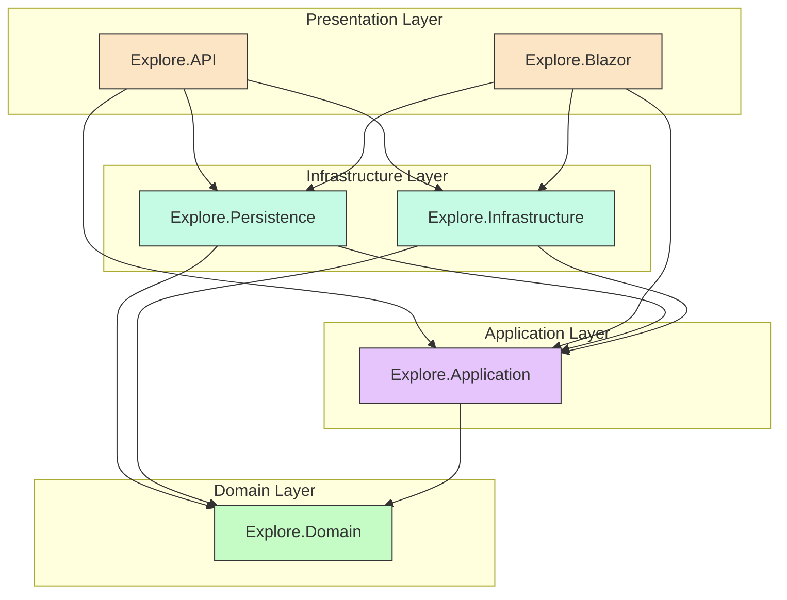

# Dependency Rules - Complete Reference

## Dependency Matrix

| Layer | Can Reference | Cannot Reference | Framework Dependencies Allowed |
|-------|---------------|------------------|-------------------------------|
| **Explore.Domain** | Nothing | Everything | None (pure C#) |
| **Explore.Application** | Domain | Infrastructure, Persistence, API, Blazor | MediatR, FluentValidation, AutoMapper |
| **Explore.Persistence** | Application, Domain | API, Blazor | EF Core, Npgsql, NetTopologySuite |
| **Explore.Infrastructure** | Application, Domain | API, Blazor | Any (email, file storage, external APIs) |
| **Explore.API** | All | None (top layer) | ASP.NET Core, Swashbuckle, Serilog |
| **Explore.Blazor** | All | None (top layer) | Blazor, MudBlazor, SignalR |
| **Explore.Blazor.Client** | Shared DTOs | Server components | Blazor WebAssembly, MudBlazor |

## Visual Dependency Flow



## The Dependency Inversion Principle (DIP)

**Core Idea**: High-level modules should not depend on low-level modules. Both should depend on abstractions.

### Example: Application needs Database Access

**❌ WITHOUT Dependency Inversion** (Violation):
```
Application ──────> Infrastructure
(high-level)        (low-level, concrete)

CreateEventCommandHandler → ExploreDbContext
```
*Problem*: Application layer depends on concrete Infrastructure implementation.

**✅ WITH Dependency Inversion** (Correct):
```
Application ──────> IEventRepository (Interface)
                           ▲
                           │ implements
Infrastructure ────────────┘
EventRepository (implements IEventRepository)
```
*Solution*: Both depend on abstraction (interface) defined in Application.

## Allowed `using` Statements by Layer

### Explore.Domain

**Example from Event.cs**:
```csharp
// File: Explore.Domain/Event.cs
namespace Explore.Domain;

// ✅ ALLOWED - Pure C# only
using System;
using System.Collections.Generic;
using System.ComponentModel.DataAnnotations.Schema;

public class Event
{
    public Guid Id { get; set; }
    
    [ForeignKey("EventType")]
    public int EventTypeId { get; set; }
    public EventType EventType { get; set; }
    
    [ForeignKey("AudienceGender")]
    public int AudienceGenderId { get; set; }
    public AudienceGender AudienceGender { get; set; }
    
    // ... 20+ more navigation properties
}

// ❌ NOT ALLOWED in Domain
using Microsoft.EntityFrameworkCore;           // Infrastructure concern
using Explore.Application;                     // Layer above
using Explore.Infrastructure;                  // Layer above
using Microsoft.AspNetCore.Mvc;                // Presentation concern
using MediatR;                                 // Application concern
```

### Explore.Application

**Example from CreateEventCommandHandler.cs**:
```csharp
// File: Explore.Application/Features/Events/Handlers/Commands/CreateEventCommandHandler.cs
namespace Explore.Application.Features.Events.Handlers.Commands;

// ✅ ALLOWED
using System;
using System.Collections.Generic;
using System.Linq;
using System.Threading;
using System.Threading.Tasks;
using AutoMapper;                                      // Application framework
using Explore.Application.Contracts.Persistence;       // Same layer
using Explore.Application.DTOs.Event;                  // Same layer
using Explore.Application.DTOs.Event.Validators;       // Same layer
using Explore.Application.Features.Events.Requests.Commands;  // Same layer
using Explore.Application.Responses;                   // Same layer
using Explore.Domain;                                  // Domain entities
using MediatR;                                         // CQRS framework

// ❌ NOT ALLOWED
using Explore.Persistence;                     // Infrastructure layer
using Explore.Infrastructure;                  // Infrastructure layer
using Explore.API;                             // Presentation layer
using Microsoft.EntityFrameworkCore;           // Infrastructure concern
using Microsoft.AspNetCore.Mvc;                // Presentation concern
```

### Explore.Persistence

**Example from EventRepository.cs**:
```csharp
// File: Explore.Persistence/Repositories/EventRepository.cs
namespace Explore.Persistence.Repositories;

// ✅ ALLOWED
using System;
using System.Collections.Generic;
using System.Linq;
using System.Threading.Tasks;
using Explore.Application.Contracts.Persistence;       // Application interfaces
using Explore.Domain;                                  // Domain entities
using Microsoft.EntityFrameworkCore;                   // ORM framework
using Npgsql.EntityFrameworkCore.PostgreSQL;           // Database provider
using NetTopologySuite;                                // PostGIS support

// ❌ NOT ALLOWED
using Explore.API;                             // Presentation layer
using Explore.Blazor;                          // Presentation layer
using Microsoft.AspNetCore.Mvc;                // Presentation concern
```

### Explore.Infrastructure

```csharp
// File: Explore.Infrastructure/Email/EmailService.cs
namespace Explore.Infrastructure.Email;

// ✅ ALLOWED
using Explore.Domain;                                  // Domain entities
using Explore.Application.Contracts.Infrastructure;    // Application interfaces
using SendGrid;                                        // External service
using Azure.Storage.Blobs;                             // External service

// ❌ NOT ALLOWED
using Explore.API;                             // Presentation layer
using Explore.Blazor;                          // Presentation layer
using Microsoft.AspNetCore.Mvc;                // Presentation concern
```

### Explore.API

**Example from EventController.cs**:
```csharp
// File: Explore.API/Controllers/EventController.cs
namespace Explore.API.Controllers;

// ✅ ALLOWED (Everything)
using System;
using System.Collections.Generic;
using System.Linq;
using System.Security.Claims;
using System.Threading.Tasks;
using Explore.Application.DTOs.Event;                      // DTOs
using Explore.Application.Features.Events.Requests.Commands;
using Explore.Application.Features.Events.Requests.Queries;
using Explore.Application.Responses;                        // Response wrappers
using MediatR;                                             // CQRS
using Microsoft.AspNetCore.Authorization;                  // Auth
using Microsoft.AspNetCore.Http;                           // HTTP context
using Microsoft.AspNetCore.Mvc;                            // Controllers
using Scalar.AspNetCore;                                   // API docs
// ... any other dependencies
```

## Project Reference Rules (.csproj)

### Explore.Domain.csproj
```xml
<Project Sdk="Microsoft.NET.Sdk">
  <PropertyGroup>
    <TargetFramework>net10.0</TargetFramework>
  </PropertyGroup>

  <!-- ✅ NO PROJECT REFERENCES -->
  <ItemGroup>
    <!-- Only System.ComponentModel.Annotations for [ForeignKey] -->
    <PackageReference Include="System.ComponentModel.Annotations" Version="10.0.0" />
  </ItemGroup>
</Project>
```

### Explore.Application.csproj
```xml
<Project Sdk="Microsoft.NET.Sdk">
  <ItemGroup>
    <!-- ✅ ALLOWED: Reference to Domain -->
    <ProjectReference Include="..\Explore.Domain\Explore.Domain.csproj" />
  </ItemGroup>

  <ItemGroup>
    <!-- ✅ ALLOWED: Framework packages -->
    <PackageReference Include="MediatR" Version="12.4.0" />
    <PackageReference Include="FluentValidation" Version="11.9.0" />
    <PackageReference Include="AutoMapper" Version="13.0.1" />
  </ItemGroup>

  <!-- ❌ NOT ALLOWED: References to Infrastructure, Persistence, API, Blazor -->
</Project>
```

### Explore.Persistence.csproj
```xml
<Project Sdk="Microsoft.NET.Sdk">
  <ItemGroup>
    <!-- ✅ ALLOWED: References to Domain and Application -->
    <ProjectReference Include="..\Explore.Domain\Explore.Domain.csproj" />
    <ProjectReference Include="..\Explore.Application\Explore.Application.csproj" />
  </ItemGroup>

  <ItemGroup>
    <!-- ✅ ALLOWED: EF Core and database packages -->
    <PackageReference Include="Microsoft.EntityFrameworkCore" Version="10.0.0" />
    <PackageReference Include="Npgsql.EntityFrameworkCore.PostgreSQL" Version="10.0.0" />
    <PackageReference Include="NetTopologySuite.IO.GeoJSON" Version="4.0.0" />
  </ItemGroup>
</Project>
```

### Explore.API.csproj
```xml
<Project Sdk="Microsoft.NET.Sdk.Web">
  <ItemGroup>
    <!-- ✅ ALLOWED: References to ALL -->
    <ProjectReference Include="..\Explore.Application\Explore.Application.csproj" />
    <ProjectReference Include="..\Explore.Infrastructure\Explore.Infrastructure.csproj" />
    <ProjectReference Include="..\Explore.Persistence\Explore.Persistence.csproj" />
  </ItemGroup>
</Project>
```

## Verification Commands

### Check Project References
```bash
# Domain should have NO project references
dotnet list Explore.Domain/Explore.Domain.csproj reference

# Application should ONLY reference Domain
dotnet list Explore.Application/Explore.Application.csproj reference

# Persistence should reference Domain + Application
dotnet list Explore.Persistence/Explore.Persistence.csproj reference
```

### Search for Violations
```bash
# Find prohibited using statements in Domain
rg "using (Microsoft\.(EntityFrameworkCore|AspNetCore)|Explore\.(Application|Infrastructure|API|Blazor))" Explore.Domain/

# Find validation annotations in Domain (except [ForeignKey])
rg "\[Required\]|\[MaxLength\]|\[Range\]|\[StringLength\]" Explore.Domain/
```

## Common Questions

### Q: Can Domain use System.ComponentModel.DataAnnotations?
**A**: ⚠️ LIMITED USE. Only `[ForeignKey]` is acceptable for EF Core relationships. Avoid `[Required]`, `[MaxLength]`, `[Range]` etc.

**Real Event Entity Example**:
```csharp
// File: Explore.Domain/Event.cs
public class Event
{
    public Guid Id { get; set; }
    
    // ✅ OK - Specifies foreign key relationship
    [ForeignKey("EventType")]
    public int EventTypeId { get; set; }
    public EventType EventType { get; set; }
    
    // ❌ NOT OK - Validation annotations
    // [Required]
    // [MaxLength(200)]
    public string Title { get; set; } = string.Empty;
}
```

**Why**: `[ForeignKey]` is metadata for EF Core navigation, not validation. Use FluentValidation in Application layer for validation rules.

### Q: Can Application use AutoMapper?
**A**: ✅ YES. AutoMapper is an Application-layer concern for mapping Domain entities to DTOs.

**Real Example from GetEventListRequestHandler.cs**:
```csharp
// File: Explore.Application/Features/Events/Handlers/Queries/GetEventListRequestHandler.cs
public class GetEventListRequestHandler : IRequestHandler<GetEventListRequest, List<EventListDto>>
{
    private readonly IEventRepository _eventRepository;
    private readonly IMapper _mapper;

    public async Task<List<EventListDto>> Handle(GetEventListRequest request, CancellationToken cancellationToken)
    {
        var events = await _eventRepository.GetEventsWithDetails();  // Returns List<Event>
        return _mapper.Map<List<EventListDto>>(events);  // ✅ Maps to DTOs
    }
}
```

### Q: Can Application reference EF Core for IQueryable?
**A**: ❌ NO. Define repository interfaces that return `Task<List<T>>` instead. Let Infrastructure handle IQueryable.

**Correct Pattern**:
```csharp
// File: Explore.Application/Contracts/Persistence/IEventRepository.cs
namespace Explore.Application.Contracts.Persistence;

public interface IEventRepository : IGenericRepository<Event, Guid>
{
    Task<Event?> GetEventWithDetails(Guid id);
    Task<List<Event>> GetEventsWithDetails();  // ✅ Returns List<Event>, not IQueryable
    Task<List<Event>> GetMyEventsWithDetails(string userId);
}

// File: Explore.Persistence/Repositories/EventRepository.cs
public class EventRepository : GenericRepository<Event, Guid>, IEventRepository
{
    public async Task<List<Event>> GetEventsWithDetails()
    {
        return await _dbContext.Events  // ✅ EF Core IQueryable handled here
            .Include(e => e.EventType)
            .Include(e => e.AudienceGender)
            .Include(e => e.AudienceAge)
            .Include(e => e.Actor)
            .ToListAsync();  // ✅ Materializes to List
    }
}
```

### Q: Where do I put Email sending logic?
**A**:
- **Interface**: `Explore.Application/Contracts/Infrastructure/IEmailService.cs`
- **Implementation**: `Explore.Infrastructure/Services/EmailService.cs`
- **Usage**: Application layer uses `IEmailService`, Infrastructure provides SendGrid implementation

### Q: Can Blazor.Client reference Persistence?
**A**: ❌ NO. Blazor.Client runs in the browser (WebAssembly) and cannot access databases directly. Use shared DTOs and API calls.

**Correct Pattern**:
```csharp
// Shared DTO in Explore.Application
public record EventListDto
{
    public Guid Id { get; init; }
    public string Title { get; init; } = string.Empty;
    public string EventTypeName { get; init; } = string.Empty;
}

// API endpoint in Explore.API
[HttpGet]
[AllowAnonymous]
public async Task<ActionResult<List<EventListDto>>> GetAll()
{
    var events = await _mediator.Send(new GetEventListRequest());
    return Ok(events);
}

// Blazor.Client calls API
@inject HttpClient Http

var events = await Http.GetFromJsonAsync<List<EventListDto>>("/api/v1/event");
```

---

**Next**: See [violation-examples.md](violation-examples.md) for common mistakes and [fix-patterns.md](fix-patterns.md) for comprehensive fix strategies.