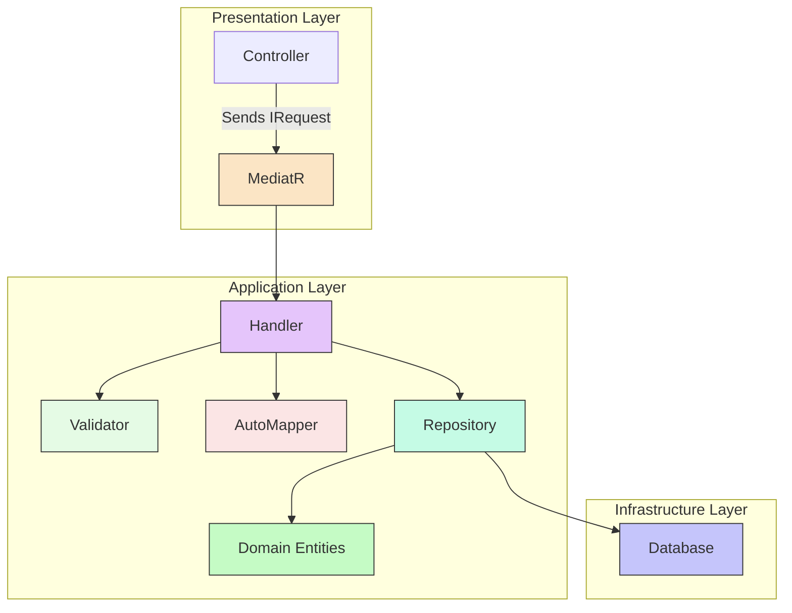

# CQRS + MediatR Guidelines

## 🎯 Purpose

Provides best practices for implementing **CQRS** (Command Query Responsibility Segregation) using **MediatR** in ISLAMU Event project. Ensures consistent, testable, and maintainable application logic.

## ⚡ When This Skill Activates

**Triggered by**:
- Keywords: "command", "query", "handler", "mediatr", "cqrs", "validation", "validator"
- Intent patterns: "create feature", "add endpoint", "implement use case"
- File patterns: `**/*Command.cs`, `**/*Query.cs`, `**/*Handler.cs`, `**/*Validator.cs`
- Content patterns: `IRequest`, `IRequestHandler`, `AbstractValidator`

## 📐 CQRS Pattern Overview



## 🔑 Key Principles

1.  **Separation**: Commands (write operations) and Queries (read operations) are distinct.
2.  **Single Responsibility**: Each handler processes one specific request (command or query).
3.  **Class Requests**: Commands and Queries are defined as classes.
4.  **Validation**: FluentValidation is used at the Application boundary for input validation.
5.  **Thin Controllers**: Controllers should be minimal, primarily responsible for receiving HTTP requests, sending them to MediatR, and returning HTTP responses.
6.  **CancellationToken**: Always pass `CancellationToken` to all asynchronous methods to enable cancellation.
7.  **Repository Returns Entities**: Repositories must return domain entities, and handlers are responsible for mapping these entities to DTOs.
8.  **Validators Use Manual Instantiation**: Validators are instantiated manually within handlers, **NOT** injected via Dependency Injection.

## 📚 Resources

*For more detailed examples, refer to the `resources/` folder within this skill.*

| Resource | Description |
|----------|-------------|
| [command-patterns.md](resources/command-patterns.md) | Command structure, naming, handlers |
| [query-patterns.md](resources/query-patterns.md) | Query structure, pagination, projections |
| [handler-patterns.md](resources/handler-patterns.md) | Handler implementation, DI, error handling |
| [validation-integration.md](resources/validation-integration.md) | FluentValidation patterns and manual integration |
| [complete-examples.md](resources/complete-examples.md) | End-to-end feature examples for CQRS |

## ⚡ Quick Reference

### 1. Command (Write Operation)

Commands represent actions that modify the application's state.

```csharp
// File: Explore.Application/Features/Events/Requests/Commands/CreateEventCommand.cs
namespace Explore.Application.Features.Events.Requests.Commands;

using MediatR;
using Explore.Application.DTOs.Event;
using Explore.Application.Responses;

public class CreateEventCommand : IRequest<BaseCommandResponse<Guid>>
{
    public CreateEventDto EventDto { get; set; } // Command wraps a DTO
}
```
*For more details, see [command-patterns.md](resources/command-patterns.md).*

### 2. Query (Read Operation)

Queries represent requests for data and should not alter the application's state.

```csharp
// File: Explore.Application/Features/Events/Requests/Queries/GetEventListRequest.cs
namespace Explore.Application.Features.Events.Requests.Queries;

using System.Collections.Generic;
using Explore.Application.DTOs.Event;
using MediatR;

public class GetEventListRequest : IRequest<List<EventListDto>>
{
    // Can include filter properties if needed
}
```
*For more details, see [query-patterns.md](resources/query-patterns.md).*

### 3. Handler (Processing Logic)

Handlers contain the business logic to execute a command or query.

```csharp
// File: Explore.Application/Features/Events/Handlers/Commands/CreateEventCommandHandler.cs
namespace Explore.Application.Features.Events.Handlers.Commands;

using System.Linq;
using System.Threading;
using System.Threading.Tasks;
using AutoMapper;
using Explore.Application.Contracts.Persistence;
using Explore.Application.DTOs.Event.Validators;
using Explore.Application.Features.Events.Requests.Commands;
using Explore.Application.Responses;
using MediatR;

public class CreateEventCommandHandler : IRequestHandler<CreateEventCommand, BaseCommandResponse<Guid>>
{
    private readonly IEventRepository _eventRepository;
    private readonly IMapper _mapper;
    // ... other dependencies needed for validation or business logic

    public CreateEventCommandHandler(IEventRepository eventRepository, IMapper mapper /* ... */)
    {
        _eventRepository = eventRepository;
        _mapper = mapper;
    }

    public async Task<BaseCommandResponse<Guid>> Handle(CreateEventCommand request, CancellationToken cancellationToken)
    {
        var response = new BaseCommandResponse<Guid>();

        // ✅ CRITICAL: Manual validator instantiation with dependencies
        var validator = new CreateEventDtoValidator(/* repositories */);
        var validationResult = await validator.ValidateAsync(request.EventDto, cancellationToken);

        if (!validationResult.IsValid)
        {
            response.Success = false;
            response.Message = "Event creation failed.";
            response.Errors = validationResult.Errors.Select(e => e.ErrorMessage).ToList();
            return response;
        }

        var @event = _mapper.Map<Event>(request.EventDto);
        @event.TotalViews = 0; // Set properties not coming from DTO
        @event = await _eventRepository.Create(@event);

        response.Success = true;
        response.Id = @event.Id;
        response.Message = "Event created successfully.";
        return response;
    }
}
```
*For more details, see [handler-patterns.md](resources/handler-patterns.md).*

### 4. Validation (Manual Integration)

FluentValidation is used for input validation, with validators instantiated manually within handlers.

```csharp
// File: Explore.Application/DTOs/Event/Validators/CreateEventDtoValidator.cs
namespace Explore.Application.DTOs.Event.Validators;

using FluentValidation;
using Explore.Application.Contracts.Persistence;

public class CreateEventDtoValidator : AbstractValidator<CreateEventDto>
{
    public CreateEventDtoValidator(IAudienceAgeRepository audienceAgeRepository /* ... */)
    {
        // ... inject repositories needed for FK validation

        RuleFor(x => x.Title)
            .NotEmpty().WithMessage("Title is required")
            .MaximumLength(200);
        
        RuleFor(x => x.AudienceAgeId)
            .NotEmpty().WithMessage("Audience Age is required")
            .MustAsync(async (id, cancellation) => await audienceAgeRepository.Exists(id))
            .WithMessage("Audience Age not found");
    }
}
```
*For more details, see [validation-integration.md](resources/validation-integration.md).*

## ✅ Do's

-   ✅ **DO** separate Commands (write) and Queries (read).
-   ✅ **DO** use classes for Commands/Queries (not records).
-   ✅ **DO** pass `CancellationToken` to all asynchronous methods.
-   ✅ **DO** use repositories that return domain entities (not DTOs).
-   ✅ **DO** perform DTO mapping in handlers using AutoMapper.
-   ✅ **DO** instantiate validators manually within handlers.
-   ✅ **DO** keep controllers thin, delegating to MediatR.
-   ✅ **DO** use `BaseCommandResponse<Guid>` for command responses (except `bool` for Delete).

## ❌ Don'ts

-   ❌ **DON'T** return entities directly from query handlers.
-   ❌ **DON'T** put business logic in controllers.
-   ❌ **DON'T** use `IRequest` without a response type.
-   ❌ **DON'T** use `.Result` or `.Wait()` in asynchronous code.
-   ❌ **DON'T** mutate state in query handlers.
-   ❌ **DON'T** throw exceptions for business validation failures; return them in the `BaseCommandResponse`.
-   ❌ **DON'T** inject validators via Dependency Injection.

---

**Related Documentation**:
- [`docs/ARCHITECTURE.md`](../../../docs/ARCHITECTURE.md) - Overall system architecture.
- [`clean-architecture-rules`](../../clean-architecture-rules/SKILL.md) - Dependency enforcement.