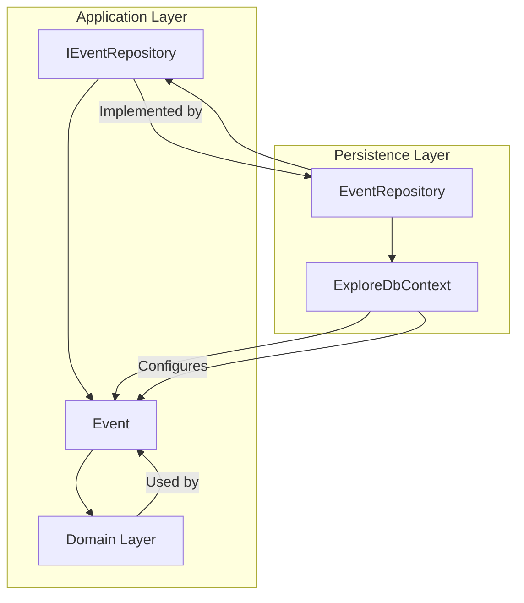

name: dotnet-efcore-guidelines
description: Entity Framework Core best practices for ISLAMU Event. Covers DbContext, entity configurations, repository pattern, migrations, and PostgreSQL-specific features.
type: domain
enforcement: suggest
priority: high
---

# .NET + Entity Framework Core Guidelines

## 🎯 Purpose

This skill provides comprehensive best practices for using Entity Framework Core with PostgreSQL in the ISLAMU Event project. It details conventions for DbContext, entity configurations, repository patterns, migrations, and PostgreSQL-specific features.

## ⚡ When This Skill Activates

**Triggered by**:
- Keywords: "ef core", "entity framework", "dbcontext", "repository", "migration", "database", "postgres", "postgresql"
- File patterns: `**/Persistence/**/*.cs`, `**/Repositories/**/*.cs`, `**/*DbContext.cs`, `**/Configurations/**/*.cs`

## 🏗️ ISLAMU Event EF Core Architecture

The persistence layer (`Explore.Persistence`) is responsible for data access and storage. It implements interfaces defined in the Application layer, adhering to Clean Architecture principles.



## 📚 Resources

*For more detailed examples, refer to the `resources/` folder within this skill.*

| Resource | Description |
|----------|-------------|
| [dbcontext-patterns.md](resources/dbcontext-patterns.md) | DbContext configuration, `SaveChangesAsync` override |
| [entity-configuration.md](resources/entity-configuration.md) | `IEntityTypeConfiguration`, TPT, PostgreSQL functions |
| [repository-pattern.md](resources/repository-pattern.md) | `GenericRepository`, custom repositories |
| [querying-patterns.md](resources/querying-patterns.md) | `Include`, `Select`, projections, performance |
| [migrations.md](resources/migrations.md) | Creating and applying migrations |

## ⚡ Quick Reference

### 1. DbContext Pattern

The `ExploreDbContext` manages database interactions.

```csharp
// File: Explore.Persistence/ExploreDbContext.cs
public class ExploreDbContext : DbContext
{
    public ExploreDbContext(DbContextOptions<ExploreDbContext> options) : base(options) { }

    protected override void OnModelCreating(ModelBuilder modelBuilder)
    {
        base.OnModelCreating(modelBuilder);
        // Automatically applies all IEntityTypeConfiguration<T> from the assembly
        modelBuilder.ApplyConfigurationsFromAssembly(typeof(ExploreDbContext).Assembly);
    }

    // Override SaveChangesAsync for cross-cutting concerns like auditing or soft deletes
    public override Task<int> SaveChangesAsync(CancellationToken cancellationToken = default)
    {
        // Example: Audit logging or automatic timestamp updates
        foreach (var entry in ChangeTracker.Entries())
        {
            // Handle CreatedAt, UpdatedAt logic
        }
        return base.SaveChangesAsync(cancellationToken);
    }

    public DbSet<Event> Events { get; set; } = null!;
    public DbSet<Organization> Organizations { get; set; } = null!;
    // ... other DbSets
}
```

*For more details, see [dbcontext-patterns.md](resources/dbcontext-patterns.md).*

### 2. Entity Configuration

All entity-specific configurations are done using `IEntityTypeConfiguration<T>` in separate classes.

```csharp
// File: Explore.Persistence/Configurations/Entities/EventConfiguration.cs
public class EventConfiguration : IEntityTypeConfiguration<Event>
{
    public void Configure(EntityTypeBuilder<Event> builder)
    {
        // Project Standard: Table Per Type (TPT) inheritance strategy
        builder.UseTptMappingStrategy();

        // Project Standard: UUIDv7 primary keys for main entities
        builder.Property(e => e.Id).HasDefaultValueSql("uuidv7()");

        // Database-level defaults are acceptable here, not in domain entities
        builder.Property(e => e.TotalViews).HasDefaultValue(0);

        builder.Property(e => e.Title).HasMaxLength(200).IsRequired();
        builder.Property(e => e.Description).HasMaxLength(5000);
        
        // Example relationship configuration
        builder.HasOne(e => e.Actor)
            .WithMany()
            .HasForeignKey(e => e.ActorId)
            .OnDelete(DeleteBehavior.Restrict);
    }
}
```

*For more details, see [entity-configuration.md](resources/entity-configuration.md).*

### 3. Repository Pattern

Repositories abstract data access. Interfaces reside in the Application layer, and implementations are in the Persistence layer.

**CRITICAL RULE**: Repositories **MUST** return **DOMAIN ENTITIES**, not DTOs. DTO mapping always happens in the Application layer handlers via AutoMapper.

```csharp
// File: Explore.Application/Contracts/Persistence/IEventRepository.cs (Application Layer)
public interface IEventRepository : IGenericRepository<Event, Guid>
{
    Task<List<Event>> GetEventsWithDetails(); // Returns List<Event>
    Task<Event?> GetEventWithDetails(Guid id); // Returns Event?
}

// File: Explore.Persistence/Repositories/EventRepository.cs (Persistence Layer)
public class EventRepository : GenericRepository<Event, Guid>, IEventRepository
{
    private readonly ExploreDbContext _dbContext;

    public EventRepository(ExploreDbContext dbContext) : base(dbContext) => _dbContext = dbContext;

    public async Task<List<Event>> GetEventsWithDetails()
    {
        return await _dbContext.Events
            .Include(e => e.EventType)
            .Include(e => e.AudienceGender)
            .Include(e => e.AudienceAge)
            .ToListAsync(); // Returns entities
    }
}
```

*For more details, see [repository-pattern.md](resources/repository-pattern.md).*

### 4. Querying Patterns

Efficient querying is crucial for performance. Avoid N+1 issues by using eager loading (`Include`) and projections (`Select`).

```csharp
// Example: Query with eager loading and projection to DTO (in Application Layer Handler)
public async Task<List<EventListDto>> Handle(GetEventListRequest request, CancellationToken cancellationToken)
{
    var events = await _eventRepository.GetEventsWithDetails(); // Repository returns entities
    return _mapper.Map<List<EventListDto>>(events); // Handler maps to DTOs
}

// Example: Using AsNoTracking for read-only queries (in Repository)
public async Task<List<Event>> GetEventsReadOnly()
{
    return await _dbContext.Events
        .AsNoTracking() // Disables change tracking for performance
        .Include(e => e.Organization)
        .ToListAsync();
}
```

*For more details, see [querying-patterns.md](resources/querying-patterns.md).*

### 5. Migrations

Database schema changes are managed through EF Core migrations.

```powershell
# Create a new migration for schema changes
dotnet ef migrations add AddNewFieldToEvent --project Explore.Persistence

# Apply pending migrations to the database
dotnet ef database update --project Explore.Persistence

# Generate SQL script for production deployment
dotnet ef migrations script --idempotent --output migrations/release.sql --project Explore.Persistence
```

*For more details, see [migrations.md](resources/migrations.md).*

## 🔑 Key Principles & Conventions

*   **IDs**: All primary keys are `Guid`, except for lookup tables which use `int`.
*   **Numeric Types**: Use `int` instead of `long` unless explicitly required for large values (e.g., file sizes, pagination cursors).
*   **Default Values**: **DO NOT** add default values in domain entity property initializers (e.g., `public int TotalViews { get; set; } = 0;`). Set defaults in application handlers or use database-level defaults via `IEntityTypeConfiguration`.
*   **Link Tables**: Navigation properties on link/mapping tables are **readonly for queries only**. Writes must go through the link table's repository directly.
*   **PostgreSQL Features**: Leverage PostgreSQL-specific features like `UUIDv7` for primary keys and PostGIS for spatial data handling.

---

**Related Documentation**:
- [`docs/DOMAIN.md`](../../../docs/DOMAIN.md) - Conceptual domain model.
- [`docs/ARCHITECTURE.md`](../../../docs/ARCHITECTURE.md) - Overall system architecture.
- [`clean-architecture-rules`](../../clean-architecture-rules/SKILL.md) - Dependency enforcement.
