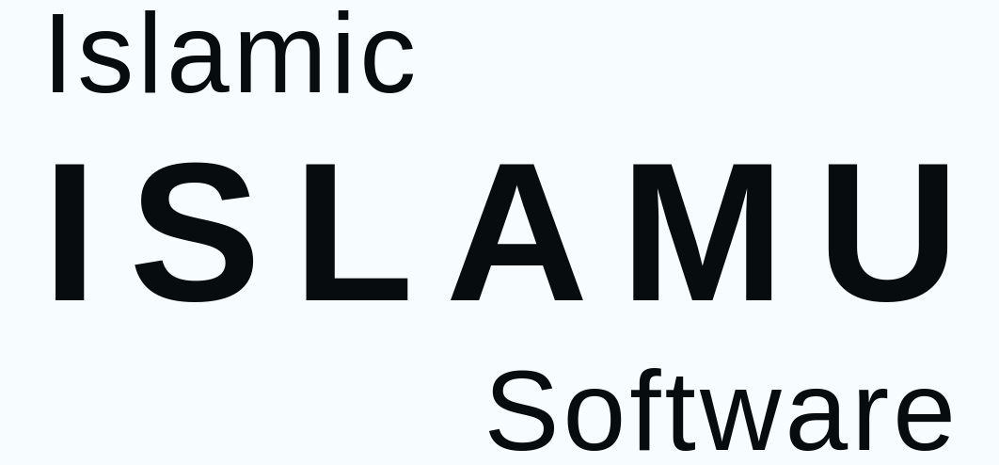

<a name="readme-top"></a>

<div align="center">



# ISLAMU Event

Self-hostable, open-source event discovery and management software for communities, organizations, and platform operators.

ISLAMU Event powers ISLAMU’s Islamic events instance, but the software itself is purpose-agnostic, white-label, and designed to be rebranded for any event ecosystem.

> Pre-1.0 notice: ISLAMU Event is still before v1. Breaking changes may happen between releases. We avoid data-loss-class breaks where possible, but configuration changes may be required.

Operator references: [Self-hosting](docs/SELF_HOSTING.md) ·
[Configuration](docs/CONFIGURATION.md) · [Configuration Manifest](docs/CONFIGURATION_MANIFEST.md) ·
[Secrets](docs/SECRETS.md) · [Troubleshooting](docs/TROUBLESHOOTING.md)

![GitHub Workflow Status][github-workflow-status-shield]
[![GitHub License][github-license-shield]][github-license-link]
[![GitHub Repo Stars][github-stars-shield]][github-stars-link]
[![GitHub Last Commit][github-last-commit-shield]][github-last-commit-link]
[![Contributors][github-contributors-shield]][github-contributors-link]
[![Discussions][github-discussions-shield]][github-discussions-link]
[![Discord][discord-shield]][discord-link]

[**ISLAMU Islamic Events Instance**][islamu-platform] · [**Quick Start**](#quick-start) · [**Docs**](docs/index.md) · [**Roadmap**][roadmap-link]

</div>

## About ISLAMU Event

ISLAMU Event is a **self-hostable event discovery and management platform** for publishing, discovering, and operating events across one organization or many isolated tenants.

The public ISLAMU instance is Islamic-focused, but the software itself is **purpose-agnostic, white-label, and designed to be rebranded for any event ecosystem**.

![Event List Screenshot][event-list-image]

## ✨ Who It Serves

### Event Seekers

- **🔍 Advanced Discovery:** Event search with title, dates, location, categories, tags, and paging filters
- **👨‍👩‍👧‍👦 Culturally-Aware Filters (opt-in modules):** Age ranges, gender segregation modes, madhab targeting, prayer-relative timing — only enabled by instances that choose them; never imposed on the software
- **🌐 Multi-Language Sessions:** Event sessions with multiple language variants and localized content
- **📱 PWA & Responsive Design:** Mobile-friendly Blazor UI with MudBlazor components; installable as a Progressive Web App
- **✅ RSVP & Registration:** Waitlists, approval workflows, per-session registration limits, and capacity management
- **🎟️ Ticketing:** Discover events with free or paid tickets; view published ticket types, price summaries, and availability directly in event discovery and detail pages
- **💳 Seamless & Secure Checkout:** Pay for ticketed events with transparent pricing, zero card data stored on-platform, and guaranteed refund protections — see [Payments][payments-doc]
- **🤖 AI Assistant (when enabled):** Chat with the assistant to discover events, ask questions in natural language, and let it draft registrations or RSVPs as confirmable proposed actions

### Event Organizers

- **📅 Single & Multi-Session Events:** Conferences, seminars, and recurring programs with speakers, agendas, and language variants
- **📊 Flexible Publishing:** Manage registrations, waitlists, approval workflows, capacity limits, and event visibility
- **👥 Member Management:** Invite members, assign roles (Owner, Admin, Editor, Viewer), and track permissions
- **🎯 Modular Event Types:** Custom fields, event aspects, and event templates for any kind of program
- **🧩 Custom Properties:** Per-event-type custom fields, single- and multi-select options, relations, and typed validation — see [Custom Properties][custom-properties-doc]
- **🔔 Notifications, Email & Webhooks:** In-app notifications, built-in/Svix-compatible outgoing webhooks, and templated email pipelines — see [Notifications][notifications-doc], [Webhooks][webhooks-doc], and [Email Notifications][email-notifications-doc]
- **📇 Contact Sharing:** Share contact information with explicit, revocable consent — see [Contact Sharing][contact-sharing-doc]
- **🎟️ Ticketing & Pricing:** Create versioned ticket catalogs with multiple ticket types, capacity pools, and minor-unit pricing. Publish a catalog to attach structured pricing to an event; ticket price summaries appear in public discovery automatically. Draft, clone, and iterate before publishing
- **💳 Direct Ticket Payments (OrganizerDirect):** Connect your own payment account (via Stripe Connect) with no platform intermediary holding your funds. Ticket proceeds flow directly to your linked bank account with transparent fee breakdowns and automated refund handling — see [Payments][payments-doc]
- **📬 Mailing List Integration (Listmonk):** Optionally connect a self-hosted [Listmonk][listmonk-link] instance to automatically sync attendee registrations as newsletter subscribers, with pre-confirmation support and per-tenant configuration
- **🤖 AI Assistant (when enabled):** Ask the assistant to draft event listings, suggest categories/tags, and propose schedule improvements; every AI-proposed change is reviewed and explicitly confirmed before any side effect
- **🌍 Decentralization / Federation:** Depending on if event federation support is enabled, publish once and have your event appear on all the event platforms that support federation. Depending on if AT-Protocol Auth is enabled, store records directly on your personal data server (PDS) and be independent of ISLAMU Event data-wise.

### Platform Owners & Self-Hosters

- **🆓 100% Free & Open Source:** No feature paywalls, telemetry traps, or enterprise tiers. Licensed under AGPL-3.0-or-later.
- **🐳 Minimal Standalone Deployment:** All-in-one lightweight single-binary / single-container distribution. One `Event.Standalone` container combines the ISLAMU Event API and Blazor BFF/UI with embedded SQLite persistence — no external service or sidecar required for this minimum operational topology
- **🐳 Deployment:** Standalone Docker image, split Docker Compose topology, and .NET Aspire for local development
- **💼 Multi-Tenancy:** Switch between single-tenant and SaaS modes at runtime without code changes — the most important adoption decision for self-hosters
- **🛠️ White-Label Control:** Custom branding, domains, logos, navigation links, and policies per tenant
- **💳 Provider-Neutral Payments:** Enable paid ticketing with direct organizer payouts (via Stripe Connect), zero cardholder data liability (PCI DSS), and a hierarchical policy ceiling. Instance admins manage platform keys and global risk limits, while tenant admins govern policy narrowing without access to platform secrets or attendee funds — see [Payments][payments-doc]
- **🔧 Admin Hierarchy:** Instance admins, tenant admins, and organization admins with cascading settings
- **🛡️ Built-in Moderation & Verification:** Moderation queues, organizer verification workflows, and structured appeal paths — see [Governance][governance-doc] and [Authorization][authorization-doc]
- **🔌 Model Context Protocol (MCP) Server:** The API hosts a stateless MCP adapter at `/mcp` so AI agents, IDEs (VS Code, Copilot, Inspector), and external integrations can discover public events and *propose* actions through the normal confirmation flow — mutations never bypass authorization. See [MCP Debugging][mcp-debugging-doc]
- **🧠 AI-Ready Foundation:** Provider-neutral AI Assistant, RAG ingestion contracts, and proposal-first tooling are wired through the same Cerbos-authorized, HAL-affordance-driven surface as the rest of the platform
- **🌍 Decentralization / Federation:** Optional AT-Protocol Authentication and event federation support !
- **🗄️ Privacy Erasure Authority:** GDPR-compliant user data erasure with two topology options: **Co-located** (default — erasure authority shares the main database, simplest to operate) or **External Database** (a dedicated isolated PostgreSQL instance for stricter compliance separation). Operators choose topology at deployment time; the runtime erasure receipt flow and provider-work reconciliation behave identically in both modes.
- **📬 Mailing List Integration (Listmonk):** Integrate with a self-hosted [Listmonk][listmonk-link] instance to sync attendee registrations as mailing-list subscribers. Connection, behavior, and privacy-erasure authority settings are independently configurable per tenant via grouped settings patches.
- **📚 Comprehensive Docs:** Architecture, deployment, configuration, troubleshooting, and API reference
- **🔐 Enterprise Security:** BFF pattern, built-in local authorization, environment-first secrets, and HATEOAS REST API; Cerbos, Keycloak, and Infisical integrations remain optional
- **🛡️ Absolute Data Sovereignty:** Self-host on your own infrastructure (Docker, Coolify, Aspire, On-Prem) with total control over user and attendee data.
- **📜 Declarative Configuration Manifests & Portability:** Automated Day 0 bootstrap and preview-first Day 2 configuration portability via strict, schema-validated JSON artifacts (`ConfigurationManifest` for instance administrators and `TenantConfigurationPackage` for tenant administrators). Features dry-run validation, side-effect-free preview diffs with target mapping, transactional atomic application of selected sections, pre-apply snapshots, append-only receipts, forward rollback, and zero secret/PII/payment data leakage — see [Configuration Manifest][configuration-manifest-doc]
- **🎛️ Multi-Instance & Fleet Orchestration Ready:** Complete programmatic management support via configuration manifests and built-in management APIs (`/api/management/*`). For operators and Official Partners running fleets of instances at scale, a separate standalone fleet-orchestrator—**ISLAMU Event Control Plane**—is in development to glue multiple instances with PaaS engines (such as Coolify) for automated provisioning, SLA monitoring, and cross-instance backups.

## Deployment & Hosting Options

This platform is designed to be flexible and self-hostable for any organization.

- **Single-Tenant Mode**: One organization or community per deployment
- **Multi-Tenant SaaS Mode**: Multiple isolated tenants with custom domains and branding

See [Operations Guide][operations-doc] for full deployment details and examples.

## 🎨 Branding & Customization

ISLAMU Event is built for white-label use:

- **Change instance name and domain**
- **Customize logos, colors, and UI**
- **Define your own categories, tags, and policies**
- **Decide who can publish events and how verification works**

See [Configuration Guide][configuration-doc] for full customization options.

## 🛡️ Enterprise Security & Compliance

We treat security as a first-class citizen, not an afterthought.

- **🔐 Authentication:** OAuth 2.0/OIDC via **Keycloak**
- **🛡️ Authorization:** Runtime provider switching via system setting (Cerbos PDP or local DB-backed provider), with optional tenant BYO Cerbos
- **Tenant Isolation:** API-authoritative tenant resolution with EF Core global query filters for tenant-scoped data
- **🔍 Input Validation:** FluentValidation + ASP.NET Core model binding
- **🚫 Data Integrity:** Parameterized EF Core queries to eliminate SQL injection
- **🗝️ Secret Management:** Environment-first secret loading with optional Infisical compatibility
- **Observability:** OpenTelemetry + structured logging with Serilog
- **🔒 HTTPS Hardening:** HTTPS redirection and production HSTS support
- **🌐 CORS:** Configurable origin whitelist
- **⏱️ Rate Limiting:** ASP.NET Core middleware

## Used in production

ISLAMU Event is used by:


---

Using ISLAMU Event and want to add your project/organization to this list? [Open a pull request!](https://github.com/islamu-ngo/Event/edit/develop/README.md)

## Roadmap

The roadmap is tracked publicly in the [Roadmap Kanban View][roadmap-link]. Use it to follow planned work, vote, comment,

![Roadmap Kanban View][roadmap-image]

## 🤝 Contributing

There are many ways you can contribute to ISLAMU Event:

**Non-Technical:**
- 🐛 [Report bugs][github-issues-link]
- 💡 [Suggest features][github-issues-link]
- 📖 Improve documentation
- 🌐 Translate UI/docs
- 📣 Spread the word

**Technical:**
- 💻 Fix bugs
- ✨ Implement features
- 🧪 Write tests
- 📊 Improve performance
- 🎨 Enhance UI/UX

## Quick Start

For local contribution, use the local-default Aspire loop:

```bash
git clone https://github.com/islamu-ngo/Event.git
cd Event
cp .env.example .env
curl -sSL https://aspire.dev/install.sh | bash # only needed when aspire is not installed
aspire run
```

This starts local infrastructure, migrations, API, Blazor, and the Aspire dashboard. For Docker-only development:

```bash
cp .env.example .env
docker compose config
docker compose up -d postgres redis keycloak-db keycloak keycloak-init islamu-event-api islamu-event-ui
```

Start with [Contributing](CONTRIBUTING.md). Code contributors should also read
[Getting Started](docs/GETTING_STARTED.md) for profile modes, optional Compose profiles, validation commands, and troubleshooting links,
[Governance](docs/GOVERNANCE.md), [Quick Reference](docs/QUICK_REFERENCE.md), and [Architecture](docs/ARCHITECTURE.md).

AI-assisted contributors should follow [`AGENTS.md`](AGENTS.md).

Please read [Contribution Guidelines][contribution-guidelines] for details on the process for submitting pull requests to us.

### ✍️ Contributor License Agreement & Community Protection

All non-bot contributors must sign the [ISLAMU Contributor License Agreement][cla-link] before a pull request can be merged. Signing is handled automatically directly in your PR with a simple comment reply—see [`legal/CLA.md`][cla-link] for full terms.

> **🛡️ Why We Have a CLA & Why You Can Trust It:**
> * **Community-First Invariant:** Contributors retain ownership of their contributions. The CLA grants ISLAMU inbound rights so the non-profit can offer alternative licensing for enterprise compliance on private internal networks.
> * **The Anti-SaaS Covenant:** ISLAMU is bound by a strict governance commitment **never to grant an alternative license permitting a third party to operate a closed-source, proprietary SaaS or cloud service**. 
> * **Universal Parity:** Any company offering ISLAMU Event as a public SaaS must do so under `AGPL-3.0-or-later`, guaranteeing that all SaaS improvements are shared back with the community. Your contributions will never be locked behind a proprietary vendor wall.

## 📚 Documentation

The README is the entrypoint for new readers. [docs/index.md](docs/index.md) is the full documentation map once you know the area you need.

| Reader | Best first page | Use when |
|---|---|---|
| Evaluator | [Project](docs/PROJECT.md), [Architecture](docs/ARCHITECTURE.md), [Security Model](docs/SECURITY-MODEL.md) | You want product scope, status, and architecture context. |
| Local developer | [Getting Started](docs/GETTING_STARTED.md), [Testing](docs/TESTING.md), [Troubleshooting](docs/TROUBLESHOOTING.md) | You want to build, run, and validate the app locally. |
| Self-hoster/operator | [Self-Hosting](docs/SELF_HOSTING.md), [Configuration](docs/CONFIGURATION.md), [Configuration Manifest](docs/CONFIGURATION_MANIFEST.md), [Operations](docs/OPERATIONS.md), [Backup/Restore/Upgrade](docs/BACKUP_RESTORE_UPGRADE.md), [ERP Integration](docs/ERP_INTEGRATION_GUIDE.md) | You want Docker Compose, infrastructure, secrets, configuration manifests/portability, health checks, upgrades, or ERP white-label embedding. |
| Contributor | [First Contribution](docs/FIRST_CONTRIBUTION.md), [Contributing](docs/CONTRIBUTING.md), [Quick Reference](docs/QUICK_REFERENCE.md) | You want the shortest safe path to a docs-only or small-bug PR. |
| API integrator | [API Cookbook](docs/API_COOKBOOK.md), [API Reference](docs/API.md), [API Changelog](docs/API_CHANGELOG.md) | You want task-first API examples before the full API reference. |
| Frontend contributor | [Blazor](docs/BLAZOR.md) | You want client architecture, render policies, and UI conventions. |
| AI-assisted contributor | [AGENTS.md](AGENTS.md), [Contract Intents](.agents/contract/intents.yaml), [Quick Reference](docs/QUICK_REFERENCE.md) | You need the repository contribution contract and required context-loading rules. |

For the complete documentation inventory, use [docs/index.md](docs/index.md). If a page gives task steps and another page gives exact keys/contracts, treat the task page as the workflow and the reference page as the source of truth.

## 🏗️ Technology Stack (v0.1.0)

| Layer | Technology |
|---|---|
| Runtime | .NET 10 |
| Architecture | Clean Architecture, CQRS, MediatR |
| UI | Blazor, MudBlazor |
| API | ASP.NET Core, REST/HAL, OpenAPI, Swagger, Scalar |
| Data | PostgreSQL, EF Core |
| Auth | Keycloak OIDC/OAuth2 |
| Authorization | Cerbos or local provider |
| Secrets | Environment variables and Infisical-compatible provider abstraction |
| Observability | Serilog, OpenTelemetry |
| Deployment | Docker Compose, .NET Aspire for development |
| Tests | TUnit, bUnit, integration and architecture tests |

## Community

Join the ISLAMU community on [Discord][discord-link] and our [GitHub Discussions][github-discussions-link]. We follow a [Code of Conduct][code-of-conduct] in all our community channels.

Feel free to ask questions, report bugs, participate in discussions, share ideas, request features, or showcase. We would love to hear from you.

> Give us a Star ⭐️

## 🛡️ Security Disclosure

If you discover a security vulnerability in ISLAMU Event, please report it responsibly instead of opening a public issue. We take all legitimate reports seriously and will investigate them promptly. See the [Security Policy][security-policy] for more info.

To disclose any security issues, please email us at [contact@openislamu.org][contact-email].

### Security fixes from forks

If you maintain a fork of ISLAMU Event and discover or fix a security vulnerability, please report it privately first using the process in our Security Policy instead of opening a public issue or public pull request before coordination.

We are grateful for security fixes from forks. To merge an exact patch into the official ISLAMU Event repository, every non-bot contributor must sign the ISLAMU Contributor License Agreement. This keeps the official codebase compatible with both the public AGPL-3.0-or-later release and ISLAMU’s alternative licensing path.

If you cannot or do not want to sign the CLA, you can still help by privately sharing the vulnerability details, affected versions, reproduction steps, and the general remediation approach. The ISLAMU maintainers may then implement an independent fix.

## Contributors

### Core Maintainer

|                                                                                                                                                                            Amir Akrari                                                                                                                                                                             |
| :------------------------------------------------------------------------------------------------------------------------------------------------------------------------------------------------------------------------------------------------------------------------------------------------------------------------------------------------------------------: |
|                                                                                                                                                                                                                                                                                   |
| <a href="https://github.com/amirakrari"></a> <a href="https://bsky.app/profile/amirakrari.bsky.social"></a> |

I am deeply grateful to all our amazing contributors.

[![Contributors Image][contributors-image]][contributors-link]

## 📊📈 Repo Stats

![Repo Stats][repobeats-image]

## ISLAMU Solutions

- [ISLAMU Event][github-repo-link]: Event Platform & Management System.
- [I-VSD][ivsd-github-repo-link]: Islamic Value Sensitive Design: A Framework for Provider-Mediated Software Solutions

## 🙏 Acknowledgement

- [Keycloak][keycloak-link]: An Open Source Identity and Access Management Provider.
- [Cerbos][cerbos-link]: An Open Source Policy Decision Point.
- [Infisical][infisical-link]: An Open Source Secret Management Platform.
- [MudBlazor][mudblazor-link]: An Open Source Blazor UI library that simplifies the creation of beautiful websites and webapps.
- [ROOST Coop][roost-coop-link]: An Open Source Review and Moderation Platform.
- [ROOST Osprey][roost-osprey-link]: An Open Source Investigation and Rules Engine.
- [Svix][svix-link]: An Open Source Webhooks Service.
- [Penpot][penpot-link]: An Open Source Design Tool.
- [Plane][plane-link]: An Open Source Project Management Platform that unifies projects, knowledge and agents with all-in-one workspace: projects, wiki, and AI.
- [Coolify][coolify-link]: An Open Source Platform as a Service, alternative to Vercel, Heroku, Netlify, and Railway for easy deploying to your own servers.
- [Weblate][weblate-link]: An Open Source Translation Management Platform.
- [Kener][kener-link]: An Open Source Status Page.

### Open-Source Libraries & Dependencies

Our codebase is enriched by dozens of community-crafted .NET libraries. For the complete, centrally managed dependency list and version pins, see [`Directory.Packages.props`](Directory.Packages.props).
*A heartfelt thank you to every open-source author and maintainer whose work (direct or transitive) helps make this project possible.*

## Inspiration (UI/...)

- [Luma][luma-link]: A Modern Event Management & Discovery Platform
- [Smoke Signals][smoke-signals-link]: An Event & RSVP Management and Discovery Web Application built on top of ATProtocol.
- [Mangadex][mangadex-link]: A Manga Discovery Platform with advanced filtering and multi-language support.
- [Plane][plane-link]: An Open Source Project Management Platform that unifies projects, knowledge and agents with all-in-one workspace: projects, wiki, and AI.
- [Hi.Events][hi.events-link]: An Open Source Event Ticketing and Management Platform

## 🌱 Sustainability

ISLAMU is built by one person — **Amir Akrari** — entirely on personal free time and personal funds.

**ISLAMU (ASBL en formation)** (Association Sans But Lucratif — a non-profit association in formation in Belgium) is being established as the operational and legal steward of all ISLAMU open-source projects and charitable activities. Once formally registered with legal personality, ISLAMU ASBL will assume full legal stewardship.

### How ISLAMU sustains itself

ISLAMU will not offer its open-source software as a hosted SaaS. Instead, sustainability is built on:

- **Fundraising & Grants:** Crowdfunding campaigns, foundation grants, and public-interest funding for open-source digital infrastructure
- **Sponsorships:** Ranked sponsorship tiers — sponsors receive recognition and visibility; every euro goes back into the non-profit
- **Official Partnerships & Fleet Tooling:** Organizations that want to offer ISLAMU software as a hosted service can become **Official ISLAMU Partners**. Partners are vetted, listed on the ISLAMU website, and actively recommended and marketed by ISLAMU. Official Partners receive access to **ISLAMU Event Control Plane** (our standalone fleet orchestrator that bridges multiple ISLAMU Event instances with PaaS engines like Coolify for automated provisioning, SLA management, and backups). ISLAMU does not compete with its partners by running a commercial SaaS; we empower our partners with tooling and referrals
- **Consultation & Support** — professional consulting around ISLAMU software deployment, customization, and integration

If you are a company or institution that wants to support this work, reach out at [contact@openislamu.org][contact-email] or start a conversation in our [Discord][discord-link].

## 📞 Contact

For any question or problem reporting, please consider opening a [new issue][github-issues-link] or send an email to [contact@openislamu.org][contact-email] or create a new post in our [Discord Server][discord-link].

## Privacy Policy

You can find details [here][privacy-policy].

## 📄 License & Ecosystem Architecture

This project is licensed under the terms of [GNU AGPL-3.0-or-later][license-link].

### 🌐 The Three-Pillar Ecosystem

ISLAMU Event operates on a transparent three-pillar model designed for universal community parity and sustainable open-source governance:

1. **Community Commons (`AGPL-3.0-or-later`):** 100% Free & Open Source for everyone. Any organization or hoster can run a SaaS or self-host under AGPLv3. All SaaS modifications must be published openly, ensuring complete community parity.
2. **Enterprise Internal-Use License (Anti-SaaS):** For enterprises whose internal compliance policies ban AGPL copyleft on private internal infrastructure. This license waives Section 13 network copyleft for private on-premises/VPC deployments and internal corporate events, while **strictly forbidding external SaaS or commercial cloud hosting**. Paid for commercial corporations (funding security audits and maintainers); gratis ($0) for verified non-profits and educational institutions.
3. **Official Partner Program:** For certified agencies, hosters, and integrators. Partners operate on the exact same 100% AGPLv3 codebase (no proprietary code privilege). Commercial value is generated through quality certification, trust branding, and official directory listings.

For the full ethical and strategic design analysis, see the [I-VSD Strategy Review](islamic-value-sensitive-design/i-vsd-licensing-and-commercial-strategy.md).

### Standalone Core And Optional Services

The minimum operational deployment is the single `Event.Standalone` image: the ISLAMU Event API and Blazor BFF/UI run in one process with SQLite persistence. Application, Data Protection, and embedded privacy-erasure migrations run in that process before it accepts traffic. PostgreSQL, SQL Server, MariaDB, MySQL, Redis, Keycloak, Cerbos, MinIO/S3, SMTP/Mailpit, Svix, Weblate, Formbricks, Coop, Osprey, AI providers, federation services, and external observability backends are optional capabilities, not requirements of the standalone core.

The AGPL-3.0-or-later license and any alternative license offered by ISLAMU apply only to material that ISLAMU owns or is authorized to license. Third-party libraries, container images, services, datasets, fonts, and other assets retain their respective licenses, public-domain status, and other applicable terms. Including an optional integration or deployment manifest in this repository does not relicense that third-party material. See the [Self-Hosting Guide](docs/SELF_HOSTING.md#third-party-software-and-license-boundary) and [release dependency policy](docs/CI_CD_GOVERNANCE.md#standalone-and-optional-service-license-boundary).
<div align="right">

[![][back-to-top]][back-to-top-link]

</div>

<!-- LINK GROUP -->

[back-to-top]: https://img.shields.io/badge/-BACK_TO_TOP-151515?style=flat-square
[back-to-top-link]: #readme-top
[islamu-platform]: https://event.openislamu.org
[event-list-image]: assets/event-list-image.png
[roadmap-link]: https://sites.plane.so/views/b8b7d9fced694f5a9d9a546e9d40d988
[roadmap-image]: assets/islamu-event-roadmap-screenshot.png
[code-of-conduct]: CODE_OF_CONDUCT.md
[master-reference-doc]: docs/index.md
[project-doc]: docs/PROJECT.md
[architecture-doc]: docs/ARCHITECTURE.md
[api-doc]: docs/API.md
[domain-doc]: docs/DOMAIN.md
[operations-doc]: docs/OPERATIONS.md
[configuration-doc]: docs/CONFIGURATION.md
[configuration-manifest-doc]: docs/CONFIGURATION_MANIFEST.md
[troubleshooting-doc]: docs/TROUBLESHOOTING.md
[governance-doc]: docs/GOVERNANCE.md
[quick-reference-doc]: docs/QUICK_REFERENCE.md
[multi-tenancy-doc]: docs/MULTI_TENANCY.md
[admin-hierarchy-doc]: docs/ADMIN_HIERARCHY.md
[security-doc]: docs/SECURITY-MODEL.md
[deployment-modes-doc]: docs/DEPLOYMENT_MODES.md
[extensibility-doc]: docs/EXTENSIBILITY.md
[modular-events-doc]: docs/MODULAR_EVENTS.md
[render-policies-doc]: docs/RENDER_POLICIES.md
[custom-properties-doc]: docs/CUSTOM_PROPERTIES.md
[notifications-doc]: docs/NOTIFICATIONS.md
[email-notifications-doc]: docs/EMAIL_NOTIFICATIONS.md
[contact-sharing-doc]: docs/CONTACT_SHARING.md
[authorization-doc]: docs/AUTHORIZATION.md
[mcp-debugging-doc]: docs/MCP_DEBUGGING.md
[payments-doc]: docs/PAYMENTS.md
[federation-doc]: docs/FEDERATION.md
[ai-rag-doc]: docs/AI_RAG_FOUNDATION.md
[erp-integration-doc]: docs/ERP_INTEGRATION_GUIDE.md
[security-policy]: SECURITY.md
[privacy-policy]: https://openislamu.org/privacy
[license-link]: LICENSE
[contact-email]: mailto:contact@openislamu.org

[github-repo-link]: https://github.com/islamu-ngo/Event
[github-issues-link]: https://github.com/islamu-ngo/Event/issues/new
[github-discussions-link]: https://github.com/islamu-ngo/Event/discussions
[github-contributors-link]: https://github.com/islamu-ngo/Event/graphs/contributors

[github-workflow-status-shield]: https://img.shields.io/github/actions/workflow/status/islamu-ngo/Event/test.yml?branch=develop&logo=github&style=flat-square
[github-stars-shield]: https://img.shields.io/github/stars/islamu-ngo/Event?color=594ae2&style=flat-square&logo=github
[github-stars-link]: https://github.com/islamu-ngo/Event/stargazers
[github-license-shield]: https://img.shields.io/github/license/islamu-ngo/Event?color=594ae2&logo=github&style=flat-square
[github-license-link]: https://github.com/islamu-ngo/Event/blob/main/LICENSE
[github-last-commit-shield]: https://img.shields.io/github/last-commit/islamu-ngo/Event?color=594ae2&style=flat-square&logo=github
[github-last-commit-link]: https://github.com/islamu-ngo/Event
[github-contributors-shield]: https://img.shields.io/github/contributors/islamu-ngo/Event?color=594ae2&style=flat-square&logo=github
[github-discussions-shield]: https://img.shields.io/github/discussions/islamu-ngo/Event?color=594ae2&logo=github&style=flat-square
[discord-shield]: https://img.shields.io/discord/1357505436479131668?color=%237289da&label=Discord&logo=discord&logoColor=%237289da&style=flat-square
[discord-link]: https://discord.gg/wrkY824Yv5

[repobeats-image]: https://repobeats.axiom.co/api/embed/a0f11a3d9b80342b5f5965127c2c45871c9d3397.svg
[contributors-image]: https://contrib.rocks/image?repo=islamu-ngo/Event
[contributors-link]: https://github.com/islamu-ngo/Event/graphs/contributors

[keycloak-link]: https://www.keycloak.org/
[cerbos-link]: https://www.cerbos.dev/
[webhooks-doc]: docs/WEBHOOKS.md
[infisical-link]: https://infisical.com/
[roost-coop-link]: https://roost.tools/coop
[roost-osprey-link]: https://roost.tools/osprey
[svix-link]: https://www.svix.com/
[listmonk-link]: https://listmonk.app/
[mudblazor-link]: https://www.mudblazor.com/
[weblate-link]: https://weblate.org/
[penpot-link]: https://penpot.app/
[plane-link]: https://plane.so/
[coolify-link]: https://coolify.io/
[kener-link]: https://kener.ing/
[luma-link]: https://luma.com/
[smoke-signals-link]: https://smokesignal.events/
[mangadex-link]: https://mangadex.org/
[hi.events-link]: https://hi.events/

[ivsd-github-repo-link]: https://github.com/islamu-ngo/Islamic-Value-Sensitive-Design

[contribution-guidelines]: CONTRIBUTING.md
[cla-link]: legal/CLA.md
