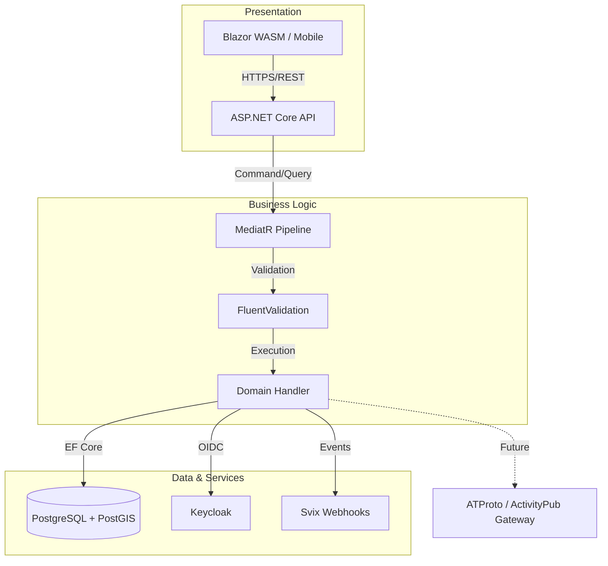
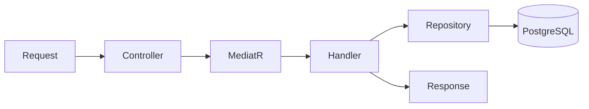

<a name="readme-top"></a>

<div align="center">

# ISLAMU Event

# Event Platform & Management System — v0.1.0 Beta

⚠️ **Beta Release**: Currently at v0.1.0 — First public release ready for beta testing and early adopters. API may change before 1.0.0 stable release.

ISLAMU Event is a self-hostable, decentralized, multi-tenant event platform for any community or industry.
The ISLAMU organization hosts a public instance focused on Islamic events, but the software itself is purpose-agnostic, fully white-label, and designed to be rebranded for any use case.

![GitHub Workflow Status][github-workflow-status-shield]
[![Codecov][codecov-shield]][codecov-link]
[![Quality Gate Status][sonarcloud-shield]][sonarcloud-link]
[![GitHub License][github-license-shield]][github-license-link]
[![GitHub Repo Stars][github-stars-shield]][github-stars-link]
[![GitHub Last Commit][github-last-commit-shield]][github-last-commit-link]
[![Contributors][github-contributors-shield]][github-contributors-link]
[![Discussions][github-discussions-shield]][github-discussions-link]
[![Discord][discord-shield]][discord-link]

[**ISLAMU's Islamic Instance**][islamu-platform] · [**Docs**](docs/index.md) · [**Roadmap**][roadmap-link]

</div>

---

## ℹ About ISLAMU Event

ISLAMU Event is a **self-hostable event discovery and management platform** that helps communities find, organize, and promote events. Built with advanced filtering, verification workflows, and cultural intelligence to serve diverse communities worldwide.

> **v0.1.0 Beta** — First public release ready for beta testing. [See what's included →](docs/semantic_versioning/v0.1.0.md)

> Give us a Star ⭐️

### Platform Flexibility
- **The software is general-purpose**: Adaptable for any kind of events, communities, and organizations (tech meetups, conferences, workshops, community gatherings)
- **The ISLAMU-hosted instance is Islamic-focused**: Our public instance at [event.openislamu.org](https://event.openislamu.org) is curated for Islamic events and community needs
- **White-label ready**: Rebrand and customize the platform for your specific use case with full control over branding, policies, and features


![Event List Screenshot][event-list-image]

## ✨ Why ISLAMU Event

### Key Differentiators

- **🔐 Security-First:** BFF pattern (no tokens in browser), Cerbos fine-grained authorization, Infisical secrets management
- **🛡️ Verified Organizations:** Two-tier verification system for trust and quality
- **⚡ Multi-Tenancy:** Runtime mode switching (Single-tenant ↔ Multi-tenant) without code changes
- **🔧 Modular Events:** Plugin-style aspects (Islamic, Tech) with per-tenant enablement
- **🎯 Cultural Intelligence:** Advanced filtering based on enabled modules. filter by madhab, gender, age, prayer times, skill level...
- **🏗️ Enterprise Architecture:** Clean Architecture + CQRS with MediatR, REST Level 3 (HATEOAS)
- **🌍 Federation-Ready:** ATProto/ActivityPub data models complete (Phase 1), protocol endpoints planned for 1.0.0
- **🧪 Test Coverage:** 7 test projects (TUnit, bUnit, architecture tests)
- **📖 Open Source:** AGPL-3.0 licensed for transparency and community ownership

---

## 🎯 Core Features (v0.1.0)

### For Event Seekers

- **🔍 Advanced Discovery:** 33 query parameters including title search, date range, location radius, categories, tags, and more
- **👨‍👩‍👧‍👦 Culturally-Aware Filters:** Age ranges, gender segregation modes, madhab targeting, prayer-relative timing (for instances that enable these modules)
- **🌐 Multi-Language Support:** Event sessions with multiple language options
- **📱 Responsive Design:** Mobile-friendly Blazor UI with MudBlazor components
- **✅ RSVP & Registration:** Waitlists, approval workflows, registration limits per session

### For Event Organizers

- **📅 Multi-Session Events:** Conferences, seminars, recurring programs with speakers, agendas, and language variants
- **🛡️ Organization Verification:** Two-tier system (user-submitted vs. verified organizations)
- **👥 Member Management:** Invite members, assign roles (Owner, Admin, Editor, Viewer), track permissions
- **⭐ Reviews & Ratings:** Users can review verified organizations to build trust
- **🎯 Modular Event Types:** Enable Islamic or Tech aspects per event based on tenant configuration
- **📊 Flexible Publishing:** Open registration, approval-required, or invite-only policies

### For Platform Owners

- **🐳 Docker-Ready:** One-command deployment with `docker-compose up -d`
- **💼 Multi-Tenancy:** Switch between single-tenant and SaaS modes at runtime without code changes
- **🛠️ White-Label Control:** Custom branding, domains, logos, navigation links, policies per tenant
- **🔧 Admin Hierarchy:** Instance admins, tenant admins, and organization admins with cascading settings
- **🌍 Federation Foundation:** ATProto/ActivityPub data models complete (Phase 1), protocol endpoints planned for 1.0.0
- **📚 Comprehensive Docs:** Architecture, deployment, configuration, troubleshooting, and API reference
- **🔐 Enterprise Security:** BFF pattern, Cerbos authorization, Infisical secrets, HATEOAS REST API

##  Deployment & Hosting Options

This platform is designed to be flexible and self-hostable for any organization.

- **Single-Instance Mode**: One organization or community per deployment
- **Multi-Tenant SaaS Mode**: Multiple isolated tenants with custom domains and branding

See [Operations Guide][operations-doc] for full deployment details and examples.

## 🎨 Branding & Customization

ISLAMU Event is built for white-label use:

- **Change instance name and domain**
- **Customize logos, colors, and UI**
- **Define your own categories, tags, and policies**
- **Decide who can publish events and how verification works**

See [Configuration Guide][configuration-doc] for full customization options.

## 🛡️ Enterprise Security & Compliance

We treat security as a first-class citizen, not an afterthought.

* **Identity & Access:** Managed via **Keycloak**, supporting MFA, Social Login, and SAML/LDAP integration.
* **Authorization:** Fine-grained access control (FGAC) powered by **Cerbos**: Policy Decision Point that coordinates unified policy-based authorization, allowing for complex "Who can do what" logic with human readable yaml for non technical users.
* **Data Integrity:** All database interactions use **Parameterized EF Core queries** to eliminate SQL injection.
* **Secret Management:** Zero hardcoded credentials; all secrets are injected at runtime via **Infisical**.
* **Observability:** Integrated **OpenTelemetry** for distributed tracing and real-time security monitoring.

### Security Features

- **🔒 HTTPS Enforcement:** All traffic encrypted with HSTS
- **🔐 Modern Authentication:** OAuth 2.0/OIDC via Keycloak
- **🗝️ Secret Management:** Infisical vault for credentials
- **🛡️ Authorization:** Policy-based access control via Cerbos
- **🔍 Input Validation:** FluentValidation + ASP.NET Core model binding
- **🚫 SQL Injection Prevention:** Parameterized queries (EF Core)
- **🌐 CORS:** Configurable origin whitelist
- **⏱️ Rate Limiting:** ASP.NET Core middleware

### Extensibility Model

Events use **composition over inheritance**:

```
Event (Core)
  ├── IslamicDetails (optional aspect)
  ├── TechDetails (optional aspect)
  └── EducationalDetails (optional aspect)
```

A "Ramadan Tech Workshop" has both Islamic and Tech aspects. No class explosion.

See [EXTENSIBILITY.md](docs/EXTENSIBILITY.md) and [MODULAR_EVENTS.md](docs/MODULAR_EVENTS.md).

## 🚀 Quick Start

### 🌐 Try Our Public Instance

Visit **[event.openislamu.org](https://event.openislamu.org)** to:
- 🔍 Browse events (no account needed)
- 📝 Create account to post events
- ✅ Register for events
- 👥 Follow organizations

### 🖥️ Self-Host Your Instance

**Prerequisites:**
- Docker
- .NET 10 SDK (for development)
- PostgreSQL 16+ with PostGIS (or use Docker)

**Quick Deploy:**
```bash
# Clone the repository
git clone https://github.com/islamu-ngo/Explore.git && cd Explore

# Option 1: Start core services (API, DB, Auth, UI)
docker-compose up -d

# Option 2: Start with object storage (S3/MinIO)
docker-compose up --profile storage -d

# Access the application
# Blazor UI: https://localhost:7001
# API: https://localhost:5001
# Scalar API Docs: https://localhost:5001/scalar/v1
```

**For detailed deployment instructions**, see:
- [Operations Guide](docs/OPERATIONS.md) — Production deployment
- [Configuration Guide](docs/CONFIGURATION.md) — Environment variables and settings
- [Quick Start (v0.1.0)](docs/semantic_versioning/v0.1.0.md#-getting-started) — Full setup walkthrough

## Roadmap

[Roadmap Kanban View][roadmap-link]: All the work items, go vote, comment, and more.

![Roadmap Kanban View][roadmap-image]

## Community

Join the ISLAMU community on [Discord][discord-link] and our [GitHub Discussions][github-discussions-link]. We follow a [Code of Conduct][code-of-conduct] in all our community channels.

Feel free to ask questions, report bugs, participate in discussions, share ideas, request features, or showcase. We would love to hear from you.

## 🤝 Contributing

There are many ways you can contribute to ISLAMU Event:

**Non-Technical:**
- 🐛 [Report bugs][github-issues-link]
- 💡 [Suggest features][github-issues-link]
- 📖 Improve documentation
- 🌐 Translate UI/docs
- 📣 Spread the word

**Technical:**
- 💻 Fix bugs
- ✨ Implement features
- 🧪 Write tests
- 📊 Improve performance
- 🎨 Enhance UI/UX

### Development Guidelines

Before contributing code, please review:
- **[CLAUDE.md](CLAUDE.md)** — Project overview and AI agent instructions
- **[GOVERNANCE.md](docs/GOVERNANCE.md)** — Code conventions and architectural rules
- **[QUICK_REFERENCE.md](docs/QUICK_REFERENCE.md)** — 12 critical rules for contributors
- **[ARCHITECTURE.md](docs/ARCHITECTURE.md)** — Clean Architecture patterns and CQRS implementation
- **[v0.1.0 Release Notes](docs/semantic_versioning/v0.1.0.md)** — Current feature set and known limitations

### How to Contribute

1. Fork the repoisory
2. Create your feature branch (`git checkout -b feature/foobar`)
3. Commit your changes (`git commit -am 'Add some foobar'`)
4. Push to the branch (`git push origin feature/foobar`)
5. Create a new Pull Request

Please read [Contribution Guidelines][contribution-guidelines] for details on the process for submitting pull requests to us.

## 📚 Documentation

Start here for deeper details and technical guides:

### 📚 Core Docs

- **Project Overview**: [Master Reference][master-reference-doc] & [Project Context][project-doc]
- [Architecture][architecture-doc]
- [Governance][governance-doc]
- [Quick Reference][quick-reference-doc]

### 📚 Platform Docs

- [Operations Guide][operations-doc]
- [Multi-Tenancy][multi-tenancy-doc]
- [Admin Hierarchy][admin-hierarchy-doc]
- [Deployment Modes][deployment-modes-doc]
- [Extensibility][extensibility-doc]
- [Modular Events][modular-events-doc]
- [Rendering Policies][render-policies-doc]

### 📚 Reference Docs

- [API Reference][api-doc]
- [Domain Model][domain-doc]
- [Security][security-doc]
- [Configuration & Environment][configuration-doc]
- [Troubleshooting][troubleshooting-doc]

## 🏗️ Technical Overview

ISLAMU Event is built on **Clean Architecture + CQRS** with a **BFF (Backend-for-Frontend)** pattern.

### Technology Stack (v0.1.0)

| Component | Technology | Purpose |
|-----------|------------|---------|
| **Runtime** | .NET 10.0 | Latest LTS framework |
| **Architecture** | Clean Architecture + CQRS | Layer separation with MediatR |
| **Frontend** | Blazor Server + WASM | Hybrid rendering (InteractiveAuto) |
| **UI Components** | MudBlazor | Material Design components |
| **Database** | PostgreSQL + PostGIS | Relational + spatial queries |
| **ORM** | Entity Framework Core 10 | Data access with named query filters |
| **Authentication** | Keycloak (OIDC/OAuth 2.0) | Identity provider with BFF pattern |
| **Authorization** | Cerbos | Policy Decision Point (PDP) for FGAC |
| **Secrets** | Infisical | Vault with auto-refresh + health checks |
| **API Docs** | Scalar + Swagger/NSwag | OpenAPI 3.0 with HAL+JSON |
| **Logging** | Serilog | Structured logging to Loki |
| **Telemetry** | OpenTelemetry | Distributed tracing + Prometheus metrics |
| **Orchestration** | .NET Aspire (dev), Docker (prod) | Service orchestration |
| **Test Framework** | TUnit + bUnit | Unit + integration + component tests |

### The Request Lifecycle (CQRS)
We utilize **MediatR** for a decoupled command/query pipeline. This ensures that our business logic is isolated from transport layers (API/Blazor).





## 🛡️ Security

If you discover a security vulnerability in ISLAMU Event, please report it responsibly instead of opening a public issue. We take all legitimate reports seriously and will investigate them promptly. See the [Security Policy][security-policy] for more info.

To disclose any security issues, please email us at [contact@openislamu.org][contact-email].

## 📊📈 Repo Stats

![Repo Stats][repobeats-image]

## Contributors

I am deeply grateful to all our amazing contributors.

[![Contributors Image][contributors-image]][contributors-link]

## 🙏 Acknowledgement

- [Keycloak][keycloak-link]: An Open Source Identity and Access Management Provider.
- [Cerbos][cerbos-link]: An Open Source Policy Decision Point.
- [Svix][svix-link]: An Open Source Webhooks Service.
- [Infisical][infisical-link]: An Open Source Secret Management Platform.
- [MudBlazor][mudblazor-link]: An Open Source Blazor UI library that simplifies the creation of beautiful websites and webapps.
- [Penpot][penpot-link]: An Open Source Design Tool.
- [Plane][plane-link]: An Open Source Project Management Platform that unifies projects, knowledge and agents with all-in-one workspace: projects, wiki, and AI.
- [Coolify][coolify-link]: An Open Source Platform as a Service, alternative to Vercel, Heroku, Netlify, and Railway for easy deploying to your own servers.
- [Kener][kener-link]: An Open Source Status Page.

## ISLAMU Solutions

- [ISLAMU Event][github-repo-link]: Event Platform & Management System.

## 📞 Contact

For any question or problem reporting, please consider opening a [new issue][github-issues-link] or send an email to [contact@openislamu.org][contact-email] or create a new post in our [Discord Server][discord-link].

## Privacy Policy

You can find details [here][privacy-policy].

## 📄 License

This project is licensed under the terms of [GNU AGPL v3][license-link].

## Quick Note

The tyranny of Israel on the Palestinian people is horrifying and heartbreaking. As such, we all
should try our best to support the Palestinians from our position. Consider supporting the Palestinians
by donating to the [Palestinian Red Crescent Society][palestinian-red-crescent].

[![ReadMeSupportPalestine][support-palestine-banner]][palestinian-red-crescent]

Banner from: [support-palestine-banner repository][support-palestine-banner-source]

<div align="right">

[![][back-to-top]][back-to-top-link]

</div>

<!-- LINK GROUP -->

[back-to-top]: https://img.shields.io/badge/-BACK_TO_TOP-151515?style=flat-square
[back-to-top-link]: #readme-top
[islamu-platform]: https://event.openislamu.org
[event-list-image]: images/event-list-image.png
[roadmap-link]: https://sites.plane.so/views/b8b7d9fced694f5a9d9a546e9d40d988
[roadmap-image]: images/Roadmap%20Kanban%20View.png
[code-of-conduct]: CODE_OF_CONDUCT.md
[master-reference-doc]: docs/index.md
[project-doc]: docs/PROJECT.md
[architecture-doc]: docs/ARCHITECTURE.md
[api-doc]: docs/API.md
[domain-doc]: docs/DOMAIN.md
[operations-doc]: docs/OPERATIONS.md
[configuration-doc]: docs/CONFIGURATION.md
[troubleshooting-doc]: docs/TROUBLESHOOTING.md
[governance-doc]: docs/GOVERNANCE.md
[quick-reference-doc]: docs/QUICK_REFERENCE.md
[multi-tenancy-doc]: docs/MULTI_TENANCY.md
[admin-hierarchy-doc]: docs/ADMIN_HIERARCHY.md
[security-doc]: docs/SECURITY.md
[deployment-modes-doc]: docs/DEPLOYMENT_MODES.md
[extensibility-doc]: docs/EXTENSIBILITY.md
[modular-events-doc]: docs/MODULAR_EVENTS.md
[render-policies-doc]: docs/RENDER_POLICIES.md
[security-policy]: SECURITY-POLICY.md
[privacy-policy]: PRIVACY-POLICY.md
[license-link]: LICENSE
[contact-email]: mailto:contact@openislamu.org

[github-repo-link]: https://github.com/islamu-ngo/Explore
[github-issues-link]: https://github.com/islamu-ngo/Explore/issues/new
[github-discussions-link]: https://github.com/islamu-ngo/Explore/discussions
[github-contributors-link]: https://github.com/islamu-ngo/Explore/graphs/contributors

[sonarcloud-shield]: https://sonarcloud.io/api/project_badges/measure?project=islamu-ngo_Explore&metric=alert_status
[sonarcloud-link]: https://sonarcloud.io/summary/overall?id=islamu-ngo_Explore
[github-workflow-status-shield]: https://img.shields.io/github/actions/workflow/status/islamu-ngo/Explore/build.yml?branch=main&logo=github&style=flat-square
[codecov-shield]: https://img.shields.io/codecov/c/github/islamu-ngo/Explore
[codecov-link]: https://app.codecov.io/github/islamu-ngo/Explore
[github-stars-shield]: https://img.shields.io/github/stars/islamu-ngo/Explore?color=594ae2&style=flat-square&logo=github
[github-stars-link]: https://github.com/islamu-ngo/Explore/stargazers
[github-license-shield]: https://img.shields.io/github/license/islamu-ngo/Explore?color=594ae2&logo=github&style=flat-square
[github-license-link]: https://github.com/islamu-ngo/Explore/blob/main/LICENSE
[github-last-commit-shield]: https://img.shields.io/github/last-commit/islamu-ngo/Explore?color=594ae2&style=flat-square&logo=github
[github-last-commit-link]: https://github.com/islamu-ngo/Explore
[github-contributors-shield]: https://img.shields.io/github/contributors/islamu-ngo/Explore?color=594ae2&style=flat-square&logo=github
[github-discussions-shield]: https://img.shields.io/github/discussions/islamu-ngo/Explore?color=594ae2&logo=github&style=flat-square
[discord-shield]: https://img.shields.io/discord/1357505436479131668?color=%237289da&label=Discord&logo=discord&logoColor=%237289da&style=flat-square
[discord-link]: https://discord.gg/wrkY824Yv5

[repobeats-image]: https://repobeats.axiom.co/api/embed/a0f11a3d9b80342b5f5965127c2c45871c9d3397.svg
[contributors-image]: https://contrib.rocks/image?repo=islamu-ngo/explore
[contributors-link]: https://github.com/islamu-ngo/explore/graphs/contributors

[keycloak-link]: https://www.keycloak.org/
[cerbos-link]: https://www.cerbos.dev/
[svix-link]: https://www.svix.com/
[infisical-link]: https://infisical.com/
[mudblazor-link]: https://www.mudblazor.com/
[penpot-link]: https://penpot.app/
[plane-link]: https://plane.so/
[coolify-link]: https://coolify.io/
[kener-link]: https://kener.ing/

[palestinian-red-crescent]: https://www.palestinercs.org/en/Donation
[support-palestine-banner]: https://github.com/Safouene1/support-palestine-banner/blob/master/banner-support.svg
[support-palestine-banner-source]: https://github.com/Safouene1/support-palestine-banner/

[contribution-guidelines]: https://sites.plane.so/pages/b957e6c5278845feac5557d22bd54756
