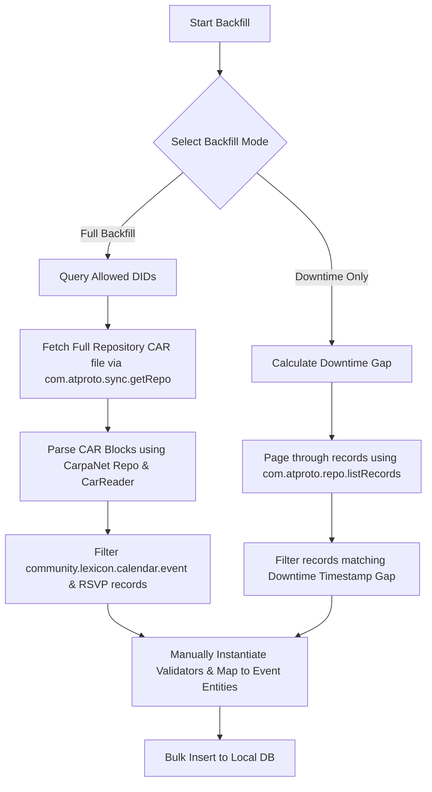

# AT Protocol Event Backfill and Architecture Design Report

This report defines the technical design and architectural roadmap for event backfilling, recovery, and PDS-independent identity management in the ISLAMU Event platform, leveraging the **CarpaNet** C# library.

---

## 1. Executive Summary

The ISLAMU Event platform integrates with the **AT Protocol (ATProto)** to federate events and RSVPs using community-defined lexicons. While the existing implementation establishes ATProto OAuth login and live Jetstream ingestion, it does not support historical event backfilling or automatic recovery of events missed during temporary instance downtime. 

This document proposes:
1. **Downtime Catch-up (Resume from Cursor):** Automatic resumption of live events from the last successfully committed microsecond Unix timestamp cursor after application restarts or deployments.
2. **Historical Backfill (Full Sync):** A tenant-admin configurable option to backfill all historical events from allowed/federated DIDs using CarpaNet's repository APIs.
3. **CarpaNet Library Optimizations:** Suggestions for dynamic filters, automated token persistence, and high-throughput CAR file ingestion.
4. **Decoupled PDS Identity Model:** A blueprint for PDS-independent authentication (Bluesky, Eurosky, self-hosted) transitioning to a future dual Keycloak + ISLAMU PDS provisioning system.

---

## 2. Ingest Downtime & Real-time Recovery

Jetstream is a real-time event stream that broadcasts JSON-formatted ATProto commits. Because it is cursor-based, the platform can automatically recover from temporary downtime (restarts, updates, crashes) without losing events.

### 2.1 The Native Resume Flow
In the existing codebase, `AtprotoJetstreamSubscriber` implements a leased background subscriber. It stores the consumer progress in the database via `AtprotoJetstreamConsumerState` and claims a lease on start:
* **Lease Acquisition:** On start, `store.TryClaimAsync(...)` retrieves the last successfully committed sequence `Cursor` from the database.
* **Cursor Propagation:** If `Cursor` is non-zero, it is supplied to `JetstreamSubscribeOptions` as a Unix microsecond timestamp.
* **Jetstream Replay:** The Jetstream server automatically replays all buffered commits that occurred after the supplied cursor.
* **Atomic Advancement:** The `AtprotoJetstreamSubscriber` processes events sequentially and advances the cursor in the database using `store.TryApplyAndAdvanceAsync(...)`.

This mechanism guarantees **zero-loss recovery** for short-to-medium downtimes out of the box, with no historical backfill engine required.

### 2.2 Buffer Expiry & Safe Fallback
Jetstream servers maintain a finite event buffer (typically hours to a few days depending on the host configuration). If the instance downtime exceeds this buffer:
* **The Symptom:** The Jetstream WebSocket connection will fail or refuse the old cursor (falling back to the current live head, which creates a gap).
* **The Mitigation:** 
  1. The system must detect cursor rejection or fallback events.
  2. If the saved cursor is older than the oldest message in the stream (or if the connection fails due to an expired cursor), the background subscriber must log a warning (`Critical`) indicating a gap in data.
  3. The system should automatically flag the affected tenants for a **downtime-restricted backfill** (detailed below) rather than failing silently or performing a full history scrape.

---

## 3. Historical Event Backfilling

For new tenants, long downtimes, or specific instances like ISLAMU, a manual or automated backfill is required to fetch historical events and populate the local database.

### 3.1 Tenant Backfill Configuration
We introduce two new lockable tenant-tier settings to manage backfilling:
* `federation.atproto_events_backfill_enabled` (Boolean): Allows tenant administrators to enable backfilling of events.
* `federation.atproto_events_backfill_mode` (Enum: `DowntimeOnly`, `Full`):
  * `DowntimeOnly` (Default): Restricts backfilling to the period between the last saved cursor (or downtime start timestamp) and the current time.
  * `Full`: Triggers a complete sync of all historical records in the community lexicon collections for all configured `AllowedDids`.

Both settings use the standard platform cascade (User → Group → Org → Tenant → Instance) and respect the `SettingDefinition.IsLockable` lock engine to allow instance administrators to enforce global constraints.

### 3.2 Backfill Implementation Strategies (using CarpaNet)

Because Jetstream cannot serve arbitrarily old history outside of its buffer, the backfill engine must query the PDS/AppView repositories directly. We propose two strategies supported by CarpaNet:



#### Strategy A: Direct Pagination via `com.atproto.repo.listRecords` (Best for `DowntimeOnly`)
For targeted, smaller gaps, the system can page through the community event collection (`community.lexicon.calendar.event`) for each DID:
```csharp
var records = await client.ComAtprotoRepoListRecordsAsync(
    new ComAtproto.Repo.ListRecordsParameters
    {
        Repo = targetDid,
        Collection = "community.lexicon.calendar.event",
        Limit = 100
    });
```
* **Filter by Date:** Compare the `createdAt` or `startsAt` fields in the records with the downtime timestamp window.
* **Pros:** Standard API call, easy to rate-limit, lightweight for small gaps.
* **Cons:** High HTTP overhead if a DID has thousands of records.

#### Strategy B: CAR Archive Ingestion via `com.atproto.sync.getRepo` (Best for `Full` Backfills)
For a complete sync of all records (such as on ISLAMU's instance), downloading the repository CAR (Content Addressable aRchive) file is the most performant approach:
```csharp
using CarpaNet.Repo;

// 1. Fetch CAR stream from com.atproto.sync.getRepo
byte[] carBytes = await client.ComAtprotoSyncGetRepoAsync(new ComAtproto.Sync.GetRepoParameters { Did = targetDid });

// 2. Load the repository using CarpaNet
var repo = Repository.Load(carBytes);

// 3. Low-level CAR block reading or extracting specific collections
using var reader = new CarReader(new MemoryStream(carBytes));
foreach (var block in reader.ReadBlocks())
{
    // Reconstruct DAG-CBOR records and map the community.lexicon.calendar.* namespaces
}
```
* **Pros:** Single HTTP request per DID, high performance, handles complete history natively.
* **Cons:** Requires raw CBOR/block parsing.

### 3.3 Database Insertion and Validation Rules
When historical events are ingested:
1. **Provenance Verification:** Ensure the DID, RKey, and CID are cached globally in `AtprotoRecord`.
2. **Local Validation:** Manual instantiation of validators (`var validator = new CreateEventValidator()`) must execute. The events must adhere to the tenant's active `federation.atproto_event_validation_profile` (`platform` vs `community_lexicon`).
3. **Database Creation:** Map the parsed record properties and insert them into the local event tables (alongside any `AtprotoRecordTenantPresentation` mappings) to make them searchable and visible in the local tenant discovery views.
4. **Deduplication:** Match by `ATUri` (DID + Collection + RKey) to prevent duplicating records already partially indexed by the live Jetstream stream.

---

## 4. Suggestions & CarpaNet Library Integrations

Based on the capabilities exposed in `/home/amir/dev/Github/CarpaNet/docs/docs`, we can introduce several enhancements to our ATProto implementation:

### 4.1 Dynamic Ingestion Updates via `SendOptionsUpdateAsync`
* **Current Gap:** Re-subscribing to Jetstream with new filters currently requires restarting the background worker task.
* **CarpaNet Solution:** Use `client.SendOptionsUpdateAsync(...)` to update the subscription filters on the fly.
* **Our Implementation:** When an administrator updates `AllowedDids` or when a new tenant is enabled/disabled, the system can push a `JetstreamOptionsUpdate` down the WebSocket connection without severing the TCP session.

### 4.2 Auto-Rotated Token Persistence via `TokenRefreshed`
* **Current Gap:** Manual orchestration of token persistence.
* **CarpaNet Solution:** Wire the token refresh event handler.
* **Our Implementation:** Attach a handler to `TokenRefreshed` events:
  ```csharp
  client.TokenProvider.TokenRefreshed += async (sender, args) =>
  {
      await sessionStore.UpdateEncryptedSessionAsync(args.Did, args.AccessToken, args.RefreshToken);
  };
  ```
  This guarantees that refreshed OAuth tokens are automatically encrypted and persisted to `UserAuthenticationToken` immediately upon rotation.

### 4.3 Caching via `IdentityResolver`
* Use `IdentityResolver.CreateWithCache()` to minimize DNS/HTTP lookup overhead for handles and DID documents. Cache TTL should be managed at the application level to avoid resolving the same actors during high-frequency outbox delivery and Jetstream ingestion.

---

## 5. Decoupled PDS Identity Architecture

It is critical that the ATProto integration in ISLAMU Event remains **PDS-agnostic**.

### 5.1 Open Federation Boundaries
* **Universal OAuth Support:** Authentication relies on standard ATProto OAuth 2.0 metadata discovery (`/.well-known/oauth-protected-resource`). The login flow will work for users hosted on the main Bluesky PDS (`bsky.social`), regional services like `eurosky.biz`, or any self-hosted personal PDS.
* **Client Metadata Resolution:** The platform hosts a canonical client-metadata JSON endpoint. Any conforming PDS will read this metadata to authorize the ISLAMU Event BFF as a valid client.

### 5.2 Future Local PDS Provisioning
In the next phase, ISLAMU will operate its own PDS cluster. This enables a hybrid registration model:

```
┌────────────────────────────────────────────────────────┐
│               ISLAMU Event WebApp                      │
├────────────────────────────────────────────────────────┤
│  User signs up:                                        │
│  - Captures name, email, credentials, and handle       │
└──────────────────────────┬─────────────────────────────┘
                           │
                           ▼
             ┌──────────────────────────┐
             │   Registration Handler   │
             └─────────────┬────────────┘
                           │
             ┌─────────────┴────────────┐
             ▼                          ▼
   ┌──────────────────┐       ┌──────────────────┐
   │    Keycloak      │       │    Local PDS     │
   │  (Identity &     │       │  (Custodial DID  │
   │   OIDC Auth)     │       │   & Repo Init)   │
   └────────┬─────────┘       └────────┬─────────┘
            │                          │
            └─────────────┬────────────┘
                          ▼
            ┌──────────────────────────┐
            │   Link User Account      │
            │   - Save DID in DB       │
            │   - Store OAuth Session  │
            └──────────────────────────┘
```

1. **Dual Provisioning Flow:**
   * A user registers on ISLAMU Event.
   * The registration handler initiates account creation in **Keycloak** (OIDC user entity with password/MFA configuration).
   * Simultaneously, it registers a user handle (e.g. `user.islamu.community`) on the **local ISLAMU PDS**, initiating a new custodial ATProto repository and resolving a unique DID (e.g., `did:plc:...` or `did:web:...`).
2. **Unified Account Link:**
   * The registration handler links the Keycloak `sub` and the PDS `DID` in the local `UserExternalLogin` junction table.
   * This maintains clean boundaries: Keycloak manages standard app authentication and claims, while the PDS hosts the decentralized public events repository.
3. **Future Custodial Bridge:**
   * For custodial users, the platform can act as the custodian of their PDS session, automatically establishing and refreshing their OAuth sessions without requiring manual loopback auth clicks.

---

## 6. Verification and Test Strategy

To verify the event backfilling design:
* **Unit Tests:** Verify that `AtprotoJetstreamApplyRequest` handles replay detection correctly when `envelope.TimeUs <= cursor`.
* **Integration Tests:** Mock the `com.atproto.repo.listRecords` endpoint to ensure historical records are parsed, validated using the community lexicon profile, and stored in the database without duplicates.
* **Downtime Replays:** Write tests that simulate a disconnected subscriber, advance the database state with manual writes, reconnect the subscriber, and assert that the missed sequence interval is fully recovered.
