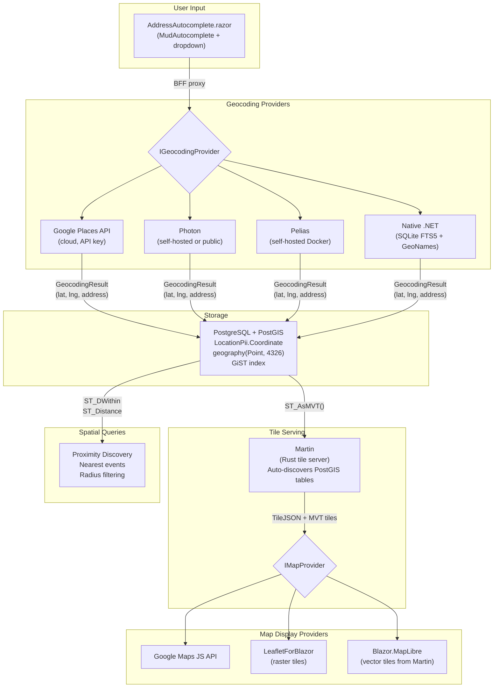
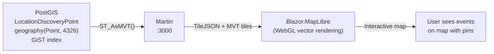

# Address Autocomplete, Geocoding & Maps — Final Provider Selection

> **Context**: The ISLAMU Event platform needs address autocomplete for event/location creation, feeding into map display and PostGIS spatial queries (nearest events, radius filtering). As self-hostable open-source software, the architecture **must support multiple swappable providers**.
>
> **PostGIS is a hard requirement** — not deferred. It powers both spatial queries and Martin tile serving.

---

## Finalized Provider Stack

### Geocoding / Address Autocomplete (4 providers)

| # | Provider | Type | How It Works |
|---|---|---|---|
| 1 | **Google Places (New)** | Cloud API | Best-in-class accuracy, session-based autocomplete. Requires API key + billing |
| 2 | **[Photon](https://github.com/komoot/photon)** | Self-hosted (Java + Elasticsearch) | Purpose-built for typeahead, uses OSM data, free public instance at `photon.komoot.io` |
| 3 | **[Pelias](https://github.com/pelias/pelias)** | Self-hosted (Node.js + Elasticsearch) | Best coverage (OSM + OpenAddresses + WoF + GeoNames), dedicated `/autocomplete` endpoint |
| 4 | **Native .NET** | Embedded (SQLite + GeoNames/OSM) | Zero external dependencies, SQLite FTS5 trigram search over GeoNames data |

### Map Display (3 providers)

| # | Provider | NuGet Package | Underlying Engine |
|---|---|---|---|
| 1 | **Google Maps** | `GoogleMapsComponents` | Google Maps JS API (proprietary) |
| 2 | **[LeafletForBlazor](https://github.com/ichim/LeafletForBlazor-NuGet)** | `LeafletForBlazor` v4.0 | Leaflet.js (raster tiles, pure C#) |
| 3 | **[Blazor.MapLibre](https://github.com/Yet-another-solution/Blazor.MapLibre)** | `Community.Blazor.MapLibre` v1.4 | MapLibre GL JS (WebGL vector tiles) |

### Tile Server

| Provider | Type | Key Feature |
|---|---|---|
| **[Martin](https://github.com/maplibre/martin)** | Self-hosted (Rust) | Serves MVT vector tiles on-the-fly from PostGIS tables + PMTiles/MBTiles |

---

## Architecture Overview



---

## Part 1: Geocoding Providers — Deep Dive

### 1. Google Places (New)

| Aspect | Details |
|---|---|
| **API** | Places API (New) with session-based autocomplete |
| **Pricing** | Per-SKU subscriptions. ~$2.83–17/1K requests. $200/mo free credit |
| **Coverage** | Best worldwide (Global #1 POI database) |
| **Autocomplete** | ⭐⭐⭐⭐⭐ — Session tokens group typeahead + detail fetch into one billing event |
| **Reverse Geocode** | ✅ Full support |
| **.NET SDK** | `Google.Maps.Places.V1` (official gRPC) or `GoogleApi` (community REST) |
| **Self-hostable** | ❌ Cloud-only |
| **Constraints** | **ToS: geocoded results must be displayed on a Google Map**, not on Leaflet/MapLibre. No caching >30 days without Permanent SKU |

> [!WARNING]
> Google's ToS coupling means: if you use Google Places for geocoding, the map display **must** use Google Maps JS API — not LeafletForBlazor or Blazor.MapLibre. This constraint is enforced at the configuration level.

---

### 2. Photon (komoot)

| Aspect | Details |
|---|---|
| **Repo** | [github.com/komoot/photon](https://github.com/komoot/photon) |
| **Stack** | Java 21+ / Elasticsearch (OpenSearch compatible) |
| **Data** | OpenStreetMap via Nominatim dumps. Pre-built planet dumps ~95GB |
| **Autocomplete** | ⭐⭐⭐⭐⭐ — Purpose-built for search-as-you-type, typo-tolerant, <50ms on SSD |
| **Reverse Geocode** | ✅ via `/reverse?lat=...&lon=...` |
| **API** | Simple REST, returns GeoJSON FeatureCollection |
| **Self-hostable** | ✅ Docker one-liner |

```bash
# Run with pre-built worldwide data
docker run -p 2322:2322 komoot/photon:latest

# Autocomplete API
GET http://localhost:2322/api?q=Berlin+Alex&limit=5&lang=en

# Response: GeoJSON with coordinates + address components (country, city, street, postcode)
```

**Resource requirements:**

| Scope | RAM | Disk |
|---|---|---|
| Single country (e.g. Germany) | ~8 GB | ~15 GB |
| Worldwide | ~64 GB | ~100 GB SSD |

> [!TIP]
> **Default recommendation for development**: Use the free public instance at `photon.komoot.io`. Self-hosters deploy their own Photon instance for production. Country-level extracts keep resources manageable.

---

### 3. Pelias

| Aspect | Details |
|---|---|
| **Repo** | [github.com/pelias/pelias](https://github.com/pelias/pelias) |
| **Stack** | Node.js microservices + Elasticsearch. Docker Compose (5+ containers) |
| **Data** | 4 sources: OSM + OpenAddresses + Who's on First + GeoNames |
| **Autocomplete** | ⭐⭐⭐⭐⭐ — Dedicated `/v1/autocomplete` pipeline with location biasing |
| **Reverse Geocode** | ✅ via `/v1/reverse` |
| **API** | REST, GeoJSON responses (Mapzen/Geocode Earth format) |
| **Self-hostable** | ✅ Docker Compose |

```bash
# Dedicated autocomplete endpoint
GET http://localhost:4000/v1/autocomplete?text=Berlin+Alex&focus.point.lat=52.5&focus.point.lon=13.4

# Structured geocoding
GET http://localhost:4000/v1/search/structured?address=Alexanderplatz&locality=Berlin&country=DE
```

**Why Pelias has the best coverage**: OpenAddresses adds millions of verified house-number-level addresses **not in OSM**. Who's on First adds administrative boundaries. GeoNames adds alternate names and translations.

**Resource requirements:**

| Scope | RAM | Disk |
|---|---|---|
| Single country | ~16–32 GB | ~50 GB |
| Worldwide | ~128 GB | ~1 TB SSD |

---

### 4. Native .NET

| Aspect | Details |
|---|---|
| **Stack** | C# + SQLite FTS5 (trigram tokenizer) + SpatiaLite + GeoNames data |
| **Dependencies** | Zero external services. Single embedded `.db` file |
| **Data** | GeoNames dumps (`cities1000.txt` → ~140K records, `allCountries.zip` → ~12M records) |
| **Autocomplete** | ⭐⭐⭐–⭐⭐⭐⭐ — Depends on data scope. Trigram FTS5 supports prefix + fuzzy matching |
| **Reverse Geocode** | ✅ via KD-Tree (`NGeoNamesCore`) or SpatiaLite spatial queries |
| **Self-hostable** | ✅ Embedded — ships with the application |

**How it works:**

```sql
-- SQLite FTS5 with trigram tokenizer for autocomplete
CREATE VIRTUAL TABLE address_fts USING fts5(
    full_address,
    asciiname,
    country_code,
    population UNINDEXED,
    tokenize = 'trigram'
);

-- Autocomplete query
SELECT * FROM address_fts
WHERE address_fts MATCH 'berlin*'
ORDER BY population DESC
LIMIT 10;
```

**Key .NET packages:**

| Package | Purpose |
|---|---|
| `NGeoNamesCore` | Parse GeoNames dumps, built-in KD-Tree reverse geocoder |
| `Microsoft.Data.Sqlite` | SQLite + FTS5 trigram search |
| `Microsoft.EntityFrameworkCore.Sqlite.NetTopologySuite` | SpatiaLite spatial queries |
| `OsmSharp` + `OsmSharp.IO.PBF` | Parse OSM PBF files for street-level addresses |

**Resource requirements:**

| Dataset | Records | RAM | Disk | Search Latency |
|---|---|---|---|---|
| GeoNames `cities1000` | ~140K | <50 MB | ~20 MB | <2 ms |
| GeoNames `allCountries` | ~12.5M | ~150–300 MB | ~2.5 GB | 5–15 ms |
| OSM regional addresses | ~5–20M | ~250–500 MB | ~2–6 GB | 5–20 ms |

> [!NOTE]
> **Native .NET is the lightest-weight option** — ideal for small self-hosted deployments or air-gapped environments. City/town-level autocomplete with `cities1000` needs only ~20 MB on disk. For street-level addresses, consider Photon or Pelias instead.

**Three-tier strategy for the Native .NET provider:**

| Tier | Data | Coverage | Use Case |
|---|---|---|---|
| **Lite** | GeoNames `cities1000` | City-level worldwide | Default for minimal deployments |
| **Standard** | GeoNames `allCountries` + alternate names | Places + localized names | Full place-level autocomplete |
| **Full** | OSM regional PBF → SQLite | Street-level addresses | Region-specific deep coverage |

---

## Part 2: Map Display Providers — Deep Dive

### 1. Google Maps JS API

| Aspect | Details |
|---|---|
| **NuGet** | `GoogleMapsComponents` (community Blazor wrapper) |
| **Rendering** | Proprietary WebGL + vector |
| **Tile Source** | Google-only (closed, cannot use with Martin) |
| **3D** | ✅ 3D tiles, Street View, satellite |
| **License** | Proprietary — requires API key + billing |
| **Blazor Modes** | Server, WASM via JS interop |
| **Constraints** | Must be used when Google Places is the geocoding provider (ToS) |

---

### 2. LeafletForBlazor

| Aspect | Details |
|---|---|
| **Repo** | [github.com/ichim/LeafletForBlazor-NuGet](https://github.com/ichim/LeafletForBlazor-NuGet) |
| **NuGet** | `LeafletForBlazor` v4.0.0.28 |
| **Rendering** | Canvas/DOM (raster tile-first) |
| **Key Feature** | **Pure C# — zero JavaScript configuration**. No `<script>` or `<link>` tags needed |
| **Tile Source** | Any raster tile provider (OSM, custom, Martin raster endpoint) |
| **3D** | ❌ No 3D terrain |
| **License** | MIT |
| **Blazor Modes** | ✅ InteractiveServer, InteractiveWebAssembly, InteractiveAuto |
| **Maintenance** | Active — regular updates for .NET 8/9 by Laurentiu Ichim |

**API surface — pure C#, no JS interop boilerplate:**

```razor
@using LeafletForBlazor
@using static LeafletForBlazor.Map

<Map Parameters="@_mapParams" />

@code {
    private Map.LoadParameters _mapParams = new()
    {
        location = new Map.Location() { latitude = 44.4323, longitude = 26.1063 },
        zoom = 13,
        anyway_overlay_layers_control = true
    };
}
```

**Features:**
- Markers via `Geometric.Points`, `addPoint()`, bulk upload via `upload()`
- GeoJSON loading from files (`DataFromGeoJSON.addFromFiles()`) or raw payloads
- Configurable tile layers (OSM, custom tile servers)
- C# event callbacks: `OnAfterMapLoaded`, click, double-click, zoom, movement
- LINQ-based data structuring/destructuring
- Fluent API for readable method chaining
- Memory cache optimizations
- No built-in geocoding/search — pairs with our `IGeocodingProvider` via MudAutocomplete

---

### 3. Blazor.MapLibre

| Aspect | Details |
|---|---|
| **Repo** | [github.com/Yet-another-solution/Blazor.MapLibre](https://github.com/Yet-another-solution/Blazor.MapLibre) |
| **NuGet** | `Community.Blazor.MapLibre` v1.4.0 |
| **Rendering** | **WebGL 2** (vector tile-first, hardware-accelerated) |
| **Key Feature** | Native vector tile rendering — **direct integration with Martin PostGIS tiles** |
| **Tile Source** | Martin TileJSON, PMTiles, MBTiles, any vector/raster source |
| **3D** | ✅ Terrain mesh, building extrusions, globe view |
| **License** | Unlicense (wrapper) / BSD-3 (MapLibre GL JS engine) |
| **Blazor Modes** | ✅ InteractiveServer, InteractiveWebAssembly, InteractiveAuto |
| **Maintenance** | Active — targeting .NET 8, 9, and 10 |
| **Docs** | [Official docs site](https://yet-another-solution.github.io/Blazor.MapLibre/) with live demos |

**Setup — requires CSS link in App.razor:**

```html
<link href="_content/Community.Blazor.MapLibre/maplibre-5.12.0.min.css" rel="stylesheet" />
```

**API surface:**

```razor
@using Community.Blazor.MapLibre

<MapLibre Options="_mapOptions" @ref="_map" />

@code {
    private MapLibre _map;
    private readonly MapOptions _mapOptions = new()
    {
        Style = "https://demotiles.maplibre.org/style.json",
        Center = new LngLat(-74.5, 40),
        Zoom = 9
    };
}
```

**Full type-safe C# abstractions for:**
- Sources: `GeoJsonSource`, `VectorSource`, `RasterSource`, `RasterDemSource`
- Layers: Circle, Line, Fill, Symbol, Heatmap, Fill-Extrusion
- Markers: `MarkerOptions` with HTML customization
- Popups: `PopupOptions` with interactive content
- **Martin integration**: Point vector source at Martin's TileJSON endpoint

```csharp
// Connect to Martin PostGIS tiles
await _map.AddSourceAsync("events", new VectorSource
{
    Url = "http://martin:3000/location_discovery_points.json"
});

await _map.AddLayerAsync(new CircleLayer("event-points", "events")
{
    SourceLayer = "location_discovery_points",
    Paint = new CirclePaint { CircleRadius = 6, CircleColor = "#FF6B35" }
});
```

---

### Comparison Matrix

| | Google Maps | LeafletForBlazor | Blazor.MapLibre |
|---|---|---|---|
| **Rendering** | Proprietary WebGL | Canvas/DOM (raster) | **WebGL 2 (vector)** |
| **Bundle size** | Dynamic load | ~40KB (Leaflet.js) | ~250KB (MapLibre GL JS) |
| **Tile source** | Google-only | Any raster tiles | **Any vector/raster (Martin, PMTiles)** |
| **3D terrain** | ✅ | ❌ | ✅ |
| **Martin integration** | ❌ | Raster fallback only | **✅ Native vector tiles** |
| **JS config needed** | JS interop | **Zero** | CSS link only |
| **Pure C# API** | Partial | **✅ Full** | **✅ Full** |
| **License** | Proprietary ($$$) | MIT (free) | Unlicense/BSD-3 (free) |
| **Best for** | Google Places users | Simple raster maps, lightweight | **PostGIS + Martin vector maps** |

---

## Part 3: Martin Tile Server + PostGIS

### What Martin Does

[Martin](https://github.com/maplibre/martin) is a **Rust-based vector tile server** maintained by the MapLibre organization. It generates Mapbox Vector Tiles (MVT) **on-the-fly** directly from PostGIS spatial tables using `ST_AsMVT()`.

| Aspect | Details |
|---|---|
| **Language** | Rust (Tokio/Axum async runtime) |
| **License** | Apache 2.0 + MIT (dual-licensed) |
| **Container size** | <30 MB Docker image |
| **Performance** | Sub-millisecond tile generation with PostGIS GiST indexes |
| **Auto-discovery** | Automatically finds all PostGIS tables with `geometry`/`geography` columns |
| **Tile formats** | MVT from PostGIS, PMTiles files, MBTiles files |
| **Extra assets** | Serves font glyphs (SDF `.pbf`), sprites (SVG→PNG/JSON), style JSON |

### How Martin Connects to PostGIS

```yaml
# martin.yaml (or via DATABASE_URL env var)
postgres:
  connection_string: "postgres://user:pass@db:5432/islamu_event"
  auto_publish:
    tables: true      # auto-discover spatial tables
    functions: true   # auto-discover tile-generating functions
  tables:
    location_discovery_points:
      schema: explore
      geometry_column: coordinate
      srid: 4326
      properties:
        location_id: uuid
        display_name: text
        city: text
        country: text
```

### Docker Deployment (in docker-compose)

```yaml
services:
  db:
    image: postgis/postgis:17-3.5
    environment:
      POSTGRES_DB: islamu_event
    volumes:
      - pgdata:/var/lib/postgresql/data

  martin:
    image: ghcr.io/maplibre/martin:latest
    ports:
      - "3000:3000"
    environment:
      DATABASE_URL: "postgres://user:pass@db:5432/islamu_event"
    depends_on:
      - db

  # Martin auto-discovers PostGIS tables and serves:
  # GET http://martin:3000/location_discovery_points/{z}/{x}/{y}.pbf
  # GET http://martin:3000/location_discovery_points.json  (TileJSON)
```

### Martin + Blazor.MapLibre Integration



This gives you **live, dynamic map tiles generated directly from your PostGIS event data** — no pre-rendering, no tile cache management, no external tile provider.

---

## Part 4: PostGIS — Hard Requirement

### Current State

[LocationPii](file:///home/amir/ISLAMU/Github/Event/src/Explore.Domain/LocationPii.cs) already stores `double? Latitude, Longitude`. [ADR-013](file:///home/amir/ISLAMU/Github/Event/docs/adr/ADR-013-postgis-proximity-discovery.md) proposes `LocationDiscoveryPoint` with `geography(Point, 4326)` — this is now a hard requirement, not deferred.

### What Changes

| Component | Current | Target |
|---|---|---|
| **Docker image** | `postgres:17` | `postgis/postgis:17-3.5` |
| **EF Core** | `Npgsql.EntityFrameworkCore.PostgreSQL` | + `Npgsql.EntityFrameworkCore.PostgreSQL.NetTopologySuite` |
| **LocationPii** | `double? Latitude, Longitude` | + `Point? Coordinate` (NTS, SRID 4326) |
| **LocationDiscoveryPoint** | Not implemented | Tenant-scoped governed public discovery point per ADR-013 |
| **Migration** | N/A | Enable PostGIS extension, add `geography` column, create GiST index |
| **Spatial queries** | None | `ST_DWithin`, `ST_Distance`, cursor-paginated proximity |
| **Martin** | Not deployed | Serves vector tiles from `LocationDiscoveryPoint` table |

### EF Core Configuration

```csharp
// DbContext registration
services.AddDbContext<ExploreDbContext>(options =>
    options.UseNpgsql(connectionString,
        npgsql => npgsql.UseNetTopologySuite()));

// Migration: enable PostGIS
migrationBuilder.Sql("CREATE EXTENSION IF NOT EXISTS postgis;");

// LocationPii configuration
builder.Property(p => p.Coordinate)
    .HasColumnType("geography(Point, 4326)");

builder.HasIndex(p => p.Coordinate)
    .HasMethod("gist");

// Proximity query
var userPoint = new Point(userLng, userLat) { SRID = 4326 };
var nearbyEvents = await context.LocationDiscoveryPoints
    .Where(p => p.Coordinate.IsWithinDistance(userPoint, radiusMeters))
    .OrderBy(p => p.Coordinate.Distance(userPoint))
    .Take(20)
    .ToListAsync();
```

---

## Part 5: Architecture in Clean Architecture Layers

```
Explore.Domain/
  ├── LocationPii.cs                         (MODIFY: add Point? Coordinate)
  ├── LocationDiscoveryPoint.cs              (NEW: governed public point per ADR-013)
  └── Enums/DiscoveryModeEnum.cs             (area_only, postgis)

Explore.Application/
  ├── Contracts/
  │   ├── Geocoding/
  │   │   ├── IGeocodingProvider.cs           (NEW: provider abstraction)
  │   │   ├── GeocodingResult.cs              (NEW: normalized result)
  │   │   └── GeocodingOptions.cs             (NEW: language, bias, bounds)
  │   └── Maps/
  │       └── IMapConfigProvider.cs           (NEW: tile URL, style, attribution)
  └── Features/
      └── Geocoding/
          └── AutocompleteQueryHandler.cs     (NEW: MediatR query → IGeocodingProvider)

Explore.Infrastructure/ (or Explore.Geocoding project)
  └── Geocoding/
      ├── GooglePlaces/
      │   └── GooglePlacesProvider.cs         (HttpClient → Places API)
      ├── Photon/
      │   └── PhotonProvider.cs               (HttpClient → Photon REST)
      ├── Pelias/
      │   └── PeliasProvider.cs               (HttpClient → Pelias REST)
      └── NativeDotNet/
          ├── NativeDotNetProvider.cs          (SQLite FTS5 queries)
          ├── GeoNamesImporter.cs              (data import pipeline)
          └── Data/
              └── geocoding.db                (SQLite + FTS5 + SpatiaLite)

Explore.Persistence/
  └── Configurations/
      ├── LocationPiiConfiguration.cs         (MODIFY: add Point column + GiST)
      └── LocationDiscoveryPointConfiguration.cs  (NEW)

Explore.Blazor.Client/
  └── Components/
      ├── AddressAutocomplete.razor           (NEW: MudAutocomplete → BFF → geocoding)
      └── Maps/
          ├── IMapComponent.cs                (NEW: common map interface)
          ├── GoogleMapView.razor              (NEW: Google Maps JS)
          ├── LeafletMapView.razor             (NEW: LeafletForBlazor)
          └── MapLibreMapView.razor            (NEW: Blazor.MapLibre + Martin)

Explore.BFF/
  └── Endpoints/
      └── GeocodingEndpoints.cs              (NEW: proxy autocomplete to API, hide keys)

docker-compose.yml
  ├── db: postgis/postgis:17-3.5              (CHANGE from postgres:17)
  └── martin: ghcr.io/maplibre/martin         (NEW service)
```

---

## Part 6: Configuration Schema

```json
{
  "Geocoding": {
    "Provider": "Photon",
    "Providers": {
      "GooglePlaces": {
        "ApiKey": "AIza...",
        "Language": "en",
        "SessionTokenTtlMinutes": 3
      },
      "Photon": {
        "BaseUrl": "https://photon.komoot.io/api",
        "Language": "en"
      },
      "Pelias": {
        "BaseUrl": "http://pelias:4000/v1"
      },
      "NativeDotNet": {
        "DatabasePath": "data/geocoding.db",
        "DataTier": "Standard"
      }
    }
  },
  "Maps": {
    "Provider": "MapLibre",
    "Providers": {
      "GoogleMaps": {
        "ApiKey": "AIza..."
      },
      "Leaflet": {
        "TileUrl": "https://{s}.tile.openstreetmap.org/{z}/{x}/{y}.png",
        "Attribution": "© OpenStreetMap contributors",
        "MaxZoom": 19
      },
      "MapLibre": {
        "StyleUrl": "https://demotiles.maplibre.org/style.json",
        "MartinUrl": "http://martin:3000"
      }
    }
  },
  "PostGIS": {
    "DiscoveryMode": "postgis",
    "DefaultRadiusMeters": 50000,
    "MaxRadiusMeters": 200000
  }
}
```

---

## Part 7: Provider Compatibility Matrix

Not all combinations are valid. This matrix documents the constraints:

| Geocoding ↓ / Map → | Google Maps | LeafletForBlazor | Blazor.MapLibre |
|---|---|---|---|
| **Google Places** | ✅ **Required by ToS** | ❌ Violates Google ToS | ❌ Violates Google ToS |
| **Photon** | ✅ | ✅ | ✅ (**Recommended**) |
| **Pelias** | ✅ | ✅ | ✅ (**Recommended**) |
| **Native .NET** | ✅ | ✅ | ✅ |

> [!IMPORTANT]
> The configuration layer must enforce this constraint: when `Geocoding.Provider = "GooglePlaces"`, `Maps.Provider` must be `"GoogleMaps"`. Attempting to display Google-geocoded results on Leaflet or MapLibre violates the Google Maps Platform Terms of Service.

---

## Part 8: Recommended Combinations

| Deployment | Geocoding | Map Display | Tile Source | Cost |
|---|---|---|---|---|
| **🏠 Self-hosted (minimal)** | Native .NET (cities1000) | LeafletForBlazor + OSM tiles | Public OSM rasters | **$0** |
| **🏠 Self-hosted (recommended)** | Photon (own instance) | Blazor.MapLibre | Martin ← PostGIS | **$0** |
| **🏠 Self-hosted (max coverage)** | Pelias (Docker) | Blazor.MapLibre | Martin ← PostGIS | **$0** |
| **☁️ SaaS (premium)** | Google Places | Google Maps | Google tiles | **$$** |
| **☁️ SaaS (budget)** | Photon (public) | Blazor.MapLibre | Martin ← PostGIS | **$0** |

---

## Part 9: Implementation Priority

| Phase | What | Why |
|---|---|---|
| **Phase 0** | PostGIS migration + Martin deployment | Foundation — everything depends on this |
| **Phase 1** | `IGeocodingProvider` abstraction + Photon implementation | Fastest to ship, zero cost, zero keys |
| **Phase 2** | Blazor.MapLibre + Martin vector tiles | Best UX with PostGIS data on the map |
| **Phase 3** | AddressAutocomplete component (MudAutocomplete → BFF → Photon) | User-facing autocomplete dropdown |
| **Phase 4** | Google Places + Google Maps provider pair | Premium option for SaaS |
| **Phase 5** | Native .NET provider (SQLite FTS5 + GeoNames) | Minimal/air-gapped deployment option |
| **Phase 6** | Pelias provider | Maximum coverage for large self-hosted deployments |
| **Phase 7** | LeafletForBlazor provider | Lightweight raster alternative to MapLibre |

---

## Risks & Mitigations

| Risk | Mitigation |
|---|---|
| **PostGIS adds operational complexity** | Use `postgis/postgis` official Docker image. Document upgrade path in SELF_HOSTING.md |
| **Martin is a new infrastructure dependency** | <30 MB container, auto-discovers tables, zero config needed. Add health check |
| **Google ToS restricts map/geocoding mixing** | Configuration-level enforcement. Validate at startup |
| **Photon public instance has rate limits** | Default warns about production use. Document self-hosting |
| **Native .NET has limited street-level coverage** | Clearly document tier system (Lite/Standard/Full). Recommend Photon for street-level |
| **Blazor.MapLibre requires CSS link** | Document in setup guide. LeafletForBlazor is the zero-config alternative |
| **Multiple map libraries increase bundle size** | Only one map provider loads at runtime per configuration |
