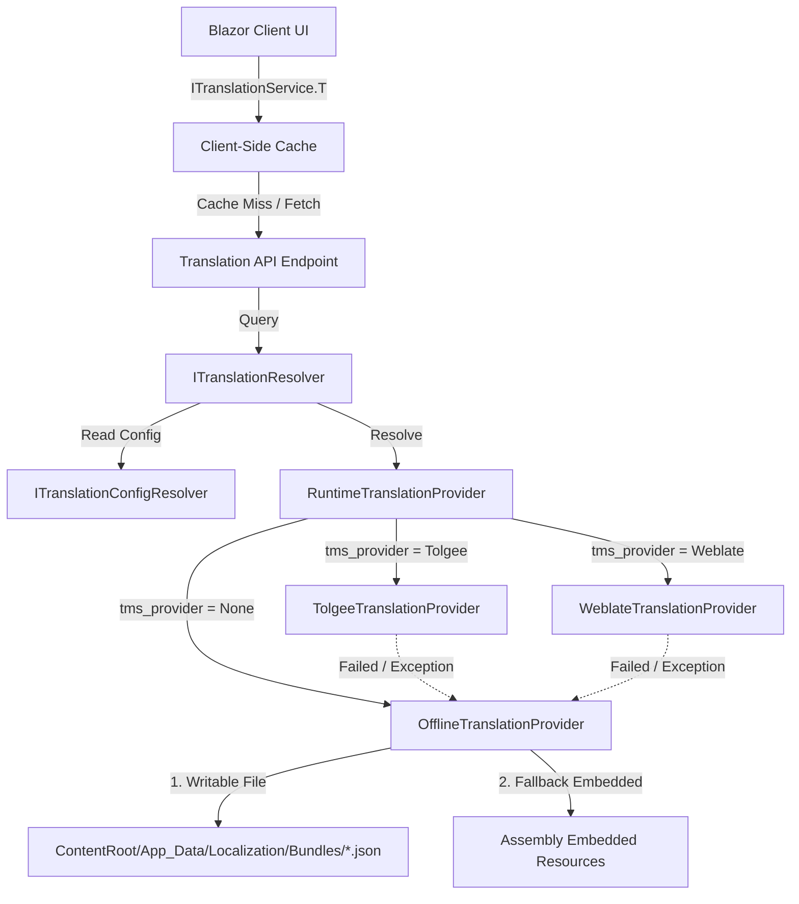

ABOUTME: Technical report on localization architecture, TMS abstraction (Tolgee/Weblate), offline bundles, and .NET integration.
ABOUTME: Guides self-hosters on configuring providers and outlines robust static bundle fallback and update strategies.

# ISLAMU Event Internationalization & Translation Report

## 1. Executive Summary

This report documents the architectural design, integration details, and deployment considerations for the localization and translation system of the ISLAMU Event platform. 

The primary goal is to provide a pluggable **Translation Management System (TMS)** abstraction that supports both live translations via **Tolgee** and **Weblate** and offline/static translations via pre-exported JSON bundles. This enables:
1. **Zero-Dependency Self-Hosting**: Out-of-the-box support for multiple languages without requiring external API dependencies or database tables.
2. **Dynamic Live Translations**: The ability for instance administrators (or ISLAMU global) to connect to a self-hosted or managed TMS instance, translate live, and pull updates.
3. **Robust Upgrades**: Safe fallback mechanisms when software is updated, ensuring new translation keys do not result in missing/blank labels.

---

## 2. Localization System Architecture

The codebase implements a **single-source translation system**. Unlike traditional applications that store translations in a database table or duplicate them across `.resx` resource files and DB schemas, ISLAMU Event treats the TMS (or the static JSON files exported from it) as the single source of truth.



### Core Architecture Components

| Component | Location | Role / Lifetime |
| :--- | :--- | :--- |
| `ITranslationResolver` | `Explore.Application` | Scoped service. Unified entry point for resolving keys. Manages the server-side memory cache. |
| `ITranslationManagementProvider` | `Explore.Application` | Interface defining TMS operations (test connection, import, export, list languages). |
| `RuntimeTranslationProvider` | `Explore.Infrastructure` | Scoped orchestrator. Resolves the configured active provider and executes fallback logic if the live TMS fails. |
| `OfflineTranslationProvider` | `Explore.Infrastructure` | Singleton. Reads flat key-value JSON bundles from disk or embedded assembly resources. |
| `TolgeeTranslationProvider` | `Explore.Infrastructure` | Scoped. Communicates with Tolgee REST API v2. |
| `WeblateTranslationProvider` | `Explore.Infrastructure` | Scoped. Communicates with Weblate REST API. |
| `ITranslationConfigResolver` | `Explore.Application` | Resolves tenant-level localization governance settings with a 5-minute cache. |

---

## 3. TMS Provider Integration Analysis (.NET)

As there are no official, actively-maintained NuGet packages for Weblate or Tolgee in the .NET ecosystem, the integration uses custom HTTP clients generated via **Refit**. This provides typed REST interfaces, resilience, and full control over performance and error handling.

### 3.1. Tolgee Integration
* **API Version**: v2 (`/v2/...`)
* **Authentication**: `X-API-Key` HTTP Header. Secret token is retrieved securely from the `SecretProvider`.
* **Refit Interface Definition (`ITolgeeApi`)**:
  ```csharp
  internal interface ITolgeeApi
  {
      [Get("/v2/projects/{projectId}")]
      Task<IApiResponse> TestConnectionAsync(string projectId, CancellationToken ct = default);

      [Post("/v2/projects/{projectId}/keys/import-resolvable")]
      Task<IApiResponse> ImportKeysAsync(string projectId, [Body] TolgeeImportRequest request, CancellationToken ct = default);

      [Get("/v2/projects/{projectId}/translations/{languageCode}?structureDelimiter=.")]
      Task<IApiResponse<TolgeeTranslationsResponse>> ExportTranslationsAsync(string projectId, string languageCode, CancellationToken ct = default);

      [Get("/v2/projects/{projectId}/languages")]
      Task<IApiResponse<TolgeeLanguagesResponse>> GetLanguagesAsync(string projectId, CancellationToken ct = default);
  }
  ```
* **Payload Mechanics**:
  - *Export*: Tolgee returns a nested JSON response that maps to `_embedded.keys`. The provider flattens these keys using a dot (`.`) separator to match the key convention (e.g., `ui.button.save`).
  - *Import*: Keys are sent as a batch (`TolgeeImportRequest`) containing keys and their respective translation values per language.

### 3.2. Weblate Integration
* **API Version**: Standard REST API (`/api/...`)
* **Authentication**: `Authorization: Token {apiKey}` HTTP Header.
* **Refit Interface Definition (`IWeblateApi`)**:
  ```csharp
  internal interface IWeblateApi
  {
      [Get("/api/projects/{projectId}/")]
      Task<IApiResponse> TestConnectionAsync(string projectId, CancellationToken ct = default);

      [Post("/api/translations/{projectId}/{component}/{languageCode}/units/")]
      Task<IApiResponse> CreateTranslationUnitAsync(string projectId, string component, string languageCode, [Body] WeblateUnitRequest request, CancellationToken ct = default);

      [Get("/api/translations/{projectId}/{component}/{languageCode}/file/")]
      Task<IApiResponse<Dictionary<string, string>>> ExportTranslationsAsync(string projectId, string component, string languageCode, CancellationToken ct = default);

      [Get("/api/projects/{projectId}/languages/")]
      Task<IApiResponse<WeblateLanguagesResponse>> GetLanguagesAsync(string projectId, CancellationToken ct = default);
  }
  ```
* **Payload Mechanics**:
  - *Export*: Weblate natively supports exporting translation files in a flat key-value JSON format via its `/file/` endpoint, returning a clean `Dictionary<string, string>`.
  - *Import*: Weblate imports keys at the "Unit" level. The importer groups keys by language and issues sequential unit-creation requests (`WeblateUnitRequest`).

---

## 4. Offline Static File Support & Docker constraints

For self-hosters who do not want to connect to a live TMS (Tier 1), the application ships with static, pre-exported translation bundles inside the Docker image.

### 4.1. The Bundle System
1. **Embedded Fallback**: JSON files are bundled as embedded resources inside the `Explore.Infrastructure` project at `/Localization/Bundles/{lang}.json`. 
   - Files are flat key-value JSON structures:
     ```json
     {
       "lookup.tag.FIQH.full_name": "Jurisprudence",
       "ui.button.save": "Save"
     }
     ```
   - Standard languages shipped: English (`en.json`), French (`fr.json`), and Arabic (`ar.json`).
2. **Local Writable Directory**: When an administrator triggers "Export from TMS" in the dashboard, the translations are pulled from the connected Tolgee/Weblate instance and written to:
   ```
   {ContentRoot}/App_Data/Localization/Bundles/{lang}.json
   ```
   `OfflineTranslationProvider` prioritizes reading from this directory first, falling back to embedded resources only if the local file does not exist.

### 4.2. High Availability & Stateless Docker Constraints
> [!WARNING]
> In stateless cloud deployments (such as multiple container replicas behind a load balancer on Kubernetes, AWS ECS, or scaled Docker Compose instances), writing local files creates an inconsistent state.

When an administrator runs the "Export from TMS" command:
1. The load balancer routes the HTTP POST request to **Replica A**.
2. **Replica A** fetches translations and writes the bundle file to its local container storage (`/app/App_Data/Localization/Bundles/en.json`).
3. **Replica B** and **Replica C** do not receive this write operation and continue to serve stale/embedded translation bundles.

#### The Solution: The `IBundleFileWriter` Seam
To resolve this, the system decouples file writing from the command handler using the `IBundleFileWriter` interface. The default implementation (`BundleFileWriter`) writes directly to the local disk.

To make the system HA-safe, a self-hoster or platform architect can implement a `DistributedBundleFileWriter` that writes to a shared persistent volume or a cloud storage provider (e.g., AWS S3, Azure Blob Storage, or a shared NFS mount). 

---

## 5. Software Update & Translation Drift Strategy

When self-hosters update their Docker images, they pull in new binaries and updated embedded resource bundles. However, if they have previously exported translations to a persistent volume (e.g., mounting `App_Data` to local disk), the application will continue to read the local files.

This introduces **Translation Drift**:
* **The Problem**: A new software update adds a new page with a new translation key (e.g., `ui.event.new_button`). The updated embedded `en.json` contains this key. However, the user's persistent volume has a local `en.json` file from 3 months ago that does *not* contain this key. Because the local file is prioritized, the system returns the raw key `ui.event.new_button` on the UI.

### Proposed Drift Mitigation Strategies

To ensure translations are updated during software upgrades, we propose three mitigation strategies:

#### 1. Key-by-Key Merged Fallback (Recommended)
Instead of treating local vs. embedded bundle files as mutually exclusive (file-level fallback), we should merge them at load time.
* **Mechanism**:
  1. Load the local bundle from `App_Data/Localization/Bundles/{lang}.json` (if it exists).
  2. Load the embedded bundle from the assembly.
  3. Merge the dictionaries: use the local bundle value if it exists, but fall back to the embedded resource key if the key is missing from the local file.
* **Why it works**: Admins keep their custom translations, but any newly introduced UI strings from software updates automatically fall back to the updated embedded translations.

#### 2. Assembly Build/Version Invalidation
Check if the local file is stale compared to the running software version.
* **Mechanism**: Write a version metadata key (e.g., `__schema_version` or `__build_date`) into the bundle file. If the assembly version is newer than the version recorded in the local JSON file, disregard the local file or trigger a background job to merge/re-export.

#### 3. "Reset to Default" Affordance
* **Mechanism**: Provide an Admin UI button that triggers a command to delete files inside `{ContentRoot}/App_Data/Localization/Bundles/`, immediately forcing the application to resolve all translations from the embedded resources.

---

## 6. Performance, Caching & Telemetry

To ensure the localization system does not impact response latency, the system employs caching at multiple layers:

1. **Governance Config Cache (5 mins)**: `ITranslationConfigResolver` caches the configuration for the active provider to avoid querying the settings table on every page load.
2. **Server-Side Translation Cache**:
   - **Live TMS (30 mins)**: Live translations from Tolgee or Weblate are cached to avoid API rate limits and round-trip latencies.
   - **Offline (24 hours)**: Static bundles loaded from disk are cached for 24 hours (or application lifetime).
3. **Client-Side Cache (30 mins)**: The Blazor WASM client caches the entire language dictionary in memory. 
4. **Zero-Allocation Hot Path**: The Blazor client translation function `T(key)` checks the in-memory cache directly. It does not perform I/O, allocate memory, or initiate logging scopes, keeping the rendering loop fast.

### Telemetry (OpenTelemetry)
`TranslationMetrics` tracks system performance:
* `islamu.translation.fetch_total`: Counts hits and misses by provider and result.
* `islamu.translation.fetch_duration_seconds`: Monitors response times of Weblate/Tolgee APIs.
* `islamu.tms.fallback_activated_total`: Tracks failover events to offline bundles (alertable).

---

## 7. How Self-Hosters Can Deploy and Configure

Self-hosters can choose between the two translation tiers depending on their infrastructure.

### Tier 1: Zero-Dependency Offline (Default)
Self-hosters do not need to configure any external translation tool. Out of the box, the system runs in offline mode.
* **Configuration**:
  - `localization.tms_provider`: Set to `0` (None).
  - The application reads directly from embedded resources. Updates to languages occur automatically when pulling new Docker images.

### Tier 2: Connected Self-Hosted TMS
Self-hosters can set up their own instance of Tolgee or Weblate and connect it to ISLAMU Event.

#### A. Setting up Tolgee
1. Spin up Tolgee via Docker Compose:
   ```yaml
   services:
     tolgee:
       image: tolgee/tolgee:v2
       ports:
         - "8085:8080"
       environment:
         - TOLGEE_AUTHENTICATION=true
   ```
2. Log into Tolgee, create a project, and generate an API key (scoped to read/write translations).
3. Configure ISLAMU Event settings:
   - `localization.tms_provider` = `1` (Tolgee)
   - `localization.tms_api_url` = `http://tolgee:8080` (or public URL)
   - `localization.tms_project_id` = `{ProjectId}`
   - Store the API key in the environment or secrets provider: `Secret_TmsApiKey = {API_KEY}`

#### B. Setting up Weblate
1. Deploy Weblate (typically requires Postgres, Redis, and Celery).
2. Create a project and component, and generate a user token.
3. Configure ISLAMU Event settings:
   - `localization.tms_provider` = `2` (Weblate)
   - `localization.tms_api_url` = `http://weblate:80`
   - `localization.tms_project_id` = `{ProjectSlug}`
   - `localization.tms_component` = `{ComponentSlug}`
   - Store the API key in secrets provider: `Secret_TmsApiKey = {Token}`
