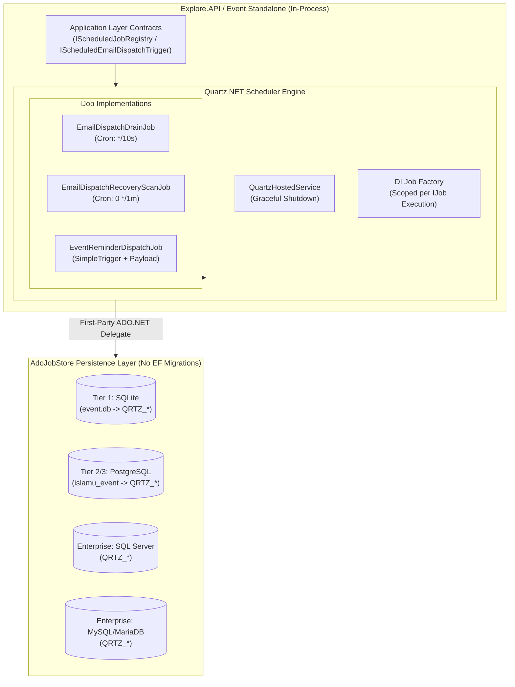

<!-- ABOUTME: Architectural report detailing the evaluation, rationale, and selection of Quartz.NET for background job scheduling. -->
<!-- ABOUTME: Explains multi-database support, zero-EF-migration architecture, self-hosting minimalism, and comparison with alternatives. -->

# Quartz.NET Background Jobs Architecture & Selection Report

> **Status:** Approved Architectural Decision & Selection Report  
> **Last Updated:** 2026-08-15 Europe/Brussels  
> **Applies to:** `src/Explore.API`, `src/Event.Standalone`, `src/Event.MigrationService`, `docs/SELF_HOSTING.md`  
> **Related Workstream:** [`dev/active/tickerq-to-quartznet-migration/`](../active/tickerq-to-quartznet-migration/)  
> **Related Architecture ADRs:** [`docs/SELF_HOSTING.md`](../../docs/SELF_HOSTING.md), [`docs/DEPLOYMENT_TIERS.md`](../../docs/DEPLOYMENT_TIERS.md), [`docs/legal/IP_GOVERNANCE.md`](../../docs/legal/IP_GOVERNANCE.md)

---

## 1. Executive Summary

As part of ISLAMU Event's commitment to frictionless, single-binary self-hosting (Tier 1 Standalone) and robust multi-database scalability (Tier 2/3), the platform has migrated its background job scheduling infrastructure from **TickerQ** to **Quartz.NET**.

While TickerQ served as an initial in-process scheduler, its reliance on a dedicated PostgreSQL schema (`ticker`), a distinct Entity Framework Core `DbContext` (`ApiTickerQDbContext`), separate design-time migrations (`Migrations/TickerQ/`), and a lack of first-party SQLite persistence created significant operational friction for minimal self-hosters.

Following a thorough evaluation of the .NET ecosystem—including **Quartz.NET**, **Hangfire**, **Coravel**, **TickerQ**, and native ASP.NET Core primitives—**Quartz.NET** was selected as the canonical background job engine for ISLAMU Event.

```
┌─────────────────────────────────────────────────────────────────────────────────┐
│                           WHY QUARTZ.NET WAS CHOSEN                             │
├───────────────────────────────┬─────────────────────────────────────────────────┤
│ 1. Multi-Database Parity      │ First-party ADO.NET stores for SQLite, Postgres,│
│                               │ SQL Server, and MySQL/MariaDB.                  │
├───────────────────────────────┼─────────────────────────────────────────────────┤
│ 2. Zero EF Migration Overhead │ Co-located raw DDL tables (QRTZ_) in the main   │
│                               │ DB without extra DbContexts or migration chains.│
├───────────────────────────────┼─────────────────────────────────────────────────┤
│ 3. True Self-Hosting Minimal  │ Tier 1 Standalone runs durable jobs in a single │
│                               │ SQLite file with zero external services.        │
├───────────────────────────────┼─────────────────────────────────────────────────┤
│ 4. Permissive License (IP)    │ Apache 2.0 license: zero copyleft friction,     │
│                               │ no paid tier restrictions, 100% FOSS clean.     │
├───────────────────────────────┼─────────────────────────────────────────────────┤
│ 5. Proven Enterprise Standard │ 15+ years of battle-tested enterprise maturity, │
│                               │ .NET 10 SDK ready, and active LTS maintenance.  │
└───────────────────────────────┴─────────────────────────────────────────────────┘
```

---

## 2. Background & Problem Statement

### 2.1 The Self-Hosting Vision (Tier 1 Standalone)

ISLAMU Event's design philosophy prioritizes accessibility for small organizations, non-profits, mosques, and community organizers. As established in [`docs/SELF_HOSTING.md`](../../docs/SELF_HOSTING.md) and [`docs/DEPLOYMENT_TIERS.md`](../../docs/DEPLOYMENT_TIERS.md), the **Tier 1 Standalone** profile must operate with the lowest possible infrastructure overhead:
- A single container or process (`Event.Standalone`).
- Co-located Blazor UI + ASP.NET Core API behind an embedded YARP BFF.
- An embedded **SQLite** database (`event.db`) for all storage needs.
- **Zero mandatory external dependencies** (no separate Redis, no RabbitMQ, no external database container, no third-party SaaS).

### 2.2 Pain Points with TickerQ

TickerQ introduced several architectural and operational hurdles:

1. **PostgreSQL-Only Persistence Constraint:**  
   TickerQ's EF Core persistence engine was tightly coupled to PostgreSQL. Consequently, Standalone SQLite deployments could not utilize durable background scheduling, creating a fragmented execution model where Tier 1 had to forgo durable job storage.
2. **EF Core Migration & DbContext Bloat:**  
   TickerQ required its own EF Core `DbContext` (`ApiTickerQDbContext`), a dedicated design-time factory (`ApiTickerQDbContextFactory`), and an independent migration tree (`src/Explore.API/Migrations/TickerQ/`). This required dual-migration runs at startup, increasing startup latency, migration failure surfaces, and operational complexity.
3. **Fixed Schema Ownership (`ticker`):**  
   TickerQ enforced an isolated database schema (`ticker`). In environments where database provisioning is constrained or multi-tenant database sharing is configured, managing permissions and migrations for multiple database schemas created unnecessary friction.
4. **Ecosystem & Maturity Risk:**  
   As a relatively young library with an optional commercial SaaS offering, long-term alignment with future .NET LTS releases (.NET 10, .NET 11) and enterprise self-hosting requirements carried higher maintenance risk compared to long-standing industry standards.

---

## 3. Comprehensive Candidate Evaluation

The evaluation assessed available background processing frameworks against non-negotiable criteria: permissive licensing, multi-database support (specifically SQLite and PostgreSQL), operational simplicity, production maturity, and .NET 10 readiness.

| Evaluation Criterion | Quartz.NET | Hangfire | Coravel | TickerQ | Native .NET (`IHostedService`) |
|---|---|---|---|---|---|
| **License** | **Apache 2.0** (Permissive) | **LGPL 3.0** (Weak Copyleft) / Commercial Pro | **MIT** (Free) / Commercial Pro | **MIT / Apache 2.0** Dual | **MIT** (Microsoft runtime) |
| **Production Maturity** | **15+ Years** (Enterprise Standard) | **10+ Years** (Industry Standard) | **Moderate** (Community) | **Young / Emerging** | **Core Framework** |
| **Active Maintenance & .NET 10+** | **Yes** (.NET 10 ready) | **Yes** (.NET 10 ready) | **Yes** | **Yes** | **Yes** (Native) |
| **SQLite Support** | **First-Party** (`Microsoft.Data.Sqlite`) | Community Extension Only | In-Memory Only (Paid Pro for DB) | EF Core SQLite (Partial) | In-Memory Only |
| **Multi-DB Storage (`AdoJobStore`)** | PostgreSQL, SQLite, SQL Server, MySQL/MariaDB | SQL Server (First-Party); Postgres/Redis (Paid Pro / Community) | None in free tier | PostgreSQL only in current repo | N/A (None) |
| **Durable Persistence** | **Yes** (Survives process restarts) | **Yes** (Survives process restarts) | **No** (Free tier is in-memory only) | **Yes** | **No** (In-memory only) |
| **Clustering Support** | **Built-in** (Free tier DB clustering) | Requires Hangfire Pro / Redis for advanced clustering | None | Limited | None |
| **Separate Migration Overhead** | **None** (Raw idempotent DDL scripts) | Automatic table initialization | N/A | **High** (Dedicated EF Core DbContext & Migrations) | N/A |
| **External Infrastructure Needed** | **None** (In-process execution) | **None** (In-process execution) | **None** | **None** | **None** |
| **Built-in Dashboard** | **Yes** (`Quartz.AspNetCore`) | **Yes** (`Hangfire.Dashboard`) | Coravel Pro only | **Yes** (`TickerQ.Dashboard`) | None |

---

## 4. Deep-Dive: Why Alternatives Were Disqualified

### 4.1 Hangfire: Disqualified Due to Licensing and SQLite Gaps
Hangfire is widely recognized in the .NET ecosystem, but it failed three key repository governance requirements:
- **Copyleft & IP Licensing Constraints:** Hangfire core is licensed under **LGPL-3.0**, while enterprise capabilities (Redis storage, batching, throttling, fine-grained concurrency) are locked behind **commercial proprietary licenses (Hangfire Pro / Hangfire Ace)**. Under ISLAMU Event's [`docs/legal/IP_GOVERNANCE.md`](../../docs/legal/IP_GOVERNANCE.md), dependencies must not introduce copyleft ambiguity or lock open-source operators out of critical features.
- **Third-Party SQLite Dependency:** Hangfire lacks first-party SQLite storage. Using Hangfire in Standalone Tier 1 would require relying on an unendorsed community package (`Hangfire.Storage.SQLite`), introducing supply-chain and maintenance risks for the project's primary self-hosting target.

### 4.2 Coravel: Disqualified Due to In-Memory Limitations
Coravel offers an elegant, lightweight fluent API for basic scheduling, but:
- **No Durable Outbox/Recovery Persistence:** Coravel's open-source edition is strictly in-memory. If a container restarts or crashes, scheduled event reminders and pending transactional outbox sweeps are permanently lost.
- **Commercial Paywall for Persistence:** Database persistence, queuing, and failure recovery require the closed-source **Coravel Pro**.

### 4.3 Native .NET `BackgroundService` / `IHostedService`: Disqualified Due to Lack of Scheduling State
Microsoft provides foundational primitives (`BackgroundService`, `PeriodicTimer`, `Channel<T>`), but intentionally avoids shipping a full durable scheduler:
- **No Persistence or Misfire Handling:** Native hosted services hold state in volatile memory. They cannot handle complex cron calendars, scheduled delayed triggers across application restarts, or cluster-wide job synchronization.
- **Excessive Custom Plumbing:** Rebuilding durable job state, exponential backoff retries, dead-lettering, and misfire instructions on top of `BackgroundService` would amount to writing a custom scheduler from scratch.

---

## 5. Core Architectural Advantages of Quartz.NET



### 5.1 First-Party Multi-Database Persistence (`AdoJobStore`)
Quartz.NET provides official, first-party `AdoJobStore` delegates for all database providers supported by ISLAMU Event:
- **SQLite:** `Microsoft.Data.Sqlite` delegate natively integrates with `event.db`.
- **PostgreSQL:** `Npgsql` delegate integrates directly into the primary application database.
- **SQL Server & MySQL/MariaDB:** Official delegates ensure complete database portability.

This enables **100% feature parity** across all deployment tiers. Tier 1 Standalone instances running on SQLite benefit from the exact same durable transactional outbox drain, event reminder scheduling, and recovery scans as Tier 3 clustered PostgreSQL clusters.

### 5.2 Zero EF Core Migrations & Schema Co-Location
Quartz.NET manages its persistence through standard ADO.NET tables rather than an EF Core model:
- **Elimination of `ApiTickerQDbContext`:** Eliminates 3 migration files, a design-time context factory, and custom EF migration execution logic.
- **Co-Located Tables with `QRTZ_` Prefix:** Quartz tables reside directly within the application database under the configurable `QRTZ_` prefix (e.g., `QRTZ_JOB_DETAILS`, `QRTZ_TRIGGERS`).
- **Idempotent DDL Execution:** Pre-packaged, official DDL initialization scripts are executed idempotently at startup (Standalone) or via `Event.MigrationService` (Split Deployment), removing database schema creation dependencies.

### 5.3 Strict Clean Architecture Isolation
The migration strictly respects ISLAMU Event's Clean Architecture invariants:
- **Neutral Application Layer:** Application layer contracts ([`IScheduledJobRegistry`](file:///home/amir/ISLAMU/Github/Event/src/Explore.Application/Contracts/Scheduling/IScheduledJobRegistry.cs), [`ScheduledJobDescriptor`](file:///home/amir/ISLAMU/Github/Event/src/Explore.Application/Contracts/Scheduling/ScheduledJobDescriptor.cs), [`ScheduledJobNames`](file:///home/amir/ISLAMU/Github/Event/src/Explore.Application/Contracts/Scheduling/ScheduledJobNames.cs), [`IScheduledEmailDispatchTrigger`](file:///home/amir/ISLAMU/Github/Event/src/Explore.Application/Contracts/Infrastructure/IScheduledEmailDispatchTrigger.cs)) contain **zero references to Quartz.NET**.
- **Encapsulation in API/Hosting:** All Quartz-specific dependencies (`Quartz`, `Quartz.Extensions.Hosting`, `Quartz.Serialization.SystemTextJson`, `Quartz.AspNetCore`) are confined to `Explore.API`.

### 5.4 High-Fidelity Semantic Mapping

The transition from TickerQ to Quartz.NET preserves all existing background processing semantics while enhancing reliability:

| Capability | TickerQ Implementation | Quartz.NET Implementation | Benefit |
|---|---|---|---|
| **Recurring Jobs** | `[TickerFunction("name", "cron")]` | `IJob` class + `CronScheduleBuilder` | Strongly-typed, testable job classes. |
| **Concurrency Guard** | `context?.SkipIfAlreadyRunning()` | `[DisallowConcurrentExecution]` | Declarative attribute enforced by scheduler. |
| **Delayed One-Off Jobs** | `ITickerManager.ScheduleAsync()` | `IScheduler.ScheduleJob(SimpleTrigger)` | Standardized trigger scheduling. |
| **Payload Dispatch** | `TickerFunctionContext<T>` | `JobDataMap` + `System.Text.Json` | Pure JSON string serialization via `SystemTextJsonObjectSerializer`. |
| **Graceful Shutdown** | Custom cancellation token | `options.WaitForJobsToComplete = true` | Zero dropped jobs during container termination. |
| **Observability** | `TickerQ.Instrumentation.OpenTelemetry` | Native Quartz OpenTelemetry Source | Standard OTel metrics and distributed traces. |

---

## 6. Summary of Architectural Impact

1. **Self-Hosters (Smallest Footprint):** Standalone operators can now deploy a single container with a local SQLite file and enjoy enterprise-grade, durable background job scheduling without configuring PostgreSQL, Redis, or external services.
2. **Platform Maintainers:** Dropping `ApiTickerQDbContext` reduces codebase maintenance, simplifies EF Core migration generation, and eliminates multi-context migration race conditions.
3. **Enterprise Scalability:** When an instance scales from Tier 1 to Tier 3, switching from SQLite to clustered PostgreSQL requires only a configuration change in `appsettings.json`, with zero application code modifications.
4. **Legal & Governance:** Apache 2.0 licensing ensures full compliance with ISLAMU's open-source governance and IP clean-room standards.
