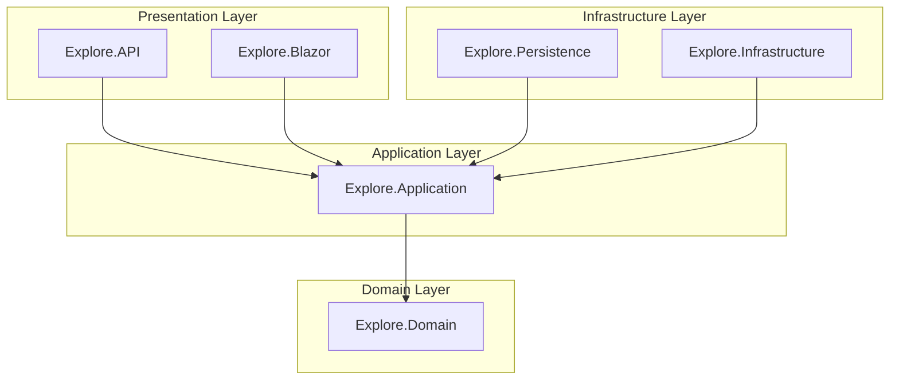
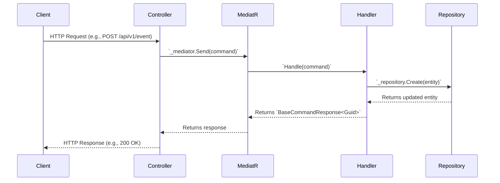
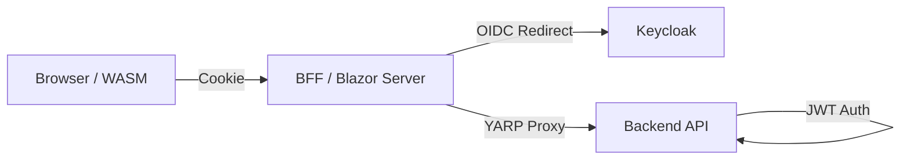

# Technical Architecture

## 1. Technology Stack

| Layer | Technology | Purpose |
|-------|------------|---------|
| **Runtime** | .NET 10.0 | Primary framework |
| **Orchestration** | .NET Aspire | Service orchestration, observability |
| **Web UI** | Blazor (Server + WebAssembly) | Hybrid rendering model |
| **UI Components** | MudBlazor | Material Design components |
| **Database** | PostgreSQL + PostGIS | Primary datastore with spatial queries |
| **ORM** | Entity Framework Core | Data access layer |
| **Authentication** | Keycloak | OIDC/JWT identity provider |
| **Authorization** | ASP.NET Core Authorization | `[Authorize]` attributes and resource-based logic |
| **Secrets** | Infisical | Secrets management |
| **Logging** | Serilog | Structured logging |
| **Telemetry** | OpenTelemetry | Distributed tracing and metrics |
| **API Docs** | Scalar + Swagger | OpenAPI documentation |
| **Federation** | ATProto / ActivityPub (Planned) | Domain model exists; federation endpoints are not yet implemented. |

## 2. Architectural Paradigm: Clean Architecture + CQRS

The project is built upon **Clean Architecture** principles to ensure a separation of concerns, testability, and maintainability. It uses **Command Query Responsibility Segregation (CQRS)** to separate read and write operations within the application layer.

### Layer Dependencies

Dependencies must only flow inwards. The domain layer has no dependencies on any other layer.



-   **Domain**: Contains pure business logic, entities, and value objects. It is the core of the application and has no external dependencies.
-   **Application**: Orchestrates the domain logic. It contains use cases (commands/queries), DTOs, and interfaces for infrastructure services. It depends only on the Domain layer.
-   **Infrastructure**: Provides concrete implementations for data access (Persistence) and external services (email, file storage). It depends on the Application layer to implement its interfaces.
-   **Presentation**: The entry points to the application, including the REST API (`Explore.API`) and the Blazor UI (`Explore.Blazor`). This layer composes the other layers and handles user interaction and HTTP requests.

### Data Flow (CQRS Pattern)

The CQRS pattern is implemented using the **MediatR** library.



*For detailed implementation guidance, see the `cqrs-mediatr-guidelines` skill.*

## 3. Frontend Architecture: Blazor Hybrid with BFF

The frontend is a **Blazor Hybrid** application that uses the **Backend-for-Frontend (BFF)** pattern for security and performance.

### Rendering Mode: InteractiveAuto

The application uses the `InteractiveAuto` render mode by default.

1.  **Fast Initial Load**: The first visit renders pages on the **server** via a SignalR connection, providing immediate content to the user.
2.  **Background Download**: The Blazor **WebAssembly** runtime and application DLLs are downloaded in the background.
3.  **Seamless Transition**: Once the WASM assets are cached, the application transitions to client-side rendering, offloading work from the server and enabling potential offline capabilities.

### BFF Security Model

The `Explore.Blazor` project acts as a security gateway for the `Explore.Blazor.Client` frontend.



-   The **BFF** handles the OIDC authentication flow with Keycloak and maintains the user session in a secure, `HttpOnly` cookie.
-   The **WASM Client** is "dumb" regarding authentication; it simply sends the cookie with each request to the BFF.
-   The **BFF** uses **YARP** as a reverse proxy. When a request for `/api/v1/...` arrives, it reads the access token from the session cookie and forwards the request to the `Explore.API` backend with a `Authorization: Bearer <token>` header.
-   This architecture ensures **no tokens are ever exposed to the browser**.

*For detailed implementation guidance, see the `blazor-bff-patterns` and `auth-patterns` skills.*

## 4. API Architecture

The `Explore.API` project is a standard ASP.NET Core REST API following Clean Architecture principles.

### Key Conventions

-   **Stateless**: The API is stateless and relies solely on the provided JWT for authentication and authorization.
-   **Thin Controllers**: Controllers are minimal. Their only job is to receive an HTTP request, send a command or query to MediatR, and return an appropriate HTTP response.
-   **Authorization**: Write endpoints (`POST`, `PUT`, `DELETE`) are protected with `[Authorize]`. Read endpoints (`GET`) are public with `[AllowAnonymous]`.
-   **Documentation**: Endpoints are documented using `[EndpointSummary]`, `[EndpointDescription]`, and `[ProducesResponseType]` attributes for OpenAPI generation.

*For detailed implementation guidance, see the `api-guidelines` skill (to be created) and `cqrs-mediatr-guidelines`.*

## 5. Project Structure

The solution is organized into projects that directly map to the layers of Clean Architecture.

```
Explore.sln
├── 
│   ├── Explore.Domain/              # Domain layer: Entities, Enums
│   ├── Explore.Application/         # Application layer: CQRS handlers, DTOs, Interfaces
│   ├── Explore.Persistence/         # Infrastructure: EF Core DbContext, Repositories
│   ├── Explore.Infrastructure/      # Infrastructure: External services (email, storage)
│   ├── Explore.API/                 # Presentation: REST API
│   ├── Explore.Blazor/              # Presentation: Blazor Server (BFF)
│   ├── Explore.Blazor.Client/       # Presentation: Blazor WebAssembly (UI)
│   ├── Explore.AppHost/             # .NET Aspire Orchestrator
│   └── Explore.ServiceDefaults/     # Shared Aspire configuration
├── tests/
│   ├── ... (Unit and Integration test projects)
└── docs/
    └── ... (High-level documentation)
```