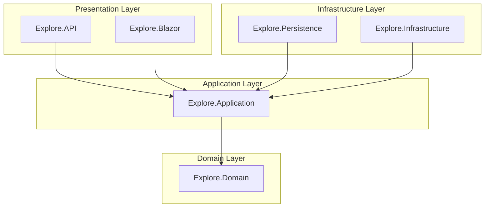
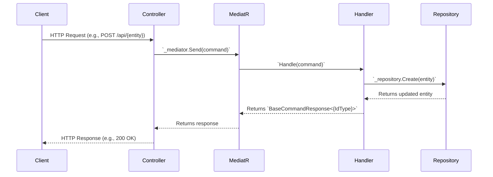
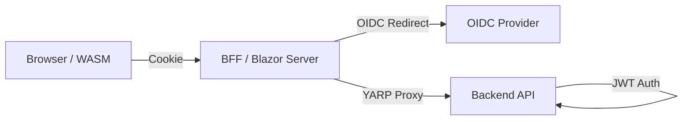

# Technical Architecture

> **Project-Agnostic .NET Clean Architecture Guide**
>
> Placeholders use `{Placeholder}` syntax - see [TEMPLATE_GLOSSARY.md](TEMPLATE_GLOSSARY.md).

**Last Updated**: February 2026

---

## Placeholder Substitutions

| Placeholder | Replace With | Example (ISLAMU Event) |
|-------------|--------------|------------------------|
| `{Project}` | Your solution name | `Explore` |
| `{Project}.Domain` | Domain layer project | `Explore.Domain` |
| `{Project}.Application` | Application layer project | `Explore.Application` |
| `{Project}.Persistence` | Persistence layer project | `Explore.Persistence` |
| `{Project}.Infrastructure` | Infrastructure layer project | `Explore.Infrastructure` |
| `{Project}.API` | API project | `Explore.API` |
| `{Project}.Blazor` | Blazor Server project | `Explore.Blazor` |
| `{Project}.Blazor.Client` | Blazor WASM project | `Explore.Blazor.Client` |
| `{Project}.AppHost` | Aspire AppHost project | `Explore.AppHost` |
| `{DbContext}` | EF Core DbContext class | `ExploreDbContext` |
| `{IdType}` | Primary key type | `Guid` |

---

## 1. Technology Stack

| Layer | Technology | Purpose |
|-------|------------|---------|
| **Runtime** | .NET 10.0 (preview) | Primary framework |
| **Orchestration** | .NET Aspire | Service orchestration, observability |
| **Web UI** | Blazor Web App (InteractiveAuto) | Interactive SSR + CSR |
| **UI Components** | MudBlazor | Material Design components |
| **Database** | PostgreSQL 18 + PostGIS | Primary datastore with spatial queries |
| **ORM** | Entity Framework Core 10 | Data access layer |
| **Authentication** | Keycloak | OIDC identity provider |
| **Authorization** | Cerbos + Local fallback | Policy decision point + runtime switch |
| **Secrets** | Infisical | Secrets management |
| **Logging** | Serilog | Structured logging |
| **Telemetry** | OpenTelemetry | Distributed tracing, metrics, and logs |
| **API Docs** | Scalar + Swagger | OpenAPI documentation |
| **Federation** | ATProto / ActivityPub (Planned) | Domain model + PDS sync worker; HTTP federation endpoints not implemented. |

## 2. Architectural Paradigm: Clean Architecture + CQRS

The project is built upon **Clean Architecture** principles to ensure a separation of concerns, testability, and maintainability. It uses **Command Query Responsibility Segregation (CQRS)** to separate read and write operations within the application layer.

### Layer Dependencies

Dependencies must only flow inwards. The domain layer has no dependencies on any other layer.

**Generic Structure:**
- **Presentation Layer**: `{Project}.API`, `{Project}.Blazor`
- **Application Layer**: `{Project}.Application`
- **Domain Layer**: `{Project}.Domain`
- **Infrastructure Layer**: `{Project}.Persistence`, `{Project}.Infrastructure`

**Diagram (Implementation Example: ISLAMU Event):**



*Substitute "Explore" with your `{Project}` name.*

**Layer Responsibilities:**

-   **Domain**: Contains pure business logic, entities, and value objects. It is the core of the application and has no external dependencies.
-   **Application**: Orchestrates the domain logic. It contains use cases (commands/queries), DTOs, and interfaces for infrastructure services. It depends only on the Domain layer.
-   **Infrastructure**: Provides concrete implementations for data access with repository pattern (Persistence via `{Project}.Persistence`) and external services (email, file storage via `{Project}.Infrastructure`). It depends on the Application layer to implement its interfaces.
-   **Presentation**: The entry points to the application, including the REST API (`{Project}.API`) and the Blazor UI (`{Project}.Blazor`). This layer composes the other layers and handles user interaction and HTTP requests.

### Data Flow (CQRS Pattern)

The CQRS pattern is implemented using the **MediatR** library.

**Generic Flow:**
1. Client sends HTTP request to `{Entity}Controller`
2. Controller sends command/query to MediatR
3. MediatR routes to appropriate handler
4. Handler interacts with repository
5. Response flows back through the chain

**Sequence Diagram:**



*Replace `{entity}` with your resource name (e.g., `event`, `order`, `product`) and `{IdType}` with your ID type (`Guid`, `int`).*

*For detailed implementation guidance, see the `cqrs-mediatr-guidelines` skill.*

## 3. Frontend Architecture: Blazor Web App with BFF

The frontend is a **Blazor Web App** that uses the **Backend-for-Frontend (BFF)** pattern for security and performance.

### Rendering Mode: InteractiveAuto

The application uses the `InteractiveAuto` render mode by default.

1.  **Fast Initial Load**: The first visit renders pages with **interactive SSR** (server) via a SignalR connection.
2.  **Background Download**: The Blazor **WebAssembly** runtime and app DLLs download in the background.
3.  **CSR on Repeat Visits**: Once assets are cached, subsequent visits use **client-side rendering (CSR)**.

### BFF Security Model

The `{Project}.Blazor` project acts as a security gateway for the `{Project}.Blazor.Client` frontend.

**Architecture Flow:**



**Security Layers:**

-   The **BFF** (`{Project}.Blazor`) handles the OIDC authentication flow with your identity provider (e.g., Keycloak) and maintains the user session in a secure, `HttpOnly` cookie.
-   The **WASM Client** (`{Project}.Blazor.Client`) is "dumb" regarding authentication; it simply sends the cookie with each request to the BFF.
-   The **BFF** uses **YARP** as a reverse proxy. When a request for `/api/...` arrives, it reads the access token from the session cookie and forwards the request to the `{Project}.API` backend with a `Authorization: Bearer <token>` header.
-   This architecture ensures **no tokens are ever exposed to the browser**.

### Implementation Example: ISLAMU Event

- **BFF**: `Explore.Blazor` (Blazor Server host)
- **Client**: `Explore.Blazor.Client` (WASM components + pages)
- **Backend API**: `Explore.API`
- **OIDC Provider**: Keycloak

*For detailed implementation guidance, see the `blazor-bff-patterns` and `auth-patterns` skills.*

## 4. API Architecture

The `{Project}.API` project is a standard ASP.NET Core REST API following Clean Architecture principles.

### Key Conventions

-   **Stateless**: The API is stateless and relies solely on the provided JWT for authentication and authorization.
-   **Thin Controllers**: Controllers are minimal. Their only job is to receive an HTTP request, send a command or query to MediatR, and return an appropriate HTTP response.
-   **Authorization**: Write endpoints (`POST`, `PUT`, `DELETE`) are protected with `[Authorize]`. Read endpoints (`GET`) are public with `[AllowAnonymous]` unless gated by policy.
-   **Documentation**: Endpoints are documented using `[EndpointSummary]`, `[EndpointDescription]`, and `[ProducesResponseType]` attributes for OpenAPI generation.

### Implementation Example: ISLAMU Event

- **API Project**: `Explore.API`
- **Base URL**: `https://localhost:7039/api`

*For detailed implementation guidance, see `cqrs-mediatr-guidelines` skill.*

## 5. Project Structure

The solution is organized into projects that directly map to the layers of Clean Architecture.

### Generic Template

```
{Project}.sln
├── {Project}.Domain/              # Domain layer: Entities, Enums, Value Objects
├── {Project}.Application/         # Application layer: CQRS handlers, DTOs, Interfaces
├── {Project}.Persistence/         # Infrastructure: EF Core DbContext, Repositories
├── {Project}.Infrastructure/      # Infrastructure: External services (email, storage, etc.)
├── {Project}.API/                 # Presentation: REST API
├── {Project}.Blazor/              # Presentation: Blazor Server (BFF)
├── {Project}.Blazor.Client/       # Presentation: Blazor WebAssembly (UI)
├── {Project}.AppHost/             # .NET Aspire Orchestrator
└── {Project}.ServiceDefaults/     # Shared Aspire configuration (observability, resilience)
├── {Project}.Diagnostic/          # Observability extensions
└── {Project}.Secrets/             # Secret management library
├── tests/
│   ├── {Project}.Application.UnitTests/
│   ├── {Project}.Domain.UnitTests/
│   └── {Project}.API.IntegrationTests/
└── docs/
    └── ... (Architecture documentation, guides)
```

### Implementation Example: ISLAMU Event

```
Explore.sln
├── Explore.Domain/              # Domain layer: Event, Organization, User entities
├── Explore.Application/         # Application layer: Event handlers, DTOs
├── Explore.Persistence/         # Infrastructure: ExploreDbContext, Repositories
├── Explore.Infrastructure/      # Infrastructure: Email, file storage services
├── Explore.API/                 # Presentation: REST API
├── Explore.Blazor/              # Presentation: Blazor Server (BFF)
├── Explore.Blazor.Client/       # Presentation: Blazor WebAssembly (UI)
├── Explore.AppHost/             # .NET Aspire Orchestrator
└── Explore.ServiceDefaults/     # Shared Aspire configuration
├── tests/
│   ├── Event.Application.UnitTests/
│   └── ... (other test projects)
└── docs/
    └── ... (High-level documentation)
```

*Substitute `{Project}` with your solution name (e.g., `OrderSystem`, `InventoryApp`, `HRPortal`).*
