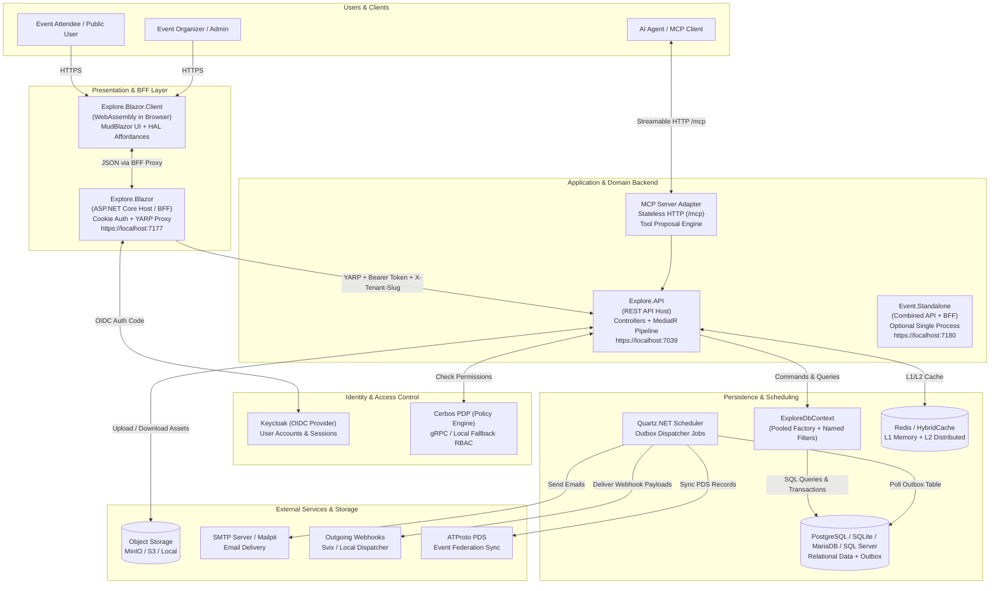
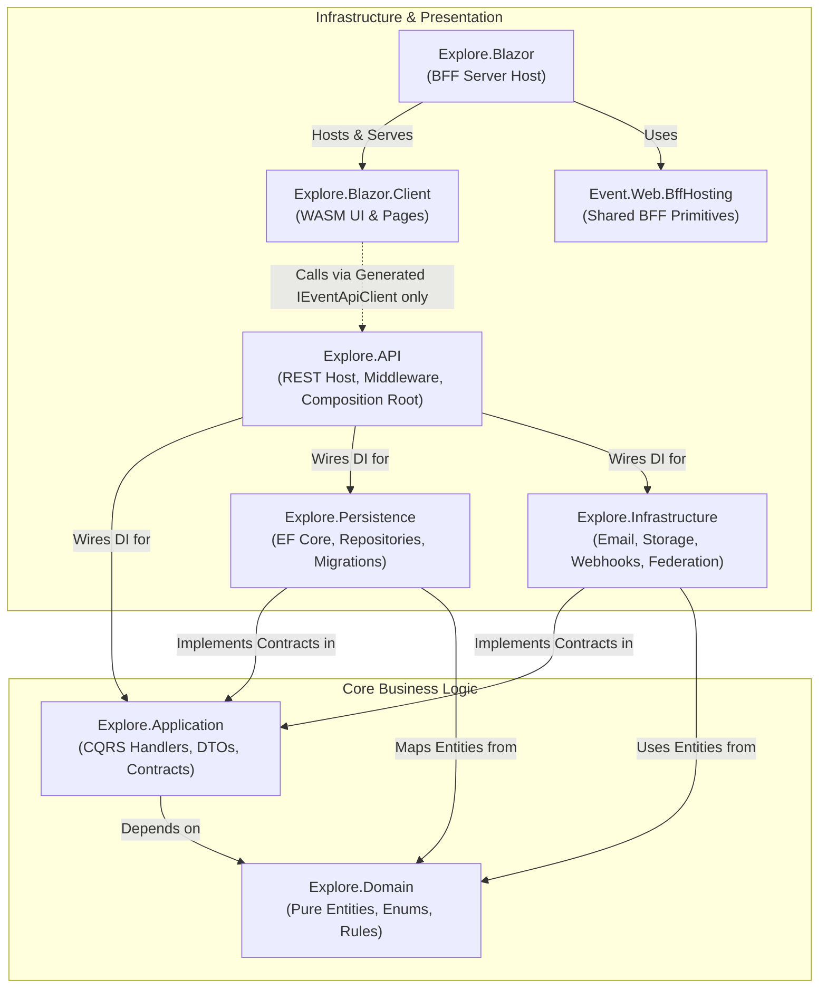
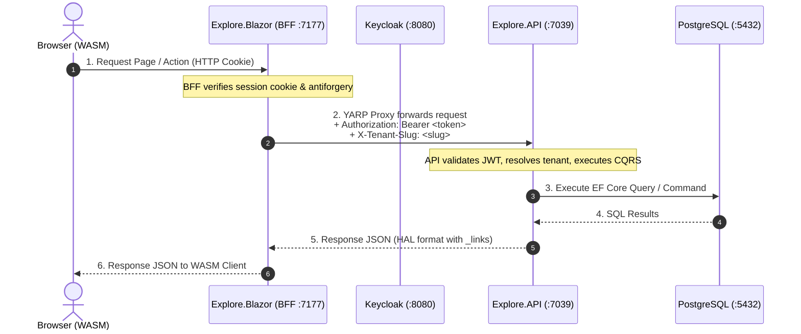

ABOUTME: High-level visual system architecture, C4 container diagram, and project map.
ABOUTME: Explains how all services, layers, and hosting topologies interact across the platform.

# System Architecture & Component Overview

> **Audience:** Contributors | Developers | Architects | AI agents
> **Status:** Implemented
> **Owner:** Contributor Experience
> **Last Verified:** 2026-08-16
> **Source Anchors:** `Explore.API/Program.cs`, `Explore.Blazor/Program.cs`, `Explore.AppHost/AppHost.cs`, `Event.Standalone/Program.cs`, `docs/DEVELOPER_GUIDE.md`, `docs/REQUEST_FLOWS.md`

This document provides a high-level visual and technical overview of how all subsystems, projects, and external services in the **ISLAMU Event** platform interact.

---

## 1. High-Level System Context & Container Map

The following diagram illustrates the complete runtime topology of ISLAMU Event, including the browser client, identity providers, authorization engines, backend APIs, background workers, and external integrations.

---

## 2. Clean Architecture & Project Dependency Graph

ISLAMU Event adheres strictly to **Clean Architecture** with inward-pointing dependencies. The core domain is entirely isolated from UI frameworks, database engines, and third-party libraries.

### Project Catalog & Responsibilities

| Project | Clean Architecture Layer | Key Responsibilities | Dependencies |
|---|---|---|---|
| **`Explore.Domain`** | Domain | Entities (`Event`, `Organization`, `User`, `OutboxMessage`), status enums, marker interfaces (`ITenantEntity`, `IAuditableEntity`, `ISoftDeletable`). | *None (Zero external dependencies)* |
| **`Explore.Application`** | Application | CQRS feature slices (Commands/Queries), MediatR handlers, FluentValidation rules, DTOs, specification query filters, and interface contracts (`IEventRepository`, `ITenantContext`). | `Explore.Domain` |
| **`Explore.Persistence`** | Persistence / Data | `ExploreDbContext` (split partials), EF Core entity configurations, named query filters, repository implementations, and data protection key stores. | `Explore.Application`, `Explore.Domain` |
| **`Explore.Infrastructure`** | Infrastructure | Email dispatching (SMTP), object storage (S3/MinIO), outgoing webhooks (Svix/Local), ATProto transport, and moderation adapters. | `Explore.Application`, `Explore.Domain` |
| **`Explore.API`** | Presentation / API Host | Composition root, ASP.NET Core controllers, middleware pipeline (tenant resolution, rate limiting, HATEOAS, auth), HAL resource assemblers, and OpenAPI generation. | `Explore.Application`, `Explore.Persistence`, `Explore.Infrastructure`, `Explore.Domain` |
| **`Explore.Blazor`** | Presentation / BFF Host | Blazor Server host, OIDC authentication challenge endpoints, session cookie management, and YARP reverse proxy to `Explore.API`. | `Event.Web.BffHosting`, `Explore.Blazor.Client` |
| **`Explore.Blazor.Client`** | Presentation / UI Client | Interactive Blazor WebAssembly frontend, MudBlazor pages, components, dialogs, design system tokens, and NSwag-generated `IEventApiClient` consumption. | *None (Generated client boundary)* |
| **`Event.Standalone`** | Optional Combined Host | Single-process host combining `Explore.API` and `Explore.Blazor` with an in-process direct pipeline and SQLite defaults for minimal resource footprints. | `Explore.API`, `Explore.Blazor` |
| **`Explore.AppHost`** | Orchestrator | .NET Aspire orchestration project for spinning up local development topologies (databases, Keycloak, Cerbos, Redis, Mailpit). | Aspire SDK |

---

## 3. Hosting Topologies: Split vs Standalone

ISLAMU Event supports two distinct hosting models configured via `Hosting:Topology`:

### 1. Split Topology (Default & Production Scalable)
In this mode, the frontend BFF and the backend API run in completely separate OS processes (or containers).

### 2. Standalone Topology (Combined Single Process)
In this mode, `Event.Standalone` hosts both Blazor UI and API within a **single executable process**.
- Browser requests to `/api/*` bypass YARP network hops.
- The BFF middleware sanitizes session cookies and dispatches in-process directly to the API pipeline.
- Ideal for minimal self-hosting, personal instances, or lightweight single-server deployments (e.g. SQLite storage).

---

## 4. Core Subsystem Architecture

### A. Multi-Tenancy Resolution & Hierarchy
Multi-tenancy is baked into the foundation of the platform:
1. **Hierarchy**: `Instance` (platform owner) ➔ `Tenant` (community/portal) ➔ `Organization` (event organizer) ➔ `Group` ➔ `User`.
2. **Resolution Pipeline**:
   - `ApiTenantResolutionMiddleware` extracts the tenant from (1) `X-Tenant-Slug` header from BFF, (2) custom domain mapping, or (3) subdomain.
   - The resolved `TenantContext` is injected into `ExploreDbContext`.
   - EF Core **Named Query Filters** automatically append `WHERE TenantId = @currentTenant` to all tenant-scoped entities (`Event`, `Organization`, `Location`, etc.).

### B. The 3-Layer Event Domain Model
Events are structured across three distinct abstraction layers to provide maximum flexibility without schema chaos:
1. **Layer 1: Universal Semantics**: Stored directly on core entities (`Event`, `EventSession`, `EventAgendaItem`, `Organization`). Includes title, slug, start/end dates, timezone, description, and status.
2. **Layer 2: Sector-Standard Aspects**: 1:1 typed optional extensions for specific verticals:
   - `EventIslamicAspect`: Prayer-relative timing, madhab targeting, halal food certification, gender segregation modes.
   - `EventTechAspect`: Tech stack tags, speaker GitHub links, skill level, devroom track.
3. **Layer 3: Governed Custom Properties**: Dynamic tenant-specific custom fields and templates defined via admin governance. Promoted to Layer 2 if they become standard.

### C. Three-Tier Location & Privacy Disclosure Model
To prevent sensitive venue addresses or private home locations from leaking to unauthenticated users or across unrelated events:
1. **`Location` (Physical Venue Master)**: Tenant-scoped physical building, room sub-divisions (`LocationRoom`), and exact coordinates/address (`LocationPii` with erasure lifecycle).
2. **`EventLocation` (Per-Event Policy)**: First-class aggregate mediating an `Event` and a `Location` (or explicit `IsToBeAnnounced` placeholder). Owns 7 field-level disclosure flags, audience gating (`FullDetailsAudienceId`), and timed reveal (`RevealFullDetailsFromUtc`).
3. **`EventSession` / `EventAgendaItem` (Mediation Invariant)**: Point to `EventLocationId` rather than unmediated physical venues, guaranteeing that session schedules always inherit and obey event-level disclosure rules.

### D. Authorization Engine (Cerbos + Local Fallback)
1. **Declarative Attributes**: Handlers and endpoints are tagged with `[AuthorizeResource(ResourceKinds.Event, AuthorizationActions.Update)]`.
2. **MediatR Pipeline**: `AuthorizationBehavior` intercepts all requests before the handler runs.
3. **Provider Cascade**:
   - Checks **Tenant BYO Cerbos** if configured by the tenant.
   - Falls back to **Instance Cerbos PDP** (gRPC).
   - Falls back to **Local RBAC (`FallbackAuthorizationService`)** if Cerbos is unreachable or in local development mode.
4. **HATEOAS Link Policies**: When serializing responses, `ResourceAssemblerBase` evaluates candidate action links in a single batch against Cerbos and attaches allowed action URLs to `_links`.

### E. Transactional Outbox Pattern
To guarantee consistency without distributed transactions (2PC):
1. Any command that generates an external effect (e.g. `CreateEventCommandHandler`) writes an `OutboxMessage` row in the same database transaction.
2. The HTTP request returns immediately (fast response time).
3. `Quartz.NET` background scheduler polls pending outbox records, locks them, deserializes the JSON payload, and calls the appropriate dispatcher (Email, Webhooks, Federation sync).
4. Handles automatic retries with exponential backoff and dead-letter queues.

### F. Multi-Tier Caching
1. **Tier 1 (HTTP Output Cache)**: Response-level caching in `Explore.API` for public listings (`30s`), lookup tables (`1h`), and detail pages (`60s`), varying by `Authorization` header.
2. **Tier 2 (Application HybridCache)**: L1 in-memory + L2 distributed (Redis) cache used within MediatR handlers with deterministic cache keys generated by `ToCacheKeySuffix()`.
3. **Tier 3 (Conditional ETag Middleware)**: Computes SHA256 weak ETags on JSON responses, returning `304 Not Modified` to save bandwidth.

---

## 5. Summary & Further Reading

- To see the step-by-step code and network flow for specific operations, read [REQUEST_FLOWS.md](REQUEST_FLOWS.md).
- To start implementing new features or bug fixes, follow the blueprints in [CONTRIBUTOR_RECIPES.md](CONTRIBUTOR_RECIPES.md).
- For strict coding standards and invariants, consult [QUICK_REFERENCE.md](QUICK_REFERENCE.md).
