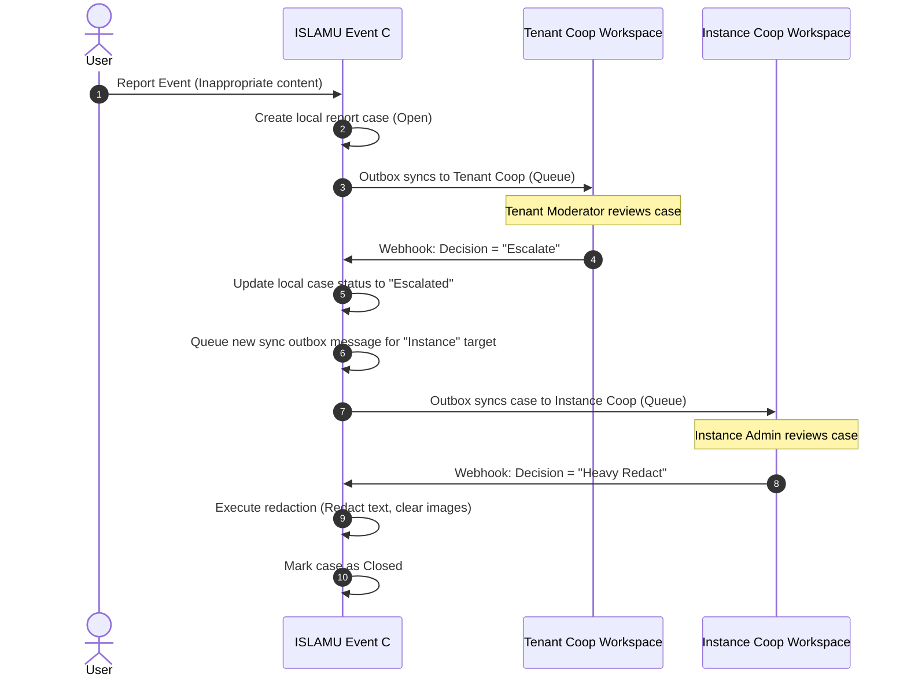

<!-- ABOUTME: Architectural design and flow mapping for the multi-tenant Coop moderation integration. -->
<!-- ABOUTME: Documents the shared cluster model, tenant keys, webhook verifications, and escalation logic. -->

# Multi-Tenant Coop Moderation Integration

This document details the architectural integration, routing flows, security mechanics, and escalation paths for the **Coop** human review queue integration within the multi-tenant ISLAMU Event platform.

---

## 1. Overview

**Coop** (developed by ROOST) is an open-source, web-based human review dashboard designed to aggregate event reports, assign cases to moderation teams, and record manual triage decisions.

Coop was built with native SaaS multi-tenancy. A single deployed cluster of Coop can host multiple isolated workspaces ("tenants"), each with its own API keys, webhook endpoints, and human reviewers. ISLAMU Event leverages this native multi-tenancy to provide a robust, hierarchically isolated moderation queue.

---

## 2. Deployment Models

The platform supports two distinct infrastructure deployment models for Coop:

```text
Model A: Shared Coop Cluster (SaaS/Siloed-by-Key)
┌────────────────────────────────────────────────────────┐
│                     ISLAMU Event                       │
│  Tenant A (Mosque A)            Tenant B (Mosque B)    │
└───────────┬──────────────────────────────┬─────────────┘
            │ (API Key A)                  │ (API Key B)
            ▼                              ▼
┌────────────────────────────────────────────────────────┐
│                 Shared Coop Cluster                    │
│  Coop Tenant A (Queue A)        Coop Tenant B (Queue B)│
└────────────────────────────────────────────────────────┘

Model B: Isolated/Self-Hosted Coop
┌──────────────────────────┐      ┌──────────────────────────┐
│  Tenant A (Mosque A)     │      │  Tenant B (Mosque B)     │
└───────────┬──────────────┘      └───────────┬──────────────┘
            │ (Private URL/Key)               │ (Private URL/Key)
            ▼                                 ▼
┌──────────────────────────┐      ┌──────────────────────────┐
│  Private Coop Instance A │      │  Private Coop Instance B │
└──────────────────────────┘      └──────────────────────────┘
```

1. **Shared Coop Cluster (Model A - Default Hosted SaaS):**
   * The platform operator deploys and maintains a single physical Coop instance.
   * The operator provisions separate Coop tenants for the **ISLAMU Event Instance Admin** (e.g. `islamevent-instance-safety`) and for **each ISLAMU Event Tenant** (e.g. `tenant-a`, `tenant-b`).
   * Isolation is enforced cryptographically using separate Coop API keys and webhook secrets per tenant, all routed through a single public Coop domain.

2. **Isolated/Self-Hosted Coop (Model B - Decentralized):**
   * Larger communities or enterprise tenants who run their own physical infrastructure can configure their tenant to point to an entirely separate, private Coop server.
   * This is supported natively via hierarchical tenant settings.

---

## 3. Data Scoping & Routing Policy

Local canonical reports and cases are always created in the ISLAMU Event PostgreSQL database **first**. Data synchronization to Coop occurs asynchronously via the transactional outbox pattern.

### The Routing Resolver
The system evaluates the effective targets at runtime using the `ReportingRoutingPolicyResolver`. This resolver merges two scopes of targets:
* **Instance Target:** Configured statically via environment variables (`Reporting:Coop:*`), representing the platform-level safety queue.
* **Tenant Target:** Dynamic settings stored in `TenantSetting` overrides:
  * `reporting.enable_tenant_coop_provider` (Boolean)
  * `reporting.coop_endpoint_url` (String)
  * `reporting.coop_api_key` (String / Encrypted)

If both are active, the sync envelope is dispatched to **both** queues using their respective target endpoints.

### Sync Envelope Shape
To comply with data minimization and GDPR rules, the payload sent to Coop is **metadata-first**. It excludes raw reporter text, reporter IP/User-Agent hashes, event titles, slugs, or URLs.
Instead, it transmits:
* Unique identifiers (`TenantId`, `ReportId`, `EventId`, `CaseId`).
* Status codes and priority flags (`QueueCode`, `CaseStatusCode`, `PriorityCode`, `ReasonCode`).
* Timestamp details.

---

## 4. Webhook Callback Intake & Security

When a reviewer makes a decision in Coop (e.g., dismissing a case, warning an organizer, or moderating an event), Coop dispatches a signed HTTP POST callback to the ISLAMU Event endpoint:
`POST /api/integrations/moderation/coop/callback`

```text
   Coop Review Queue
         │ (Manual Decision)
         ▼
[ HTTP POST Webhook Callback ]
         │
         ▼
[ Read Raw Request Body ] (Verify timestamped HMAC-SHA256 signature)
         │
         ▼
[ Resolve Tenant Secret ] (Locate TenantId in payload, load webhook secret)
         │
         ├─► [ Invalid Signature ] ──► Return 401/403
         │
         ▼
[ Check Idempotency Table ] (Check incoming_webhook_messages)
         │
         ├─► [ Duplicate Message ] ──► Return 200 OK (Skip Side Effects)
         │
         ▼
[ Dispatch ProcessCoopDecisionCallbackCommand ]
         │
         ▼
[ Execute local moderation actions via MediatR ]
```

### Signature Validation
1. The endpoint reads the raw request body before JSON parsing to preserve signature byte accuracy.
2. The endpoint extracts the `X-Coop-Signature` and `X-Coop-Timestamp` headers.
3. The system parses the JSON payload to resolve the target `TenantId`.
4. It retrieves the specific webhook secret configured for that tenant (or instance default) and computes the HMAC-SHA256 hash.
5. If the signature matches and the timestamp is within the drift tolerance window (typically 5 minutes), the callback is verified.

### Idempotency Enforcement
All verified callbacks are logged in the `incoming_webhook_messages` table using the Coop `ProviderDecisionId` as the primary key. If a duplicate webhook arrives (due to network retries), it is acknowledged with a `200 OK` instantly, preventing duplicate side effects.

---

## 5. Escalation State Machine

One of the key requirements of the system is the **Hierarchical Escalation Flow**. Community moderators handle standard violations, but severe violations or escalated reports must bubble up to the Platform Instance Admin.



### The Escalation Steps:
1. **Initial Dispatch:** An event report is submitted. It matches the tenant's scope and is synced to the **Tenant Coop Workspace**.
2. **Local Escalation Decision:** A local reviewer determines the issue is beyond local policy (e.g. platform safety threat) and flags the case as **Escalate**.
3. **Status Transition:** The webhook callback hits ISLAMU Event. The `ProcessCoopDecisionCallbackCommandHandler` transitions the local case status to `EventReportStatus.Escalated`.
4. **Outbox Re-evaluation:** The status change triggers a domain event handler. The handler generates a new sync outbox request.
5. **Instance Dispatch:** Because the status is now `Escalated`, the `CompositeEventReportProvider` resolves the global **Instance Coop Workspace** target and pushes the case to the super-admin queue.
6. **Final Resolution:** The Instance Admin makes the final decision (e.g. `HeavyRedact`), which executes locally via `ExecuteReportDecisionCommand` and propagates down, closing the case.

---

## 6. Implementation Reference

* **Composite Provider:** [CompositeEventReportProvider.cs](file:///home/amir/ISLAMU/Github/Event/Explore.Infrastructure/Services/Moderation/CompositeEventReportProvider.cs)
* **Callback Handler:** [ProcessCoopDecisionCallbackCommandHandler.cs](file:///home/amir/ISLAMU/Github/Event/Explore.Application/Features/EventReporting/Handlers/Commands/ProcessCoopDecisionCallbackCommandHandler.cs)
* **API Controller:** [ModerationIntegrationController.cs](file:///home/amir/ISLAMU/Github/Event/Explore.API/Controllers/ModerationIntegrationController.cs)
* **Integration Tests:** [IncomingWebhookFrameworkTests.cs](file:///home/amir/ISLAMU/Github/Event/Event.API.IntegrationTests/Features/IncomingWebhookFrameworkTests.cs)
