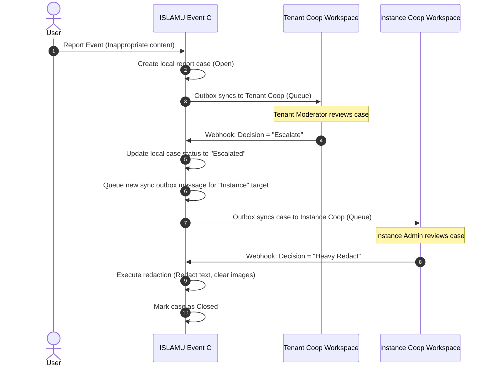

<!-- ABOUTME: Architectural design and flow mapping for the multi-tenant Coop moderation integration. -->
<!-- ABOUTME: Documents the shared cluster model, tenant keys, webhook verifications, and escalation logic. -->

# Multi-Tenant Coop Moderation Integration

This document details the architectural integration, routing flows, security mechanics, and escalation paths for the **Coop** human review queue integration within the multi-tenant ISLAMU Event platform.

---

## 1. Overview

**Coop** (developed by ROOST) is an open-source, web-based human review dashboard designed to aggregate event reports, assign cases to moderation teams, and record manual triage decisions.

Coop was built with native SaaS multi-tenancy. A single deployed cluster of Coop can host multiple isolated workspaces ("tenants"), each with its own API keys, webhook endpoints, and human reviewers. ISLAMU Event leverages this native multi-tenancy to provide a robust, hierarchically isolated moderation queue.

---

## 2. Deployment Models

The platform supports two distinct infrastructure deployment models for Coop:

```text
Model A: Shared Coop Cluster (SaaS/Siloed-by-Key)
┌────────────────────────────────────────────────────────┐
│                     ISLAMU Event                       │
│  Tenant A (Mosque A)            Tenant B (Mosque B)    │
└───────────┬──────────────────────────────┬─────────────┘
            │ (API Key A)                  │ (API Key B)
            ▼                              ▼
┌────────────────────────────────────────────────────────┐
│                 Shared Coop Cluster                    │
│  Coop Tenant A (Queue A)        Coop Tenant B (Queue B)│
└────────────────────────────────────────────────────────┘

Model B: Isolated/Self-Hosted Coop
┌──────────────────────────┐      ┌──────────────────────────┐
│  Tenant A (Mosque A)     │      │  Tenant B (Mosque B)     │
└───────────┬──────────────┘      └───────────┬──────────────┘
            │ (Private URL/Key)               │ (Private URL/Key)
            ▼                                 ▼
┌──────────────────────────┐      ┌──────────────────────────┐
│  Private Coop Instance A │      │  Private Coop Instance B │
└──────────────────────────┘      └──────────────────────────┘
```

1. **Shared Coop Cluster (Model A - Default Hosted SaaS):**
   * The platform operator deploys and maintains a single physical Coop instance.
   * The operator provisions separate Coop tenants for the **ISLAMU Event Instance Admin** (e.g. `islamevent-instance-safety`) and for **each ISLAMU Event Tenant** (e.g. `tenant-a`, `tenant-b`).
   * Isolation is enforced cryptographically using separate Coop API keys and webhook secrets per tenant, all routed through a single public Coop domain.

2. **Isolated/Self-Hosted Coop (Model B - Decentralized):**
   * Larger communities or enterprise tenants who run their own physical infrastructure can configure their tenant to point to an entirely separate, private Coop server.
   * This is supported natively via hierarchical tenant settings.

---

## 3. Data Scoping & Routing Policy

Local canonical reports and cases are always created in the ISLAMU Event PostgreSQL database **first**. Data synchronization to Coop occurs asynchronously via the transactional outbox pattern.

### The Routing Resolver
The system evaluates the effective targets at runtime using the `ReportingRoutingPolicyResolver`. This resolver merges two scopes of targets:
* **Instance Target:** Configured statically via environment variables (`Reporting:Coop:*`), representing the platform-level safety queue.
* **Tenant Target:** Dynamic settings stored in `TenantSetting` overrides:
  * `reporting.enable_tenant_coop_provider` (Boolean)
  * `reporting.coop_endpoint_url` (String)
  * `reporting.coop_api_key` (String / Encrypted)

If both are active, the sync envelope is dispatched to **both** queues using their respective target endpoints.

### Sync Envelope Shape
To comply with data minimization and GDPR rules, the payload sent to Coop is **metadata-first**. It excludes raw reporter text, reporter IP/User-Agent hashes, event titles, slugs, or URLs.
Instead, it transmits:
* Unique identifiers (`TenantId`, `ReportId`, `EventId`, `CaseId`).
* Status codes and priority flags (`QueueCode`, `CaseStatusCode`, `PriorityCode`, `ReasonCode`).
* Timestamp details.

---

## 4. Webhook Callback Intake & Security

Signed decision callbacks use a durable two-stage intake/effect flow. Intake verifies and retains the exact callback bytes, then atomically creates one specialized effect pointer. A separate fenced worker loads those retained bytes and invokes the existing Coop decision command outside the intake transaction.

When a reviewer makes a decision in Coop (e.g., dismissing a case, warning an organizer, or moderating an event), Coop dispatches a signed HTTP POST callback to the ISLAMU Event endpoint:
`POST /api/integrations/moderation/coop/callback`

```text
   Coop Review Queue
         │ (Manual Decision)
         ▼
[ HTTP POST Webhook Callback ]
         │
         ▼
[ Read Raw Request Body ] (Verify timestamped HMAC-SHA256 signature)
         │
         ▼
[ Resolve Tenant Secret ] (Locate TenantId in payload, load webhook secret)
         │
         ├─► [ Invalid Signature ] ──► Return 401/403
         │
         ▼
[ Retain Idempotency Record ] (incoming_webhook_messages)
         │
         ├─► [ Duplicate Message ] ──► Return 200 OK
         │
         ▼
[ IncomingWebhookEffectOutbox ] (claim + fenced renewable lease)
         │
         ▼
[ Load retained callback and revalidate pointer identity ]
         │
         ▼
[ ProcessCoopDecisionCallbackCommand ]
         │
         ▼
[ ExecuteReportDecisionCommand ] (canonical enforcement/completion seam)
         │
         ▼
[ Complete decision + materialize reporter notification atomically ]
         │
         ├─► [ Retryable failure ] ──► Schedule bounded retry
         ├─► [ Poison callback ] ──► Dead-letter for operator review
         ▼
[ Commit applied-effect receipt + pointer completion ]
```

### Signature Validation
1. The endpoint reads the raw request body before JSON parsing to preserve signature byte accuracy.
2. The endpoint extracts the `X-Coop-Signature` and `X-Coop-Timestamp` headers.
3. The system parses the JSON payload to resolve the target `TenantId`.
4. It retrieves the specific webhook secret configured for that tenant (or instance default) and computes the HMAC-SHA256 hash.
5. If the signature matches and the timestamp is within the drift tolerance window (typically 5 minutes), the callback is verified.

### Idempotency Enforcement
Verified callbacks are retained in `incoming_webhook_messages`. Every decision callback must carry a stable, nonblank signed `ProviderDecisionId`; neither intake nor `ProcessCoopDecisionCallbackCommand` derives one from report, case, correlation, or action fields. The identifier and SHA-256 evidence bind the retained message to a specialized `IncomingWebhookEffectOutbox`. Unique `(TenantId, Provider, ProviderDecisionId, EffectKind)` and `(TenantId, IncomingWebhookMessageId, EffectKind)` constraints make exact replay idempotent; missing IDs and same-ID/different-hash input quarantine instead of running a decision. A later `NeedsMoreInfo` or `Escalate` generation therefore needs a new provider identifier, while an exact replay retains the original identifier.

The outbound Coop mirror includes the authoritative report-case concurrency stamp as `expected_case_concurrency_stamp`. Coop must echo that exact value in the signed decision callback. The retained callback bytes remain authoritative: the effect worker never fills in or replaces a missing stamp, and a genuinely new decision with an absent or stale stamp is rejected for refresh. Exact replay of an already captured provider decision remains stamp-independent.

The effect worker claims due pointers with a generation, monotonically increasing fence, opaque token, owner, and renewable expiry. Settlement rechecks the complete claim identity. It validates tenant, provider, event kind, payload hash, and decision identity against the retained callback before invoking `ProcessCoopDecisionCallbackCommand`.

That command captures the provider decision and invokes `ExecuteReportDecisionCommand` with the selected decision ID and post-selection case stamp. This is the same executor used by the local moderation API. Enforcement receipts, case completion, and reporter outcome or follow-up materialization belong exclusively to that executor; callback capture alone cannot create a reporter outcome. The applied-effect receipt and pointer completion commit together only after command execution succeeds. A crashed or stale worker cannot settle work after a newer claim recovers the lease, and callback/pointer/dispatcher replay converges on the same decision/execution identity without creating another notification intent.

Permanent validation failures are dead-lettered with bounded categories and safe details. Retryable failures use bounded retry scheduling; cancellation leaves the lease for normal expiry recovery. Operators inspect tenant-scoped lifecycle data through `GET /api/admin/incoming-webhook-effects/status` and may follow the HAL `redrive` relation only for dead-lettered rows whose retained payload remains inside its replay window. Redrive requires the expected processing generation and an authenticated actor, creates a safe audit event, and never returns callback bytes, hashes, provider decision IDs, or raw provider errors.

---

## 5. Escalation State Machine

The durable callback-to-command route below is implemented. The local report-case state machine remains authoritative: stale or out-of-order decisions are rejected by the existing command path and cannot reopen a completed case.

One of the key requirements of the system is the **Hierarchical Escalation Flow**. Community moderators handle standard violations, but severe violations or escalated reports must bubble up to the Platform Instance Admin.



### The Escalation Steps:
1. **Initial Dispatch:** An event report is submitted. It matches the tenant's scope and is synced to the **Tenant Coop Workspace**.
2. **Local Escalation Decision:** A local reviewer determines the issue is beyond local policy (e.g. platform safety threat) and flags the case as **Escalate**.
3. **Status Transition:** After the durable effect dispatcher successfully invokes `ProcessCoopDecisionCallbackCommandHandler`, the local case may transition to `EventReportStatus.Escalated`.
4. **Outbox Re-evaluation:** The status change triggers a domain event handler. The handler generates a new sync outbox request.
5. **Instance Dispatch:** Because the status is now `Escalated`, the `CompositeEventReportProvider` resolves the global **Instance Coop Workspace** target and pushes the case to the super-admin queue.
6. **Final Resolution:** The Instance Admin decision executes locally through the one decision executor before the specialized effect settles; stale/out-of-order callbacks cannot reopen a completed case.

---

## 6. Implementation Reference

* **Composite Provider:** `src/Explore.Infrastructure/Services/Moderation/CompositeEventReportProvider.cs`
* **Callback Command Handler:** `src/Explore.Application/Features/EventReporting/Handlers/Commands/ProcessCoopDecisionCallbackCommandHandler.cs`
* **Canonical Decision Executor:** `src/Explore.Application/Features/EventReporting/Handlers/Commands/ExecuteReportDecisionCommandHandler.cs`
* **Effect Processing:** `src/Explore.Application/Services/Webhooks/IncomingWebhookEffectProcessingService.cs`
* **Effect Drain:** `src/Explore.Infrastructure/Webhooks/IncomingWebhookEffectDrainService.cs`
* **Operator API:** `src/Explore.API/Controllers/IncomingWebhookEffectsAdminController.cs`
* **API Controller:** `src/Explore.API/Controllers/ModerationIntegrationController.cs`
* **Incoming Framework Tests:** `tests/Event.API.IntegrationTests/Features/IncomingWebhookFrameworkTests.cs`
