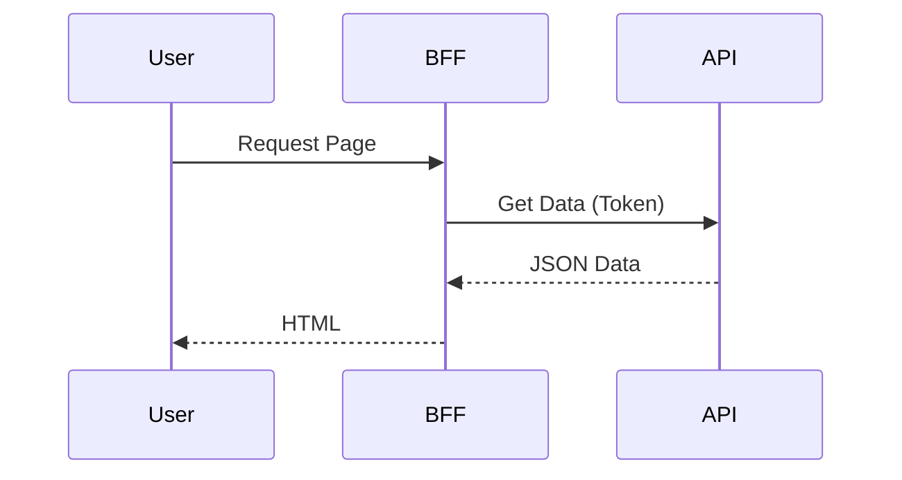
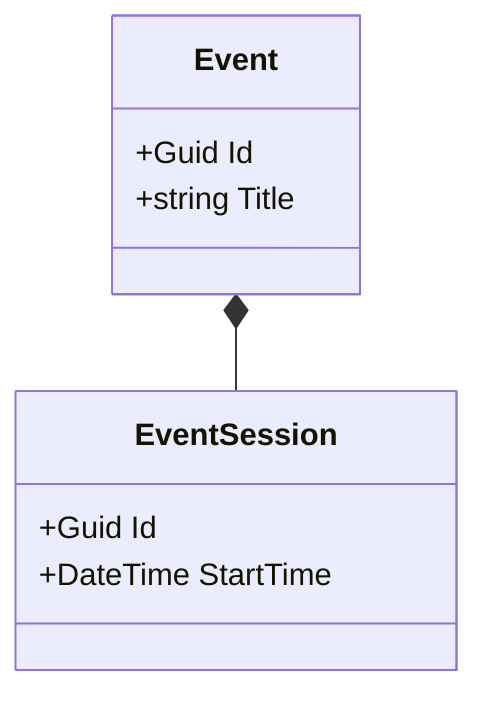

# Documentation Style Guide

This guide establishes the standards for writing documentation in the ISLAMU Event project. We follow the **Microsoft Style Guide** and the **Diátaxis Framework** to ensure consistency, clarity, and usability.

---

## 1. Core Principles

### 1.1. Voice and Tone
*   **Be direct and active.** Use the imperative mood for instructions.
    *   ✅ *Create a new event.*
    *   ❌ *A new event can be created.*
*   **Address the user as "you".**
    *   ✅ *You must configure the API key.*
    *   ❌ *The user must configure the API key.*
*   **Be concise.** Avoid fluff.
    *   ✅ *To save changes, click **Save**.*
    *   ❌ *In order to save your changes to the system, please go ahead and click on the **Save** button.*

### 1.2. The Diátaxis Framework
Structure documentation into four distinct types:

1.  **Tutorials** (Learning-oriented): Step-by-step lessons where the user *does* something to learn.
    *   *Example: "Build your first Event Strategy"*
2.  **How-To Guides** (Problem-oriented): Steps to solve a specific real-world problem.
    *   *Example: "How to configure Keycloak for multi-tenancy"*
3.  **Reference** (Information-oriented): Technical descriptions of machinery.
    *   *Example: "API Endpoint Reference", "Configuration Options"*
4.  **Explanation** (Understanding-oriented): High-level context and design decisions.
    *   *Example: "Understanding the Hybrid Caching Strategy"*

---

## 2. Formatting Standards

### 2.1. Text Formatting
*   **Bold**: Use for UI elements, filenames, and key terms upon first introduction.
    *   *Click **Save**.*
    *   *Open `appsettings.json`.*
*   *Italics*: Use for emphasis (sparingly) or placeholders.
    *   *Replace `your-api-key` with the actual key.*
*   `Code`: Use for inline code, commands, and property names.
    *   *Set the `TenantId` property.*

### 2.2. Code Blocks
Always specify the language for syntax highlighting.

```csharp
public void Configure(IApplicationBuilder app)
{
    app.UseRouting();
}
```

### 2.3. Headings
*   Use Sentence case for headings.
    *   ✅ *Configure the database connection*
    *   ❌ *Configure The Database Connection*
*   Hierarchy: `#` (Page Title) -> `##` (Section) -> `###` (Subsection).

### 2.4. Lists
*   Use bullet lists for non-sequential items.
*   Use numbered lists for sequential steps.

---

## 3. Terminology

| Term | Definition | Usage Note |
| :--- | :--- | :--- |
| **Tenant** | A customer organization with isolated data. | Use instead of "Client" or "Account". |
| **Instance** | The running deployment of the platform. | Use for single-tenant vs multi-tenant discussions. |
| **Event** | The core entity (conference, webinar). | Capitalize when referring to the Entity. |
| **Session** | A sub-unit of an event (talk, workshop). | |
| **BFF** | Backend-for-Frontend. | Refers to the Blazor Server host. |
| **Aspect** | A modular extension of an event (Islamic, Tech). | |

---

## 4. Diagramming Standards

Use **Mermaid** for all diagrams.

### 4.1. Sequence Diagrams (Flows)


### 4.2. Class Diagrams (Structure)


---

## 5. Review Checklist

Before merging documentation PRs:
- [ ] Is the document type clear (Tutorial vs Reference)?
- [ ] Are headings in Sentence case?
- [ ] Is code highlighted correctly?
- [ ] Are prerequisites listed at the top?
- [ ] Is "please" avoided? (Be direct)
- [ ] Are all placeholders clearly marked (e.g., `<your-id>`)?
