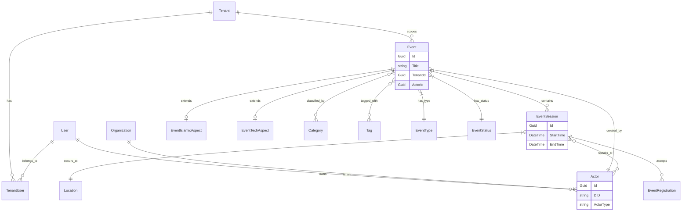

# Domain Model

> **Project-Specific Domain Reference**
>
> This document describes the domain model for the ISLAMU Event platform (Explore project).
> While entity names are project-specific, the architectural patterns and structure can be adapted to any .NET Clean Architecture project.
>
> For generic architectural guidance, see [ARCHITECTURE.md](ARCHITECTURE.md) and [GOVERNANCE.md](GOVERNANCE.md).
> Placeholders use `{Placeholder}` syntax - see [TEMPLATE_GLOSSARY.md](TEMPLATE_GLOSSARY.md).

## Placeholder Substitutions

| Placeholder | Replace With | Example (ISLAMU Event) |
|-------------|--------------|------------------------|
| `{Project}` | Your solution name | `Explore` |
| `{Project}.Domain` | Domain layer project | `Explore.Domain` |

---

## Overview

The domain layer (`{Project}.Domain/`) is the heart of the application, containing all business entities, enums, and value objects. It defines **what** the system is about, independent of any technical implementation details.

### Implementation Example: ISLAMU Event
The `Explore.Domain/` layer contains entities specific to Islamic event discovery and federation, including:
- Multi-tenant organization and event management
- ATProto federation actors and records
- Islamic-specific metadata (Madhab, prayer times)
- Event registration and approval workflows

For details on how these domain models are implemented using Entity Framework Core, including conventions for IDs, numeric types, default values, and link tables, refer to the **`dotnet-efcore-guidelines` skill**.

## Domain Model Visualized



## Core Entities

### Tenant Management

#### Tenant
*   **Purpose**: Represents a distinct client or organization within the multi-tenant system, ensuring data isolation.
*   **Key Relationships**: Core of multi-tenancy; all tenant-scoped entities link to `Tenant`.
*   **Associated Concepts**: `TenantUser`, `TenantSettings`.

#### TenantUser
*   **Purpose**: Links a User to a specific Tenant, often with associated roles.
*   **Key Relationships**: Many-to-many relationship between `User` and `Tenant`.

#### TenantSettings
*   **Purpose**: Stores tenant-specific configuration and policies.
*   **Key Relationships**: One-to-one relationship with `Tenant`.

#### Role (Unified)
*   **Purpose**: Defines roles across all scopes — Platform (SuperAdmin, Admin, Moderator, Editor, Member), Tenant (TenantOwner, TenantAdmin, TenantModerator, TenantMember), and Organization (OrgCreator, OrgCoOwner, OrgAdmin, OrgModerator, OrgMember, OrgViewer).
*   **Key Relationships**: Referenced by `TenantUser.RoleId`, `OrganizationMember.RoleId`. Scoped via `RoleScopeEnum`. Linked to `Permission` via `RolePermission` join table.

### User Management

#### User
*   **Purpose**: Represents a user account in the system.
*   **Key Relationships**: Can link to an `Actor` for federation, and associated with `UserAuthenticationToken`, `UserExternalLogin`, `OrganizationMember`, `EventRegistration`.

#### UserAuthenticationToken
*   **Purpose**: Stores authentication-related tokens for users (e.g., from Keycloak, ATProto OAuth).
*   **Key Relationships**: Links to `User` and `Tenant`.

#### UserExternalLogin
*   **Purpose**: Records external login details, such as DID (Decentralized Identifier) or private keys for ATProto OAuth.
*   **Key Relationships**: Links to `User` and `Tenant`.

### Federation (ATProto)

#### Actor
*   **Purpose**: Represents a federated identity (DID) in the ATProto network. This is the core identity for all content creators and organizations.
*   **Key Relationships**: Linked to `ActorType`, `DidCustodyType`, `User`.

#### ActorType
*   **Purpose**: Categorizes actors (e.g., User, Organization, Service, Bot).

#### DidCustodyType
*   **Purpose**: Defines who controls an Actor's DID keys (e.g., Self-Custodied, Custodial).

#### ActorKeyStore
*   **Purpose**: Securely stores cryptographic keys associated with an `Actor`.
*   **Key Relationships**: Links to `Actor` and `Tenant`.

#### IndexedDid
*   **Purpose**: Tracks DIDs discovered and indexed from the ATProto network.

#### SyncState
*   **Purpose**: Manages the synchronization progress with federation firehoses/relays.

#### AtprotoRecord
*   **Purpose**: Links local entities (like `Event` or `EventRegistration`) to their corresponding records on the ATProto network.
*   **Key Relationships**: Linked to entities that are federated.

### Organization Management

#### Organization
*   **Purpose**: Represents an entity that creates and manages events (e.g., a mosque, a university, a community group).
*   **Key Relationships**: Linked to `ApprovalStatus`, `Actor`, and has associated `OrganizationMember`s and `OrganizationReview`s.
*   **Associated Concepts**: Supports a two-tier verification system (User-Submitted vs. Verified).

#### OrganizationMember
*   **Purpose**: Represents a `User`'s membership within an `Organization`, defining their role and position.
*   **Key Relationships**: Links `Organization` with `User`.

#### OrganizationPosition
*   **Purpose**: Defines specific positions within an `Organization` (e.g., President, Secretary).

#### ApprovalStatus
*   **Purpose**: Defines the various stages of approval for entities like `Organization`s or `EventRegistration`s (e.g., Pending, Approved, Verified).

#### OrganizationReview
*   **Purpose**: Captures community reviews and ratings for `Organization`s.

### Event Management

#### Event
*   **Purpose**: The central entity representing a scheduled occurrence (e.g., a conference, webinar, workshop).
*   **Key Relationships**: Links to `EventType`, `AudienceGender`, `AudienceAge`, `Actor`, `EventStatus`, `VisibilityType`, `EventFormat`, `Madhab`, `StorageObject` (for featured image), and potentially `AtprotoRecord`.
*   **Associated Concepts**: Can have multiple `EventSession`s.

#### EventSession
*   **Purpose**: Represents a specific time slot or segment of an `Event`. Events can have one or many sessions.
*   **Key Relationships**: Links to `Event`, `Location`, `RegistrationMode`.
*   **Associated Concepts**: Can contain `EventSessionAgendaItem`s, `EventSessionSpeaker`s, `EventSessionLanguage`s, and `EventRegistration`s.

#### EventSessionAgendaItem
*   **Purpose**: Details specific activities or segments within an `EventSession` (e.g., a speaker's talk, a break).
*   **Key Relationships**: Links to `EventSession`, `Location`.

#### EventSessionSpeaker
*   **Purpose**: Links an `Actor` (speaker) to an `EventSession`.
*   **Key Relationships**: Many-to-many relationship between `Actor` and `EventSession`.

#### EventSessionLanguage
*   **Purpose**: Indicates the languages supported or used in an `EventSession`.
*   **Key Relationships**: Many-to-many relationship between `EventSession` and `Language`.

#### EventRegistration
*   **Purpose**: Records a `User`'s registration for an `EventSession`.
*   **Key Relationships**: Links to `User`, `EventSession`, `ApprovalStatus`, and potentially `AtprotoRecord`.

#### RegistrationMode
*   **Purpose**: Defines the method of registration for an `EventSession` (e.g., Open, Approval Required, Invitation Only).

### Module-Specific Entity Extensions

The system supports **modular event types** through aspect entities that extend the base `Event` entity with domain-specific fields. This pattern allows different event types to have specialized properties while maintaining a consistent core event model.

#### EventIslamicAspect
*   **Purpose**: Extends `Event` with Islamic-specific fields for religious events (prayer-relative scheduling, gender segregation, madhab).
*   **Key Fields**:
    -   `ReferencePrayer` (`PrayerTime`) - Fajr, Sunrise, Dhuhr, Asr, Maghrib, Isha
    -   `PrayerTimeOffset` (int) - Minutes offset from the referenced prayer
    -   `GenderMode` (`GenderSegregationMode`) - Mixed, MenOnly, WomenOnly, Segregated, Family
    -   `IncludesQuranRecitation` (bool)
    -   `PrimaryLanguageId` (int?) - Lookup ID for Islamic content language
*   **Relationship**: One-to-one with `Event` (optional)
*   **Module Governance**: Enabled per-tenant via `TenantCapability` table

**Enum References**:
- `PrayerTime`: Fajr (1), Sunrise (2), Dhuhr (3), Asr (4), Maghrib (5), Isha (6)
- `GenderSegregationMode`: Mixed (0), MenOnly (1), WomenOnly (2), Segregated (3), Family (4)

#### EventTechAspect
*   **Purpose**: Extends `Event` with technology-specific fields for tech conferences, workshops, and hackathons.
*   **Key Fields**:
    -   `GithubRepoUrl` (string?) - Repository link
    -   `HackathonTrack` (string?) - Competition track name
    -   `SkillLevel` (`SkillLevel`) - AllLevels, Beginner, Intermediate, Advanced
    -   `TechStackTags` (string?) - Comma-separated tech tags
    -   `RequiresLaptop` (bool)
    -   `IsCodingCompetition` (bool)
*   **Relationship**: One-to-one with `Event` (optional)
*   **Module Governance**: Enabled per-tenant via `TenantCapability` table

**Enum References**:
- `SkillLevel`: AllLevels (0), Beginner (1), Intermediate (2), Advanced (3)

#### Module Resolution Strategy Pattern

The system uses a **strategy pattern** to resolve module-specific aspects:

```csharp
// Simplified conceptual example
public interface IModuleService<TEntity, TAspect>
{
    Task<TAspect?> GetAspectAsync(Guid entityId);
    Task SaveAspectAsync(TAspect aspect);
}

// Usage in handlers
var islamicAspect = await _islamicModuleService.GetAspectAsync(eventId);
if (islamicAspect != null)
{
    // Event has Islamic-specific data
    dto.ReferencePrayer = islamicAspect.ReferencePrayer;
}
```

**Key Design Principles**:
-   **Opt-in Architecture**: Events don't require aspect entities. Only create aspect when needed.
-   **Tenant Control**: Modules are enabled/disabled per tenant via `TenantCapability` table
-   **Type Safety**: Each aspect has its own strongly-typed entity and DTO
-   **Separation of Concerns**: Core event logic remains clean; domain-specific logic in aspects

**See Also**: [CODEBASE_INSIGHTS.md](CODEBASE_INSIGHTS.md) Section 7 for module governance implementation details.

### Event Session Hierarchy

The event session system supports complex, multi-session events with detailed scheduling:

```
Event (e.g., "Annual Tech Conference 2026")
├── EventSession 1 (e.g., "Day 1 - Morning Keynote")
│   ├── EventSessionAgendaItem 1 (e.g., "09:00 - Opening Remarks")
│   ├── EventSessionAgendaItem 2 (e.g., "09:30 - Keynote Speaker")
│   ├── EventSessionSpeaker 1 → Actor (Speaker)
│   ├── EventSessionSpeaker 2 → Actor (Speaker)
│   ├── EventSessionLanguage 1 → Language (English)
│   └── EventRegistration records (Users registered for this session)
├── EventSession 2 (e.g., "Day 1 - Afternoon Workshop Track A")
│   ├── EventSessionAgendaItem 1 (e.g., "14:00 - Workshop: Clean Architecture")
│   ├── EventSessionSpeaker 1 → Actor (Instructor)
│   ├── EventSessionLanguage 1 → Language (English)
│   └── EventRegistration records
└── EventSession 3 (e.g., "Day 2 - Closing Session")
    └── ...
```

**Relationships**:
-   **Event → EventSession**: One-to-many (an event can have multiple sessions)
-   **EventSession → EventSessionAgendaItem**: One-to-many (a session has a timeline of agenda items)
-   **EventSession → EventSessionSpeaker**: Many-to-many (a session can have multiple speakers; a speaker can appear in multiple sessions)
-   **EventSession → EventSessionLanguage**: Many-to-many (a session can support multiple languages)
-   **EventSession → EventRegistration**: One-to-many (users register for specific sessions)
-   **EventSession → Location**: Many-to-one (each session has a location; location can host multiple sessions)
-   **EventSession → RegistrationMode**: Many-to-one (defines registration requirements)

**Design Notes**:
-   Sessions provide flexibility for multi-day, multi-track events
-   Each session can have its own location (useful for hybrid events)
-   Registration is at the session level (users can attend specific sessions)
-   Agenda items provide detailed scheduling within a session
-   Speaker and language associations are session-specific (different speakers/languages per session)

### Event Metadata

#### EventType
*   **Purpose**: Classifies `Event`s (e.g., Conference, Webinar, Workshop).

#### EventStatus
*   **Purpose**: Tracks the lifecycle status of an `Event` (e.g., Draft, Published, Cancelled).

#### VisibilityType
*   **Purpose**: Controls the visibility of an `Event` (e.g., Public, Private, Unlisted).

#### EventFormat
*   **Purpose**: Describes the delivery format of an `Event` (e.g., In-person, Online, Hybrid).

#### Madhab
*   **Purpose**: Classifies `Event`s or `Actor`s by Islamic jurisprudence school (e.g., Hanafi, Maliki).

#### AudienceAge
*   **Purpose**: Categorizes the target age demographic for an `Event` (e.g., Children, Youth, Adults).

#### AudienceGender
*   **Purpose**: Categorizes the target gender for an `Event` (e.g., Men-only, Women-only, Mixed).

#### Category
*   **Purpose**: Provides hierarchical categorization for `Event`s (e.g., Aqidah, Fiqh, Tafsir).
*   **Key Relationships**: Can be self-referencing for parent-child relationships.

#### EventCategories
*   **Purpose**: Links `Event`s to `Category`s.

#### Tag
*   **Purpose**: Provides flexible tagging for `Event`s, `Actor`s, or other entities.

#### TagType
*   **Purpose**: Classifies the type of a `Tag` (e.g., Person, Channel, Oeuvre).

#### TagTypeTags
*   **Purpose**: Links `Tag`s to `TagType`s.

#### EventTags
*   **Purpose**: Links `Event`s to `Tag`s.

### Location Management

#### Location
*   **Purpose**: Defines physical or virtual locations where `EventSession`s can occur.
*   **Associated Concepts**: Can include geographic coordinates for spatial queries.

### Storage Management

#### StorageObject
*   **Purpose**: Represents files stored in the system (e.g., images, documents).
*   **Key Relationships**: Links to `FileType` and `Actor` (owner).

#### FileType
*   **Purpose**: Classifies `StorageObject`s (e.g., Image, Document, Video).

### Language Support

#### Language
*   **Purpose**: Represents supported human languages for `EventSession`s.

## Domain Invariants

Domain invariants are rules that must always be true for an entity to be in a valid state. These are typically enforced within the domain entities themselves or orchestrated by the application layer.

*   **Event-related**: Session end time must be after start time; an event must have at least one session to be published.
*   **Organization-related**: Organization email must be unique within a tenant; an owner role is required for organization creation.
*   **Category-related**: Categories cannot form circular references in their hierarchy.
*   **Actor-related**: DID must be globally unique; custodial DIDs require associated keys.

## Domain Events

Domain events are discrete occurrences within the domain that other parts of the system might need to react to.

*   **Event Lifecycle Events**: `EventCreated`, `EventPublished`, `EventCancelled`, `EventStarted`, `EventEnded`.
*   **Organization Events**: `OrganizationCreated`, `OrganizationVerified`, `OrganizationMemberAdded`.
*   **Registration Events**: `UserRegisteredForSession`, `RegistrationApproved`.
