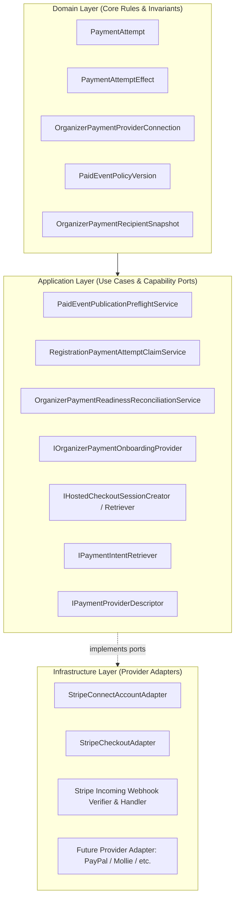
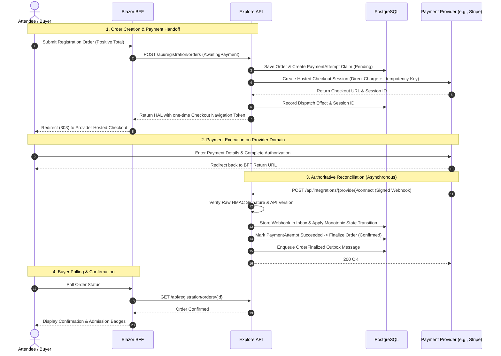

<!-- ABOUTME: Canonical architectural and operational documentation for the provider-neutral payment subsystem. -->
<!-- ABOUTME: Covers OrganizerDirect, Stripe Connect adapter, multi-tenant policy hierarchy, and provider extension guide. -->

# Payments Architecture And Provider Integration

> **Audience:** Operators | Integrators | Contributors | AI agents
> **Status:** Implemented
> **Owner:** Platform/Commerce
> **Last Verified:** 2026-08-21
> **Source Anchors:** `Explore.Domain/PaymentAttempt.cs`, `Explore.Domain/OrganizerPaymentProviderConnection.cs`, `Explore.Domain/PaidEventPolicyVersion.cs`, `Explore.Domain/Services/Registration/PaidEventPolicyRules.cs`, `Explore.Application/Contracts/Payments/`, `Explore.Application/Contracts/Services/IOrganizerPaymentOnboardingProvider.cs`, `Explore.Application/Services/Registration/RegistrationPaymentAttemptClaimService.cs`, `Explore.Infrastructure/Payments/Stripe/`, `Explore.API/Controllers/PaidEventPolicySettingsController.cs`, `Explore.Blazor/Extensions/BffRegistrationPaymentEndpoints.cs`, `docs/adr/ADR-022-paid-event-commerce-and-stripe-connect.md`, `docs/adr/ADR-024-external-business-integrations-and-protected-payout-boundaries.md`

ISLAMU Event provides a robust, multi-tenant, and **provider-neutral payment architecture** for paid event ticketing. The subsystem is decoupled through Clean Architecture ports and adapters: domain and application logic remain completely independent of any specific payment vendor.

**Stripe is currently the initial concrete payment provider adapter** implemented in Infrastructure via Stripe Connect. The platform is designed so additional payment gateways (such as PayPal, Mollie, Lemonsqueezy, or regional processors) can be added as modular Infrastructure adapters without altering the core Domain or Application business rules.

---

## 1. Provider-Neutral Architecture (Ports & Adapters)

The payment subsystem strictly follows Clean Architecture:



### Layer Responsibilities

| Layer | Responsibility | Key Components |
|---|---|---|
| **Domain** | Provider-neutral aggregates, financial value objects, immutable recipient snapshots, and pure policy narrowing rules. | [`PaymentAttempt`](../src/Explore.Domain/PaymentAttempt.cs), [`OrganizerPaymentProviderConnection`](../src/Explore.Domain/OrganizerPaymentProviderConnection.cs), [`PaidEventPolicyVersion`](../src/Explore.Domain/PaidEventPolicyVersion.cs), [`PaidEventPolicyRules`](../src/Explore.Domain/Services/Registration/PaidEventPolicyRules.cs) |
| **Application** | Use-case orchestration, payment claim management, preflight checks, and provider capability interfaces. | [`IOrganizerPaymentOnboardingProvider`](../src/Explore.Application/Contracts/Services/IOrganizerPaymentOnboardingProvider.cs), [`IHostedCheckoutSessionCreator`](../src/Explore.Application/Contracts/Payments/IHostedCheckoutProvider.cs), [`PaidEventPublicationPreflightService`](../src/Explore.Application/Features/EventTicketing/Services/PaidEventPublicationPreflightService.cs) |
| **Infrastructure** | Concrete third-party SDK calls, HTTP clients, signature verifications, retries, and error mapping. | [`StripeConnectAccountAdapter`](../src/Explore.Infrastructure/Payments/Stripe/StripeConnectAccountAdapter.cs), [`StripeCheckoutAdapter`](../src/Explore.Infrastructure/Payments/Stripe/Checkout/StripeCheckoutAdapter.cs) |
| **Presentation (API/BFF)** | HAL resource links, antiforgery-protected checkout redirection, and incoming webhook ingestion endpoints. | `PaidEventPolicySettingsController`, `OrganizerPaymentConnectionsController`, `BffRegistrationPaymentEndpoints`, `IncomingWebhooksController` |

---

## 2. Multi-Tenancy & Responsibility Hierarchy

To maintain Islamic Value-Sensitive Design principles (Trust / *Amanah*, Justice / *'Adl*, and Non-Harm / *Lā Darar*), payment authority is divided across four distinct roles:

| Dimension | Instance Administrator (Platform Host) | Tenant Administrator | Event Organizer (Merchant) | Buyer / Attendee |
|---|---|---|---|---|
| **Scope** | Platform-wide / All tenants | Single Tenant | Specific Event / Organization | Individual Order |
| **Owns Secrets?** | **Yes** (`.env` / Infisical server-only platform API keys & webhook secrets) | **No** (Zero access to platform secrets) | **No** (Never enters or manages API secrets) | **No** |
| **Policy Authority** | Defines the **Global Policy Ceiling** (allowed currencies, allowed organizer kinds, minimum verification, refund floors, platform fee). | Governs **Policy Narrowing** (can disable payments, restrict currencies, enforce stricter verification or refund floors). | Chooses single event currency, ticket prices, and refund policy from within effective tenant policy. | Accepts ticket pricing and published refund terms. |
| **Financial Authority** | Receives optional transparent platform fee or platform tip if configured. | **Zero financial authority**; cannot act as merchant or divert ticket funds. | **Full commercial merchant authority**; receives net ticket proceeds directly. | Pays order total via provider-hosted checkout. |
| **Account Setup** | Configures the Connect Platform account with payment provider(s). | Manages tenant settings via Admin UI. | Completes provider-hosted onboarding (e.g. Stripe Connect) to link bank account. | Completes checkout on provider's domain. |

### Policy Ceiling vs. Policy Narrowing

Under [`PaidEventPolicyRules`](../src/Explore.Domain/Services/Registration/PaidEventPolicyRules.cs), tenant policies can **only narrow** the instance policy ceiling, never broaden it:

1. **Payments Activation**: If disabled at the instance level, no tenant can enable payments. If enabled at the instance level, a tenant can disable payments for itself.
2. **Allowed Currencies**: Effective currencies = `Instance Currencies ∩ Tenant Currencies ∩ Provider Capabilities`.
3. **Organizer Types**: If the instance allows `[Organization, Group, User]`, a tenant can restrict its policy to `[Organization]` only.
4. **Verification Floor**: If the instance requires local verification, a tenant cannot waive it.
5. **Refund Floor**: A tenant or organizer can offer more generous refunds, but can never reduce protections below the instance baseline.

---

## 3. Core Operating Profiles

### `OrganizerDirect` (Default & Active)
In the `OrganizerDirect` profile:
- Ticket charges are created as **direct charges** in the event organizer's connected merchant account context (`StripeAccount: acct_...`).
- The payment provider assesses its processing fees directly against the organizer's account and acts as the collector of payment losses.
- Funds flow directly from the ticket buyer to the organizer's connected account and into their linked bank account via standard provider payout schedules.
- **Zero Intermediary Escrow**: The platform host and tenant administrators never hold, pool, or escrow organizer ticket funds.

### `ProtectedDelayedPayout` (Deferred under ADR-024)
- An optional, future operating profile for institutional deployments with dedicated risk and compliance programs.
- Requires explicit operator approval and legal holding agreements.
- Never described as generic "escrow"; governed by bounded milestone releases within provider capabilities.

---

## 4. Financial Invariants & Safety Rules

1. **Integer Minor Units**: All monetary amounts are stored and calculated as integer minor units (`long` or `int`, e.g., cents, pence) using the [`Money`](../src/Explore.Domain/ValueObjects/Money.cs) value object. Floating-point types (`float`, `double`, `decimal`) are strictly forbidden in domain money calculations to eliminate rounding errors.
2. **Explicit Single Currency**: Every ticket catalog version and registration order is bound to exactly one immutable ISO-4217 currency code (e.g. `EUR`, `USD`, `SAR`). Mixed-currency orders and silent foreign exchange conversions are forbidden.
3. **Zero Cardholder Data Liability (PCI DSS)**: ISLAMU servers never handle, transmit, or store credit card numbers, CVVs, or bank account credentials. All payment capture occurs via provider-hosted checkouts (e.g. Stripe Checkout) or provider-hosted onboarding.
4. **Pre-Commit Idempotency**: Mutating provider requests require a deterministic, unique idempotency key persisted in [`PaymentAttempt`](../src/Explore.Domain/PaymentAttempt.cs) before executing remote network I/O.
5. **Asynchronous Provider Truth**: Browser return URLs are treated as navigation only, not proof of payment. Terminal payment state is advanced strictly through signed webhooks and background reconciliation jobs.
6. **Immutable Historical Snapshots**: When a ticket catalog is published, an [`OrganizerPaymentRecipientSnapshot`](../src/Explore.Domain/OrganizerPaymentRecipientSnapshot.cs) records the exact organizer actor, connected account ID, country, currency, and policy version. Replacing a connected account applies only to future sales and never alters historical order records.

---

## 5. End-to-End Payment Flow



---

## 6. Organizer Payment Onboarding Flow

To publish paid events, an organizer actor must connect an eligible merchant account:

```text
[Organizer in Studio UI]
       │
       ▼ 1. Request Onboarding Link
[API: OrganizerPaymentConnectionsController]
       │
       ▼ 2. Claim Operation & Call Provider Adapter
[Infrastructure: IOrganizerPaymentOnboardingProvider]
       │  - Creates Connected Account on Platform
       │  - Generates Secure Hosted Onboarding Link
       ▼
[Organizer Browser navigates to Hosted Provider Onboarding]
       │  - Completes KYC/KYB & Bank Details directly on Provider domain
       ▼
[Provider Callback / Background Reconciliation Worker]
       │  - Polling worker checks charges_enabled & payouts_enabled
       │  - Signed webhooks deliver account.updated events
       ▼
[OrganizerPaymentProviderConnection: Status -> Ready]
       │
       ▼
[PaidEventPublicationPreflightService: PASS -> Affordance "Publish" Unlocked]
```

---

## 7. Refunds & Balance Liability in OrganizerDirect

A common operational question in the `OrganizerDirect` model is: **how do refunds work if ticket funds go directly to the organizer, and what happens if an organizer withdraws the money from their bank?**

### 1. Does the refund come out of the organizer's Stripe account?
**Yes, 100%.** 
Because `OrganizerDirect` creates direct charges on the organizer's connected account (`acct_...`), any refund is issued directly against that original charge in the organizer's account. Neither the instance host nor tenant administrators are the merchant of record.

### 2. How does Stripe pull the funds for a refund?
When a refund is triggered in ISLAMU Event:
1. **Available / Pending Balance First:** Stripe attempts to deduct the refund amount from the organizer's current Stripe account balance (funds from ongoing or upcoming ticket sales).
2. **Automatic Bank Debit (if balance is insufficient):** If the organizer has already received a payout to their bank account and their Stripe balance is zero (or less than the refund amount), **Stripe automatically initiates a reverse direct debit (ACH, SEPA, Bacs, etc.) from the organizer's linked bank account** to cover the refund.

### 3. What if the organizer empties their bank account as well?
If the bank auto-debit fails (e.g., closed account or insufficient funds):
- **Negative Balance on Stripe:** The organizer's connected account enters a **negative balance**.
- **Future Sales Offset:** Any future ticket sales or payments to that organizer account are automatically withheld by Stripe until the negative balance is cleared.
- **Liability & Collections (Stripe vs. Organizer):** Because the platform uses **Direct Charges with Stripe-managed loss collection** (per ADR-022 and controller configuration), **Stripe pursues the organizer directly** based on the identity verification (KYC/KYB, government ID, business registration, tax ID) collected during Stripe-hosted onboarding.
- **Platform Protection:** The ISLAMU platform operator and tenant administrators are **not liable** for the organizer's negative balance. The platform's operating funds and bank accounts are never debited for an organizer's bad balance or refund defaults.

### 4. How ISLAMU Tracks Refunds
1. ISLAMU records an independent, idempotent `RefundAttempt` pinned to the original connected account and charge ID.
2. The refund status stays `Pending` / `Requested` until Stripe processes the transaction.
3. Once Stripe confirms execution (via signed webhook `charge.refunded` or background reconciliation), ISLAMU marks the order and refund state as `Succeeded`. If Stripe rejects the refund (e.g., account frozen/blocked), it is flagged for manual reconciliation without corrupting order history.

---

## 8. Developer Guide: Adding a New Payment Provider

To integrate a new payment gateway (e.g. `paypal`, `mollie`, `lemonsqueezy`), follow this step-by-step procedure:

### Step 1: Implement Application Capability Ports
In `src/Explore.Infrastructure/Payments/<ProviderName>/`, create classes implementing the provider-neutral contracts defined in `Explore.Application.Contracts.Payments`:

```csharp
namespace Explore.Infrastructure.Payments.Mollie;

// 1. Merchant Onboarding & Account Management
public sealed class MollieConnectAccountAdapter(
    IHttpClientFactory httpClientFactory,
    ISecretResolver secretResolver) : IOrganizerPaymentOnboardingProvider
{
    public async Task<OrganizerPaymentProviderAccountCreationResult> CreateAccountAsync(
        OrganizerPaymentProviderAccountCreationRequest request,
        CancellationToken cancellationToken)
    {
        // Call provider API to create connected merchant account
    }

    public async Task<OrganizerPaymentOnboardingLinkCreationResult> CreateOnboardingLinkAsync(
        OrganizerPaymentOnboardingLinkRequest request,
        CancellationToken cancellationToken)
    {
        // Generate hosted onboarding URL
    }

    public async Task<OrganizerPaymentProviderReadinessResult> GetReadinessAsync(
        OrganizerPaymentProviderReadinessRequest request,
        CancellationToken cancellationToken)
    {
        // Query provider account capabilities and restrictions
    }
}

// 2. Hosted Checkout & Intent Retrieval
public sealed class MollieCheckoutAdapter(
    IHttpClientFactory httpClientFactory,
    ISecretResolver secretResolver) :
    IHostedCheckoutSessionCreator,
    IHostedCheckoutSessionRetriever,
    IPaymentIntentRetriever,
    IPaymentProviderDescriptor
{
    public PaymentProviderDescriptor Describe() =>
        new("mollie", "OrganizerDirect", "v2");

    public async Task<HostedCheckoutCreateResult> CreateAsync(
        HostedCheckoutCreateRequest request,
        CancellationToken cancellationToken)
    {
        // Create hosted payment session using request.ExternalAccountId and request.ProviderIdempotencyKey
    }

    public async Task<HostedCheckoutRetrieveResult> RetrieveAsync(
        HostedCheckoutRetrieveRequest request,
        CancellationToken cancellationToken)
    {
        // Retrieve session status from provider
    }

    public async Task<PaymentIntentRetrieveResult> RetrievePaymentIntentAsync(
        PaymentIntentRetrieveRequest request,
        CancellationToken cancellationToken)
    {
        // Retrieve charge status from provider
    }
}
```

### Step 2: Implement Webhook Ingestion & Signature Verification
Create an incoming webhook verifier and handler in `src/Explore.Infrastructure/Payments/<ProviderName>/`:
- Verify the unmodified raw payload bytes using the provider's signature header and shared secret.
- Enforce timestamp freshness tolerances to protect against replay attacks.
- Map the provider's payment and account events into the system's idempotent message pipeline.

### Step 3: Register Options & DI Services
1. Add configuration options in `Explore.Infrastructure`:
   ```csharp
   public sealed class MolliePaymentOptions
   {
       public const string SectionName = "Payments:Mollie";
       public string Mode { get; set; } = "Test";
       public string[] AllowedCheckoutHosts { get; set; } = ["www.mollie.com"];
   }
   ```
2. Register secrets in [`SecretDefinitionRegistry.cs`](../src/Explore.Domain/Secrets/SecretDefinitionRegistry.cs).
3. Bind the adapter implementations in `Explore.Infrastructure/Payments/PaymentServicesRegistration.cs`.

---

## 9. Configuration & Secrets Reference

### Environment & AppSettings Keys

| Key | Environment Variable | Default | Purpose |
|---|---|---|---|
| `Payments:Stripe:Mode` | `PAYMENTS_STRIPE_MODE` | `Test` | Payment execution mode (`Test` or `Live`). |
| `Payments:Stripe:AllowedCheckoutHosts` | `Payments__Stripe__AllowedCheckoutHosts__0` | `checkout.stripe.com` | Whitelisted destination hosts for checkout redirects. |
| `Payments:OrganizerDirect:ProviderCode` | `Payments__OrganizerDirect__ProviderCode` | `stripe` | Active commercial provider code. |
| `Payments:OrganizerDirect:ConnectPlatformId` | `Payments__OrganizerDirect__ConnectPlatformId` | `""` | Non-secret Connect platform identifier. |

### Secrets Resolution (`Explore.Secrets`)

| Secret Key | Registry Binding Key | Scope | Description |
|---|---|---|---|
| `PAYMENTS_STRIPE_PLATFORM_API_KEY` | `payments.stripe.platform_api_key` | Instance (Server-only) | Platform secret API key (`sk_test_...` or `sk_live_...`). |
| `PAYMENTS_STRIPE_WEBHOOK_SECRET` | `payments.stripe.webhook_secret` | Instance (Server-only) | Signing secret for verifying raw webhook signatures (`whsec_...`). |

---

## 10. Related Documentation & Decisions

- [ADR-022: Paid Event Commerce And Stripe Connect](adr/ADR-022-paid-event-commerce-and-stripe-connect.md)
- [ADR-024: External Business Integrations And Protected Payout Boundaries](adr/ADR-024-external-business-integrations-and-protected-payout-boundaries.md)
- [CONFIGURATION.md](CONFIGURATION.md) - Configuration settings and provider options
- [SECRETS.md](SECRETS.md) - Multi-provider secret management
- [SECURITY-MODEL.md](SECURITY-MODEL.md) - Platform security invariants and privilege boundaries
- [WEBHOOKS.md](WEBHOOKS.md) - Webhook delivery, callback verifications, and operational runbooks
- [I-VSD Paid Event Payments Consultation](../islamic-value-sensitive-design/i-vsd-paid-event-payments-consultation.md)
