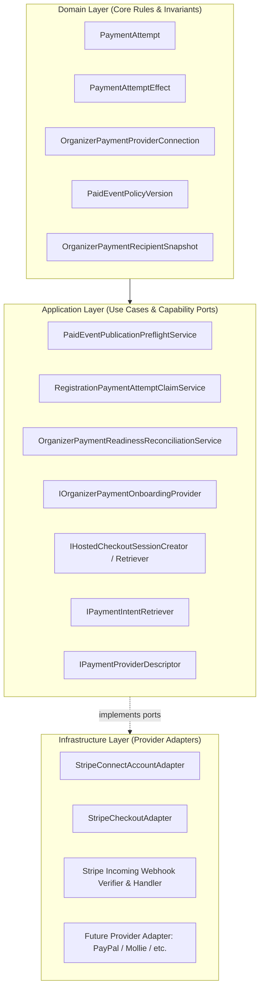
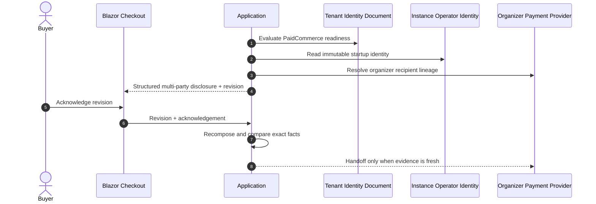
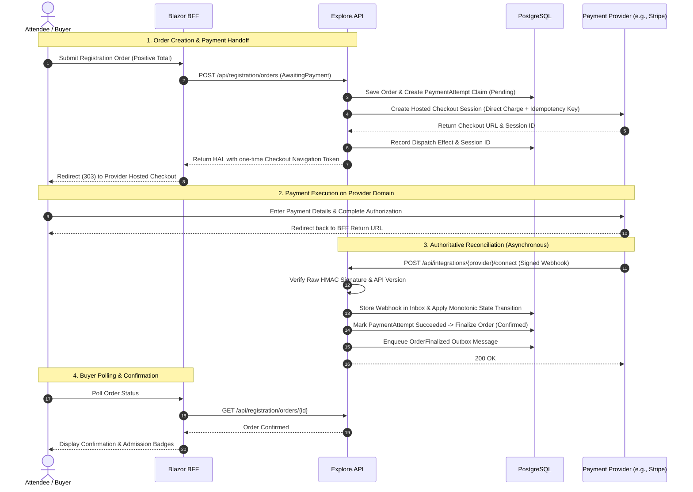

<!-- ABOUTME: Canonical architectural and operational documentation for the provider-neutral payment subsystem. -->
<!-- ABOUTME: Covers OrganizerDirect, Stripe Connect adapter, multi-tenant policy hierarchy, and provider extension guide. -->

# Payments Architecture And Provider Integration

> **Audience:** Operators | Integrators | Contributors | AI agents
> **Status:** Implemented
> **Owner:** Platform/Commerce
> **Last Verified:** 2026-08-29
> **Source Anchors:** `Explore.Domain/PaymentAttempt.cs`, `Explore.Domain/OrganizerPaymentProviderConnection.cs`, `Explore.Domain/PaidEventPolicyVersion.cs`, `Explore.Domain/Services/Registration/PaidEventPolicyRules.cs`, `Explore.Application/Contracts/Payments/`, `Explore.Application/Contracts/Services/IOrganizerPaymentOnboardingProvider.cs`, `Explore.Application/Services/Registration/RegistrationPaymentAttemptClaimService.cs`, `Explore.Infrastructure/Payments/Stripe/`, `Explore.API/Controllers/PaidEventPolicySettingsController.cs`, `Explore.Blazor/Extensions/BffRegistrationPaymentEndpoints.cs`, `docs/adr/ADR-022-paid-event-commerce-and-stripe-connect.md`, `docs/adr/ADR-024-external-business-integrations-and-protected-payout-boundaries.md`

ISLAMU Event provides a robust, multi-tenant, and **provider-neutral payment architecture** for paid event ticketing. The subsystem is decoupled through Clean Architecture ports and adapters: domain and application logic remain completely independent of any specific payment vendor.

## Paid Checkout Activation Safety

New paid Checkout is disabled by default and fails closed until startup-bound
`Instance:OperatorIdentity` is complete and `Payments:CheckoutGovernance`
defines complaint, refund, dispute, reconciliation, activation, statement, and
charge-type operations. The browser first reads exact server-authored facts and
explicitly acknowledges their SHA-256 revision. The resulting
`PaidOrderAcceptanceSnapshot` pins the organizer actor, payment-connection ID,
Connect platform ID, external account ID, merchant country, tenant directory
document/revision, complete instance identity, separately grouped payment
operations, delivery, typed lines, aggregate money, refund/support facts, and
provider descriptor before a provider session can be created. Historical
attempts remain readable and reconcilable with a null acceptance reference;
they are never backfilled. A global or event stop-sale blocks new claim and
dispatch while signed webhooks, reconciliation, support, and reads continue.
Refund initiation is not implemented and is not a stop-sale capability.

`OrganizerDirect` describes the technical direct-charge profile. It does not establish who legally controls an account, bears loss, or owes a remedy in a particular deployment. Operators must retain provider, contractual, legal, and operational evidence for those deployment-specific conclusions.

## Ticket Purchase Authority And Ceilings

Purchase governance runs before payment-provider I/O. The Application handler derives quantity from the persisted registration-order lines, resolves the current tenant, and asks `TicketPurchaseAuthorityResolver` for a server-proven enforcement dimension. A command cannot supply an account ID, contact hash, enforcement key, or quantity.

Hard cross-order ceilings use only stable authority:

- an authenticated account remains the controlling key when the purchaser switches between personal, group, or organization actor contexts;
- a verified guest uses the SHA-256 hash of the persisted, verified normalized contact; and
- name-only access is honestly order-scoped and receives no claimed per-person cross-order guarantee.

The pinned effective ceiling is the literal minimum of instance, tenant, and event policy versions. PostgreSQL serializes a canonical operation/authority lock set before opening the serializable transaction, then records cumulative authority usage and the tenant-qualified durable operation outcome. An exact key and fingerprint replays the original result. Reusing a key with a different tenant, principal, route-equivalent command scope, policy, quantity, actor context, or body conflicts rather than duplicating authority.

These local database steps perform no payment-provider call. Provider claims and dispatch remain later durable operations, preserving the rule that remote I/O never occurs inside the purchase-governance transaction.

**Stripe is currently the initial concrete payment provider adapter** implemented in Infrastructure via Stripe Connect. The platform is designed so additional payment gateways (such as PayPal, Mollie, Lemonsqueezy, or regional processors) can be added as modular Infrastructure adapters without altering the core Domain or Application business rules.

---

## 1. Provider-Neutral Architecture (Ports & Adapters)

The payment subsystem strictly follows Clean Architecture:



### Layer Responsibilities

| Layer | Responsibility | Key Components |
|---|---|---|
| **Domain** | Provider-neutral aggregates, financial value objects, immutable recipient snapshots, and pure policy narrowing rules. | [`PaymentAttempt`](../src/Explore.Domain/PaymentAttempt.cs), [`OrganizerPaymentProviderConnection`](../src/Explore.Domain/OrganizerPaymentProviderConnection.cs), [`PaidEventPolicyVersion`](../src/Explore.Domain/PaidEventPolicyVersion.cs), [`PaidEventPolicyRules`](../src/Explore.Domain/Services/Registration/PaidEventPolicyRules.cs) |
| **Application** | Use-case orchestration, payment claim management, preflight checks, and provider capability interfaces. | [`IOrganizerPaymentOnboardingProvider`](../src/Explore.Application/Contracts/Services/IOrganizerPaymentOnboardingProvider.cs), [`IHostedCheckoutSessionCreator`](../src/Explore.Application/Contracts/Payments/IHostedCheckoutProvider.cs), [`PaidEventPublicationPreflightService`](../src/Explore.Application/Features/EventTicketing/Services/PaidEventPublicationPreflightService.cs) |
| **Infrastructure** | Concrete third-party SDK calls, HTTP clients, signature verifications, retries, and error mapping. | [`StripeConnectAccountAdapter`](../src/Explore.Infrastructure/Payments/Stripe/StripeConnectAccountAdapter.cs), [`StripeCheckoutAdapter`](../src/Explore.Infrastructure/Payments/Stripe/Checkout/StripeCheckoutAdapter.cs) |
| **Presentation (API/BFF)** | HAL resource links, antiforgery-protected checkout redirection, and incoming webhook ingestion endpoints. | `PaidEventPolicySettingsController`, `OrganizerPaymentConnectionsController`, `BffRegistrationPaymentEndpoints`, `IncomingWebhooksController` |

---

## 2. Multi-Tenancy & Responsibility Hierarchy

To maintain Islamic Value-Sensitive Design principles (Trust / *Amanah*, Justice / *'Adl*, and Non-Harm / *Lā Darar*), payment authority is divided across four distinct roles:

| Dimension | Instance Administrator (Platform Host) | Tenant Administrator | Event Organizer (Merchant) | Buyer / Attendee |
|---|---|---|---|---|
| **Scope** | Platform-wide / All tenants | Single Tenant | Specific Event / Organization | Individual Order |
| **Owns Secrets?** | **Yes** (`.env` / Infisical server-only platform API keys & webhook secrets) | **No** (Zero access to platform secrets) | **No** (Never enters or manages API secrets) | **No** |
| **Policy Authority** | Defines the **Global Policy Ceiling** (allowed currencies, allowed organizer kinds, minimum verification, refund floors, platform fee). | Governs **Policy Narrowing** (can disable payments, restrict currencies, enforce stricter verification or refund floors). | Chooses single event currency, ticket prices, and refund policy from within effective tenant policy. | Accepts ticket pricing and published refund terms. |
| **Financial Authority** | Receives optional transparent platform fee or platform tip if configured. | **Zero financial authority**; cannot act as merchant or divert ticket funds. | **Full commercial merchant authority**; receives net ticket proceeds directly. | Pays order total via provider-hosted checkout. |
| **Account Setup** | Configures the Connect Platform account with payment provider(s). | Manages tenant settings via Admin UI. | Completes provider-hosted onboarding (e.g. Stripe Connect) to link bank account. | Completes checkout on provider's domain. |

### Policy Ceiling vs. Policy Narrowing

Under [`PaidEventPolicyRules`](../src/Explore.Domain/Services/Registration/PaidEventPolicyRules.cs), tenant policies can **only narrow** the instance policy ceiling, never broaden it:

1. **Payments Activation**: If disabled at the instance level (`IsPaymentsEnabled = false`), no tenant can enable payments. If enabled at the instance level, a tenant can disable payments (`IsPaymentsEnabled = false`) for itself.
2. **Allowed Currencies**: Effective currencies = `Instance Currencies ∩ Tenant Currencies ∩ Provider Capabilities`.
3. **Organizer Types**: If the instance allows `[Organization, Group, User]`, a tenant can restrict its policy to `[Organization]` only.
4. **Verification Floor**: If the instance requires local verification, a tenant cannot waive it.
5. **Refund Floor**: A tenant or organizer can offer more generous refunds, but can never reduce protections below the instance baseline.

---

## 3. Structured Legal-Identity And Paid Acceptance

The payment model preserves four explicit roles. It does not derive a legal
identity from cosmetic branding and does not infer legal conclusions for an
operator:

| Role | Authority source | Paid responsibility represented by the system |
|---|---|---|
| Tenant directory operator | `tenant.directory-operator-identity` typed settings document | Public accountability for the tenant directory and its legal/contact links |
| Instance operator | Startup-bound `Instance:OperatorIdentity` | General platform identity and operator legal/contact links |
| Organizer merchant | Event organizer actor plus connected provider account | Recipient/merchant lineage for the direct charge |
| Payment operations | `Payments:CheckoutGovernance` | Complaint, refund, dispute, reconciliation, activation, statement, and charge-type operations |

`PaidCommerce` readiness is an intersection, not a fallback chain. Paid event
publication and Checkout activation require a complete tenant directory
operator identity, a complete instance operator identity, active payment
operations, current policies, and an eligible organizer payment connection.
Missing or corrupt tenant identity blocks the operation with stable reason
codes; branding is never consulted as a substitute.

Before provider handoff, `PaidOrderAcceptanceService` returns a structured
`PaidOrderAcceptanceDisclosureDto` containing:

- a code-owned, versioned acceptance template identifier and exact text;
- organizer actor plus immutable payment-connection, Connect-platform,
  external-account, and merchant-country lineage;
- the exact tenant directory document/revision and normalized identity facts;
- the exact instance operator identity, including legal name, operator kind,
  and optional registration identifier;
- a separate `paymentOperations` group for complaint, refund, dispute,
  reconciliation, activation, statement, and charge-type facts;
- policy, schedule, money, line, and support facts.

The browser sends only the `DisclosureRevision` and explicit acknowledgement.
The server recomputes the disclosure, rejects stale evidence, and persists an
immutable `PaidOrderAcceptanceSnapshot`. Any directory identity revision,
instance identity fact, payment-operation fact, organizer actor, connection,
platform, external account, merchant country, provider descriptor, policy,
schedule, line, or money change invalidates an earlier acceptance. Claim-time
fencing repeats the exact recipient comparison before any payment-attempt or
dispatch write.



The public footer renders the tenant **Directory operator** and instance
**Platform operator** separately. Paid event details and ticket selection render
the structured tenant directory operator; payment review renders organizer,
directory, and instance groups. No prose disclaimer DTO, branding interpolation,
dual read, or compatibility alias remains.

---

## 4. Core Operating Profiles

### `OrganizerDirect` (Default & Active)
In the `OrganizerDirect` profile:
- Ticket charges are created as **direct charges** in the event organizer's connected merchant account context (`StripeAccount: acct_...`).
- The payment provider assesses its processing fees directly against the organizer's account and acts as the collector of payment losses.
- Funds flow directly from the ticket buyer to the organizer's connected account and into their linked bank account via standard provider payout schedules.
- **Zero Intermediary Escrow**: The platform host and tenant administrators never hold, pool, or escrow organizer ticket funds.

### `ProtectedDelayedPayout` (Deferred under ADR-024)
- An optional, future operating profile for institutional deployments with dedicated risk and compliance programs.
- Requires explicit operator approval and legal holding agreements.
- Never described as generic "escrow"; governed by bounded milestone releases within provider capabilities.

---

## 5. Financial Invariants & Safety Rules

1. **Integer Minor Units**: All monetary amounts are stored and calculated as integer minor units (`long` or `int`, e.g., cents, pence) using the [`Money`](../src/Explore.Domain/ValueObjects/Money.cs) value object. Floating-point types (`float`, `double`, `decimal`) are strictly forbidden in domain money calculations to eliminate rounding errors.
2. **Explicit Single Currency**: Every ticket catalog version and registration order is bound to exactly one immutable ISO-4217 currency code (e.g. `EUR`, `USD`, `SAR`). Mixed-currency orders and silent foreign exchange conversions are forbidden.
3. **Zero Cardholder Data Liability (PCI DSS)**: ISLAMU servers never handle, transmit, or store credit card numbers, CVVs, or bank account credentials. All payment capture occurs via provider-hosted checkouts (e.g. Stripe Checkout) or provider-hosted onboarding.
4. **Pre-Commit Idempotency**: Mutating provider requests require a deterministic, unique idempotency key persisted in [`PaymentAttempt`](../src/Explore.Domain/PaymentAttempt.cs) before executing remote network I/O.
5. **Asynchronous Provider Truth**: Browser return URLs are treated as navigation only, not proof of payment. Terminal payment state is advanced strictly through signed webhooks and background reconciliation jobs.
6. **Immutable Historical Snapshots**: When a ticket catalog is published, an [`OrganizerPaymentRecipientSnapshot`](../src/Explore.Domain/OrganizerPaymentRecipientSnapshot.cs) records the exact organizer actor, connected account ID, country, currency, and policy version. Replacing a connected account applies only to future sales and never alters historical order records.

---

## 6. End-to-End Payment Flow



---

## 7. Organizer Payment Onboarding Flow

To publish paid events, an organizer actor must connect an eligible merchant account:

```text
[Organizer in Studio UI]
       │
       ▼ 1. Request Onboarding Link
[API: OrganizerPaymentConnectionsController]
       │
       ▼ 2. Claim Operation & Call Provider Adapter
[Infrastructure: IOrganizerPaymentOnboardingProvider]
       │  - Creates Connected Account on Platform
       │  - Generates Secure Hosted Onboarding Link
       ▼
[Organizer Browser navigates to Hosted Provider Onboarding]
       │  - Completes KYC/KYB & Bank Details directly on Provider domain
       ▼
[Provider Callback / Background Reconciliation Worker]
       │  - Polling worker checks charges_enabled & payouts_enabled
       │  - Signed webhooks deliver account.updated events
       ▼
[OrganizerPaymentProviderConnection: Status -> Ready]
       │
       ▼
[PaidEventPublicationPreflightService: PASS -> Affordance "Publish" Unlocked]
```

---

## 8. Refunds And Balance Liability In OrganizerDirect

`OrganizerDirect` is a technical direct-charge profile, not a universal legal or loss-allocation conclusion. Provider balance recovery, bank debit eligibility, negative-balance collection, and liability vary by provider configuration, controller country, connected-account agreement, payment method, and applicable law. Operators must verify those facts against current provider and contractual evidence; this document does not state that a provider will debit an organizer automatically, pursue one party, or insulate another party from loss.

ISLAMU Event does **not** currently implement refund initiation, a `RefundAttempt` aggregate, a refund provider port, or a refund API. A stop-sale therefore preserves no in-product refund command. Operators must not advertise an application refund workflow until the separate refund workstream ships and is operationally rehearsed.

Any future refund implementation must:

1. pin the original tenant, order, provider, connected account, charge, currency, and amount;
2. use durable idempotency and an explicit reconciliation state machine;
3. preserve buyer remedy access while new sales are stopped;
4. expose only server-authorized HAL affordances;
5. document deployment-specific responsibility without deriving legal conclusions from the charge profile; and
6. prove webhook, retry, duplicate-delivery, insufficient-balance, and restore behavior before activation.

---

## Fair Return Replacement Settlement

Fair return reuses the registration payment and refund aggregates; it does not create a second provider integration. A `WaitlistPaymentIntent` points to the buyer's replacement `PaymentAttempt` and to one capacity-reserving `RefundAttempt` for the original charge. `FairReturnOrchestrationEffect` owns the stable operation UUID, provider idempotency key, bounded retry count, processing fence, and lease. Unknown provider outcomes remain durable and retryable; they never release refund capacity or synthesize success.

Replacement settlement is the hard ordering fence. Persistence records `ReplacementPaymentSettledAt` before it can create the pointer-only `WaitlistRefundIntent` and generic refund-dispatch outbox row in the same transaction. Provider refund I/O happens later through the existing refund dispatcher/reconciler. Replays return the existing stable intent, stale leases can be reclaimed after restart, and a refund cannot be staged from pending, failed, missing, or contradictory replacement evidence.

The waitlist itself never accepts paid priority. Queue order is policy priority descending, enqueue time ascending, then UUID ascending. Commercial substitution requires exact tenant, event, ticket type, catalog, purchase-policy snapshot, currency, commerce digest, entitlement digest, gross minor units, and refund-funding mode equality.

## 9. Developer Guide: Adding a New Payment Provider

To integrate a new payment gateway (e.g. `paypal`, `mollie`, `lemonsqueezy`), follow this step-by-step procedure:

### Step 1: Implement Application Capability Ports
In `src/Explore.Infrastructure/Payments/<ProviderName>/`, create classes implementing the provider-neutral contracts defined in `Explore.Application.Contracts.Payments`:

```csharp
namespace Explore.Infrastructure.Payments.Mollie;

// 1. Merchant Onboarding & Account Management
public sealed class MollieConnectAccountAdapter(
    IHttpClientFactory httpClientFactory,
    ISecretResolver secretResolver) : IOrganizerPaymentOnboardingProvider
{
    public async Task<OrganizerPaymentProviderAccountCreationResult> CreateAccountAsync(
        OrganizerPaymentProviderAccountCreationRequest request,
        CancellationToken cancellationToken)
    {
        // Call provider API to create connected merchant account
    }

    public async Task<OrganizerPaymentOnboardingLinkCreationResult> CreateOnboardingLinkAsync(
        OrganizerPaymentOnboardingLinkRequest request,
        CancellationToken cancellationToken)
    {
        // Generate hosted onboarding URL
    }

    public async Task<OrganizerPaymentProviderReadinessResult> GetReadinessAsync(
        OrganizerPaymentProviderReadinessRequest request,
        CancellationToken cancellationToken)
    {
        // Query provider account capabilities and restrictions
    }
}

// 2. Hosted Checkout & Intent Retrieval
public sealed class MollieCheckoutAdapter(
    IHttpClientFactory httpClientFactory,
    ISecretResolver secretResolver) :
    IHostedCheckoutSessionCreator,
    IHostedCheckoutSessionRetriever,
    IPaymentIntentRetriever,
    IPaymentProviderDescriptor
{
    public PaymentProviderDescriptor Describe() =>
        new("mollie", "OrganizerDirect", "v2");

    public async Task<HostedCheckoutCreateResult> CreateAsync(
        HostedCheckoutCreateRequest request,
        CancellationToken cancellationToken)
    {
        // Create hosted payment session using request.ExternalAccountId and request.ProviderIdempotencyKey
    }

    public async Task<HostedCheckoutRetrieveResult> RetrieveAsync(
        HostedCheckoutRetrieveRequest request,
        CancellationToken cancellationToken)
    {
        // Retrieve session status from provider
    }

    public async Task<PaymentIntentRetrieveResult> RetrievePaymentIntentAsync(
        PaymentIntentRetrieveRequest request,
        CancellationToken cancellationToken)
    {
        // Retrieve charge status from provider
    }
}
```

### Step 2: Implement Webhook Ingestion & Signature Verification
Create an incoming webhook verifier and handler in `src/Explore.Infrastructure/Payments/<ProviderName>/`:
- Verify the unmodified raw payload bytes using the provider's signature header and shared secret.
- Enforce timestamp freshness tolerances to protect against replay attacks.
- Map the provider's payment and account events into the system's idempotent message pipeline.

### Step 3: Register Options & DI Services
1. Add configuration options in `Explore.Infrastructure`:
   ```csharp
   public sealed class MolliePaymentOptions
   {
       public const string SectionName = "Payments:Mollie";
       public string Mode { get; set; } = "Test";
       public string[] AllowedCheckoutHosts { get; set; } = ["www.mollie.com"];
   }
   ```
2. Register secrets in [`SecretDefinitionRegistry.cs`](../src/Explore.Domain/Secrets/SecretDefinitionRegistry.cs).
3. Bind the adapter implementations in `Explore.Infrastructure/Payments/PaymentServicesRegistration.cs`.

---

## 10. Configuration & Secrets Reference

### Environment & AppSettings Keys

| Key | Environment Variable | Default | Purpose |
|---|---|---|---|
| `Payments:Stripe:Mode` | `PAYMENTS_STRIPE_MODE` | `Test` | Payment execution mode (`Test` or `Live`). |
| `Payments:Stripe:AllowedCheckoutHosts` | `Payments__Stripe__AllowedCheckoutHosts__0` | `checkout.stripe.com` | Whitelisted destination hosts for checkout redirects. |
| `Payments:OrganizerDirect:ProviderCode` | `Payments__OrganizerDirect__ProviderCode` | `stripe` | Active commercial provider code. |
| `Payments:OrganizerDirect:ConnectPlatformId` | `Payments__OrganizerDirect__ConnectPlatformId` | `""` | Non-secret Connect platform identifier. |

### Secrets Resolution (`Explore.Secrets`)

| Secret Key | Registry Binding Key | Scope | Description |
|---|---|---|---|
| `PAYMENTS_STRIPE_PLATFORM_API_KEY` | `payments.stripe.platform_api_key` | Instance (Server-only) | Platform secret API key (`sk_test_...` or `sk_live_...`). |
| `PAYMENTS_STRIPE_WEBHOOK_SECRET` | `payments.stripe.webhook_secret` | Instance (Server-only) | Signing secret for verifying raw webhook signatures (`whsec_...`). |

---

## 11. Configuration Manifest Tenant Payment Boundary

Tenant bootstrap may declare only the provider-neutral narrowing document
`tenant.paid_event_policy`. The document is pinned to the active
`instancePolicyVersion`, validated with `PaidEventPolicyRules`, and applied
through the canonical serializable `PaidEventPolicyMutationBoundary` in the
same transaction as tenant creation and manifest audit.

Allowed values narrow payment enablement, organizer kinds, local verification,
currencies/default currency, refund-protection floors, integer minor-unit and
count risk ceilings, rolling windows, and review thresholds. The manifest
cannot select a provider, supply credentials, name connected accounts, choose
charge ownership, establish operator or official status, accept buyer terms,
execute refunds, control stop/review state, hand work to a provider, or alter
reconciliation. Those authorities remain in the Phase 18C chain:

1. active instance policy;
2. valid tenant narrowing;
3. persisted sale-control/review state;
4. server-authored acceptance;
5. freshness validation;
6. provider handoff and reconciliation.

Both regular policy revisions and manifest bootstrap acquire the same
instance/tenant named locks. A stale instance version or concurrently created
tenant policy returns a retryable conflict and rolls back the entire manifest
transaction. Work already handed to a provider is immutable and is never
rewritten by configuration import.

Exports include no payment secrets or PII. `Overrides` emits only an active
tenant narrowing; `Portable` flattens the active safe policy while explicitly
marking sovereign values omitted and locked. Neither export claims refund,
liability, dispute, or provider behavior.

## 12. Event-Bound Add-On Commerce

Event add-ons are organizer-authored optional commerce items in a separate
versioned catalog. One event catalog may contain multiple items. Every item
owns its immutable name, integer-minor-unit unit price, finite quantity,
fulfillment disclosure, and refund disclosure.

Buyer selection is bounded to the original registration-order checkout:

1. the browser submits catalog item IDs and quantities only;
2. the browser also submits the exact catalog ID it was shown;
3. the server resolves that still-published tenant/event catalog, pins it to
   the order, and rejects a replaced or retired catalog instead of silently
   changing the offer;
4. checked `long` multiplication creates separate add-on line snapshots;
5. a serializable item/order/line fence reserves finite stock;
6. the registration order discloses add-on and grand totals before payment
   handoff.

Add-ons do not introduce a new platform-fee authority. Phase 7 preserves the
order's already-pinned platform fee while adding the add-on amount to the
organizer-directed total. A later fee on add-ons requires an explicit paid
event policy and I-VSD decision; it must not be inferred from ticket fees.
Ticket promotions remain scoped to ticket lines and do not discount add-on
lines unless a later explicit add-on promotion policy is approved.

Refund allocation and provider-confirmed refund are distinct. The add-on API
may report `allocated_pending_provider` after exact quantity/value allocation,
but it never labels that amount succeeded or refunded until the existing
provider reconciliation authority confirms it. Pending allocation does not
release stock for resale. Only a later provider-confirmed refund transition may
release add-on stock. Fulfillment and refund replay are idempotent and never
mutate tickets, participant readiness, credentials, ticket capacity, admission,
or check-in.

Refund allocation requires the exact latest provider-reconciled `Succeeded`
payment ID and amount for the order. Provider failure marks the allocation
failed and reopens refundable quantity. Provider success releases stock
atomically; if stock release cannot complete, the durable
`provider_confirmed_inventory_release_pending` state preserves provider truth
for recovery instead of reverting it to pending.

The add-on allocation, generic `RefundAttempt`, and PII-free refund dispatch
outbox message commit in one serializable transaction. `RefundOperationId`
therefore identifies the canonical `RefundAttempt`; it is not a browser-
invented provider authority. Dispatch and reconciliation synchronize terminal
provider evidence back into the add-on allocation idempotently.

The catalog response discloses the current maximum selectable quantity and the
order response discloses the current maximum refundable quantity. These are
neutral operational limits, not scarcity-pressure copy.

Specialist-system boundaries remain unchanged: Event does not become the
merchant's accounting, tax, invoice, credit-note, banking, or escrow system.

## 13. Related Documentation & Decisions

- [ADR-022: Paid Event Commerce And Stripe Connect](adr/ADR-022-paid-event-commerce-and-stripe-connect.md)
- [ADR-024: External Business Integrations And Protected Payout Boundaries](adr/ADR-024-external-business-integrations-and-protected-payout-boundaries.md)
- [CONFIGURATION.md](CONFIGURATION.md) - Configuration settings and provider options
- [SECRETS.md](SECRETS.md) - Multi-provider secret management
- [SECURITY-MODEL.md](SECURITY-MODEL.md) - Platform security invariants and privilege boundaries
- [WEBHOOKS.md](WEBHOOKS.md) - Webhook delivery, callback verifications, and operational runbooks
- [I-VSD Paid Event Payments Consultation](../islamic-value-sensitive-design/i-vsd-paid-event-payments-consultation.md)
