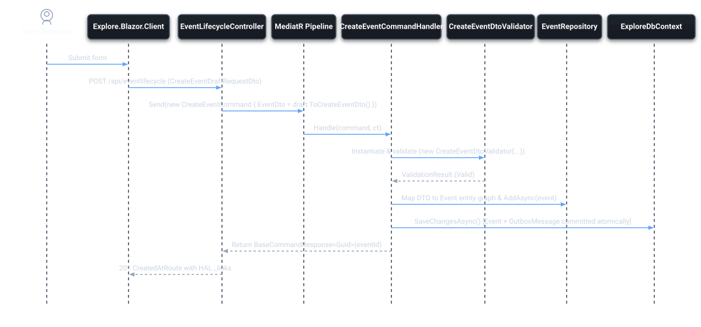
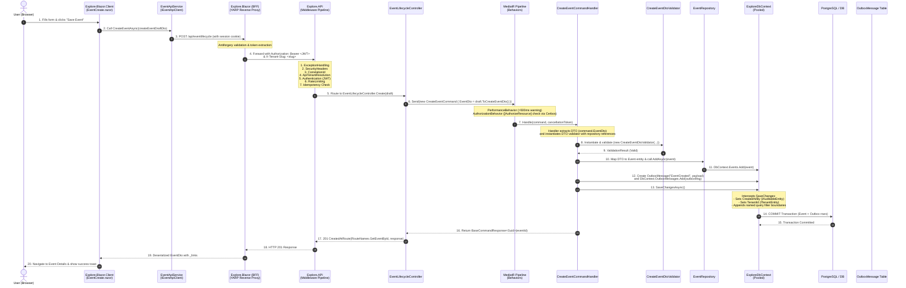
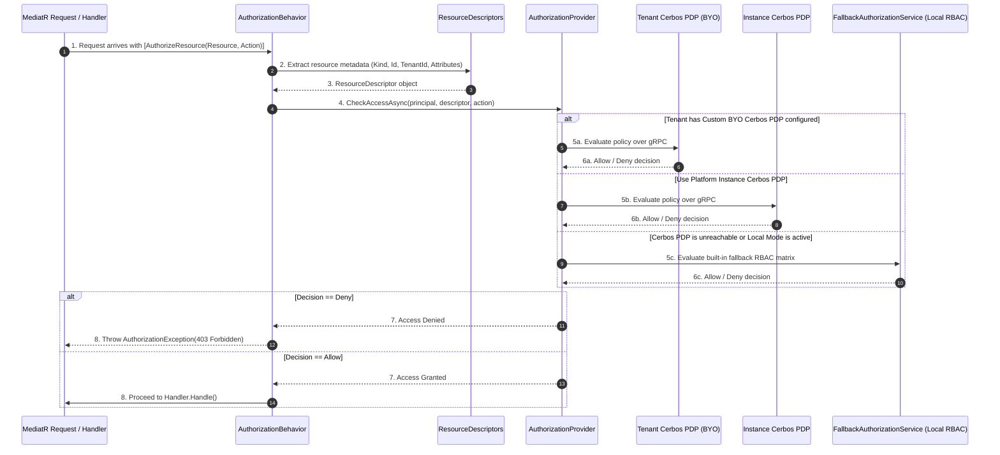
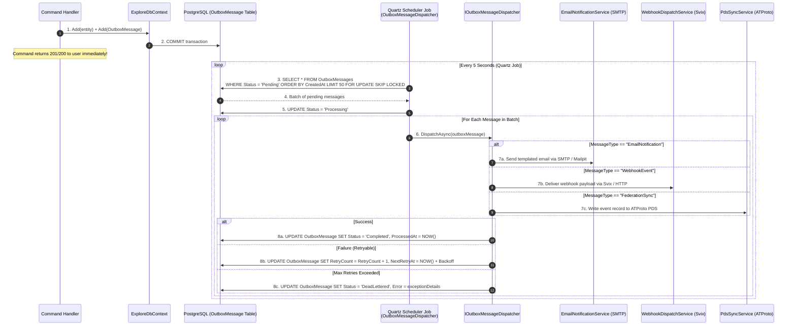
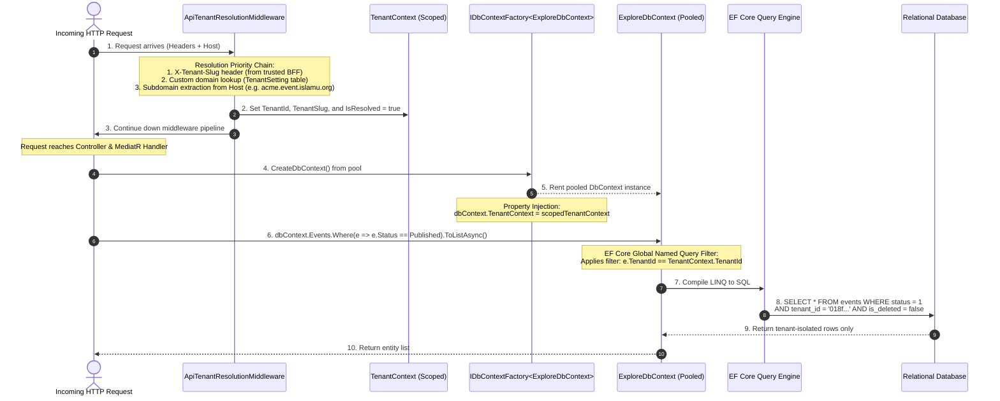

ABOUTME: Technical end-to-end request lifecycles with detailed sequence diagrams.
ABOUTME: Explains the exact code, middleware, handlers, database, and background flows across the platform.

# End-to-End Request Lifecycles & Execution Flows

> **Audience:** Contributors | Developers | Architects | AI agents
> **Status:** Implemented
> **Owner:** Contributor Experience
> **Last Verified:** 2026-08-16
> **Source Anchors:** `Explore.API/Middleware/`, `Explore.Application/Features/`, `Explore.Persistence/ExploreDbContext.cs`, `docs/DEVELOPER_GUIDE.md`, `docs/ARCHITECTURE_OVERVIEW.md`

This document details the exact execution paths taken by HTTP requests through the **ISLAMU Event** stack. Each flow is illustrated with a sequence diagram and a step-by-step walkthrough of the classes, middleware, and database operations involved.

---

## 1. Flow 1: Command Mutation Flow (Write Operations)

This flow illustrates what happens when a user performs a state-changing action in the UI (for example, clicking "Create Event").





### Key Technical Details
- **DTOs, DTO Validators, and Commands**: 
  - Input models are defined as **DTOs** (`CreateEventDto`, `CreateOrganizationDto`) in `Explore.Application.DTOs.<Entity>/`.
  - Validation rules are defined in **DTO Validators** (`CreateEventDtoValidator`, `CreateOrganizationDtoValidator`) inheriting `AbstractValidator<TDto>` in `Explore.Application.DTOs.<Entity>.Validators/`.
  - **Commands** (`CreateEventCommand`, `CreateOrganizationCommand`) live in `Explore.Application.Features.<Entity>.Requests.Commands/` and wrap the DTO as a property (`command.EventDto` or `command.Dto`).
  - **Handlers** receive the command, extract the DTO, manually instantiate the DTO validator (`new CreateEventDtoValidator(...)`, passing any repository dependencies needed for database checks), and validate `await validator.ValidateAsync(request.EventDto, ct)`.
- **Atomic Transaction**: The `Event` entity and its corresponding `OutboxMessage` are committed in the **exact same** database transaction. If the database crashes, neither is saved; if it succeeds, the background dispatcher is guaranteed to see the outbox row.
- **HATEOAS Affordance Assembly**: The controller and resource assemblers append HAL `_links` to responses so the UI immediately knows which actions the user can perform next.

---

## 2. Flow 2: Query Read & HATEOAS Affordance Flow (Read Operations)

This flow illustrates how data is searched, filtered, cached, and decorated with dynamic permission affordances when a user loads a page.

```mermaid
sequenceDiagram
    autonumber
    actor User as User (Browser)
    participant WASM as Explore.Blazor.Client<br/>(EventList.razor)
    participant BFF as Explore.Blazor (BFF)
    participant API as Explore.API (Pipeline)
    participant Controller as EventsController
    participant MediatR as MediatR Query Pipeline
    participant Handler as GetEventListRequestHandler
    participant Spec as EventQuerySpecification
    participant Cache as HybridCache (L1/L2)
    participant DbContext as ExploreDbContext
    participant Cerbos as Cerbos PDP / Authz
    participant Assembler as EventResourceAssembler

    User->>WASM: 1. Opens /events page
    WASM->>BFF: 2. GET /api/events?page=1&status=Published
    BFF->>API: 3. Forward to API with Tenant Header & Bearer Token

    Note over API: Check OutputCache & ETag middleware
    API->>Controller: 4. EventsController.GetEvents(queryParameters)
    Controller->>MediatR: 5. Send(new GetEventListRequest(queryParams))

    MediatR->>Handler: 6. Handle(query, cancellationToken)
    
    Note over Handler: Build Specification & deterministic cache key
    Handler->>Spec: 7. Compose EventQuerySpecification<br/>(Status == Published, DateFilter, AspectFilter)
    
    Handler->>Cache: 8. GetOrCreateAsync(cacheKey)
    alt Cache Miss
        Cache->>DbContext: 9. Apply specification to IQueryable<Event>
        Note over DbContext: Global Named Query Filter automatically applies:<br/>WHERE TenantId = @currentTenant AND IsDeleted == false
        DbContext-->>Cache: 10. Read Entity list from SQL DB
        Cache-->>Handler: 11. Return entity list & Map to EventListDto
    else Cache Hit
        Cache-->>Handler: 11. Return cached EventListDto list
    end

    Handler-->>Controller: 12. Return PagedList<EventListDto>

    Controller->>Assembler: 13. ToResourceAsync(dtoList)
    Note over Assembler: 4-Phase Affordance Pipeline:<br/>1. Extract candidate action links (edit, delete, publish)<br/>2. Build batch AuthorizationChecks with descriptors<br/>3. Batch evaluate permissions against Cerbos PDP<br/>4. Attach permitted links to dto._links
    Assembler->>Cerbos: 14. Batch Check Permissions (Event IDs)
    Cerbos-->>Assembler: 15. Allow / Deny Decisions
    Assembler-->>Controller: 16. Decorated HAL DTO with _links

    Controller-->>API: 17. 200 OK + HAL JSON + ETag header
    API-->>BFF-->>WASM: 18. Response payload
    
    Note over WASM: EventList.razor checks _links presence:<br/>- If _links.ContainsKey("edit") -> Render Edit Button<br/>- If _links.ContainsKey("delete") -> Render Delete Button
    WASM-->>User: 19. Render Event Cards with dynamic action buttons
```

### Key Technical Details
- **Specification Query Composition**: Queries use `EventQuerySpecification` which chains filters cleanly: Layer 1 core filters, Layer 2 aspect filters (e.g. `IslamicAspectFilter`), and Layer 3 projection filters.
- **Zero Client Role Checks**: The Blazor WASM client **never** checks `User.IsInRole("Admin")` to show the Edit button. It only checks `eventDto.Links.ContainsKey("edit")`. If Cerbos denies the user permission, the link is omitted, and the button automatically disappears.

---

## 3. Flow 3: Authentication & Token Lifecycle Flow

This flow explains how a user logs in via Keycloak and how the BFF manages tokens securely on behalf of the WebAssembly client.

```mermaid
sequenceDiagram
    autonumber
    actor User as User (Browser)
    participant WASM as Explore.Blazor.Client
    participant BFF as Explore.Blazor (BFF Server)
    participant Keycloak as Keycloak Identity Provider
    participant API as Explore.API

    User->>WASM: 1. Clicks "Login" button
    WASM->>BFF: 2. Navigate to /account/login
    
    BFF->>Keycloak: 3. Challenge -> Redirect to Keycloak OIDC Auth URL
    Keycloak-->>User: 4. Render Keycloak Login Screen
    
    User->>Keycloak: 5. Submits username + password / passkey
    Keycloak-->>BFF: 6. Redirect to /signin-oidc with Authorization Code
    
    BFF->>Keycloak: 7. POST /token (Exchange code for Tokens)
    Keycloak-->>BFF: 8. Returns Access Token (JWT), Refresh Token, ID Token

    Note over BFF: 1. Encrypts tokens in HTTP-only, Secure, SameSite cookie<br/>2. Registers CircuitAccessTokenService (circuit scoped)<br/>3. Deserializes AuthenticationState for WASM
    BFF-->>User: 9. Set-Cookie header & redirect to /

    User->>WASM: 10. Reloads Blazor WASM
    WASM->>BFF: 11. GET /api/user/me (with Cookie)
    BFF->>API: 12. YARP extracts token from cookie & sends Bearer <JWT>
    API-->>BFF-->>WASM: 13. Returns User Profile
    WASM-->>User: 14. UI shows user avatar and logged-in state
```

### Key Technical Details
- **No Tokens in Browser Storage**: Tokens are **never** stored in `localStorage` or `sessionStorage`, making XSS token theft impossible.
- **Circuit Token Service**: In Blazor Server/BFF, tokens are held securely in memory per SignalR circuit and encrypted session cookies.

---

## 4. Flow 4: Authorization & Cerbos Decision Pipeline

This flow details how resource-level permissions are evaluated on every command and query.



### Key Technical Details
- **Fail-Closed Strategy**: If Cerbos fails or returns an error, the system denies access by default rather than silently bypassing security.
- **SafeMode Latch**: If a tenant's custom PDP fails repeatedly, the provider activates `SafeMode` and permits only Instance Admin emergency access until configuration is fixed.

---

## 5. Flow 5: Asynchronous Outbox & Background Processing Flow

This flow illustrates how asynchronous side effects (emails, webhooks, search indexing) are processed reliably without slowing down user requests.



### Key Technical Details
- **Concurrency Protection**: The outbox worker uses `FOR UPDATE SKIP LOCKED` (in PostgreSQL) so multiple API or worker instances can process the outbox concurrently without duplicate processing.
- **Dead-Letter Queue**: If a message fails after maximum retries (default 5), it is marked `DeadLettered` for administrative inspection without blocking the rest of the queue.

---

## 6. Flow 6: Multi-Tenancy Resolution & Query Isolation Flow

This flow details how tenant boundaries are resolved on incoming HTTP requests and enforced down to SQL queries.



### Key Technical Details
- **Fail-Closed Isolation**: If `TenantContext` is null or unresolved on a multi-tenant request, tenant query filters automatically evaluate to `false`, returning zero rows instead of leaking cross-tenant data.
- **Administrative Bypass**: Cross-tenant administrative operations must explicitly invoke `dbContext.EnableTenantFilterBypass("audit_export")` with an audit reason.

---

## 7. Next Steps

- To learn how to implement these patterns in your own code, read [CONTRIBUTOR_RECIPES.md](CONTRIBUTOR_RECIPES.md).
- To review core architecture and project boundaries, read [ARCHITECTURE_OVERVIEW.md](ARCHITECTURE_OVERVIEW.md).
- For quick reference of coding constraints, see [QUICK_REFERENCE.md](QUICK_REFERENCE.md).
