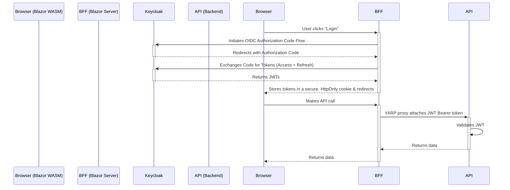

# Security Architecture

This document provides a high-level overview of the security architecture for the ISLAMU Event platform.

For detailed implementation patterns, code examples, and specific conventions, refer to the **`auth-patterns` skill**.

## 1. Authentication Strategy: Backend-for-Frontend (BFF)

The project employs a **Backend-for-Frontend (BFF)** security model to provide a high level of security by ensuring that no tokens are ever exposed to the end-user's browser.

**Protocol**: OpenID Connect (OIDC) / OAuth 2.0  
**Provider**: Keycloak

### Conceptual Flow

The authentication flow is designed to separate the concerns of browser session management from backend API authorization.

### Key Architectural Principles

*   **`Explore.Blazor` (The BFF)** is the only component that communicates directly with Keycloak. It manages the user's session using a secure, server-side, `HttpOnly` cookie.
*   **`Explore.Blazor.Client` (The Frontend)** is completely unaware of OIDC or JWTs. It operates like a traditional web application, automatically sending the session cookie with every request to its backend (the BFF).
*   **`Explore.API` (The Backend Resource)** is a stateless service. It only accepts JWT Bearer tokens for authorization and has no knowledge of the user's session cookie. This allows the API to be used by other clients (e.g., mobile apps, other services) in the future.

## 2. Authorization Strategy

### Endpoint-Level Authorization

A simple and strict convention is followed for securing API endpoints:
*   **Read operations (`GET`)** are generally public and decorated with `[AllowAnonymous]`.
*   **Write operations (`POST`, `PUT`, `DELETE`)** are protected and require a valid token, enforced with `[Authorize]`.

### Resource-Level Authorization

Fine-grained, resource-level authorization (e.g., "can this user edit *this specific* event?") is the responsibility of the **Application Layer**, typically within the MediatR handlers. This logic is not handled at the controller level.

### Future: Policy-Based Authorization (Cerbos)

The architecture is designed to incorporate a dedicated policy decision point (PDP) like Cerbos in the future. However, **Cerbos is not currently integrated**. All authorization logic is currently implemented within the application code.

---
For implementation details, see the `auth-patterns` skill.