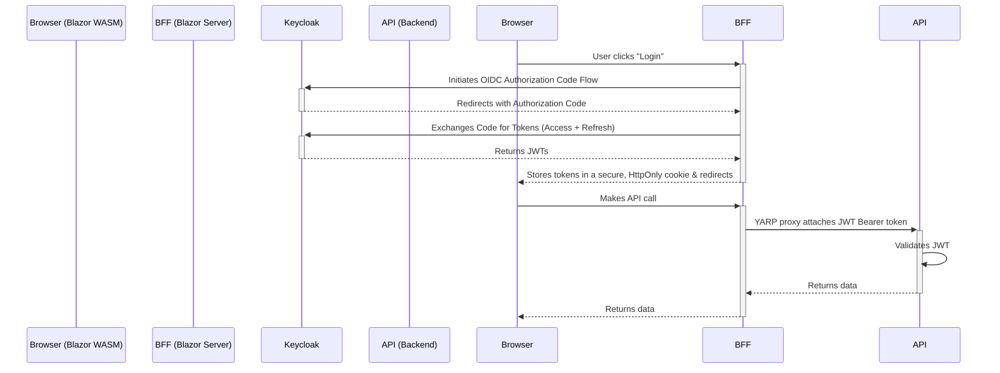

# Security Architecture

This document provides a high-level overview of the security architecture for the ISLAMU Event platform.

For detailed implementation patterns, code examples, and specific conventions, refer to the **`auth-patterns` skill**.

## 1. Authentication Strategy: Backend-for-Frontend (BFF)

The project employs a **Backend-for-Frontend (BFF)** security model to provide a high level of security by ensuring that no tokens are ever exposed to the end-user's browser.

**Protocol**: OpenID Connect (OIDC) / OAuth 2.0  
**Provider**: Keycloak

### Conceptual Flow

The authentication flow is designed to separate the concerns of browser session management from backend API authorization.



### Key Architectural Principles

*   **`Explore.Blazor` (The BFF)** is the only component that communicates directly with Keycloak. It manages the user's session using a secure, server-side, `HttpOnly` cookie.
*   **`Explore.Blazor.Client` (The Frontend)** is completely unaware of OIDC or JWTs. It operates like a traditional web application, automatically sending the session cookie with every request to its backend (the BFF).
*   **`Explore.API` (The Backend Resource)** is a stateless service. It only accepts JWT Bearer tokens for authorization and has no knowledge of the user's session cookie. This allows the API to be used by other clients (e.g., mobile apps, other services) in the future.

## 2. Authorization Strategy

### Endpoint-Level Authorization

A simple and strict convention is followed for securing API endpoints:
*   **Read operations (`GET`)** are generally public and decorated with `[AllowAnonymous]`.
*   **Write operations (`POST`, `PUT`, `DELETE`)** are protected and require a valid token, enforced with `[Authorize]`.

### Resource-Level Authorization

Fine-grained, resource-level authorization (e.g., "can this user edit *this specific* event?") is the responsibility of the **Application Layer**, typically within the MediatR handlers. This logic is not handled at the controller level.

### Policy-Based Authorization (Cerbos)

Cerbos is actively integrated as the policy decision point (PDP) for fine-grained authorization.

Current implementation overview:

*   **Application Layer** enforces resource/action checks via MediatR `AuthorizationBehavior` before command handlers execute.
*   **Infrastructure Layer** delegates policy decisions to Cerbos via HTTP in `CerbosAuthorizationService` (implements `IAuthorizationProvider`).
*   **Fallback Path** exists via `FallbackAuthorizationService` (also implements `IAuthorizationProvider`) when Cerbos is disabled by configuration. A `RuntimeAuthorizationProvider` wrapper selects the active provider based on the `AuthorizationProvider` system setting.
*   **API HATEOAS Layer** filters links using Cerbos batch checks so clients only receive authorized actions.
*   **Blazor UI** uses DB-backed admin claims for UX gating; server-side authorization remains the hard security boundary.

This keeps endpoint authorization simple (`[AllowAnonymous]` for public reads, `[Authorize]` for writes) while enforcing fine-grained resource policies centrally.

## 3. Fine-Grained Authorization (Cerbos)

We use **Cerbos** as an external Policy Decision Point (PDP). This decouples authorization logic from application code.

### 3.1. Implementation Pattern

1.  **Define Policy**: Authorization rules are defined in YAML files in the `cerbos/policies` directory.
2.  **Decorate Command**: Use `[AuthorizeResource]` on MediatR commands (optionally with `ISecureRequest` for dynamic resource IDs).

```csharp
[AuthorizeResource("event", PermissionAction.Update)]
public class UpdateEventCommand : IRequest<BaseCommandResponse>
{
    public Guid Id { get; set; }
}
```

3.  **Pipeline Enforcement**: The `AuthorizationBehavior` pipeline detects this attribute:
    *   Extracts the User (Principal) from `IUserContext`.
    *   Constructs the Resource (Kind: "event", ID: `command.Id`).
    *   Calls Cerbos: `Check(principal, resource, "update")`.
    *   If denied, throws `ForbiddenException`.

### 3.2. Policy Structure

Cerbos policies follow a standard hierarchy:

*   **Resource Policy**: Rules for a specific resource type (e.g., `event.yaml`).
*   **Principal Policy**: Rules for specific users/roles (rarely used, prefer roles in resource policies).
*   **Derived Roles**: Logic to map dynamic conditions to simple roles (e.g., `owner` if `request.auth.id == resource.attr.ownerId`).

---

## 4. Multi-Tenancy & Keycloak

### 4.1. Tenant Isolation

*   **Data Layer**: Enforced via Global Query Filters (`TenantId`).
*   **Auth Layer**: Keycloak manages identity.

### 4.2. Keycloak Configuration Models

The system supports two multi-tenancy models in Keycloak:

1.  **Shared Realm (Default)**:
    *   All tenants live in one Keycloak Realm.
    *   `TenantId` is stored as a custom attribute on the User or Group.
    *   Pros: Simpler management, Single Sign-On (SSO) across tenants.
    *   Cons: Less isolation between tenant user directories.

2.  **Realm-per-Tenant**:
    *   Each tenant has its own Keycloak Realm.
    *   Pros: Total isolation, tenant-specific login pages/policies.
    *   Cons: No SSO, higher management overhead.

*Current Implementation assumes **Shared Realm** with Group-based tenancy.*

---

## 5. Secret Management (Infisical)

We use **Infisical** to manage secrets (DB connection strings, API keys, Client Secrets) at runtime.

*   **No Hardcoded Secrets**: `appsettings.json` contains only placeholders or non-sensitive config.
*   **Runtime Injection**: `AddInfisicalBlazorCompatibility()` loads secrets into the `.NET Configuration` provider at startup.
*   **Rotation**: Secrets can be rotated in Infisical without code changes (requires app restart).

---

## 6. Client-Side Authorization (UX-Only)

Blazor WASM receives user claims via the BFF pattern — the server serializes admin authority claims into the authentication cookie, and `AddAuthenticationStateSerialization` makes them available to the client.

### What Client-Side Auth Does

- **Route guards** (`AdminRouteGuard`): Redirect unauthorized users away from admin pages
- **UI visibility**: Hide buttons, menu items, and actions the user cannot perform
- **Form validation**: Disable fields the user shouldn't edit

### What Client-Side Auth Does NOT Do

Client-side authorization checks are **UX conveniences only**. They:

- **Cannot prevent unauthorized access** — a user can bypass Blazor WASM checks trivially
- **Cannot enforce security policies** — all enforcement happens server-side
- **Cannot be trusted** for any security decision

### The Hard Security Boundary

```
Blazor WASM (client)          →  UX gating only (hide/show)
     │
     ▼
Blazor Server BFF (server)    →  Cookie auth, YARP proxy
     │
     ▼
API Controller (server)       →  [Authorize] + JWT validation
     │
     ▼
AuthorizationBehavior (server) →  THE ENFORCEMENT POINT
     │                            Calls IAuthorizationProvider
     │                            Throws ForbiddenException if denied
     ▼
Handler (server)              →  Business logic (only runs if authorized)
```

`AuthorizationBehavior` in the MediatR pipeline is the **only** authorization enforcement point. Every write operation passes through it before reaching the handler.

For pattern details, see [AUTHORIZATION_PATTERNS.md](AUTHORIZATION_PATTERNS.md).

---
For implementation details, see the `auth-patterns` skill.
