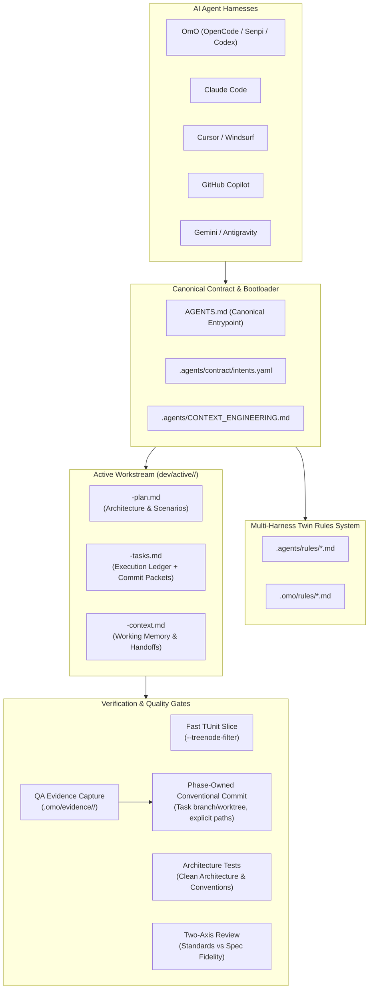
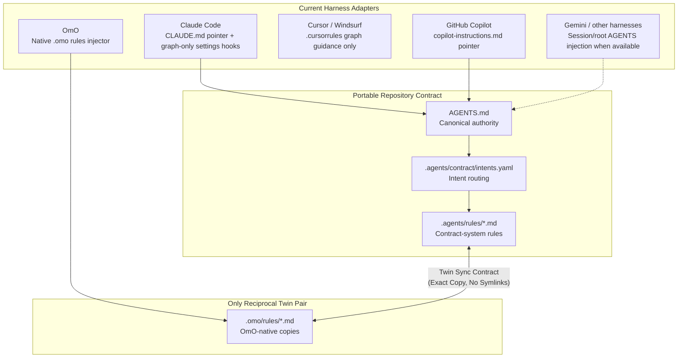
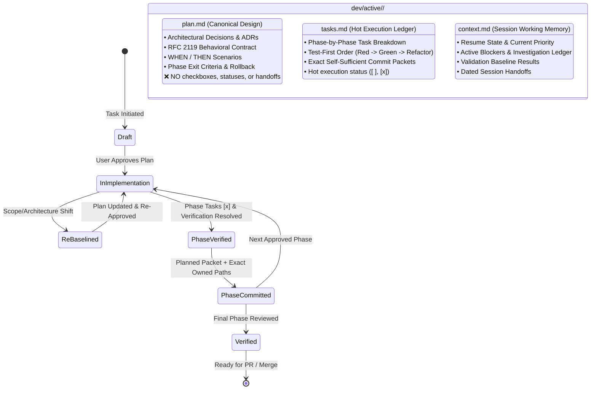
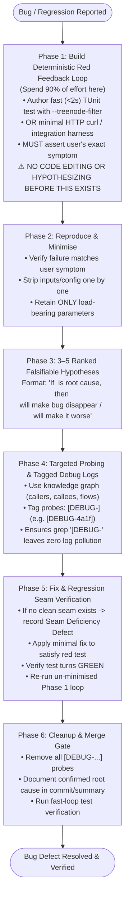
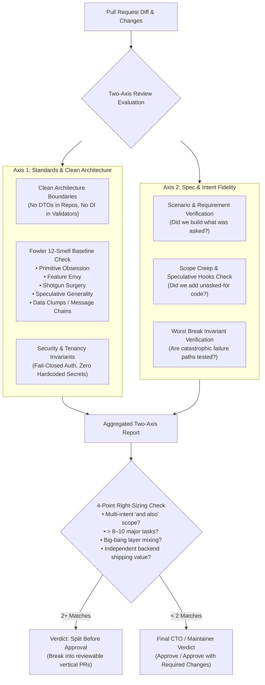

<!-- ABOUTME: Comprehensive reference and visual guide to ISLAMU Event's Agentic Context Engineering system. -->
<!-- ABOUTME: Visualizes cold start, multi-harness rules, dev-doc state, self-sufficient phase packets, verification, and improvement priorities. -->

# Agentic Context Engineering & AI Workflow Architecture

> **Audience:** Contributors | AI Agents | Platform Architects | Maintainers  
> **Status:** Canonical & Implemented  
> **Last Verified:** 2026-09-01 Europe/Brussels<br>
> **Source Anchors:** [`AGENTS.md`](../../AGENTS.md), [`.agents/CONTEXT_ENGINEERING.md`](../../.agents/CONTEXT_ENGINEERING.md), [`.agents/contract/intents.yaml`](../../.agents/contract/intents.yaml), [`implementation-plan`](../../.agents/skills/implementation-plan/SKILL.md), [`senior-cto-feedback`](../../.agents/skills/senior-cto-feedback/SKILL.md), [`conventional-commit`](../../.agents/skills/conventional-commit/SKILL.md), [`docs/QUICK_REFERENCE.md`](QUICK_REFERENCE.md)

---

## 1. Executive Overview & Design Philosophy

The **ISLAMU Event Agentic Context Engineering System** provides a deterministic, token-efficient, and multi-harness governance framework for autonomous and human-in-the-loop AI software engineering.

In modern agentic development, AI agents fail not from a lack of programming syntax knowledge, but from **context drift, assumption hallucination, test tautology ("The Ugly Mirror"), token budget exhaustion, and execution sprawl**. 

This system enforces five core design tenets:

1. **Smallest Decision-Complete Working Set**: Context is retrieved once, summarized once, and reused via an in-session context ledger (`path + symbol + revision`). Agents never reread unchanged files or inject entire registries.
2. **Zero-Turn Structural Injection**: When graph tooling is available, pre-flight blast-radius slices reduce manual traversal by injecting callers, callees, impacted flows, and tests on Turn 1.
3. **Behavior-Bound Test-First Invariants**: Requirements are written as observable system behavior (RFC 2119 + `WHEN`/`THEN` Scenarios) and mapped directly to failing Red tests at pre-agreed public seams *before* production code is touched.
4. **Portable Root Contract With A Scoped Twin Pair**: `AGENTS.md` is the portable authority. Reciprocal path-rule twins currently cover only `.agents/rules` and `.omo/rules`; Claude, Cursor, Copilot, Gemini, and other harness adapters remain separate drift-prone integration surfaces.
5. **Phase-Atomic Native Git Delivery**: Planning pre-authors a self-sufficient phase packet containing exact commit metadata, wholly owned paths, inspection/staging/path-limited commit commands, and post-commit verification. Parallel contributors use separate branches/worktrees, while every verified phase closes with literal commit paths and leaves unrelated work untouched.



## 2. The Three-Tier Architecture: Orchestration, Phase Closure, And Domain Guardrails

The repository's agentic system divides its 40+ skills into three distinct tiers:

1. **User-Invoked Orchestration Tier (Human-in-the-Loop Governance)**: High-level governance, ethical design, planning, and critique skills that the developer explicitly invokes to guide intent, scrutinize designs, and approve executable workstreams.
2. **Plan-Invoked Phase Closure Tier (Standing Execution Authority)**: Planning and CTO review load `conventional-commit` to produce a self-sufficient default contract after every phase verification gate. Normal implementation executes that contract without loading the skill; only a permitted override loads it to author replacements.
3. **Indirectly-Invoked Domain Execution Tier (Autonomous Machine Guardrails)**: Technical domain patterns, Clean Architecture rules, and tool wrappers that the AI activates autonomously in the background based on edited file paths, matched intents, and domain patterns.

### The Canonical 5-Stage Human-in-the-Loop Lifecycle

This is the standard, end-to-end path for implementing substantial features and architectural changes:

```mermaid
flowchart TD
    subgraph Stage1["Stage 1: Ethical & Value Framing (User-Invoked)"]
        UserTrigger1["User Prompt:\n'Run i-vsd on <feature>'"] --> IVSD["i-vsd Skill\n• Evaluates Provider Responsibility\n• Sunni Islamic Moral Boundaries\n• Mitigation & Uncertainty Traceability"]
        IVSD --> IVSDDoc["Persists Deliverable:\nislamic-value-sensitive-design/\ni-vsd-<task-name>.md"]
    end

    subgraph Stage2["Stage 2: Implementation Planning & Interrogation (User-Invoked)"]
        IVSDDoc --> PlanTrigger["User Prompt:\n'Create implementation plan for <feature>'"]
        PlanTrigger --> PlanSkill["implementation-plan Skill\n• Ingests i-vsd Deliverable\n• Runs /grill-me Technical Socratic Interrogation\n• (If Major Fork: robin-neutral Steelmanning)"]
        PlanSkill --> DevDocTriadInit["Initializes dev/active/<task>/\n• <task>-plan.md (Scenarios & Architecture)\n• <task>-tasks.md (Tests + Exact Commit Contracts)\n• <task>-context.md (Working Memory)"]
    end

    subgraph Stage3["Stage 3: Adversarial CTO Audit & Socratic Stress-Test (User-Invoked)"]
        DevDocTriadInit --> CTOTrigger["User Prompt:\n'Run senior-cto-feedback'"]
        CTOTrigger --> CTOSkill["senior-cto-feedback Skill\n• 3D Scorecard (Completeness, Correctness, Coherence)\n• 4-Point Right-Sizing Check (Split PR Heuristic)\n• 'Worst Break' Catastrophic Invariant Check\n• Validates Exact Per-Phase Commit Contracts"]
    end

    subgraph Stage4["Stage 4: Implementation Execution & Autonomous Domain Guardrails"]
        CTOSkill --> ExecTrigger["User Approval & Execution:\n(Can leverage /goal, subagents, or fast loops)"]
        ExecTrigger --> AutoExecution["Autonomous Domain Execution Loop\n• clean-architecture-rules\n• cqrs-mediatr-guidelines\n• dotnet-efcore-guidelines\n• auth-patterns & outbox-pattern\n• debug-issue & refactor-safely\n• Fast TUnit Slicing (--treenode-filter)"]
        AutoExecution --> PhaseVerification["Phase Verification\n• One Release build\n• At most one selected project test\n• Ownership disposition for failures"]
        PhaseVerification --> PhaseCommit["Immediate Phase Commit\n• Execute self-sufficient planned contract\n• Load skill only for override\n• Commit owned paths + record hash"]
        PhaseCommit --> MorePhases{"More approved phases?"}
        MorePhases -->|"Yes"| AutoExecution
    end

    subgraph Stage5["Stage 5: Workstream Review & Governed Release"]
        MorePhases -->|"No"| FinalReview["Final Workstream Review\n• Every phase hash recorded\n• No unrelated shared-tree files committed\n• Required release artifacts present"]
        FinalReview --> Shipped(["Committed on develop / Ready for PR"])
    end
```



### Skill Tier Taxonomy

| Tier | Invocation Model | Key Skills | Role & Primary Responsibility |
|---|---|---|---|
| **Orchestration Tier** | **User-Invoked** (Direct developer prompt or slash command) | `i-vsd`, `implementation-plan`, `senior-cto-feedback`, `/grill-me`, `/goal`, `robin-neutral` | Sets ethical boundaries, interrogates requirements, authors workstream triads (`dev/active/<task>/`), and audits architecture before implementation. |
| **Phase Closure Tier** | **Planning/Review-Invoked; override-only during execution** | `conventional-commit` | Planning writes exact self-sufficient contracts; CTO review validates them; normal execution does not reload the skill. Only material divergence loads it to author recorded replacements before committing owned paths. |
| **Domain Execution Tier** | **Indirectly-Invoked** (Autonomously activated via matched intent, rule path, or graph trigger) | `clean-architecture-rules`, `cqrs-mediatr-guidelines`, `dotnet-efcore-guidelines`, `blazor-ui-conventions`, `auth-patterns`, `outbox-pattern`, `debug-issue`, `refactor-safely`, `review-changes`, `review-pr`, `accessibility` | Enforces layer boundaries, immutable record contracts, zero-internal-mocking, fail-closed auth, transactional outbox dispatch, and two-axis review during active coding. |

---

## 3. Zero-Knowledge Cold-Start & Classification Lifecycle

When an AI agent starts work in this repository, it follows a deterministic cold-start sequence.

```mermaid
flowchart TD
    Start(["New User Request"]) --> Classify["1. CLASSIFY\nMatch intent in .agents/contract/intents.yaml\nResolve Criticality Tier (0–4)"]
    
    Classify --> CheckTier{"Criticality Tier"}
    
    CheckTier -->|"Tier 0: Sovereign\nTier 1: Security\nTier 2: Privacy"| HighCritIntake["2A. HIGH-CRITICALITY INTAKE\n• Load i-vsd and author i-vsd report\n• Proactive Socratic /grill-me session\n• Identify 'Worst Break' catastrophic scenario"]
    CheckTier -->|"Tier 3: Domain State"| StandardIntake["2B. STANDARD INTAKE\n• Bounded caller/callee tracing\n• Resolve open questions if ambiguous"]
    CheckTier -->|"Tier 4: UI / Docs"| AutonomousIntake["2C. AUTONOMOUS INTAKE\n• Local file reading only\n• Zero unnecessary interruptions"]
    
    HighCritIntake --> BlastRadius["3. ZERO-TURN BLAST RADIUS\nRun code-review-graph MCP\n(get_impact_radius_tool, get_affected_flows_tool)\nInject ~1KB Structural Context Slice"]
    StandardIntake --> BlastRadius
    AutonomousIntake --> DevDocsInit
    
    BlastRadius --> DevDocsInit["4. DEV-DOC TRIAD INITIALIZATION\nCreate dev/active/<task>/\n• plan.md: RFC 2119 + WHEN/THEN Scenarios\n• tasks.md: Tests + Exact Phase Commit Contracts\n• context.md: Resume & Validation Baseline"]
    
    DevDocsInit --> TDDExecution["5. BEHAVIOR-BOUND TDD EXECUTION\n• Task N.1 (Red): Author failing Invariant Tests for Scenarios\n• Task N.2 (Green): Implement Production Handlers & Entities\n• Task N.3 (Refactor): Clean Architecture & Registration"]
    
    TDDExecution --> LayerVerification["6. LAYER-BOUNDED VERIFICATION\n• Fast Loop: dotnet run -- --treenode-filter\n• Phase Exit: 1 Release Build + 1 Project Test\n• Tier 0–2: Capture QA Evidence to .omo/evidence/"]
    
    LayerVerification --> FailureOwnership{"7. FAILURE OWNERSHIP\nPhase-attributable?"}
    FailureOwnership -->|"Yes: fix before commit"| TDDExecution
    FailureOwnership -->|"No failure"| PhaseCommit["8. PHASE COMMIT\n• Execute planned contract without reload\n• Load skill only for override\n• Verify paths and record hash"]
    FailureOwnership -->|"Proven unrelated shared-tree failure"| ExternalRecord["Record exact external evidence\nLeave unrelated files untouched\nRequire phase-owned lane green"]
    ExternalRecord --> PhaseCommit
    PhaseCommit --> MorePhases{"More phases?"}
    MorePhases -->|"Yes"| TDDExecution
    MorePhases -->|"No"| ReviewTeaching["9. REVIEW & TEACHING SUMMARY\n• Two-Axis Review (Standards vs Spec)\n• Comprehensive Technical Teaching Summary\n• Phase hashes and release artifacts reconciled"]
    
    ReviewTeaching --> Done(["Work Complete & Verified"])
```



### Criticality Tier Matrix

| Criticality Tier | Target Domain & Scope | Intake & Inquiry Protocol | Exploration Budget | Test & Verification Strategy | Multi-Agent Review Protocol |
|---|---|---|---|---|---|
| **Tier 0: Sovereign** | Money, payments, checkout, RSVPs, capacity holds, refund authority | Mandatory `/grill-me` on concurrency, hold expiration, rollback | Exhaustive Knowledge Graph (callers, callees, outbox, DB locks, ADRs) | Invariant-Breaker concurrency tests + real PostgreSQL evidence | Anonymized Epistemic MAD (Weighted Voting) |
| **Tier 1: Security** | Auth, Cerbos policies, tenant boundaries, migrations, tokens | Mandatory `/grill-me` on threat models, fail-closed auth, tenant spoofing | Exhaustive Graph + Policy filters + Global query filters | Invariant-Breakers + multi-provider DB and fail-closed authorization tests | Anonymized Epistemic MAD (Weighted Voting) |
| **Tier 2: Privacy** | PII fields, erasure, AI context gateway, export, audit redaction | Mandatory `/grill-me` on erasure authority, anti-resurrection, receipt tokens | Exhaustive Data Flow tracing (`*Pii`, log sinks, vector DBs) | Invariant-Breakers + log sink PII scans + purge verification | Anonymized Epistemic MAD (Weighted Voting) |
| **Tier 3: Domain State** | Aggregate root domain logic, MediatR command/query handlers | Standard Q&A (only if requirements are ambiguous) | Bounded caller/callee tracing of target aggregate/handler | Behavioral CQRS unit and integration tests | Peer Review (`backend-engineer-agent`) |
| **Tier 4: Standard UI / Docs** | Blazor client components, CSS isolation, Markdown docs, agent context | Autonomous defaults (zero unnecessary interruptions) | Local surface reading (target razor/css/doc file only) | Affordance & component render tests; Markdown schema checks | Lightweight Self-Check (`presentation-engineer-agent`) |

---

## 4. Multi-Harness Bootloaders And Actual Twin Scope

The portable authority is root `AGENTS.md` plus the intent/skill/rule system. Harness adapters are currently heterogeneous; only `.agents/rules` and `.omo/rules` are maintained as reciprocal twins.



Current adapter facts:

- OmO auto-loads `.omo/rules`; the contract system routes `.agents/rules`.
- Root [`CLAUDE.md`](../../CLAUDE.md) and [Copilot instructions](../../.github/copilot-instructions.md) point to `AGENTS.md`; Claude settings currently register graph hooks rather than rule mirrors.
- `.cursorrules` currently contains graph guidance, not a mirrored rule tree.
- No additional Claude/Cursor/Copilot/Gemini twin directories are asserted as implemented.

Harness injection order does not change repository authority. Root [`AGENTS.md`](../../AGENTS.md) remains controlling: Critical Rules → `docs/QUICK_REFERENCE.md` → `docs/GOVERNANCE.md` → matching path-scoped rules. Adapter convergence remains proposal **#5** below.

### The Twin Rules Synchronization Contract

- **Zero Divergence**: Every rule in `.agents/rules/<name>.md` has an exact twin at `.omo/rules/<name>.md`.
- **Reciprocal Headers**: Line 2 of every rule documents its counterpart relative path.
- **No Symlinks**: Symlinks are strictly prohibited because harness file-scanners (such as OmO's `realpathSync`) collapse symlinks into single candidates, defeating distance-weighted path matching.
- **Twin Editing Rule**: When editing any rule file, agents MUST apply the identical change to its twin in the same commit.

---

## 5. The Dev-Doc Triad & Active Workstream State Machine

Substantial or multi-session development tasks are governed by the **Dev-Doc Triad** in `dev/active/<task>/`. This structure enforces strict separation of concerns between architecture, execution, and ephemeral session memory.

> [!NOTE]
> **Local Working Memory & Gitignore Isolation**: Active workstreams in `dev/active/*` are gitignored to eliminate commit churn, task-checkbox noise, and branch merge conflicts. Agents and developers access, create, and update these files directly using native harness file tools by deterministic path. Only durable architectural decisions graduate to `docs/internal/adr/`, durable findings to `dev/_journal/`, and research reports to `dev/report/`.



### Triad Single Responsibility Matrix

| Artifact | Canonical Responsibility | Strictly Forbidden Content | Update Frequency |
|---|---|---|---|
| `*-plan.md` | High-level architecture, design decisions, RFC 2119 contracts, `WHEN`/`THEN` scenarios, phase exit criteria, rollback handling. | Granular task checklists, `- [ ]` checkboxes, dynamic statuses (`IN PROGRESS`), ephemeral session progress. | Only when architectural direction or scope shifts. |
| `*-tasks.md` | Hot execution ledger, granular Red/Green/Refactor tasks, exact phase-owned paths, verification disposition, exact planned commit contracts, governed overrides, and commit tasks. | Long architectural narratives, trade-off debates, session handoff logs. | During planning, after each subtask, before any override, and after each commit. |
| `*-context.md` | Working memory, quick resume state, blockers, loaded evidence ledger, validation baseline, unrelated shared-tree failures, phase commit hashes, and dated handoffs. | Duplicate task checklists, full source code copies, redundant documentation paste. | At start of session, after phase closure, on blockers, and before handoff/pause. |

### Native Git Concurrency And Phase-Close Protocol

Parallel contributors should use native Git branches or worktrees instead of
editing one physical checkout concurrently. A task starts from the intended
base commit, works on a dedicated branch/worktree, and integrates through normal
Git review and merge. The phase boundary still owns verification and literal
commit paths:

| Step | Required action | Observable evidence |
|---|---|---|
| 1. Reconcile ownership | Update the phase-owned path list from completed tasks and generated outputs. Inspect the dirty tree and existing index before staging. | Every candidate path and hunk maps to the current phase; unrelated dirty/pre-staged paths are listed but untouched. A mixed-ownership file blocks commit until contributors separate or coordinate it. |
| 2. Verify once | Run the phase's one Release build and selected project test after implementation tasks finish. | Passing output, or an exact failure record with path/project ownership. |
| 3. Classify failures | Fix phase-attributable failures. A failure is unrelated only when concrete evidence points outside phase-owned files and the phase's selected verification lane is green. | `tasks.md` and `context.md` state the command, first actionable error, external path/owner evidence, and scoped green result. |
| 4. Consume planned contract | Compare the actual phase outcome with the self-sufficient packet in `tasks.md`; do not load `conventional-commit` merely to reuse it. | Exact metadata, commit paths, inspection commands, staging command, path-limited commit command, and verification command are reused unchanged while truthful. |
| 5. Govern exceptions | Only when the default will not be used, load `conventional-commit` for the five permitted divergence triggers. | Before commit, `tasks.md` records the reason and a complete metadata/path/command packet for every resulting commit. Style never qualifies. |
| 6. Commit owned paths | Stage exact files only. Use an explicit path-limited commit only when the task owns the complete diff of each named file. | No blind `git add .`/`git add -A`, no mixed-ownership file, and no unrelated path in the commit. |
| 7. Prove isolation | Inspect the new commit's path list and record its hash before completing the phase. | Commit file list equals the intended phase-owned set; unrelated working/index state remains present and untouched. |

A phase-attributable failure blocks its commit. A proven unrelated failure does not authorize the agent to repair, stage, discard, or claim ownership of another contributor's work. A message override never happens silently: if the divergence also changes architecture, scope, acceptance criteria, risk, or validation, the normal plan/context refresh triggers apply.

Representative `tasks.md` contract:

```markdown
#### Planned Commit Contract
- **Default title:** `fix(registration): reject expired holds before confirmation`
- **Default description:** Keep registration and capacity state unchanged when confirmation references an expired inventory hold.
- **Changelog treatment:** Public fix
- **Required trailers:** None
- **Commit paths:** `src/Registration/HoldConfirmation.cs`, `tests/Registration/HoldConfirmationTests.cs`
- **Pre-commit inspection commands:** `git status --short`; `git diff --name-only`; `git diff --cached --name-only`
- **Staging command:** `git add -- src/Registration/HoldConfirmation.cs tests/Registration/HoldConfirmationTests.cs`
- **Commit command:** `git commit --only -m "fix(registration): reject expired holds before confirmation" -m "Keep registration and capacity state unchanged when confirmation references an expired inventory hold." -- src/Registration/HoldConfirmation.cs tests/Registration/HoldConfirmationTests.cs`
- **Post-commit verification command:** `git show --name-only --format=fuller HEAD`
- **Message override:** Not overridden
```

---

## 6. Test-Driven Development & Behavior-Bound Seam Architecture

The repository enforces strict **Test-First Invariant Task Sequencing** to eliminate **Post-Hoc Test Tautology ("The Ugly Mirror")**—the failure mode where tests are written after code and merely mirror implementation bugs.

```mermaid
flowchart TD
    subgraph PlanContract["1. Behavioral Contract (in plan.md)"]
        SpecDoc["Requirement: System SHALL enforce capacity limits\n\n#### Scenario: Overbooking Hold Expired\n- GIVEN a reserved ticket hold expired 10s ago\n- WHEN user submits payment confirmation\n- THEN return ProblemDetails 409 Conflict with ExpiredHold code\n\n#### Scenario: The Worst Break (Double Capture Race)\n- GIVEN 2 concurrent requests for the final available seat\n- WHEN both process simultaneously\n- THEN exactly 1 succeeds and 1 fails closed with atomic rollback"]
    end

    subgraph SeamDefinitions["2. Pre-Agreed Public Seams"]
        AppSeam["Application Seam:\nIRequest<T> -> BaseCommandResponse<T> / ProblemDetails"]
        ApiSeam["API Seam:\nHTTP Route -> RFC 7807 Payload / HAL _links / Status"]
        PersistSeam["Persistence Seam:\nIQuerySpecification<T> -> Domain Aggregate Entity"]
    end

    subgraph RedGreenRefactor["3. Execution Sequence (in tasks.md)"]
        RedPhase["Task N.1 (Red Phase)\nAuthor failing Invariant Tests for Scenarios\n• Test against Public Seams only\n• Include 'Worst Break' Adversarial tests\n• Verify test fails with expected missing capability"]
        GreenPhase["Task N.2 (Green Phase)\nImplement Handlers, Aggregates & Domain Logic\n• Minimal production code to satisfy test\n• Verify test turns GREEN via --treenode-filter"]
        RefactorPhase["Task N.3 (Refactor & Registration)\nClean Architecture Slicing & DI\n• The Deletion Test (Deep Modules)\n• StarRedactor / HmacRedactor Zero-PII logging\n• Wire DI Service Registrations"]
        VerificationPhase["Phase Verification\n• One Release build\n• One selected project test"]
        CommitPhase["Phase-Owned Conventional Commit\n• Self-sufficient default, no skill reload\n• Override-only load, explicit paths"]
    end

    PlanContract --> SeamDefinitions
    SeamDefinitions --> RedPhase
    RedPhase --> GreenPhase
    GreenPhase --> RefactorPhase
    RefactorPhase --> VerificationPhase
    VerificationPhase --> CommitPhase
```



### Core Testing Invariants

1. **Pre-Agreed Public Seams**: Tests verify behavior strictly through public interfaces (MediatR requests, HTTP routes, aggregate root methods), never by inspecting private internal state or mocking internal collaborators.
2. **No Tautological Assertions**: Expected values must originate from an independent known-good literal or specification. Assertions that recompute expected values using the same formula as production code (`Assert.Equal(items.Sum(x => x.Price), result.Total)`) are strictly forbidden.
3. **No Interface Bypassing**: Tests must verify state transitions through the public interface. A test must not bypass the domain aggregate to assert directly against raw database tables.
4. **Mock Boundary Rule**: Mock **ONLY** external third-party infrastructure (payment gateways, external email delivery, system clock, random generators). **NEVER mock internal domain entities, aggregate roots, repositories, or MediatR handlers.** Use real domain entities and in-memory or Testcontainers-backed databases.

---

## 7. Disciplined Bug Diagnosis Protocol

Bug diagnosis follows a disciplined 6-phase falsifiable loop from `debug-issue`. Speculative debugging and premature code editing are strictly forbidden.



---

## 8. Two-Axis Review & Quality Gate Pipeline

Code review in ISLAMU Event evaluates pull requests along **two independent, non-polluting axes**, ensuring that clean code formatting does not mask missed functional requirements.



### The Fowler 12-Smell Baseline Checklist

| # | Code Smell | Diagnostic Tell in Diff | Required Refactoring Action |
|---|---|---|---|
| 1 | **Mysterious Name** | Vague identifiers (`data`, `temp`, `res`, `process()`) that obscure intent. | Rename using canonical domain glossary terms. |
| 2 | **Duplicated Code** | Similar logic shapes recurring across multiple handlers/controllers. | Extract to shared domain aggregate or application service. |
| 3 | **Feature Envy** | Method repeatedly reaching into another object's fields to perform calculations. | Move the method onto the object that owns the data. |
| 4 | **Primitive Obsession** | Raw `string`, `int`, or `Guid` representing domain concepts (e.g. email, money). | Encapsulate into a strongly-typed Value Object or Enum. |
| 5 | **Data Clumps** | The same 3+ parameters traveling together across multiple signatures. | Bundle parameters into a cohesive Record contract. |
| 6 | **Shotgun Surgery** | A single logical change forcing small edits across dozens of scattered files. | Consolidate related responsibilities into a single deep module. |
| 7 | **Divergent Change** | One class or file edited for multiple completely unrelated reasons. | Split class by single responsibility (CQRS command vs query). |
| 8 | **Speculative Generality** | Unused hooks, generic type parameters, or abstractions added "for the future". | Delete unused abstractions; keep implementation minimal (YAGNI). |
| 9 | **Message Chains** | Long property traversals (`a.B.C.D.GetState()`) violating the Law of Demeter. | Hide the walk behind a single method on the root object. |
| 10 | **Middle Man** | A class or service that merely delegates calls without enforcing invariants. | Cut the middle man; apply **The Deletion Test**. |
| 11 | **Repeated Switches** | Identical `switch`/`if` cascades on the same enum recurring across the codebase. | Replace with polymorphism or strategy dictionary. |
| 12 | **Refused Bequest** | A subclass or implementer that overrides and throws on inherited methods. | Replace inheritance with composition. |

---

## 9. Contributor & Agent Quick Command Reference

### Fast-Loop Development Commands

```bash
# 1. Fast TUnit Slicing during active subtask coding (~1.5s):
dotnet run --project tests/Event.Application.UnitTests/Event.Application.UnitTests.csproj --no-build -- --treenode-filter "/*/*/*<TargetTestClassName>/*"

# 2. Phase-End Verification (Run ONCE after all phase tasks are complete):
dotnet build --configuration Release --verbosity quiet
dotnet test --project tests/<TargetProject>.Tests/<TargetProject>.Tests.csproj --configuration Release --verbosity quiet

# 3. Architecture & Convention Integrity Check:
dotnet test --project tests/Event.Architecture.Tests/Event.Architecture.Tests.csproj --configuration Release --verbosity quiet

# 4. Immediate phase close on the task branch/worktree:
git status --short
git diff --name-only
git diff --cached --name-only
# Use the exact self-sufficient tasks.md contract without loading
# conventional-commit. Load it only when authoring a permitted override.
git add -- <phase-owned-path-1> <phase-owned-path-2>
# If unrelated files were already staged and every named file is wholly
# phase-owned, use an explicit path-limited commit.
git commit --only \
  -m "<type>(<scope>): <benefit-led phase outcome>" \
  -m "<phase-owned motivation, data flow, and required trailers>" \
  -- <phase-owned-path-1> <phase-owned-path-2>
git show --name-only --format=fuller HEAD

# 5. Markdown & Diff Integrity Check (Tier 4 / Documentation tasks):
git diff --check -- .agents/ docs/ dev/
```

### Critical Negative Constraints (What is FORBIDDEN)

> [!CAUTION]
> **Enforced Repository Invariants:**
> - ❌ **NO Ad-hoc Python/Node.js Scripts**: Agents must never generate or run `python`, `python3`, `node`, `npm` scratch scripts. Use native agent tools and POSIX Bash. Persistent dev tools belong in `eng/scripts/` or `eng/tools/` as C# scripts (`dotnet run eng/.../*.cs`).
> - ❌ **NO Hard-Coded Secrets**: Never put passwords, connection strings, or tokens in source code, `AppHost.cs`, or test fixtures. Secrets originate strictly from **Infisical** or **`.env`**.
> - ❌ **NO Repositories Returning DTOs**: Repositories return Domain Entities only. DTO mapping belongs strictly in MediatR handlers.
> - ❌ **NO DI for Validators**: FluentValidation validators must be manually instantiated in handlers.
> - ❌ **NO Hand-Editing EF Migrations**: Migrations are generated artifacts (`dotnet ef migrations add`). Never manually edit migration files or model snapshots.
> - ❌ **NO UI Authorization Inspection**: Blazor client affordances must be gated strictly by inspecting HAL `_links` presence, never by local role/claim checking.

---

## 10. Lightweight Workflow Guard

The repository intentionally does not implement an “Agent OS.” There are no
workstream manifests, concatenated plan/task/context digests, approval receipt
chains, file claims, heartbeats, lock daemons, persistent goal state machines,
custom context packet compilers, or harness-wide orchestration authority. Git
commits provide provenance; branches and worktrees provide concurrency.

`eng/agent-workflow` is a small, read-only guard with two commands:

```bash
dotnet run --project eng/agent-workflow/src/ISLAMU.AgentWorkflow/ISLAMU.AgentWorkflow.csproj -- validate-intents .agents/contract/intents.yaml
dotnet run --project eng/agent-workflow/src/ISLAMU.AgentWorkflow/ISLAMU.AgentWorkflow.csproj -- validate-commit -- git commit --only -m "message" -- src/ExactFile.cs docs/ExactFile.md
```

The first command checks that the canonical intents catalog is one bounded,
valid UTF-8 YAML document. The second checks only that a described `git commit`
uses distinct literal file pathspecs after `--`; it rejects `.`, directories,
globs, traversal, rooted paths, Git pathspec magic, controls, and duplicates.
The guard never executes Git or mutates repository state.

## 11. Related Documentation & Canonical Anchors

- [`AGENTS.md`](../../AGENTS.md) — Canonical agent contract and entrypoint.
- [`.agents/CONTEXT_ENGINEERING.md`](../../.agents/CONTEXT_ENGINEERING.md) — Context budget policy and retrieval limits.
- [`.agents/contract/intents.yaml`](../../.agents/contract/intents.yaml) — Machine-readable task and intent registry.
- [`docs/QUICK_REFERENCE.md`](QUICK_REFERENCE.md) — Global invariant quick reference.
- [`docs/GOVERNANCE.md`](GOVERNANCE.md) — Architectural governance, coding patterns, and conventions.
- [`docs/DOCUMENTATION_ARCHITECTURE.md`](DOCUMENTATION_ARCHITECTURE.md) — Documentation structure, layout, and maintenance rules.
