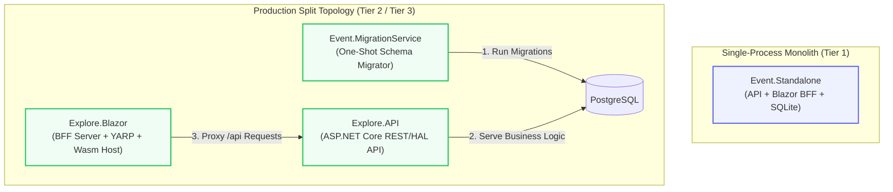

<!-- ABOUTME: Architectural specification of C# composition roots, hosting topologies, and startup lifecycle phases. -->
<!-- ABOUTME: Defines the runtime boundary between Explore.API, Explore.Blazor, Event.Standalone, and Event.MigrationService. -->

# Hosting Architecture & Composition Roots

Last Updated: 2026-09-03 Europe/Brussels

---

## 1. Composition Roots & Assembly Responsibilities

ISLAMU Event divides its runtime hosting across four distinct composition roots:



### 1. `Explore.API` (REST / HAL API Server)
* **Assembly**: `src/Explore.API/`
* **Entrypoint**: `Program.cs`
* **Role**: Primary domain and persistence authority. Hosts all MediatR request handlers, Cerbos/Local authorization evaluation, EF Core DbContexts (`ExploreDbContext`, `PrivacyErasureDbContext`), OpenAPI/Scalar endpoints, and webhook ingest/dispatch engines.
* **Network Exposure**: In production split topologies, `Explore.API` is internal to the container network (`islamu-network`) and communicates with `Explore.Blazor` over private HTTP/gRPC.

### 2. `Explore.Blazor` (Backend-for-Frontend & UI Host)
* **Assembly**: `src/Explore.Blazor/` (Server) & `src/Explore.Blazor.Client/` (WebAssembly Client)
* **Entrypoint**: `src/Explore.Blazor/Program.cs`
* **Role**: BFF host managing OAuth2/OIDC sessions, HTTP-only anti-forgery session cookies, YARP reverse-proxy routes forwarding `/api/*` requests to `Explore.API`, and serving static MudBlazor WebAssembly assets.
* **Network Exposure**: Publicly exposed via reverse proxy (Traefik/Caddy/Nginx) on port 80/443.

### 3. `Event.Standalone` (Monolithic Lightweight Host)
* **Assembly**: `src/Event.Standalone/`
* **Entrypoint**: `Program.cs`
* **Role**: Unifies `Explore.API` endpoints and `Explore.Blazor` BFF server into a **single .NET process**. Uses SQLite (`Data Source=/app/data/islamu.db`) and embedded migrations, enabling single-container deployments on resource-constrained servers (1 vCPU, 2 GB RAM).

### 4. `Event.MigrationService` (One-Shot Database Migrator)
* **Assembly**: `src/Event.MigrationService/`
* **Entrypoint**: `Program.cs`
* **Role**: Ephemeral container executed during deployment before `Explore.API` accepts traffic. Applies EF Core migrations atomically to PostgreSQL, seeds baseline lookup tables, and exits with code `0`.

---

## 2. Startup Lifecycle & Phase Ordering

Application startup in `Explore.API` and `Event.Standalone` executes in deterministic, sequential phases:

```
[Phase 0: Config & Secrets] ──► [Phase 1: DB Readiness] ──► [Phase 2: Migrations]
                                                                    │
[Phase 5: HTTP Pipeline]    ◄── [Phase 4: Caching/Outbox] ◄── [Phase 3: AuthN Discovery]
```

1. **Phase 0 (Configuration & Options Binding)**:
   * Load environment variables and optional Infisical secrets via `Explore.Secrets`.
   * Bind strongly typed options classes (`IOptions<TOptions>`) and execute `ValidateDataAnnotations()` and `ValidateOnStart()`.
2. **Phase 1 (Storage & Infrastructure Readiness)**:
   * Perform TCP connection test to PostgreSQL or test file write permissions for SQLite.
3. **Phase 2 (Schema Migrations)**:
   * Execute `DbContext.Database.MigrateAsync()` for main application and privacy-erasure contexts.
4. **Phase 3 (Identity & OIDC Handshake)**:
   * Fetch OpenID Connect discovery document from Keycloak (`/.well-known/openid-configuration`) and cache public signing keys (JWKS).
5. **Phase 4 (Cache & Asynchronous Workers)**:
   * Initialize Redis multiplexer connection pool (or in-memory cache fallback).
   * Start `EmailDispatchWorker` and `WebhookOutboxWorker` background services.
6. **Phase 5 (Middleware Pipeline Registration)**:
   * Pipeline order: `ExceptionHandlerMiddleware` $\to$ `RequestCorrelationMiddleware` $\to$ `ApiTenantResolutionMiddleware` $\to$ `AuthenticationMiddleware` $\to$ `AuthorizationMiddleware` $\to$ Endpoint Routing.

---

## 3. BFF Data Protection Key Ring & Stateless Checkout Tickets

In Split topology, `Explore.Blazor` protects short-lived browser payloads, including the registration
payment checkout ticket, with its own Data Protection key ring. That ring is
configured in `src/Explore.Blazor/Extensions/BffDataProtectionExtensions.cs`:

* The application name is always pinned to `islamu-event`.
* When `ConnectionStrings:cache` is absent, keys stay in the local native key store
  (filesystem or platform default for the host).
* When a cache connection string is present, keys persist to Redis under
  `islamu-event:data-protection-keys`.

Two consequences matter for topology decisions:

1. **Database-backed keys in `Explore.API` do not extend to a separate Split BFF.** The API's
   `DataProtectionKeyContext` covers API-issued payloads. A Split BFF still resolves
   its ring from the rules above, so operators must decide separately how BFF keys
   are shared.
2. **Multi-replica BFF requires a shared ring and the same application name.** A
   ticket protected by replica A is unreadable on replica B unless both read the same
   keys. Sharing a mounted key directory satisfies this; so does the Redis ring. If
   the Redis ring is chosen, Redis availability becomes part of the BFF's critical
   path even though checkout itself stores nothing there.

Combined `Event.Standalone` uses a single service container, not separate rings:
`Program.cs` calls `AddApiHostServices` before `AddBlazorHostServices`. Without
cache, the API's `PersistKeysToDbContext<DataProtectionKeyContext>()` registration
remains effective for the entire process, including the BFF. With cache configured,
the later BFF Redis repository registration replaces that selection process-wide.
These existing registration rules are unchanged by stateless checkout tickets.

Checkout tickets themselves are stateless. The BFF keeps no nonce, no Redis entry,
and no in-memory ticket dictionary: the target URL, audience, session digest, and
expiry all live inside the protected cookie value. Redis stays optional for checkout
storage. It is not optional as a shared-key mechanism once you pick it as the ring.
Contract details live in [PAYMENTS.md](PAYMENTS.md).

---

## 4. Operational Deployment Runbooks (Public Source of Truth)

For step-by-step container configuration, Docker Compose YAML manifests, environment variables, reverse proxies, and backup/restore procedures, **refer exclusively to the canonical public documentation**:

* 📖 **[Deployment Tiers & Hardware Sizing](https://islamu.gitbook.io/islamu-event/documentation/readme/self-hosting/deployment-tiers)**
* 📖 **[Docker Standalone Runbook](https://islamu.gitbook.io/islamu-event/documentation/readme/self-hosting/docker-standalone)**
* 📖 **[Docker Compose Production Runbook](https://islamu.gitbook.io/islamu-event/documentation/readme/self-hosting/docker-compose)**
* 📖 **[Coolify with Cerbos & Traefik](https://islamu.gitbook.io/islamu-event/documentation/readme/self-hosting/coolify-cerbos-traefik)**
* 📖 **[Environment Variables Reference](https://islamu.gitbook.io/islamu-event/documentation/readme/configuration-and-operations/environment-variables)**
* 📖 **[Secrets Management Guide](https://islamu.gitbook.io/islamu-event/documentation/readme/configuration-and-operations/secrets)**
