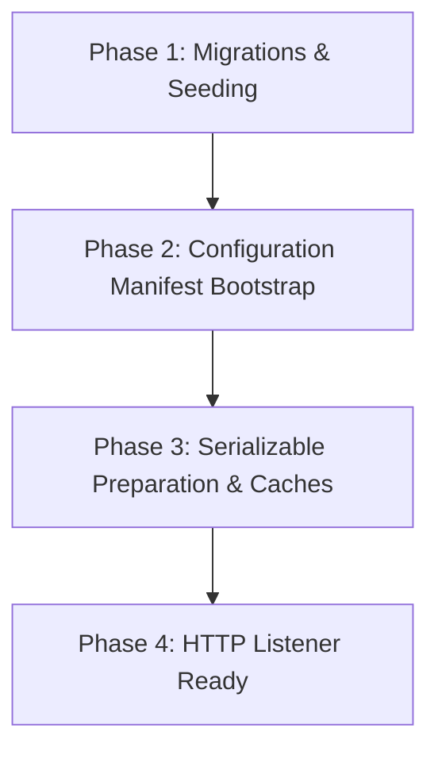

<!-- ABOUTME: Canonical architectural specification for hosting composition roots and startup lifecycle. -->
<!-- ABOUTME: Defines Explore.API, Explore.Blazor, Event.Standalone, and Event.MigrationService responsibilities. -->

# Hosting Architecture & Composition Roots

> **Audience:** Contributors | Architects | AI agents  
> **Status:** Implemented  
> **Owner:** Platform/Ops  
> **Last Verified:** 2026-09-03  
> **Source Anchors:** `Explore.AppHost/AppHost.cs`, `Explore.API/Program.cs`, `Explore.Blazor/Program.cs`, `Event.Standalone/Program.cs`, `Event.MigrationService/Worker.cs`  

> 📖 **Operator Runbooks & Deployment Guides:**  
> For production deployment instructions, Docker Compose files, standalone container execution, Coolify setups, and reverse proxy recipes (Caddy, Traefik, Nginx), consult the public documentation:  
> 👉 **[`docs/public/documentation/readme/self-hosting/`](../public/documentation/readme/self-hosting/)**

---

## 1. Composition Roots & Process Model

The platform defines three runtime composition roots and one migration worker:

```text
                        ┌───────────────────────────────┐
                        │      Explore.AppHost (Aspire) │
                        └──────────────┬────────────────┘
                                       │ (orchestrates)
          ┌────────────────────────────┼────────────────────────────┐
          ▼                            ▼                            ▼
┌───────────────────┐        ┌───────────────────┐        ┌───────────────────┐
│ Event.Migration   │        │   Explore.API     │        │  Explore.Blazor   │
│ Service (One-Shot)│        │   (Core Backend)  │        │  (BFF & Web UI)   │
└───────────────────┘        └───────────────────┘        └───────────────────┘
                                       ▲
                                       │ (replaces in standalone mode)
                             ┌───────────────────┐
                             │ Event.Standalone  │
                             │ (Combined Host)   │
                             └───────────────────┘
```

### Process Roles

| Project | Packaging | Responsibilities |
|---|---|---|
| **`Explore.API`** | `src/Explore.API/` | Composition root for Domain, Application, Persistence, and Infrastructure layers. Hosts REST endpoints, MediatR pipeline, OpenAPI/Scalar, and background workers. |
| **`Explore.Blazor`** | `src/Explore.Blazor/` | Backend-for-Frontend (BFF) server hosting the Blazor WebAssembly client, OIDC cookie authentication with Keycloak, and YARP reverse-proxy forwarding to `Explore.API`. |
| **`Event.MigrationService`** | `src/Event.MigrationService/` | Dedicated one-shot worker responsible for applying EF Core database migrations, initial data seeding, and Data Protection key initialization before API/UI start. |
| **`Event.Standalone`** | `src/Event.Standalone/` | Single-process distribution combining `Explore.API`, `Explore.Blazor`, and in-process migrations into one container for lightweight, single-replica deployments. |

---

## 2. Startup Lifecycle & Phase Ordering

Whether operating in a split topology or standalone image, startup follows a strict, sequential lifecycle. A failure at any stage prevents subsequent stages from starting:



1. **Phase 1 — Migrations & Seeding**:
   - `Event.MigrationService` (split) or in-process migrator (standalone) executes EF Core migrations.
   - Applies application tables, Data Protection key ring schema, and Privacy Erasure Authority tables.
   - Runs idempotent database seeders (`DatabaseSeeder.cs`).
2. **Phase 2 — Configuration Manifest Bootstrap**:
   - Reads declarative YAML manifests if configured (`CONFIGURATION_MANIFEST_MODE`).
   - Reconciles instance-level and tenant-level configuration and branding documents.
3. **Phase 3 — Serializable Preparation & Caches**:
   - Initializes the `PrivacyErasureStartupGate` to replay authority facts and establish anti-resurrection fences before traffic is served.
   - Warms in-memory lookup caches and verifies external secret bindings.
4. **Phase 4 — HTTP Readiness**:
   - Kestrel binds HTTP listeners.
   - Liveness (`/alive`) and readiness (`/health`) endpoints report `Healthy`.

---

## 3. Database Provider Abstraction

Relational persistence is mediated through EF Core in `Explore.Persistence`:

- **Supported Providers**: PostgreSQL (`Npgsql`), SQLite (`Microsoft.EntityFrameworkCore.Sqlite`), SQL Server (`Microsoft.EntityFrameworkCore.SqlServer`), and MySQL/MariaDB (`Pomelo.EntityFrameworkCore.MySql`).
- **Namespace Rules**:
  - PostgreSQL and SQL Server use the configured `DATABASE_SCHEMA` (defaults to `public`) with clean table names.
  - SQLite and flat namespace providers prefix tables with `ie_`.
- **Query Filters**: Multi-tenancy is enforced at the `DbContext` level using EF Core global query filters (`HasQueryFilter(e => e.TenantId == CurrentTenantId)`). Cross-tenant queries must explicitly use `IgnoreQueryFilters()`.

---

## 4. Operational Runbook Routing

For all operational deployment configurations, refer to public documentation:

- **Docker Compose Production Setup**: [`docs/public/documentation/readme/self-hosting/docker-compose.md`](../public/documentation/readme/self-hosting/docker-compose.md)
- **Standalone Container Setup**: [`docs/public/documentation/readme/self-hosting/docker-standalone.md`](../public/documentation/readme/self-hosting/docker-standalone.md)
- **Coolify, Cerbos & Traefik Setup**: [`docs/public/documentation/readme/self-hosting/coolify-cerbos-traefik.md`](../public/documentation/readme/self-hosting/coolify-cerbos-traefik.md)
- **Deployment Sizing & Tiers**: [`docs/public/documentation/readme/self-hosting/deployment-tiers.md`](../public/documentation/readme/self-hosting/deployment-tiers.md)
- **Backups & Disaster Recovery**: [`docs/public/documentation/readme/configuration-and-operations/backup-restore-upgrade.md`](../public/documentation/readme/configuration-and-operations/backup-restore-upgrade.md)
- **Troubleshooting**: [`docs/public/documentation/readme/configuration-and-operations/troubleshooting-and-health.md`](../public/documentation/readme/configuration-and-operations/troubleshooting-and-health.md)
