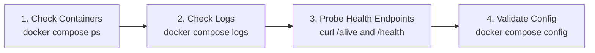

# Troubleshooting & Operational Health

This guide provides fast diagnostic procedures and step-by-step recovery recipes for common issues encountered during deployment, authentication, database migrations, and runtime operations.

---

## Quick Diagnostic Flow

When diagnosing an unexpected failure, follow this four-step sequence:



1. **Check Container Status**:
   ```bash
   docker compose ps
   ```
2. **Inspect Container Logs**:
   ```bash
   docker compose logs --tail=100 -f event-api
   docker compose logs --tail=100 -f event-ui
   docker compose logs --tail=100 -f keycloak
   ```
3. **Query Health Endpoints**:
   ```bash
   curl -i http://localhost:7039/alive
   curl -i http://localhost:7039/health
   ```
4. **Verify Configuration Syntax**:
   ```bash
   docker compose config --quiet
   ```

---

## Common Issues & Recovery Recipes

### Recipe 1: Keycloak "Invalid Parameter: redirect_uri" or Infinite Login Loop

#### Why this happens
Keycloak validates the redirect URI sent by the browser against its client whitelist. If your reverse proxy terminates TLS but does not forward `X-Forwarded-Proto: https` and `X-Forwarded-Host`, Keycloak believes the request came over unencrypted HTTP or an internal container IP and rejects the callback.

#### Step-by-Step Fix:
1. **Fix Reverse Proxy Headers**: Ensure your reverse proxy (Caddy, Traefik, or Nginx) forwards the client headers to Keycloak:
   - *Nginx*:
     ```nginx
     proxy_set_header Host $host;
     proxy_set_header X-Forwarded-For $proxy_add_x_forwarded_for;
     proxy_set_header X-Forwarded-Proto https;
     ```
   - *Caddy*:
     ```caddy
     reverse_proxy keycloak:8080 {
         header_up X-Forwarded-Proto {scheme}
         header_up X-Forwarded-Host {host}
     }
     ```
2. **Configure Keycloak Client Allowed URIs**:
   - Log into Keycloak Admin Console at `https://auth.example.org/admin`.
   - Navigate to **Clients** $\to$ **`event-blazor`**.
   - Under **Valid Redirect URIs**, enter: `https://events.example.org/*`
   - Under **Web Origins**, enter: `https://events.example.org`
   - Click **Save** and test logging in again.

---

### Recipe 2: API Fails at Startup with `Instance:OperatorIdentity Validation Failure`

#### Why this happens
In production (`ASPNETCORE_ENVIRONMENT=Production`), ISLAMU Event implements a fail-closed legal compliance check. An instance will refuse to open HTTP ports if the operator legal identity variables are blank.

#### Step-by-Step Fix:
1. Open your `.env` file.
2. Ensure the following six legal identity keys are populated with real values:
   ```env
   INSTANCE__OPERATORIDENTITY__OPERATORID=01912a7e-1234-7000-8000-000000000001
   INSTANCE__OPERATORIDENTITY__PUBLICNAME=Community Events Foundation
   INSTANCE__OPERATORIDENTITY__LEGALNAME=Community Events Foundation Non-Profit
   INSTANCE__OPERATORIDENTITY__PUBLICCONTACTEMAIL=contact@example.org
   INSTANCE__OPERATORIDENTITY__TERMSURL=https://events.example.org/terms
   INSTANCE__OPERATORIDENTITY__PRIVACYURL=https://events.example.org/privacy
   ```
3. Restart the stack:
   ```bash
   docker compose restart event-api
   ```

---

### Recipe 3: Headless Onboarding Fails with `GenerationDrift`

#### Why this happens
When using headless automated onboarding (`INSTANCE_BOOTSTRAP_MODE=ConfiguredAdministrator`), the platform guards against configuration replay attacks using a monotonic generation counter. If you edit bootstrap parameters without incrementing the generation counter, startup halts immediately.

#### Step-by-Step Fix:
1. Inspect the current generation number in `.env`:
   ```env
   INSTANCE_BOOTSTRAP_BINDING_GENERATION=1
   ```
2. Increment the value to a strictly higher integer (e.g., from `1` to `2`).
3. Confirm that `INSTANCE_BOOTSTRAP_ADMIN_SUBJECT` exactly matches the user's UUID (`sub` claim) from Keycloak.
4. Restart `event-api`:
   ```bash
   docker compose restart event-api
   ```

---

### Recipe 4: Database Migration Lock or Connection Refused

#### Why this happens
If `event-api` starts before PostgreSQL is ready or before `event-migrationservice` completes, the API may timeout or log database lock errors.

#### Step-by-Step Fix:
1. Check PostgreSQL container health:
   ```bash
   docker compose ps postgres
   docker compose logs --tail=50 postgres
   ```
2. Manually run the one-shot migration service and confirm it exits with code `0`:
   ```bash
   docker compose run --rm event-migrationservice
   ```
3. Once migrations succeed, start the API:
   ```bash
   docker compose up -d event-api event-ui
   ```

---

### Recipe 5: All Authenticated Actions Return `403 Forbidden` (Cerbos Fail-Closed)

#### Why this happens
When `AUTHORIZATION_PROVIDER=cerbos` is selected, ISLAMU Event enforces **fail-closed security**. If the Cerbos PDP container is unreachable, unhealthy, or has not loaded policies, all actions are denied immediately. It does not fall back to local RBAC.

#### Step-by-Step Fix:
1. Check Cerbos PDP health endpoint:
   ```bash
   curl http://localhost:3592/_cerbos/health
   ```
2. If Cerbos is running but policies are missing, upload policies via `cerbosctl`:
   ```bash
   docker run --rm -v "$PWD/cerbos/policies:/policies:ro" \
     ghcr.io/cerbos/cerbosctl:0.51.0 \
     --server=localhost:3593 --plaintext \
     put policy -R /policies
   ```
3. If Cerbos is experiencing an extended outage and you need immediate emergency access, switch to local RBAC in `.env`:
   ```env
   AUTHORIZATION_PROVIDER=local
   ```
   Then restart `event-api`:
   ```bash
   docker compose restart event-api
   ```

---

### Recipe 6: Lost Setup Secret Recovery

#### Why this happens
If you left `SETUP_SECRET=` blank in `.env`, the container generated an ephemeral single-use secret inside the volume upon first boot.

#### Step-by-Step Fix:
1. Copy the setup secret out of the container to your local terminal:
   ```bash
   docker compose exec event-api cat /app/data/setup-secret
   ```
2. Open `http://localhost:7002/setup` in your browser and paste the secret.
3. Once onboarding completes, the setup secret file is permanently deleted automatically.

---

## Health Check Endpoints Reference

The platform exposes standardized, sanitized health endpoints:

| Endpoint | Method | Purpose | Healthy Response |
|---|---|---|---|
| `/alive` | `GET` | **Liveness Probe**: Confirms the process is running. | `200 OK` (plain text) |
| `/health` | `GET` | **Readiness Probe**: Evaluates DB, Keycloak, storage, and Cerbos connections. | `200 OK` with sanitized JSON status |

Example healthy response from `/health`:
```json
{
  "status": "Healthy",
  "totalDuration": "00:00:00.018",
  "entries": {
    "database": { "status": "Healthy" },
    "keycloak": { "status": "Healthy" },
    "storage": { "status": "Healthy" }
  }
}
```
*Note: Health responses never disclose passwords, connection strings, or PII.*

---

## Related Guides & Next Steps

* **[Environment Variables Reference](environment-variables.md)** — Fix missing legal identity keys or secret provider errors.
* **[Docker Compose Runbook](../self-hosting/docker-compose.md)** — Production container restart and migration lifecycle.
* **[Keycloak Authentication](../security-and-identity/authentication.md)** — Configure reverse-proxy redirect URIs and client origins.
* **[Authorization Guide](../security-and-identity/authorization.md)** — Understand Cerbos fail-closed behavior vs. Local RBAC.
* **[First-Run Administration Guide](../administration-and-branding/admin-guide.md)** — Complete initial setup wizard with the recovered setup secret.
