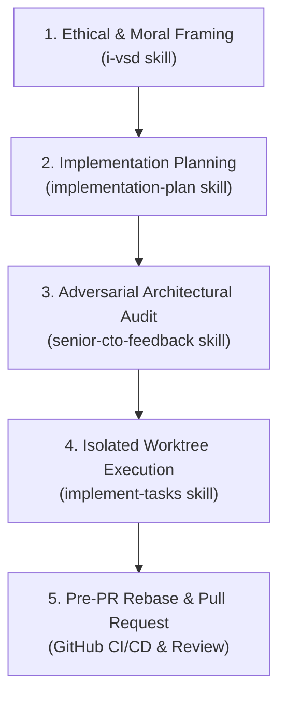

# Agentic Engineering & AI Workflow

ISLAMU Event is built using **Agentic Engineering**—a disciplined software development methodology that replaces unstructured "vibe coding" with deterministic, contract-governed AI orchestration.

Whether you contribute using Claude Code, Cursor, GitHub Copilot, Gemini/Antigravity, or open-source agent harnesses, this guide explains how our agentic lifecycle operates and how you can align your AI-assisted work with our repository.

---

## Why Agentic Engineering?

Traditional AI code generation often suffers from **context drift, assumption hallucination, test tautology ("The Ugly Mirror"), and dirty-workspace pollution**. 

To build enterprise-grade software reliably with AI, ISLAMU Event enforces five core tenets:
1. **Decision-Complete Working Sets:** Context is retrieved once, summarized once, and reused. Agents never flood context windows with entire registries.
2. **Behavior-Bound Invariant Testing:** Requirements are written as observable system behavior contracts (RFC 2119 + `WHEN`/`THEN` scenarios) and mapped to failing invariant tests *before* production code is touched.
3. **Strict Separation of Concerns:** Planning is investigative and architectural; execution is isolated and transactional. Planning agents never touch Git branches or worktrees.
4. **Hermetic Worktree Isolation:** AI execution runs in root-scoped Git worktrees (`.worktrees/<task>`), keeping the human developer's workspace cleanly parked on `develop`.
5. **Phase-Atomic Conventional Commits:** Commits are drafted as semantic contracts during planning and executed dynamically upon green test verification.

---

## The Canonical 5-Stage Agentic Lifecycle

Substantial features and refactors in ISLAMU Event flow through an optimal 5-stage pipeline:


**Multi-Session Best Practice**: For substantial contributions, run **Planning (Stage 2)**, **Adversarial Audit (Stage 3)**, and **Worktree Execution (Stage 4)** in **separate AI sessions**. Starting fresh sessions eliminates self-confirmation bias (the reviewing agent evaluates the plan purely as cold external material) and prevents context degradation.


### Stage 1: Ethical & Value Framing (`i-vsd`)
Before designing features that touch user data, privacy, monetization, or permissions, we run an **Islamic Value-Sensitive Design (I-VSD)** assessment:
* Evaluates provider responsibility and normative Sunni ethics.
* Identifies stakeholder harm vectors and mandates explicit mitigations.
* Persists durable findings under `islamic-value-sensitive-design/i-vsd-<task>.md`.

### Stage 2: Implementation Planning (`implementation-plan`)
The planning phase is strictly analytical and architectural:
* **Zero Git Topology Alterations:** Planning agents never create branches or worktrees.
* **The Dev-Doc Triad:** Authors ephemeral working memory in `dev/active/<task>/`:
  * `<task>-plan.md`: Architectural design, ADRs, and RFC 2119 behavioral scenarios.
  * `<task>-tasks.md`: Hot execution ledger with failing Red test sequences and semantic Conventional Commit contracts.
  * `<task>-context.md`: Active session progress, blockers, and validation baseline.

### Stage 3: Adversarial Architectural Audit (`senior-cto-feedback`)
Before coding begins, the plan undergoes a simulated Senior CTO review:
* Evaluates the design across three dimensions: **Completeness**, **Correctness**, and **Coherence** (Clean Architecture, HAL link affordance gating, tenant isolation).
* Applies the **4-Point Right-Sizing Rule** to enforce PR splits before implementation starts.
* Stresstests edge cases using "The Worst Break" catastrophic scenario.
* Directly updates and refines the dev-doc triad (`plan.md`, `context.md`, `tasks.md`) in place with zero review file clutter, outputting a high-signal summary to chat.

### Stage 4: Isolated Worktree Execution (`implement-tasks`)
Once approved, implementation execution begins in complete isolation:
1. **Root-Scoped Worktree:** A dedicated Git worktree is spawned under `.worktrees/<task-name>` branched from `origin/develop`.
2. **Plan Transfer (`plan mv`):** The `dev/active/<task>` directory is moved into the worktree, guaranteeing a single source of truth.
3. **TDD Cadence:** 
   * **Red:** Compilable stubs + failing invariant test.
   * **Green:** Production code to satisfy invariants.
   * **Sliced Verification:** Fast execution of targeted test classes via TUnit (`--treenode-filter`).
4. **Semantic Phase Commit:** Staged with `git add -A` within the clean worktree and committed using the planned semantic Conventional Commit contract.

### Stage 5: Pre-PR Rebase Gate & Governed Pull Request
Before submitting the contribution:
1. **Pre-PR Rebase:** The agent fetches latest upstream (`git fetch origin develop && git rebase origin/develop`) to absorb any concurrent merges from other contributors.
2. **Regression Check:** Runs the phase test suite to prove zero rebase regressions.
3. **Knowledge Graduation:** Promotes durable knowledge to `dev/backlog/<slug>.md`, `docs/internal/adr/`, or `dev/_journal/`.
4. **PR Submission & Cleanup:** Pushes `feat/<task-name>`, opens a GitHub Pull Request (`gh pr create --base develop`), and cleans up the worktree (`git worktree remove .worktrees/<task-name>`).

---

## Deep Technical Architecture


**For Platform Architects & Engineers:**  
This public guide outlines our high-level workflow. To inspect our internal context engineering architecture, multi-harness twin rules, prompt bootloaders, and MCP integration protocols, view the full specification directly on GitHub:

👉 **[Agentic Context Engineering & AI Workflow Architecture (GitHub)](https://github.com/islamu-ngo/Event/blob/develop/docs/internal/AGENTIC_CONTEXT_ENGINEERING.md)**


---

## Related Guides

* **[Clean Architecture Conventions](clean-architecture.md)** — Architectural patterns enforced by our agentic guardrails.
* **[TUnit Testing Conventions](tunit.md)** — Invariant-first testing patterns used in our Red/Green execution loops.
* **[Clean-Room IP & Licensing](clean-room-ip-and-licensing.md)** — Outbound license preservation and clean-room provenance rules.
