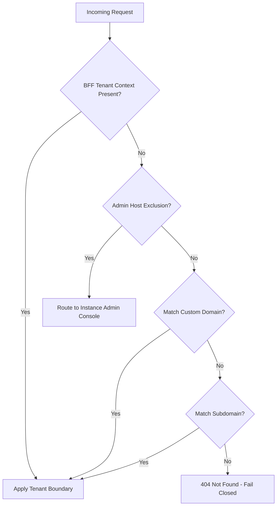

# Multi-Tenancy Architecture

ISLAMU Event defaults to single-tenant operation. To operate multiple independent community centers or organizational chapters from a single deployment, set `DEPLOYMENT_MODE=multi_tenant` in your environment (see [Environment Variables Reference](../configuration-and-operations/environment-variables.md#1-core-deployment--networking)) before initial onboarding.

---

## Tenant Resolution Hierarchy

Multi-tenant HTTP requests resolve tenant context through a strict, fail-closed sequence:

1. **Trusted BFF Tenant Context**: Passed via authenticated secure session headers (see [Architecture & Request Flows](../getting-started/architecture-and-request-flows.md#1-browser-request-flow)).
2. **Admin-Host Exclusion**: Dedicated administrative hostnames (e.g. `admin.example.org`) route exclusively to the [Instance Administration Console](../administration-and-branding/admin-guide.md).
3. **Custom Domain Matching**: Resolves tenants mapped to external domains (see [Custom Domains & SEO](../administration-and-branding/custom-domains-and-seo.md)).
4. **Subdomain Matching**: Maps `tenant.events.example.org` to the registered tenant identifier.
5. **Fail Closed**: If no matching tenant is found, the server immediately returns `404 Not Found`. An unknown host will **never** silently fall back to an arbitrary default tenant.

---

## Database & Query Filter Isolation

Every multi-tenant entity implements `ITenantScoped`. EF Core applies global query filters automatically:
* If ambient tenant context is absent, queries evaluate to `false` and return empty sets rather than leaking cross-tenant data.
* System workers and background dispatchers must explicitly opt into cross-tenant processing using bounded tenant predicates.

---

## Governance & Settings Cascade

Settings flow downward through a five-tier hierarchy:
$$\text{Instance} \longrightarrow \text{Tenant} \longrightarrow \text{Organization} \longrightarrow \text{Group} \longrightarrow \text{User}$$

Instance administrators can lock specific governance properties (such as footer links, legal notices, or payment gateways) to prevent tenants from modifying them (see [White-Labeling & Branding](../administration-and-branding/white-labeling.md)).

---

## Acceptance Testing

1. Configure at least two test tenants (`tenant-a.events.local` and `tenant-b.events.local`).
2. Verify that creating an event under Tenant A is invisible to attendees on Tenant B.
3. Access the application using an unmapped hostname and confirm it returns `404 Not Found`.
4. Verify that background outbox workers process messages with the correct tenant context.

---

## Related Guides & Next Steps

* **[Custom Domains & SEO](../administration-and-branding/custom-domains-and-seo.md)** — Bind custom vanity domains to individual tenants.
* **[White-Labeling & Branding](../administration-and-branding/white-labeling.md)** — Configure tenant-specific logos, themes, and CSS tokens.
* **[Admin Hierarchy & Scopes](../administration-and-branding/admin-hierarchy.md)** — Understand permissions for Instance Admins vs. Tenant Admins.
* **[Deployment Tiers & Sizing](../self-hosting/deployment-tiers.md)** — Review hardware requirements for multi-tenant deployments.
