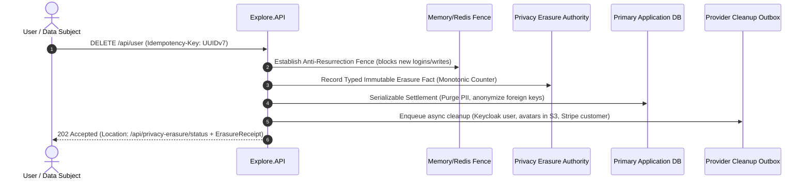

# Privacy Erasure & GDPR Compliance

Under data privacy regulations such as the GDPR, when an attendee or user requests account deletion, the platform must guarantee that their personal identifiable information (PII) is completely destroyed and **cannot be accidentally resurrected** by database restore operations or distributed retries.

ISLAMU Event implements an **Authority-First, Anti-Resurrection Architecture** to enforce this guarantee.

---

## The Anti-Resurrection Workflow

The erasure process follows a strict sequence to prevent data leaks or partial deletions:

1. **Anti-Resurrection Fence**: An immediate barrier is established in distributed cache. Any concurrent or subsequent requests with this user ID are blocked instantly.
2. **Authority Fact**: The erasure event is recorded in a dedicated, isolated authority store *before* local data disposal begins.
3. **Serializable Settlement**: In one atomic transaction, the user’s personal data is scrubbed, registrations are anonymized, and foreign keys are safely unlinked.
4. **Asynchronous External Cleanup**: Background outbox workers delete the user from Keycloak, purge media from S3/local storage, and notify external payment gateways.
5. **Single-Use Receipt**: The user receives a `202 Accepted` response with an opaque `ErasureReceipt` capability token. The receipt can be used to query `/api/privacy-erasure/status` until completion, after which all trace of the receipt is destroyed.

---

## Choosing an Authority Storage Topology

The Privacy Erasure Authority store must be configured in your environment via `PRIVACY_ERASURE__AUTHORITY__TOPOLOGY`:

| Topology | Storage Mechanism | Best Fit | Primary Constraint |
|---|---|---|---|
| **`EmbeddedSqlite`** | Dedicated SQLite database at `/app/data/privacy_erasure_authority.db` | Single-server Compose and Standalone | Single API container writer; requires volume persistence |
| **`CoLocated`** | Shared table schema within primary PostgreSQL DB | Minimal dev environments | No independent protection if primary DB is restored from stale backup |
| **`ExternalDatabase`** | Completely isolated external PostgreSQL instance | High-availability enterprise clusters | Requires managing a secondary PostgreSQL database |

> [!TIP]
> **Our Recommendation:**
> - **We recommend `EmbeddedSqlite`** for standard self-hosters. It runs with zero operational overhead, uses dedicated storage, and guarantees that even if your primary PostgreSQL database is restored to a state from last week, the SQLite erasure store will prevent previously deleted users from being resurrected!
> - **We recommend `ExternalDatabase`** only for enterprise multi-node clusters running multiple API replicas that cannot share a local SQLite file.

---

## The Golden Rule of Disaster Recovery

> [!CAUTION]
> **Never Restore the Primary Database Without the Erasure Store!**  
> If you restore an older database snapshot (e.g., from 3 days ago) to recover from corruption, any user who requested account deletion yesterday would normally be restored ("resurrected") into the database.
> 
> When ISLAMU Event starts, the **`PrivacyErasureStartupGate`** automatically replays all facts from the Privacy Erasure Authority against the application database before HTTP traffic is allowed. If an erased user is found in the restored database, the gate immediately re-purges their records and re-establishes the anti-resurrection fence!
