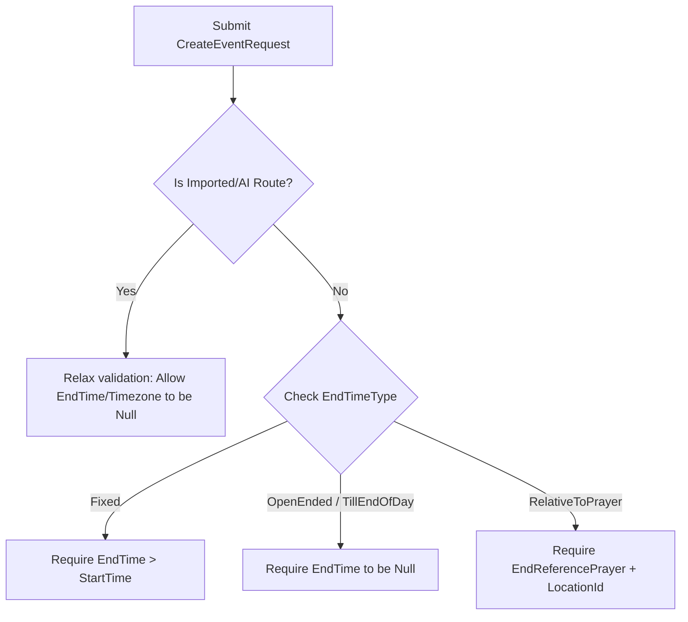

<!-- ABOUTME: I-VSD consultancy report on flexible and contextual event end times for ISLAMU Event. -->
<!-- ABOUTME: Focuses on prayer-relative scheduling, reducing gharar, facilitating worship, and API validation differences for AI imports. -->

# I-VSD Consultancy Report: Flexible and Contextual Event End Times

Last Updated: 2026-07-01

## Scope

This report reviews the design and implementation strategy for flexible, contextual, and relative event end times within the ISLAMU Event platform. Specifically, it covers:
- The representation of non-strict end times at the database, domain, and API layers.
- The definition of user-facing end-time options (e.g., "Till the end of the day", "Leave whenever you want", "Until the next prayer").
- The relaxation of end-time validations for AI-imported events (e.g., poster scans) compared to normal creation paths.
- The alignment of these scheduling options with Islamic Value Sensitive Design (I-VSD) principles.

**Exclusions**: This report does not cover the visual design of the calendar components, details of AI parsing prompts, or external integrations with third-party calendar providers.

## Claim Boundary

This report represents I-VSD design reasoning and traceability. It is not a fatwa, Sharia certification, product certification, or empirical proof of moral or ethical outcomes. Religious-legal questions concerning worship schedules or community obligations should be referred to qualified scholarly authority.

## Findings

| # | Finding | Principle | Domain | Severity |
|---|---|---|---|---|
| 1 | **Forced Artificial End Times Violate Truthfulness**: Forcing event creators to input a precise end time (e.g. 15:00) when the event is open-ended or contextual creates false expectations for attendees. | Truthfulness (`Sidq`), Trust (`Amanah`) | Design, UX | Medium |
| 2 | **Contextual Scheduling Reduces Gharar (Uncertainty)**: Community members schedule their lives and family obligations around the five daily prayers. Expressing event endings relative to prayers (e.g., "Ends before Asr") reduces ambiguity for attendees compared to a static timezone hour. | Non-Harm (`Lā Darar`), Trust | Design, Strategic | High |
| 3 | **AI Import Frictions Impede Community Utility**: AI-parsed events from posters rarely include explicit end times. Strict validation of end times for imported drafts blocks automation, creating hardship (`'Usr`) for organizers. | Ease (`Taysir`), Excellence (`Ihsan`) | Operational, Technical | High |
| 4 | **Database Constraints Already Permit Nullable End Times**: The persistence layer check constraint `CK_EventSession_EndAfterStart` allows `end_time` to be `NULL`, but the application-layer `ReprojectLocalTimes` method clears local start projections if the end time is omitted, treating the session as entirely unscheduled. | Excellence (`Ihsan`) | Technical | High |
| 5 | **UI Affordances Must Genuinely Gate Action Availability**: In accordance with HAL-driven client principles, if a session has an open-ended schedule, registration limits or check-in affordances must adapt dynamically rather than assuming fixed session lengths. | Justice (`'Adl`), Trust | Technical, UX | Medium |

---

## Technical Recommendations

### 1. Unified Domain Model for End Time Types

To support flexible endings, we should introduce a `SessionEndTimeType` enum and update the domain model.

#### A. Define the End Time Types
Add `SessionEndTimeType` to the domain (`Explore.Domain/Enums/SessionEndTimeType.cs` or nested within `EventSession.cs`):
```csharp
public enum SessionEndTimeType
{
    Fixed = 0,               // Specific date/time. Requires EndTime.
    OpenEnded = 1,           // "Open end", "Leave whenever you want". EndTime is null.
    TillEndOfDay = 2,        // "Till the end of the day". EndTime is null or set to 23:59:59.
    RelativeToPrayer = 3,    // Islamic specific: contextual relative to next prayer.
    ContextualBeforeNext = 4 // Ends automatically when the next session starts.
}
```

#### B. Update `EventSession`
- Expose `EndTimeType` (stored as `int` in the database).
- Refactor `ReprojectLocalTimes` to allow `EndTime` to be null while still projecting start times:
```csharp
public void ReprojectLocalTimes(string timezoneId, IEventScheduleProjectionCalculator calculator)
{
    ArgumentNullException.ThrowIfNull(calculator);

    if (StartTime is null)
    {
        LocalStartDate = null;
        LocalEndDate = null;
        LocalStartTime = null;
        LocalEndTime = null;
        LocalStartMinuteOfDay = null;
        LocalEndMinuteOfDay = null;
        return;
    }

    var timezone = ScheduleTimeZoneResolver.ResolveOrUtc(timezoneId);
    var localStart = TimeZoneInfo.ConvertTime(StartTime.Value, timezone);
    LocalStartDate = DateOnly.FromDateTime(localStart.DateTime);
    LocalStartTime = TimeOnly.FromDateTime(localStart.DateTime);
    LocalStartMinuteOfDay = (LocalStartTime.Value.Hour * 60) + LocalStartTime.Value.Minute;

    if (EndTime is not null)
    {
        var localEnd = TimeZoneInfo.ConvertTime(EndTime.Value, timezone);
        LocalEndDate = DateOnly.FromDateTime(localEnd.DateTime);
        LocalEndTime = TimeOnly.FromDateTime(localEnd.DateTime);
        LocalEndMinuteOfDay = (LocalEndTime.Value.Hour * 60) + LocalEndTime.Value.Minute;
    }
    else
    {
        LocalEndDate = null;
        LocalEndTime = null;
        LocalEndMinuteOfDay = null;
    }
}
```

#### C. Extend `EventSessionIslamicAspect`
To support prayer-relative end times, add end-prayer fields to `EventSessionIslamicAspect`:
```csharp
public PrayerTime? EndReferencePrayer { get; set; }
public int? EndOffsetMinutes { get; set; }
```
- At runtime, if `EndTimeType == RelativeToPrayer`, the system resolves the actual UTC time of the `EndReferencePrayer` for the session's location/date, applies the `EndOffsetMinutes`, and writes the computed value to `EventSession.EndTime`. This maintains UTC as the single source of truth for scheduling and exclusion constraints while keeping the relative definition persistent.

---

### 2. Client / API Interface Options

The API and Web client should expose clear, professional options:

| Option Key | Web Label | Description | API Fields |
|---|---|---|---|
| `Fixed` | **Specific Time** | Creator specifies starting and ending hours. | `EndTime` has value, `EndTimeType = Fixed` |
| `OpenEnded` | **Open-Ended / Flexible** | "Leave whenever you want", "No strict end". | `EndTime = null`, `EndTimeType = OpenEnded` |
| `TillEndOfDay` | **Until the end of the day** | Event goes until late evening. | `EndTime = null`, `EndTimeType = TillEndOfDay` |
| `RelativeToPrayer` | **Until [Prayer] prayer** | Contextual ending based on congregation times. | `EndTime` computed, `EndReferencePrayer` has value |

#### Computed Text Fields for Client DTOs
To prevent clients from performing timezone-shifted prayer calculations, the API read models should return a pre-formatted string:
- `dto.FormattedEndTime` (e.g., `"16:30"`, `"Open-ended"`, `"Until Asr prayer"`, or `"Until the end of the day"`).

---

### 3. Context-Aware Validation Strategy

Validation should be conditioned based on the creation mode:



#### Validation Rules Matrix

| Field | AI Import / Poster Parse Route | Normal Web UI / Direct API Route |
|---|---|---|
| `EndTime` | Optional (`null` allowed). | Required only if `EndTimeType` is `Fixed`. |
| `EndTimeType` | Optional. Defaults to `OpenEnded`. | Required. Defaults to `Fixed`. |
| `Timezone` | Optional. Defaults to Tenant's default timezone if missing. | Required. Must be a valid system timezone. |
| `EndReferencePrayer` | Optional. | Required if `EndTimeType` is `RelativeToPrayer`. |
| `LocationId` | Optional (can be draft/unanchored). | Required if `EndTimeType` is `RelativeToPrayer` (for prayer lookup). |

#### FluentValidation Sample Configuration:
```csharp
RuleFor(s => s.EndTime)
    .NotEmpty().WithMessage("End time is required when EndTimeType is Fixed.")
    .GreaterThan(s => s.StartTime).WithMessage("End time must be after start time.")
    .When(s => s.EndTimeType == SessionEndTimeType.Fixed && !request.IsImported);

RuleFor(s => s.EndTime)
    .Null().WithMessage("End time must be empty for open-ended or relative end times.")
    .When(s => s.EndTimeType != SessionEndTimeType.Fixed);
```

---

## Value-Sensitive Design Analysis (I-VSD)

### 1. Truthfulness (`Sidq`) vs. Forced Constraints
Forcing users to supply a fixed end time when one does not exist (e.g., an open-ended study circle) forces them to make a guess. This violates **Truthfulness** by publishing speculative data to attendees. Allowing `OpenEnded` or prayer-relative options reflects the true state of the event, fostering **Trust (`Amanah`)** between organizers and the community.

### 2. Eliminating Gharar (Uncertainty)
While flexibility is valuable, total lack of clarity can cause hardship (`'Usr`). For example, a traveler needs to know if an event will conclude before sunset to arrange transport. 
* **Design Guideline**: If an event has `EndTimeType = OpenEnded`, the system should encourage organizers to provide an "estimated duration" or a description note (e.g., "discussion expected to last around 2 hours, but attendees may stay longer") to manage expectations while keeping the schedule flexible.

### 3. Facilitating Communal Worship
In Islamic communities, events are highly integrated with daily prayers.
* **Relative Endings**: An event ending "Until Asr prayer" ensures that attendees and speakers are naturally released to participate in the congregational prayer without conflict.
* **Safety Buffer**: The system should allow a configurable buffer (e.g., ending 10 minutes *before* the prayer starts) to give attendees time to perform wudu and join the congregation.

---

## Evidence and Context Inventory

### Evidence Reviewed
1. `Explore.Domain/EventSession.cs` — scheduling fields and local timezone projection.
2. `Explore.Domain/EventSessionIslamicAspect.cs` — start-time scheduling types and validation.
3. `Explore.Persistence/Configurations/Entities/EventSessionConfiguration.cs` — database constraints.
4. `Explore.Application/DTOs/Event/Validators/CreateEventRequestValidator.cs` — command validation rules.
5. `docs/DOMAIN.md` — lifecycle, scheduling source of truth.

### Missing Evidence
- Prayer calculation engine signature (how current prayer times are resolved based on `LocationId` and `LocalDate`).

### Context Inventory
- Standard tenant default timezone setting structure.
- Client-side DTO contracts in Blazor application.
