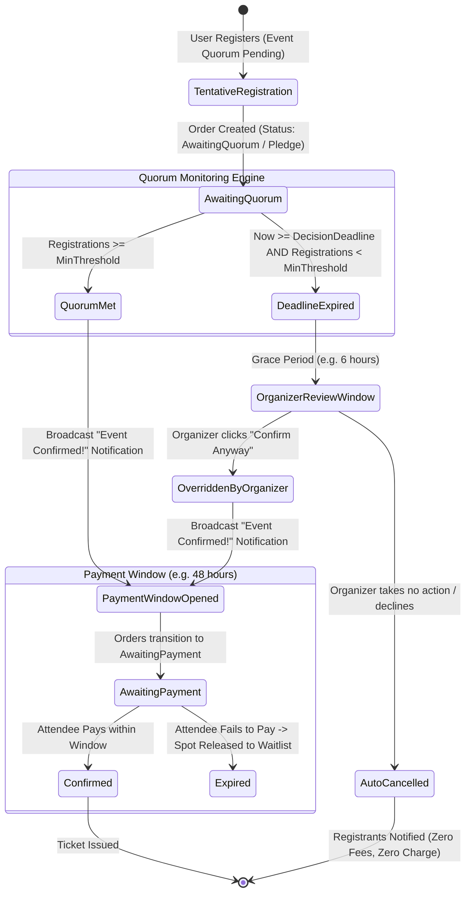

<!-- ABOUTME: I-VSD consultancy report on Event and EventSession minimum attendee thresholds (quorum). -->
<!-- ABOUTME: Evaluates cancellation mitigation, trust preservation, conditional contracts, and paid ticketing mechanics (Pledge vs Pre-auth vs Auto-refund). -->

# I-VSD Consultancy Report: Event and EventSession Minimum Attendee Thresholds (Quorum) and Conditional Ticketing

Last Updated: 2026-09-02

## Review Metadata

- Mode: standalone
- Subject: event and eventsession minimum attendee threshold (quorum), cancellation prevention, and conditional ticketing
- Workstream: none
- Report kind: consultancy-report
- Report status: current
- Disposition: advisory
- Evidence cutoff: 2026-09-02
- Reviewed input revision: SHA-256 repo audit `e87a2df81c8c11bf9b05c56b541334c919d7d2424843bcfc6b553be0378877e8`; clean-room web evidence `2026-09-02`
- Supersedes: none

---

## Scope

This report evaluates how the ISLAMU Event platform should natively support **minimum attendee counts** (quorum thresholds) for both **Events** and individual **EventSessions**, with special emphasis on:

1. **Attendee Experience and Trust Preservation**: Eliminating the industry-wide "ugly cancellation" failure mode where attendees prepare, book travel/childcare, and anticipate an event only to suffer last-minute, unstandardized cancellation due to low turnout.
2. **Organizer Viability and Communication**: Giving organizers an honest, automated mechanism to define viability thresholds without suffering embarrassment, reputational damage, or manual messaging chaos.
3. **Event vs. EventSession Granularity**: Supporting thresholds at both the whole-event aggregate level and the individual breakout/workshop/session level.
4. **Paid Event Ticketing Architecture**: Extensively analyzing payment mechanics when an event is contingent on reaching a minimum attendee threshold:
   - Immediate payment with automated refunds.
   - Credit card pre-authorizations / manual capture holds (`capture_method: manual`).
   - Saved payment methods via `SetupIntent` (merchant-initiated off-session charge upon quorum).
   - Two-Stage Pledge and Payment Window model (`Wa'd` reservation with deferred payment trigger).
5. **Islamic Commercial Jurisprudence (Fiqh) & Values**: Evaluating conditional sales (`al-Bay' al-Mu'allaq`), unilateral binding promises (`al-Wa'd al-Mulzim`), avoidance of excessive uncertainty (`Gharar`), prevention of mutual harm (`Lā Darar wa-Lā Dirār`), and fulfilling trusts (`Amanah`).

---

## Claim Boundary

This report provides Islamic Value-Sensitive Design (I-VSD) reasoning, systems architecture, game-theoretic analysis, and product heuristics. It is **not** a fatwa, religious-legal certification, Sharia board verdict, legal counsel, or financial guarantee regarding payment processors.

Determinations regarding the binding nature of conditional commercial promises (`al-Wa'd al-Mulzim`) or earnest money (`Bay' al-Urbun`) in specific local jurisdictions must be referred to qualified Sunni scholarly authority. Payment processor terms, card brand rules (Visa/Mastercard), and regulatory frameworks (e.g., EU PSD2 / SCA) must be confirmed at implementation time.

---

## Findings

| # | Finding ID | Finding Summary | I-VSD Principle | Domain | Severity |
|---|---|---|---|---|---|
| 1 | `IVSD-F001` | **Unstructured Last-Minute Cancellation Destroys Community Trust (`Amanah`)**: Hiding viability thresholds in prose or omitting them entirely forces last-minute cancellations that disrespect attendee time, travel, and personal arrangements. | Trust (`Amanah`), Truthfulness (`Sidq`) | Design, Strategic | Critical |
| 2 | `IVSD-F002` | **Mainstream Platforms Suffer From Structural Threshold Omission**: Industry leaders (Eventbrite, Meetup, Luma, Peatix) have zero native automated minimum-attendee triggers, forcing organizers into manual tracking, unstandardized cancellation emails, and financial friction. | Non-Harm (`Lā Darar`), Excellence (`Ihsan`) | Strategic, Operational | High |
| 3 | `IVSD-F003` | **Upfront Card Capture on Unconfirmed Events Imposes Processing Fee Bleed and Financial `Gharar`**: Charging cards immediately for an event that has a high risk of cancellation causes organizers to lose unrecoverable Stripe processing fees on refunds (~2.9% + 30¢ per ticket), locks attendee liquidity for 5–10 business days, and breeds bank disputes. | Non-Harm (`Lā Darar`), Avoiding `Gharar` | Financial, Technical | Critical |
| 4 | `IVSD-F004` | **Standard Card Pre-Authorizations (Holds) Expire in 7 Days**: Card networks (Visa, Mastercard) and Stripe enforce a strict 7-day authorization window (`capture_method: manual`). Because event marketing typically requires 2 to 6 weeks, credit card holds are technically unviable for general event ticketing. | Truthfulness (`Sidq`), Technical Integrity | Technical | Critical |
| 5 | `IVSD-F005` | **Off-Session Auto-Charging (`SetupIntent`) Triggers Catastrophic Cascading Declines Under SCA / 3DS**: Storing cards to charge automatically when quorum is met triggers high off-session decline rates (15–35%) due to European PSD2 Strong Customer Authentication (3DS) requirements and insufficient funds, destabilizing quorum calculations. | Non-Harm, Reliability | Technical, Financial | High |
| 6 | `IVSD-F006` | **The Two-Stage "Pledge & Payment Window" Model Best Satisfies Islamic Commercial Ethics**: Structuring tentative registration as a moral and contractual promise (`Wa'd`) to purchase upon quorum fulfillment eliminates money-in-limbo, prevents transaction fee waste, and transitions to formal purchase (`'Aqd`) only when delivery is guaranteed. | Avoiding `Gharar`, Promise-Keeping | Legal/Fiqh, Design | High |
| 7 | `IVSD-F007` | **Granularity Mismatch: Event Quorum Does Not Equal Session Quorum**: In multi-session events (conferences, retreats, workshops), a specific session may be canceled due to low quorum while the parent event proceeds. Thresholds must be distinct at the `Event` and `EventSession` levels. | Justice (`'Adl`), Excellence | Domain, Architecture | High |
| 8 | `IVSD-F008` | **Lack of Transparent Quorum Progress Depresses Registration Velocity**: When users do not know how close an event is to being confirmed, they hesitate to register ("bystander hesitation"). Transparent social proof ("8 of 12 registered — 4 spots to go!") accelerates registration. | Truthfulness (`Sidq`), Ease (`Taysir`) | Design, UX | Medium |
| 9 | `IVSD-F009` | **Ambiguous Cancellation Deadlines Harm Attendee Planning**: Cancelling an event 3 hours before start causes severe disruption. Every minimum-threshold event requires an explicit, immutable `QuorumDecisionDeadlineUtc` displayed to users before they register. | Justice (`'Adl`), Non-Harm | Operational, UX | Critical |
| 10 | `IVSD-F010` | **Organizer Discretion Override Must Be Explicit and Bounded**: An organizer may choose to run an event even if it reaches 9 out of 10 attendees. The system must allow an explicit "Confirm Anyway" manual override, but prohibit extending the deadline indefinitely without registrant consent. | Trust (`Amanah`), Agency | Governance, Domain | High |

---

## Detailed Analysis & Industry Comparison

### 1. The Industry Failure Mode (The "Ugly Way")

In the status quo across platforms like Eventbrite, Meetup, and Luma:
1. **The Organizer's Dilemma**: An organizer plans an interactive workshop or group hike that requires at least 8 people. If only 3 sign up, the activity cannot function, and the organizer loses money or wastes hours.
2. **Informal Disclaimers**: The organizer types a disclaimer in the markdown description: *"Note: We need at least 8 people or we will cancel."*
3. **The Attendee's Hesitation**: Potential attendees read this, feel uncertain whether the event will actually occur, and defer registering until "later." Because everyone waits, nobody registers.
4. **The Last-Minute Crash**: 24 hours before the event, the organizer sees only 3 people, panics, manually clicks "Cancel Event," and drafts an apologetic, awkward email.
5. **The Damage**:
   - The 3 attendees who registered committed their calendars, declined other invitations, arranged transportation, or hired babysitters. They feel deceived and frustrated.
   - For paid events, attendees' money is debited. They are told refunds will take 5 to 10 business days to return to their bank.
   - The organizer feels defeated and embarrassed.
   - Trust in both the organizer and the host platform is permanently eroded.

### 2. Comprehensive Comparison of Payment Models for Paid Events

| Dimension | Model 1: Immediate Charge + Auto-Refund | Model 2: Card Auth Hold (`manual capture`) | Model 3: Saved Card (`SetupIntent`) Off-Session | Model 4: Two-Stage Pledge & Payment Window (**Recommended**) |
|---|---|---|---|---|
| **How It Works** | Attendee pays immediately. If quorum fails at deadline, system auto-refunds. | Card is authorized (funds held). Captured if quorum reached; released if not. | Card is tokenized without charge. When quorum is reached, server auto-charges. | Attendee pledges/reserves without paying. When quorum is reached, a 48h payment window opens. |
| **Financial Risk to Organizer** | **High**: Payment processors (Stripe) do **NOT** refund transaction fees (2.9% + 30¢). Organizer pays out of pocket for canceled events. | **Zero**: Uncaptured authorizations are voided without processor fees. | **Zero**: No fee charged until capture occurs. | **Zero**: No fee charged until attendee affirmatively pays for a confirmed event. |
| **Time Horizon Feasibility** | Unconstrained. | **Fails**: Hard 7-day expiration on card holds by Visa/Mastercard/Stripe. | Unconstrained. | Unconstrained (can register weeks in advance). |
| **EU PSD2 / SCA (3DS) Compliance** | Fully compliant (attendee is on-session during checkout). | Fully compliant if captured within 7 days. | **High Failure Risk**: Off-session charges frequently trigger `authentication_required` (bank blocks payment without 3DS OTP). | **Fully Compliant**: Attendee completes payment on-session when the event confirms. |
| **Quorum Stability** | High (money is already collected). | Moderate (hold may expire if deadline slips). | **Unstable**: If 3 of 10 off-session charges decline, quorum collapses immediately after confirmation! | **High Stability**: Pledges gauge true demand; once confirmed, spots are held during the payment window. |
| **Attendee Cash Flow / Liquidity** | **Poor**: Money leaves attendee account immediately; refunds take 5–10 business days. | **Fair**: Reduces available credit limit; shows as pending charge. | **Good**: No money leaves account until quorum is reached. | **Excellent**: No money or hold until event is confirmed to happen. |
| **Islamic Fiqh Alignment** | **Concern**: Resembles sale under uncertainty (`Gharar`), asset encumbrance on conditional service. | **Mixed**: Card hold is a contemporary form of security, but time-limited. | **Mixed**: Authorization to debit upon condition, but prone to banking dispute. | **Optimal**: Aligned with `al-Wa'd al-Mulzim` (binding promise) followed by actual `'Aqd` (contract) upon delivery assurance. |

---

## Recommendations

### 1. Native Quorum Support at Both Event and EventSession Levels

Introduce native quorum configuration at two precise levels in the domain:

#### A. Event-Level Quorum (Whole Event Viability)
Configured in `EventParticipationConfiguration`:
- `MinimumAttendeeThreshold` (nullable `int`): The minimum number of participants required for the entire event to take place.
- `QuorumDecisionDeadlineUtc` (`DateTimeOffset`): The deterministic instant when the system evaluates whether the threshold was achieved. Recommended default: 48 to 72 hours prior to `FirstSessionStartUtc`.
- `QuorumStatus` (`QuorumStatusEnum`): `NotApplicable`, `Pending`, `Met`, `Failed`, `Overridden`.
- `QuorumPolicy` (`QuorumPolicyEnum`):
  - `PledgeWithPaymentWindow` (Default and recommended for community/grassroots events).
  - `PrePaidWithGuaranteedAutoRefund` (Available only if enabled by Instance Administrator).

#### B. Hierarchical Governance & Model Selection

To prevent unmitigated financial risk while preserving deployment sovereignty:

| Level | Governance Authority | Model Selection Rules |
|---|---|---|
| **Instance Administrator** | Controls platform risk defaults and allowable financial mechanisms. | **Default**: Locks the platform to `TwoStagePledgeOnly`. Other models are disabled. **Opt-in**: May explicitly toggle `AllowImmediatePaymentWithRefund` for the entire instance. |
| **Tenant Administrator** | May restrict policies within the instance envelope, but cannot broaden them. | May disable conditional paid events altogether or restrict events to `TwoStagePledgeOnly` even if the instance allows both. |
| **Organizer / Event Creator** | Chooses the operational policy for their specific event from the unlocked set. | If only `TwoStagePledge` is unlocked, that model is enforced. If `ImmediatePaymentWithAutoRefund` is unlocked by the instance admin, the organizer may select it, **provided** they check an explicit liability acknowledgement: *"I acknowledge that if the event is cancelled due to low attendance, full refunds will be issued to attendees, and my connected merchant account is responsible for all non-refundable payment processor transaction fees."* |

#### C. EventSession-Level Quorum (Session/Breakout Viability)
Configured on `EventSession`:
- `MinAudienceAttendees` (nullable `int`, matching existing `MaxAudienceAttendees`).
- When an individual session has a `MinAudienceAttendees`, that session can have its own `SessionQuorumDeadlineUtc`.
- If the session fails quorum:
  - Only that session is marked `Cancelled` (status `Cancelled`).
  - Registered participants for that specific session receive an automated notification and are given the affordance to select an alternative session or receive a partial refund/credit (if session-specific pricing was charged).
  - The parent `Event` remains active and uninterrupted!

### 2. The Recommended Two-Stage "Pledge & Payment Window" Lifecycle

#### Step-by-Step Workflow:
1. **Pledge Stage (`AwaitingQuorum`)**:
   - The event page displays: *"This event requires at least 10 participants to run. Currently: 7/10 registered. 3 more needed by Thursday at 18:00 UTC."*
   - Attendee clicks "Register (Pledge)".
   - Attendee enters their name and contact info. No credit card is demanded.
   - The attendee checks an explicit commitment box: *"I commit to attending and paying €25 if this event reaches its minimum attendance by the decision deadline."*
   - Order status: `RegistrationOrderStatusEnum.AwaitingQuorum`.
2. **Quorum Trigger (`QuorumMet`)**:
   - When the 10th attendee registers, the event automatically switches to `QuorumMet`!
   - The event status updates publicly: *"Event Confirmed!"*
   - All 10 registrants immediately receive a high-priority email / push notification:
     > *"Alhamdulillah, [Event Title] has reached its minimum participant count and is officially confirmed! Please complete your ticket payment within 48 hours to secure your seat."*
   - Orders transition to `AwaitingPayment` with `PaymentDueAt = Now + 48 hours`.
3. **Payment & Finalization**:
   - The attendee clicks their secure, personalized link to complete on-session checkout via Stripe.
   - Strong Customer Authentication (3DS) succeeds seamlessly because the attendee is on-session.
   - Order transitions to `Confirmed`, generating their ticket QR code.
4. **Subsequent Registrations**:
   - Anyone registering *after* the event is already `QuorumMet` skips the pledge phase and goes straight to immediate checkout (`ReadyForCheckout` -> `AwaitingPayment` -> `Confirmed`), because the event's viability is already guaranteed!
5. **Handling Failure Gracefully**:
   - If the deadline arrives and registrations are 6/10:
     - The organizer receives a prompt: *"Quorum not reached (6/10). Would you like to confirm the event anyway, or allow automated cancellation?"*
     - If the organizer takes no action within 6 hours (or clicks "Cancel"), the background worker executes `CancelFailedQuorumEvent`:
       - Event transitions to `Cancelled`.
       - All registrants receive an automated, compassionate notice: *"Thank you for your interest in [Event Title]. The event did not reach the minimum number of participants required to proceed and has been cancelled. No charge was made to your account."*
       - Attendee trust is preserved because expectations were transparent from day one!

---

## Stakeholders

| Stakeholder | Interests & Needs | Impact of Proposed Quorum Architecture |
|---|---|---|
| **Attendees** | Predictability, planning certainty, protection of personal time, no locked funds. | Protected from unannounced cancellations; zero financial lock-in; clear decision deadline; transparent progress. |
| **Event Organizers** | Viability assurance, avoiding empty rooms, avoiding out-of-pocket Stripe refund fees. | Ability to set hard or soft minimums; no financial loss on unviable events; automated professional communication. |
| **Session Speakers / Instructors** | Meaningful audience engagement; efficient preparation. | Guaranteed critical mass for interactive sessions; early notice if breakout is dropped. |
| **Platform Operators / Tenants** | High user trust, low chargeback/dispute rates, low support overhead. | Drastically reduced support tickets about refunds, chargebacks, or sudden cancellations. |
| **Waitlisted Users** | Fair opportunity to participate if pledged users forfeit their spots. | Orderly release of unconfirmed seats after the 48-hour payment window expires. |

---

## I-VSD Principles And Domains

### Traceability Matrix

| Principle | Domain | Provider-Controlled Decision | System Implementation |
|---|---|---|---|
| **Truthfulness (`Sidq`)** | Design / UX | How event viability status is communicated to potential attendees. | Explicit public display of quorum target, current count, and decision deadline. No pretending an unviable event is confirmed. |
| **Trust (`Amanah`)** | Operational / Strategic | Honoring the attendee's reliance on the schedule and their commitment of personal time. | Enforcing an immutable `QuorumDecisionDeadlineUtc` so attendees have ample notice if an event does not proceed. |
| **Non-Harm (`Lā Darar`)** | Financial / Technical | Protecting both attendee and organizer from financial loss and liquidity traps. | Two-Stage Pledge model avoids charging cards and avoids Stripe's non-refundable processing fees upon cancellation. |
| **Justice (`'Adl`)** | Governance / Domain | Fairness in seat allocation and cancellation decisions. | Transparent state machine with automated execution; bounded organizer override; fair 48h payment window. |
| **Avoiding `Gharar`** | Legal / Fiqh / Commercial | Eliminating excessive ambiguity in conditional contracts. | Clear separation between the initial conditional commitment (`Wa'd`) and the executed sale contract (`'Aqd`). |
| **Excellence (`Ihsan`)** | Technical | High reliability, clear notifications, and automated reconciliation. | Background Quartz worker for deterministic deadline evaluation; graceful email/SMS templates; HAL link affordances. |

---

## Common Overlooked Failures And Outcomes

1. **The "Cascading Dropout" Race Condition**:
   - *Failure*: An event reaches quorum (10/10) and opens the 48h payment window. 4 attendees decide they no longer want to attend and let their payment window expire. Now the event has only 6 paid attendees.
   - *Mitigation*: The system must support an active **Waitlist**. If a pledged spot expires after 48h, it is immediately offered to the next waitlisted user with a fresh 24h payment window. Furthermore, organizers can define an `OvercapacityBuffer` (e.g., target quorum is 10, but up to 15 can pledge).
2. **The "Last-Second Cancellation" Trap**:
   - *Failure*: An organizer sets the decision deadline 2 hours before the event start time. Attendees travel to the venue, only to receive a cancellation email en route.
   - *Mitigation*: Enforce a platform validation invariant: `QuorumDecisionDeadlineUtc <= EventStartUtc - MinimumNoticeWindow` (e.g., at least 24 hours for local events, 72 hours for multi-day/ticketed events).
3. **Session Cancellation Orphan Effects**:
   - *Failure*: A user buys an all-access conference ticket specifically to attend a specialized breakout session. That session fails quorum and is cancelled, but the conference proceeds. The user demands a full ticket refund.
   - *Mitigation*: Clear terms of service: general event admission tickets cover the event as a whole. If a session carries an individual extra charge (add-on), that specific add-on is automatically refunded or credited in full upon session cancellation.
4. **Stripe Connect Destination Charge Fee Trap**:
   - *Failure*: If the platform uses immediate payment and attempts refunds, the organizer's connected Stripe balance goes negative due to processing fees.
   - *Mitigation*: Confirmed by `IVSD-F003`: the Two-Stage Pledge model completely circumvents payment processing for failed quorum events, eliminating negative balance risks.

---

## Recommendations & Rejected Alternatives

### Recommended Strategy
1. **Implement Quorum in `EventParticipationConfiguration`**:
   - Add `MinimumAttendeeThreshold`, `QuorumDecisionDeadlineUtc`, `QuorumPolicyId`, `PaymentWindowHours`, and `QuorumStatusId`.
2. **Implement Quorum in `EventSession`**:
   - Add `MinAudienceAttendees` to enable breakout session thresholds.
3. **Add `AwaitingQuorum` to `RegistrationOrderStatusEnum`**:
   - State `AwaitingQuorum = 14` for provisional registrations during tentative event status.
4. **Background Decision Worker**:
   - An idempotent Quartz/background scheduler worker that evaluates quorum deadlines, sends transition notifications, and opens payment windows.
5. **HAL Affordances**:
   - Front-end clients render action affordances based on HAL links (`_links.pledge`, `_links.pay`, `_links.confirmAnyway`), ensuring business logic stays authoritatively on the server.

### Rejected Alternatives
- **Card Pre-Authorization Holds (`capture_method: manual`)**:
  - *Rejected because*: Hard 7-day card network expiration limit makes it impossible for events published weeks in advance.
- **Off-Session Auto-Debit via `SetupIntent`**:
  - *Rejected because*: European PSD2 / SCA mandates 3DS challenge on cards, causing widespread silent failure and quorum destabilization when charged off-session.
- **Immediate Capture with Manual Refunds**:
  - *Rejected because*: Imposes unrecoverable transaction fee loss on organizers, locks attendee money, and creates high support burden.
- **Prose-Only Minimum Disclaimers**:
  - *Rejected because*: Fails to solve the root problem; leaves communication unstandardized and causes attendee trust destruction.

---

## Validation Gaps

1. **Attendee Drop-off Rate During Payment Window**: Empirical conversion data on what percentage of users who pledge (`AwaitingQuorum`) actually complete payment when the payment window opens (industry crowdfunding estimates suggest 75–85% conversion when notifications are prompt).
2. **Organizer Override UX Testing**: Evaluating whether a 6-hour organizer grace period at the decision deadline provides sufficient time for organizers in different timezones to review and decide.
3. **SMS / WhatsApp Notification Integration**: Evaluating delivery speed and open rates of push/SMS versus email for time-sensitive 24h/48h payment windows.

---

## Escalation Needed

1. **Islamic Commercial Fiqh Authority**:
   - Escalation question: *Under what conditions is a unilateral promise (`Wa'd`) to purchase an event ticket legally and morally binding on the promisor, and does releasing the spot upon non-payment satisfy the requirements of mutual consent and non-harm without imposing an unlawful penalty?*
2. **Payment Gateway Regulatory Counsel**:
   - Confirmation of Stripe Connect terms regarding consumer notification standards for delayed payment capture in the specific target operating jurisdictions.

---

## Evidence Reviewed

- `src/Explore.Domain/Event.cs`: Event aggregate root, lifecycle, and capacity collections.
- `src/Explore.Domain/EventSession.cs`: Session entity containing `MaxAudienceAttendees`, `CurrentAudienceAttendees`, and scheduling projections.
- `src/Explore.Domain/EventParticipationConfiguration.cs`: Participation modes and registration obligations.
- `src/Explore.Domain/EventCapacityPool.cs`: Event-owned capacity resource modeling.
- `src/Explore.Domain/Enums/RegistrationOrderStatusEnum.cs`: Registration order state machine identities.
- `islamic-value-sensitive-design/i-vsd-paid-event-payments-consultation.md`: Predecessor consultation establishing `OrganizerDirect` Stripe Connect defaults and refund fee constraints.
- `islamic-value-sensitive-design/i-vsd-event-ticketing-lifecycle.md`: Ticketing lifecycle, purchase governance, and capacity hold rules.
- Clean-room web research on Eventbrite, Meetup, Luma, Peatix, Stripe SetupIntents, and Islamic crowdfunding contracts (`2026-09-02`).

---

## Missing Evidence

- Production telemetry regarding attendee cancellation complaint rates on self-hosted instances.
- Concrete tenant feedback regarding preferred default notice windows (e.g., 24h vs 48h vs 72h).
- Formal ruling from a recognized Fiqh council specifically addressing digital event pledge-to-purchase tipping points.

---

## Context Inventory

- **Repository/Workspace Docs & Code**: Explored `Event`, `EventSession`, `EventParticipationConfiguration`, `EventCapacityPool`, `RegistrationOrder`, and predecessor I-VSD reports.
- **External Framework & Industry Data**: Web search across event ticketing platforms and Stripe payment gateway APIs.
- **Fiqh & Values Research**: AAOIFI standards and classical jurisprudence on `Wa'd`, `Gharar`, and `Lā Darar`.

---

## Review Lifecycle

| Date | Previous Status | New Status | Trigger | Evidence / Replacement |
|---|---|---|---|---|
| 2026-09-02 | None | `current` | Initial standalone consultation request on minimum attendee thresholds | Web search evidence, codebase architecture audit, and I-VSD report creation |
| 2026-09-02 | `current` | `current` | Standalone alignment on instance admin governance locks | Added instance lock hierarchy table and organizer Stripe fee liability acknowledgment |
