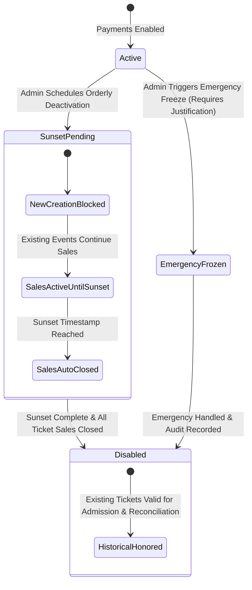
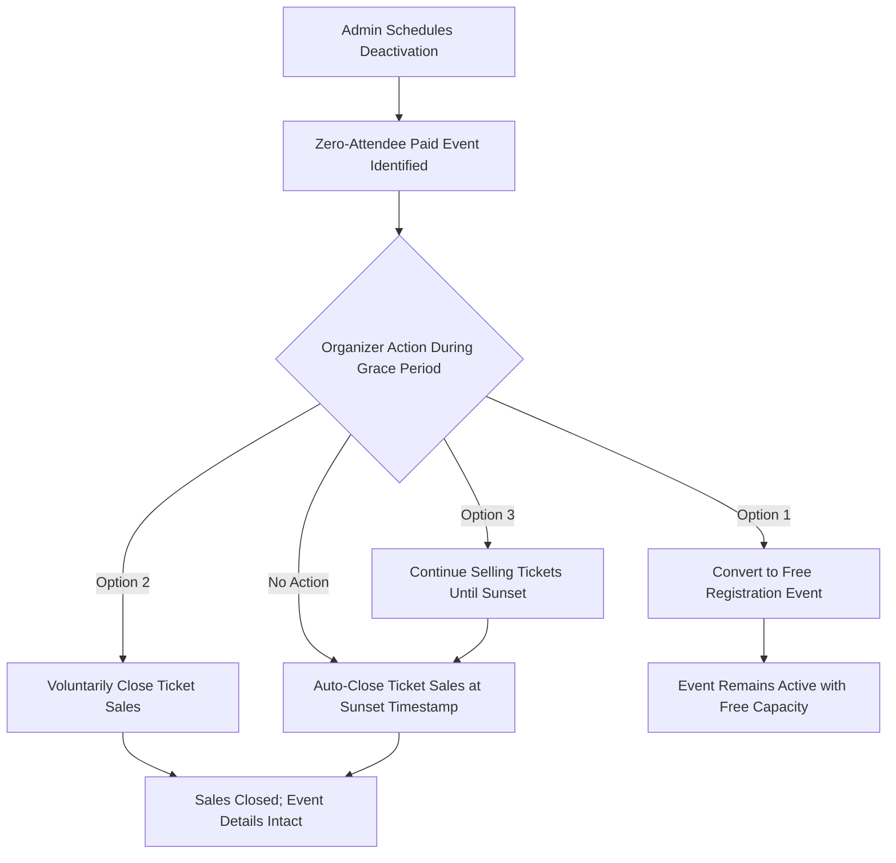

<!-- ABOUTME: I-VSD consultancy report for disabling paid events at instance and tenant administrative scopes. -->
<!-- ABOUTME: Defines provider obligations, contract preservation, sunset grace periods, and layered disclosure architecture. -->

# I-VSD Paid Event Deactivation Lifecycle, Grace Periods, and Governance Consultation

Last Updated: 2026-09-02

## Review Metadata

- Mode: standalone
- Subject: paid event deactivation, sunset grace periods, attendee contract protection, and layered notification governance
- Workstream: none
- Report kind: consultancy-report
- Report status: current
- Disposition: advisory
- Evidence cutoff: 2026-09-02
- Reviewed input revision: Git commit `f49dea0801e89973dc59e97a76c02fb89d1c8a06`
- Supersedes: none

## Scope

This report evaluates provider-controlled design choices and ethical obligations when an instance administrator or tenant administrator disables the paid events feature on the ISLAMU Event platform. It addresses:

1. **Contract Sanctity & Active Ticket Holders**: Provider duties toward upcoming events that already have paid ticket holders.
2. **Upcoming Zero-Attendee Events**: Ethical and operational handling of published paid events with zero paid attendees.
3. **Temporal Policy Modes**: Orderly sunset with configurable grace periods (7, 14, 30 days) versus emergency immediate freeze.
4. **Ticket Sales Horizon**: Sales cutoff at the sunset deadline versus event date grandfathering.
5. **Information Dissemination & Experience**: Layered contextual disclosure across organizer management and public registration, preventing public panic while enforcing mandatory organizer action.
6. **Governance Hierarchy**: Monotonic tightening between instance ceiling and tenant override, preventing administrative overreach.

This consultation provides architectural and moral guidance for future feature implementation. It does not replace existing payment configurations or author immediate code changes.

## Claim Boundary

This report provides Islamic Value-Sensitive Design (I-VSD) reasoning regarding provider responsibilities, stakeholder rights, contract preservation, and system transparency in a self-hostable platform. 

It is **not** a fatwa, formal Sharia certification, legal opinion on commercial contract law, or guarantee of Stripe regulatory compliance. Qualified Sunni scholarly authorities own religious-legal determinations regarding commercial termination periods. Legal counsel and payment operators must confirm consumer-protection compliance (such as EU/Belgian consumer rights regarding event cancellations and refunds).

## Findings

| # | Finding ID | Severity | Principle & Domain | Stakeholder | Provider-Controlled Decision | Mitigation |
|---|---|---|---|---|---|---|
| 1 | `IVSD-F001` | Critical | Sanctity of Contracts (`'Uqud`), Non-Harm (`Lā Darar`); Financial, Governance | Attendees, Organizers | Retroactive disruption of existing paid events with sold tickets | `IVSD-M001` |
| 2 | `IVSD-F002` | High | Avoidance of Uncertainty (`Raf' al-Gharar`), Excellence (`Ihsan`); Operational, UX | Organizers, Tenant Admins | Unilateral instant shutoff vs. predictable sunset grace period | `IVSD-M002` |
| 3 | `IVSD-F003` | Medium | Justice (`'Adl`), Facilitation (`Taysir`); Domain, Product | Organizers | Treatment of published paid events with zero paid attendees | `IVSD-M003` |
| 4 | `IVSD-F004` | High | Truthful Transparency (`Sidq / Bayan`), Dignity (`'Ird`); Communications, UX | Attendees, Organizers, Public | Sitewide alarmist announcement banners vs. targeted layered notices | `IVSD-M004` |
| 5 | `IVSD-F005` | High | Protection of Wealth (`Hifz al-Mal`), Accountability (`Amanah`); Security, Governance | Platform Operators, Organizers | Distinction between standard sunset and emergency fraud/legal kill-switch | `IVSD-M005` |

---

### IVSD-F001 — Unilateral Instant Deactivation Violates Contractual Sanctity (`'Uqud`) and Causes Direct Harm (`Darar`)

- **Lifecycle**: accepted
- **Severity / Claim type**: Critical / provider-responsibility design
- **Principle and domain**: Sanctity of Contracts (`'Uqud`), Trust (`Amanah`), Prevention of Harm (`Lā Darar wa-lā Dirār`); Financial & Governance
- **Stakeholders**: Attendees (ticket buyers), Event Organizers, Tenant Directory Operators
- **Provider-controlled decision**: Whether administrative deactivation cascades retroactively to invalidate published paid events with active attendees, or preserves them through fulfillment.
- **Evidence**: Predecessor report `i-vsd-paid-event-payments-consultation.md` (Finding 11: Organizer is merchant of record; historical payments cannot be rerouted); `docs/PAYMENTS.md` Section 3 (immutable order acceptance snapshot).
- **Validation level**: Repository design and architecture evidence.
- **Problem**: When a buyer purchases a ticket, an agreement (*'Aqd*) is created between attendee and organizer. If an instance or tenant admin toggles `IsPaymentsEnabled = false` and the system cancels or invalidates active events, attendees lose paid admission rights and organizers face venue defaults and financial ruin. This constitutes severe *Darar* (harm) and betrayal of *Amanah*.
- **Mitigation**: `IVSD-M001` (Mandatory Contract Grandfathering).

### IVSD-F002 — Sudden Instant Deactivation Imposes Excessive Uncertainty (`Gharar`) on Organizers

- **Lifecycle**: accepted
- **Severity / Claim type**: High / provider-responsibility design
- **Principle and domain**: Removal of Undue Uncertainty (`Raf' al-Gharar`), Moral Excellence (`Ihsan`); Operational & UX
- **Stakeholders**: Organizers, Event Volunteers, Prospective Attendees
- **Provider-controlled decision**: Offering an immediate shutoff versus a scheduled sunset period with clear notice.
- **Evidence**: User alignment decision A1 (Sales Cutoff at Sunset with 14-day default runway); `docs/DOMAIN.md` (publication preflight checks).
- **Validation level**: User-aligned design specification.
- **Problem**: Organizers invest money in venues, marketing campaigns, speakers, and printing promotional material based on active platform permissions. If deactivation takes effect instantly without warning, marketing links break unexpectedly, checkout fails silently, and trust between organizers and the platform collapses.
- **Mitigation**: `IVSD-M002` (Configurable Sunset Grace Period with Immediate Block on New Creation).

### IVSD-F003 — Published Events with Zero Sales Require Transition Pathways Rather than Arbitrary Deletion

- **Lifecycle**: accepted
- **Severity / Claim type**: Medium / provider-responsibility design
- **Principle and domain**: Justice (`'Adl`), Facilitation (`Taysir`); Domain & Product
- **Stakeholders**: Organizers of newly announced events
- **Provider-controlled decision**: How the system treats published paid events that currently have zero paid attendees at deactivation time.
- **Evidence**: `Explore.Domain/TicketCatalogVersion.cs`; `Explore.Domain/Services/Registration/PaidEventPolicyRules.cs`.
- **Validation level**: Repository domain model analysis.
- **Problem**: If an event has sold zero tickets, no consumer financial contract has crystallized. However, arbitrarily deleting or corrupting the event destroys the organizer's scheduling, venue description, and agenda. Conversely, leaving them indefinitely paid when the tenant forbids paid events violates tenant policy.
- **Mitigation**: `IVSD-M003` (Zero-Sale Event Transition Affordances: Convert to Free vs. Sunset Auto-Close).

### IVSD-F004 — Blanket Public Alarm Banners Cause Unwarranted Reputational Harm and Attendee Panic

- **Lifecycle**: accepted
- **Severity / Claim type**: High / provider-responsibility design
- **Principle and domain**: Transparent Truthfulness (`Sidq / Bayan`), Protection of Reputation (`'Ird`); Communications & UX
- **Stakeholders**: Community Members, Existing Ticket Holders, Organizers, Platform
- **Provider-controlled decision**: Pinned sitewide public announcement bar versus layered contextual notifications.
- **Evidence**: User alignment decision A2 (Layered Disclosure: Internal Organizer Banner + Contextual Ticket Notice); `docs/BLAZOR_DEV_WORKFLOW.md`.
- **Validation level**: User-aligned UX specification.
- **Problem**: Displaying a persistent, red sitewide announcement bar across the tenant home page and event directories announcing "Paid events are being disabled" causes prospective and existing attendees to suspect financial insolvency, fraud, or impending event cancellations. This harms the organizers' community standing without giving attendees actionable information.
- **Mitigation**: `IVSD-M004` (Layered Disclosure Architecture).

### IVSD-F005 — Conflating Standard Policy Changes with Emergency Fraud Freezes Degrades Platform Safety

- **Lifecycle**: accepted
- **Severity / Claim type**: High / provider-responsibility design
- **Principle and domain**: Protection of Property (`Hifz al-Mal`), Accountability (`Amanah`); Security & Operations
- **Stakeholders**: Platform Trust & Safety, Payment Processors, Buyers
- **Provider-controlled decision**: Unifying deactivation into a single toggle versus separating Orderly Sunset from Emergency Circuit Breaker.
- **Evidence**: ADR-024 (external business integrations and risk boundaries); `Explore.Application/Contracts/Payments/`.
- **Validation level**: Threat modeling and operational review.
- **Problem**: If the only way to disable paid events is an orderly 14-day sunset, platform administrators cannot halt active payment fraud, illicit money flows, or court injunctions. Conversely, if the toggle is always instant, administrators routinely cause unnecessary collateral damage during normal policy transitions.
- **Mitigation**: `IVSD-M005` (Dual-Mode Deactivation: Orderly Sunset vs. Fenced Emergency Freeze).

---

## Recommendations

### 1. Dual-Mode Administrative Deactivation Architecture (`IVSD-M002`, `IVSD-M005`)

When an instance administrator or tenant administrator chooses to disable paid events, the system must distinguish between two fundamentally different intents:



#### Mode A: Orderly Sunset (Default Workflow)
- **Use Case**: Strategic decision (e.g., tenant chooses to become a strictly free community; instance simplifies operational footprint).
- **Grace Period Options**: Dropdown offering **14 Days (Recommended Default)**, **30 Days (Extended)**, or **7 Days (Short)**.
- **Immediate Effect upon Scheduling**:
  - `IsPaymentsEnabled` enters `SunsetPending` status.
  - Creating new paid events is **immediately blocked**.
  - Editing existing events to add paid ticket tiers is **immediately blocked**.
- **During Grace Period**:
  - Existing published paid events continue ticket sales normally until the exact `SunsetAt` UTC timestamp.
  - Organizers manage their events with full transparency.
- **At `SunsetAt` Expiry**:
  - All active paid ticket tiers automatically transition to `SalesClosed`.
  - Effective policy transitions to `Disabled`.

#### Mode B: Emergency Circuit-Breaker Freeze (Restricted Exception)
- **Use Case**: Active payment fraud, regulatory sanction, payment provider platform account compromise, or legal court order.
- **Access & Friction**: Requires explicit high-friction confirmation (typing the tenant/instance slug and submitting an operational reason recorded in the immutable audit log).
- **Immediate Effect**:
  - All active checkout sessions and payment attempts are aborted immediately.
  - All ticket sales are halted across the tenancy/instance instantly.
  - Existing issued tickets remain verifiable for door check-in, but refunds and disputes are routed through dedicated administrative reconciliation.

---

### 2. Mandatory Contract Grandfathering (`IVSD-M001`)

The platform must uphold the immutable contract made with attendees who have already purchased tickets:

1. **Admission Continuity**: Attendees who hold valid tickets must remain able to access their tickets, view QR codes, receive reminder emails, and check in at the door via mobile scanner.
2. **Financial Settlement Integrity**: Disabling the policy setting must not disconnect Stripe Connect webhook processing or prevent organizer payout reconciliation and refund processing.
3. **Event Detail Preservation**: The event page remains public (if published) displaying the schedule, venue, and speaker details. The ticket widget displays a calm badge: `Ticket sales closed`.

---

### 3. Lifecycle for Events with Zero Paid Attendees (`IVSD-M003`)

For published paid events where `PaidAttendeeCount == 0` at the time deactivation is initiated:



- **Organizers Retain Agency**: The system should not abruptly unpublish the event without organizer knowledge.
- **One-Click Conversion Affordance**: In the organizer dashboard, provide a dedicated banner with a 1-click action: **"Convert to Free Event"**. This preserves the attendee form, venue, and date, but resets the price to zero and unlocks unlimited or capped free RSVP capacity.
- **Grace Period Sales Allowed**: If the organizer chooses to keep selling tickets, they may do so until `SunsetAt`. Any tickets sold during this window immediately qualify the event for full grandfathering under `IVSD-M001`.
- **Default at Sunset**: If no tickets are sold and the sunset timestamp passes, ticket sales automatically transition to `SalesClosed`.

---

### 4. Layered Disclosure & Notification Architecture (`IVSD-M004`)

To avoid panic and reputational harm, communication must be targeted to the appropriate stakeholder:

#### Layer 1: Tenant Admin & Organizer Management Dashboards (Mandatory Internal Notice)
- **Placement**: Persistent, dismissible-per-session notification bar at the top of the Tenant Admin and Organizer Event Management consoles.
- **Tone & Content**: Professional, unambiguous, actionable:
  > **Policy Notice**: Paid events are scheduled for sunset in this tenancy on **October 15, 2026 at 23:59 UTC** (14 days remaining). 
  > - New paid events cannot be created.
  > - Existing paid events will close ticket sales at the deadline.
  > - Past ticket holders are fully honored.
  > [Review Affected Events] [Convert Zero-Sale Events to Free]
- **Automated Transactional Emails**: Sent immediately upon scheduling deactivation to every organizer account owning an upcoming published paid event, detailing their exact events, ticket sales status, and recommended actions.

#### Layer 2: Public Registration & Checkout Pages (Calm Contextual Notice)
- **Placement**: Directly inside the ticket selection card on the event page.
- **Prohibited**: **No screaming, red, sitewide banners** across the public directory or homepage.
- **Tone & Content**:
  > *Note: Online ticket sales for this event will conclude on October 15, 2026 per organization schedule.*
- **Post-Sunset State**:
  > *Ticket sales for this event have closed.*

---

### 5. Technical Implementation Blueprint & Domain Rules

#### Domain Policy State Evolution
Extend `PaidEventPolicyVersion` (or the accompanying settings document) with:
```csharp
public sealed record PaidEventDeactivationSchedule(
    bool IsDeactivationScheduled,
    DateTimeOffset? ScheduledAt,
    DateTimeOffset? SunsetDeadline,
    DeactivationMode Mode,
    string InitiatedByUserId,
    string Reason
);

public enum DeactivationMode
{
    OrderlySunset = 1,
    EmergencyFreeze = 2
}
```

#### Preflight Validation Rules (`PaidEventPolicyRules`)
1. **Creation Preflight**: `GetPaidEventPublicationPreflight` returns a blocker if `IsPaymentsEnabled == false` OR `IsDeactivationScheduled == true`.
2. **Checkout Initiation Fencing**:
   - `OrderlySunset`: Allowed if `UtcNow < SunsetDeadline`.
   - `EmergencyFreeze`: Rejected immediately with `PaidCommerceDisabled`.
3. **Monotonic Hierarchy**:
   - If an Instance Admin schedules a sunset with a 14-day deadline, a Tenant Admin cannot extend it (cannot set 30 days). A Tenant Admin may only narrow it (e.g., choose an immediate freeze or a shorter 7-day sunset).

---

### Summary of Rejected Alternatives

| Rejected Alternative | Why Rejected |
|---|---|
| **Immediate Arbitrary Cutoff as Only Mode** | Inflicts severe *Darar* (harm) on organizers mid-campaign, breaks consumer trust, and abruptly terminates legitimate community initiatives without notice. |
| **Indefinite Event-Date Grandfathering (Allowing ticket sales months into the future)** | Binds the tenant and platform to ongoing financial compliance, merchant risk, and Stripe integration maintenance indefinitely, defeating the administrative decision to exit paid events. |
| **Global Red Sitewide Public Warning Banner** | Induces unnecessary attendee panic, implies organizational insolvency or security breach, and damages organizer community standing (*'Ird*). |
| **Silent Background Deactivation (No Warnings)** | Deceptive (*Gharar*); leaves organizers to discover broken checkout links from frustrated attendees. |
| **Retroactive Cancellation of Sold Tickets** | Direct breach of contract (*'Uqud*) and abuse of provider authority; converts the platform into an agent of harm. |

---

## Stakeholders

| Stakeholder | Moral Stakes & Ethical Expectations | Protection Mechanism |
|---|---|---|
| **Ticket Buyers / Attendees** | Expect valid admission, safe venue entry, and financial honesty. Must not have paid tickets cancelled arbitrarily. | Grandfathered QR check-in, preserved receipts, continuous refund pathways. |
| **Event Organizers** | Rely on platform commitments; invest time, money, and reputation in event planning. Entitled to fair notice and clear choices. | 14-day default sunset grace period, automated zero-attendee conversion tools, transparent dashboard banners. |
| **Tenant Administrators** | Entitled to govern their tenancy's commercial policy without being held hostage to indefinite commerce. | Scheduled sunset deadline that automatically terminates all ticket sales at a fixed horizon. |
| **Instance Administrators** | Responsible for overarching platform legality, Stripe Connect standing, and ecosystem safety. | Monotonic hierarchy ceiling and emergency circuit-breaker capability for fraud containment. |

---

## I-VSD Principles and Domains

| Principle | Meaning in this Context | Applied Domain |
|---|---|---|
| **Sanctity of Contracts (`'Uqud` / `'Ahd`)** | Agreements entered into between attendees and organizers are sacred obligations. A platform administrator has no moral authority to retroactively void them. | Financial, Domain Architecture |
| **Trust & Custodianship (`Amanah`)** | The platform holds data, admission credentials, and payment routing in trust. Deactivation must not leak, orphan, or destroy this trust. | Governance, Security |
| **Harm Prevention (`Lā Darar wa-lā Dirār`)** | Administrative policy changes must not cause foreseeable harm to organizers or attendees. When changes are necessary, grace periods mitigate injury. | Operations, Strategy |
| **Removal of Excessive Uncertainty (`Gharar`)** | Abrupt cutoffs and ambiguous end dates create confusion. Fixed sunset timestamps provide absolute certainty. | Domain, Technical |
| **Truthfulness & Clarification (`Sidq / Bayan`)** | Proactive, calm, targeted disclosure keeps all parties informed without sensationalism or alarmism. | UX, Communications |
| **Justice & Proportionality (`'Adl`)** | Distinguishing between acute fraud (requiring immediate freeze) and ordinary policy shifts (requiring sunset runway). | Governance, Operations |

---

## Common Overlooked Failures And Outcomes

1. **The "Orphaned Checkout Session" Race Condition**:
   - *Failure*: An attendee begins a Stripe checkout session at 23:58 UTC when sunset is 23:59 UTC, and completes payment at 00:02 UTC.
   - *Safe Outcome*: Checkout sessions created *before* the sunset deadline must be granted a standard holding expiration (e.g., 15 minutes) to complete or fail. The webhook handler must accept valid sessions initiated before the deadline.
2. **The "Frozen Refund" Trap**:
   - *Failure*: A tenant disables paid events, and when an organizer later needs to refund an attendee for an event cancelled due to illness, the API returns `403 Forbidden: Payments Disabled`.
   - *Safe Outcome*: Administrative deactivation disables *payment collection* (`ChargeCreation`), but **never** disables *refund processing* (`RefundIssuance`) or reconciliation webhooks.
3. **The "Directory Panic" Effect**:
   - *Failure*: A tenant puts a global banner across its portal: "Warning: We are turning off paid events." Attendees assume the upcoming conference is cancelled and flood the organizer with refund demands.
   - *Safe Outcome*: Restricting banners to organizer management screens and keeping public disclosures localized to ticket selection prevents panic.

---

## Validation Gaps

1. **Organizer Behavioral Testing**: User research is needed to determine whether organizers prefer 14 days or 30 days as the default sunset window for high-volume community events.
2. **Stripe Connect Webhook Resilience**: Verify that disabling tenant payment policies in the local database does not interfere with Stripe event dispatching in the background worker.

## Escalation Needed

- **Religious-Legal Boundary**: Whether specific cancellation notice periods (e.g., 14 days vs 30 days) satisfy customary commercial fairness (*'Urf*) in Muslim community organizations is a question for qualified scholarly review.
- **Consumer Protection Law**: Legal counsel must review statutory notice requirements for event ticketing in target jurisdictions (e.g., Belgian Economic Law Code regarding event cancellation and consumer disclosures).

---

## Evidence Reviewed

- Repository Documentation: [`docs/PAYMENTS.md`](file:///home/amir/ISLAMU/Github/Event/docs/PAYMENTS.md), [`docs/DOMAIN.md`](file:///home/amir/ISLAMU/Github/Event/docs/DOMAIN.md), [`docs/AUTHORIZATION.md`](file:///home/amir/ISLAMU/Github/Event/docs/AUTHORIZATION.md).
- Predecessor Consultations:
  - [`islamic-value-sensitive-design/i-vsd-paid-event-payments-consultation.md`](file:///home/amir/ISLAMU/Github/Event/islamic-value-sensitive-design/i-vsd-paid-event-payments-consultation.md)
  - [`islamic-value-sensitive-design/i-vsd-event-ticketing-lifecycle.md`](file:///home/amir/ISLAMU/Github/Event/islamic-value-sensitive-design/i-vsd-event-ticketing-lifecycle.md)
- Codebase Foundations:
  - `src/Explore.Domain/Services/Registration/PaidEventPolicyRules.cs`
  - `src/Explore.Domain/PaidEventPolicyVersion.cs`
  - `src/Explore.Application/Features/PaidEventPolicies/PaidEventPolicyMutationBoundary.cs`

## Missing Evidence

- Production telemetry on average lead time between event publication and first ticket sale.
- Direct organizer feedback on notice preferences during organizational transitions.

## Context Inventory

- Repository files: Clean Architecture domain entities, payment policies, application services, and documentation.
- Project-context tools: Code review graph and repository search.
- User decisions: Interactive alignment on Sales Cutoff at Sunset (A1) and Layered Disclosure (A2).

---

## Review Lifecycle

| Date | Previous Status | New Status | Trigger | Evidence / Replacement |
|---|---|---|---|---|
| 2026-09-02 | none | current | Initial standalone consultation | Git commit `f49dea0801e89973dc59e97a76c02fb89d1c8a06`, user alignment decisions A1 & A2 |
