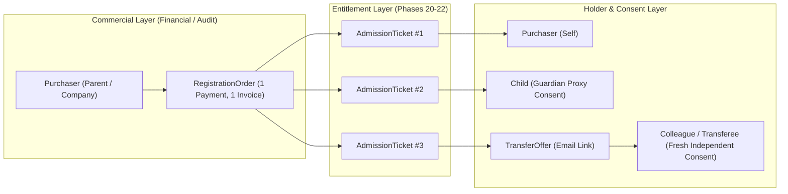
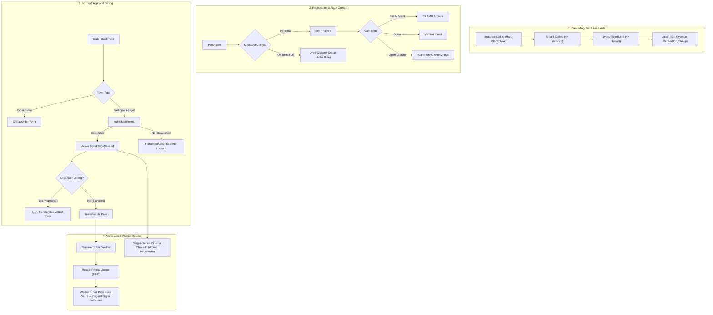

<!-- ABOUTME: I-VSD authority report for registration commerce and admission phases 18C through 25. -->
<!-- ABOUTME: Traces provider-controlled risks, mitigations, evidence gaps, and escalation boundaries. -->

# I-VSD Registration Data Collection, Commerce, And Admission Review

Last Updated: 2026-08-26

## Claim Boundary

This is Islamic Value-Sensitive Design reasoning about provider responsibility in a self-hostable event platform. It is a planning and traceability artifact, not proof that the planned behavior is implemented or effective.

It is **not** a fatwa, Sharia certification, halal/haram ruling, legal opinion, payment-services approval, privacy certification, security certification, or accessibility certification. Religious-legal conclusions about payment structures, fees, reserves, delayed payout, resale ethics, or other finance questions require qualified Islamic scholarly review. Legal, consumer protection, provider-contract, security, privacy, accessibility, and operational conclusions require their own accountable reviewers and evidence.

---

## Architectural & Governance Overview

The platform separates the **Commercial / Billing Aggregate** (`RegistrationOrder`) from the **Entitlement / Admission Aggregate** (`AdmissionTicket`) and the **Participant / Identity Layer** (`RegistrationParticipant`).

### Complete Registration, Governance, Gating, & Resale Lifecycle

---

## Detailed Context & Design Analysis

### 1. Why Tickets Are Sold or Transferred Instead of Refunded

In real-world event operations, direct refunds and secondary transfers/sales exist because they serve fundamentally different operational scenarios:

| Scenario | Why a Direct Refund Is Inapplicable | Why Secondary Transfer / Resale Occurs |
|---|---|---|
| **Refund Cutoff Passed** | The organizer closed refunds (e.g., 24 hours or 7 days prior) because catering, seating, and fixed venue costs are locked. | An attendee with a last-minute emergency or illness seeks to transfer or sell the ticket to recoup costs. |
| **Non-Refundable Tiers** | The ticket was sold as a non-refundable tier (e.g., discounted Early Bird or sponsored pass). | The buyer seeks to recover their outlay or gift the ticket to someone else. |
| **Sold-Out Event & Scalping** | The event is at full capacity and market demand exceeds supply. | Speculators buy face-value tickets to resell them at inflated prices (touting/scalping) to desperate buyers. |
| **Group / Corporate Purchasing** | A parent or company purchased multiple tickets in bulk. | The tickets were never intended for the buyer alone—they were purchased for children, colleagues, or delegates. |
| **Refund Administrative Fees** | The organizer deducts a processing/cancellation fee. | The buyer prefers a 100% face-value transfer to an acquaintance. |

---

### 2. Legal & Regulatory Framework for European Events

#### EU Consumer Rights Directive (Directive 2011/83/EU, Article 16(l))
* Under standard EU consumer law, distance purchases carry a mandatory 14-day statutory right of withdrawal (cooling-off period).
* **Statutory Leisure Exemption (Article 16(l)):** The 14-day right of withdrawal **does NOT apply** to distance contracts for *"the provision of services related to leisure activities if the contract provides for a specific date or period of performance."*
* **Implication for Organizers:** Organizers are legally permitted to define their own refund policies (e.g., strictly non-refundable, refundable up to 7 days before, or refundable up to 24 hours before).
* **Statutory Pre-Contractual Disclosure (`Aqd` / `Bayan`):** Under Directives 2011/83/EU and 93/13/EEC, the refund policy, cutoff deadline, fees, and organizer identity must be clearly, prominently, and unambiguously displayed before the buyer clicks the final pay button. The order must pin an immutable pre-payment terms snapshot.
* **Organizer Cancellation / Breach:** If the organizer cancels, postpones, or materially alters the event, the consumer is legally entitled to a full statutory refund regardless of any "no refund" policy.

#### European Anti-Scalping & Resale Regulations
* **France (Penal Code Art. 313-6-2):** Strictly prohibits habitual unauthorized resale of event tickets at a price higher than face value under criminal penalty.
* **Belgium (Law of 30 July 2013):** Strictly bans commercial ticket resale at a profit; only occasional private resale at face value is lawful.
* **UK (Consumer Rights Act 2015, Chapter 5):** Requires secondary ticketing platforms to disclose face value, seat numbers, and organizer restrictions, and prohibits bot-based ticket hoarding.
* **EU Digital Services Act (DSA):** Mandates trader traceability, notice-and-action mechanisms, and transparency on platforms facilitating secondary transactions.

---

### 3. Core Architectural Mechanisms

#### A. Single-Device Multi-Ticket Group Admission ("Cinema Flow")
* **Problem:** Forcing individual accounts or email transfers onto young children, elderly family members, or casual companions creates severe operational friction.
* **Solution:** A purchaser who buys multiple tickets can retain all valid tickets under their single account.
* **Door Execution:** At the venue door, the purchaser presents their smartphone. The scanner reads the credential and allows **sequential consumption**: each admitted person decrements the remaining active ticket count by 1 (e.g., *"Admitted 1 of 5 — 4 tickets remaining"*). Each scan emits an append-only admission fact for that specific ticket slot.

#### B. Cascading Purchase Limits & Actor Authority
* **Monotonic Constraint:** $\text{Event Limit} \le \text{Tenant Limit} \le \text{Instance Ceiling}$
  1. **Instance Ceiling (Global Maximum):** Absolute ceiling set by system operators (e.g., max 20 tickets per order).
  2. **Tenant Ceiling:** Can only be equal to or stricter than the instance ceiling.
  3. **Event / Ticket Type Policy:** Can only be equal to or stricter than the tenant ceiling.
* **Actor / Organization Delegation:** Organizers can enforce strict per-person limits for the general public (e.g., max 2 tickets) while allowing higher bulk allocations for verified Organization Accounts (`Actor` entities) or Groups. A user holding the `EventPurchaser` or `OrganizationAdmin` role selects their purchasing context via a dropdown during checkout (*"Register as Myself"* vs *"Register on behalf of [Organization]"*).

#### C. Registration Authentication Modes
* **Authenticated Account Required:** Mandatory ISLAMU Event login (best for members, internal retreats, accredited courses).
* **Verified Email (Guest Checkout):** Magic link / email token verification without a permanent account.
* **Name-Only / Anonymous Visitor (*Anti-Tajassus*):** Zero email or account required; generates a lightweight bearer reference for free public lectures or open community gatherings where minimal data collection is desired.

#### D. Form Scoping & Lifecycle State Gating
* **Two Form Scopes:**
  * *Order-Level Form:* Answered once per order (e.g., company name, group arrival notes, billing VAT).
  * *Participant-Level Form:* Required per individual ticket (e.g., attendee name, dietary restrictions, emergency contact, workshop selections).
* **Lifecycle State Gating:**
  * If a participant form is not completed upfront, the ticket is placed in `PendingDetails` / `Incomplete` status.
  * **No active QR admission credential is generated** while a ticket is `Incomplete`.
  * For transferred tickets, completing the participant form is an atomic prerequisite to claiming the ticket.
  * **Door Scanner Behavior:** Scanners fail closed on `Incomplete` tickets, displaying a clear message directing the attendee to an on-site registration desk to finish safety-critical details before entry.

#### E. Organizer Approval / Vetting & Non-Transferability
* **Vetting Workflow:** Attendee registers $\rightarrow$ Registration enters `PendingApproval` $\rightarrow$ Organizer reviews and approves $\rightarrow$ Ticket is issued (and payment collected if paid).
* **Non-Transferability Invariant:** Because approval was granted specifically to that vetted individual, **individually vetted/approved tickets are strictly non-transferable** (or transferring triggers a mandatory re-vetting process by the organizer).

#### F. Fair-Return Waitlist Reallocation (No Black-Market Resale)
* **No Speculative Marketplace:** The platform never operates an open P2P secondary marketplace or takes resale cuts.
* **Conditional Refund Disclosure:** When an attendee releases a non-refundable ticket to the waitlist:
  * The UI makes it explicit that a refund is **contingent upon a waitlist buyer actually purchasing the ticket** before the cutoff. If no one buys it, no refund occurs.
* **Resale Priority Order:** When waitlist capacity is made available or new buyers purchase tickets for a sold-out tier, the system **prioritizes selling released tickets from existing attendees first** before releasing newly added organizer stock.
* **Tier Parity:** Resale and waitlist matching operates strictly within the exact matching `EventTicketTypeId`.

---

## Findings And Recommendations

### F1 — Block: Accepted Commercial And Operator Facts Must Precede Payment

The current workstream proves Phase 18 payment attempts and reconciliation, but its future plan had placed the complete buyer refund/operator acceptance snapshot after paid Checkout. A later record cannot prove what a buyer accepted earlier.

**Recommendation:** Phase 18C must fail closed on every new positive Checkout until the order pins the exact merchant, independent instance operator, official/unofficial status, event delivery milestone, currency, line totals, fee, contribution, refund policy version/text/language, support/complaint contact, provider charge type, and statement descriptor accepted before payment. Historical attempts must not receive synthetic acceptance.

### F2 — Block: Refund And Dispute State Must Be Truthful Under Ambiguity

Refund creation, insufficient available balance, customer action, provider timeout, webhook delay, refund failure, and disputes can leave local state non-terminal. Showing request acceptance as financial completion would mislead buyers and overload organizers/support.

**Recommendation:** Reserve refundable allocation atomically across every non-definitively-released state, keep disputes separate from refunds, persist mutation intent before provider I/O, reconcile ambiguous outcomes, and display “refunded” only after authoritative success evidence. Cancellation must create a bounded durable campaign rather than one unbounded transaction over all buyers.

### F3 — Block: Self-Hosting Must Not Borrow ISLAMU Trust

Each self-hoster controls its own deployment, Stripe platform credentials, support capacity, policies, incident response, and legal obligations. Generic branding or tenant-settable official status can falsely imply ISLAMU operation or protection.

**Recommendation:** Store official-instance status outside tenant control; disclose merchant and instance operator before payment; require each deployment to use its own provider credentials; name complaint/refund/dispute/reconciliation owners; and provide stop-sale that preserves webhook, refund, reconciliation, support, and historical reads.

### F4 — High: Admission Credentials Must Minimize Data And Preserve Dignity

QR admission can reduce fraud and queues, but bearer leakage, PII in codes, inaccessible smartphone-only flows, scanner compromise, connectivity loss, or public rejection messages can harm attendees.

**Recommendation:** Encode only a version and high-entropy opaque credential; store only a keyed digest and key version; treat the manual code as equally sensitive; reveal scanner capabilities once; provide accessible camera/HID/manual paths; return bounded door information; avoid offline-validity claims; and use private, respectful, non-enumerating results.

### F5 — High: Check-In Must Be Auditable Without Becoming Surveillance

Attendance evidence is operationally useful but can expose movement, identity, or sensitive participation. Mutable “checked in” flags and deletion of mistakes weaken accountability.

**Recommendation:** Use entitlement-scoped append-only check-in/undo facts, bounded retention and export authority, no credential/PII metric labels, explicit device-loss response, and an authenticated reasoned exception path for genuine outages rather than silent local validation.

### F6 — High: Ticket Transfer Must Protect Participant Agency, Eliminate Black-Market Fraud, And Separate Commercial Ownership From Admission

Ticket transfers occur when a purchaser buys for others (e.g. parents for children, companies for employees), when an attendee gifts a pass, or when plans change after an organizer's refund window has passed. Resale black markets and non-transferable locks create severe moral, privacy, and security hazards: fraudulent duplicate screenshot sales (*Gharar*), predatory price gouging (*Ghabn Fahish* / *Najash*), artificial seat hoarding (*Ihtikar*), and non-consensual attendee data inheritance.

Under EU Consumer Law (Directive 2011/83/EU, Art. 16(l)), leisure activities with a specific performance date are exempt from statutory 14-day withdrawal rights, allowing organizers to legally set pre-disclosed refund cutoffs (e.g., non-refundable within 24h of an event). However, restricting refunds without a fair transfer/reallocation mechanism drives attendees to risky unofficial secondary markets.

**Recommendation:**
1. **Model Distinction:** Strictly separate the *Purchaser / Order / Billing Aggregate* from the *Admission Ticket / Participant / Holder Aggregate*. Group/Family purchasers (e.g., father or corporate buyer) own payment and invoice history while assigning individual tickets to participants.
2. **Single-Device Multi-Ticket Group Admission ("Cinema Flow"):** Allow a purchaser to retain multiple valid single-use tickets under a single account. At the door, presentation of the account's tickets allows sequential single-use consumption per arriving attendee on one smartphone, avoiding the operational friction of forcing accounts or email transfers onto children or casual companions.
3. **Guardian vs Independent Consent:** Allow parents/guardians (*Wali*) to provide authorized proxy consent for minors during family checkout; mandate that adult third-party transferees provide fresh personal data and independent consent upon claiming.
4. **Non-Transferability of Vetted/Approved Passes:** If an event requires individual organizer approval/vetting, the approved ticket is strictly non-transferable (or requires organizer re-approval), because admission authority was granted to that specific vetted person.
5. **Atomic Credential Rotation (*Anti-Gharar*):** When a transfer is accepted, atomically revoke the old bearer QR credential and issue a fresh opaque credential to the new holder. This completely eliminates duplicate-screenshot fraud.
6. **No In-Platform Resale Speculation:** Keep Phase 22 strictly as an *Admission Transfer Protocol*, not a secondary financial exchange. Prohibit platform-mediated P2P markup, monetization, or fee skimming.
7. **Anti-Scalping Policy Safeguards:** Allow organizers to configure transfer cutoffs, maximum transfer limits (e.g., max 1-2 hops), optional manual organizer approvals, and nominal ID-matching at the door.
8. **Fair-Return & Waitlist Reallocation (Phase 23):** Pair transfer limits with an official face-value return-to-waitlist workflow so attendees unable to attend can safely recover their money without resorting to exploitative black markets.

### F7 — High: Waitlist Order Must Be Explainable And Non-Manipulative

Waitlist offers distribute scarce capacity. Hidden priority, paid queue-jumping, undisclosed manual reordering, ambiguous expiry, or confusing existing `Waitlisted` order status with an actual offer can create unfair expectations.

**Recommendation:** Publish FIFO or another explicitly approved policy with deterministic tie-breakers; disclose that position is not a guarantee; minimize public position data; audit exceptional overrides; use bounded expiring offers backed by normal capacity holds; and preserve order under restart/recovery.

### F8 — High: Event Add-Ons Must Stay Optional And Separate From Admission

Add-ons can obscure the actual event price, refundability, fulfillment, and merchant relationship or expand Event into a general commerce, marketing, tax, invoicing, or accounting product.

**Recommendation:** Keep add-ons event-bound and opt-in; show separate immutable price/refund/fulfillment facts; retain one merchant/currency per mixed order; keep add-on inventory and fulfillment separate from admission; ensure add-on-only refund does not revoke a ticket; and emit only bounded post-commit facts to approved specialist systems.

### F9 — Block: `ProtectedDelayedPayout` Is An Approval Decision Before A Coding Decision

Delayed payout can create custody, reserve, consumer, provider-account-control, dispute, and religious-finance questions. Calling it escrow or enabling it from tenant configuration would overstate protection and authority.

**Recommendation:** Allow source-free investigation after Phase 18C, but keep runtime work disabled until dated provider, account-controller/loss-liability, legal, consumer/payment-services, qualified Islamic scholarly, reserve, complaint, dispute, and accountable-operator evidence exists. If the approved control requires preview, raw, undocumented, or unstable provider APIs, record the profile disabled.

### F10 — High: Multi-Ticket Purchase Limits Must Follow Strict Cascading Governance And Actor Authority

Allowing unlimited ticket purchasing per account enables scalping bots, capacity hoarding (*Ihtikar*), and denial of service to community members. Conversely, arbitrary hard limits block legitimate families, schools, and organizations from purchasing group passes.

**Recommendation:**
1. **Cascading Governance Ceiling:** Enforce a 3-tier monotonic governance hierarchy for ticket purchase limits:
   * **Instance Setting (Global Ceiling):** The maximum tickets allowable per order/account across the entire deployment.
   * **Tenant Setting (Tenant Ceiling):** Must be less than or equal to the Instance Ceiling (can only tighten limits, never exceed instance rules).
   * **Event / Ticket Type Setting (Organizer Policy):** Must be less than or equal to the Tenant Ceiling (can only tighten limits).
2. **Actor / Organization Delegation:** Allow organizers to restrict multi-ticket or bulk purchases to verified Organization Accounts (`Actor` entities) or Groups. A user acting on behalf of an Organization/Group must hold a designated commercial purchasing role (e.g. `EventPurchaser` or `OrganizationAdmin`), selected explicitly via an Actor context-switcher dropdown during checkout.

### F11 — High: Form Scoping And Lifecycle Gating Must Prevent Incomplete Or Non-Consensual Admission

Events requiring attendee data (e.g., dietary, emergency contact, workshop selection, waivers) create tension between frictionless group buying and necessary operational safety. Issuing valid admission credentials before required participant data is submitted risks critical safety failures at the venue.

**Recommendation:**
1. **Form Scoping:** Distinguish between **Order-Level Forms** (answering once for the entire group/organization) and **Participant-Level Forms** (answering specifically for each individual ticket holder).
2. **Lifecycle Completion Paths:**
   * *Upfront Checkout:* The buyer provides individual data for each ticket before completing purchase.
   * *Post-Purchase Completion:* If bulk buying without immediate attendee data is permitted, purchased tickets remain in `PendingDetails` / `Incomplete` status. An active, scannable QR admission credential is **not issued** until the participant form is completed.
   * *Transfer Claiming:* For transferred tickets, the recipient must complete the participant form as an atomic prerequisite to claiming the ticket.
3. **Scanner Denial on Incomplete State:** The door check-in scanner must fail closed on `Incomplete` tickets, displaying a dignified prompt directing the holder to a registration support desk rather than admitting un-profiled attendees.

### F12 — High: Fair-Return Waitlist Reallocation Must Prioritize Resale Without False Refund Promises

When non-refundable ticket holders cannot attend, forcing them to find buyers outside the platform creates black-market fraud, while guaranteeing an immediate refund drains organizer liquidity.

**Recommendation:**
1. **Conditional Waitlist Reallocation:** When an attendee releases a non-refundable ticket to the waitlist, the platform explicitly discloses that a refund is **contingent upon another buyer purchasing the ticket** from the waitlist before the event/deadline. If no buyer claims the ticket, no refund occurs.
2. **Resale Prioritization:** When waitlist capacity is offered or new buyers purchase tickets for a sold-out ticket type, the system deterministically prioritizes releasing tickets from attendees in the release queue before drawing from newly expanded organizer inventory.
3. **Exact Ticket-Type Parity:** Reallocation operates strictly within the matching `EventTicketTypeId` to ensure pricing, entitlement, and access tiers remain exact.

### F13 — Medium: Registration Authentication Mode Must Support Anonymous Access Without Compromising Accountability

Forcing full account creation for open community lectures creates unnecessary friction and data collection (*Tajassus*), while requiring no identity for paid/restricted workshops creates abuse.

**Recommendation:**
1. Support 3 distinct, organizer-configurable registration modes:
   * **Authenticated Account Required:** Mandatory ISLAMU Event login (best for members, internal conferences, vetted programs).
   * **Verified Email (Guest Checkout):** Magic link / email verification without full account registration.
   * **Name-Only (Anonymous Visitor):** Zero email or account required; issues a lightweight bearer reference for walk-in or free public events.
2. Enforce that pre-purchase terms, refund policies, and transfer rules are explicitly agreed to across all registration modes.

---

## Provider-Responsibility Traceability

| Area | Affected stakeholders | Provider-controlled decisions | Required mitigation | Owning plan gate |
|---|---|---|---|---|
| Buyer acceptance | Buyer, attendee, organizer, operator | Required disclosures, acknowledgement freshness, official-instance representation | Immutable pre-payment snapshot; no fabricated history; HAL-authoritative Checkout | 18C.1–18C.5 |
| Refunds and cancellation | Buyer, organizer, support, operator | Refund floor, allocation, cancellation campaign, support escalation | Atomic reservation, bounded campaign, truthful state, audit and recovery | 19.0–19.5 |
| Disputes | Buyer, organizer, operator | Inquiry/dispute response ownership, evidence route, refund blocking | Independent projection, deadline/owner alerts, provider reconciliation | 19.0, 19.2, 19.4–19.5 |
| Self-host trust | Buyer, organizer, ISLAMU, independent operator | Official status, credentials, risk ceilings, complaint ownership | Instance-owned marker, own credentials, operator disclosure, stop-sale | 18C.2–18C.4 |
| Admission credential | Attendee, door staff, organizer | Credential shape, recovery, revocation, displayed door data | Opaque bearer, keyed digest, anti-enumeration, accessible alternatives | 20.0–20.6 |
| Check-in & Group Admission | Attendee, staff, group buyer | Entitlement policy, single-device group consumption, scanner authority, audit | Append-only facts, sequential single-use ticket consumption, scoped capability | 21.0–21.5 |
| Transfer & Resale | Purchaser, holder, recipient, organizer | Transferability, disclosure, fresh consent, vetted pass non-transferability | Fresh consent, atomic rotation, vetted restriction, no P2P money exchange | 22.0–22.5 |
| Purchase Ceilings & Roles | Buyer, organization, operator | Per-account limits, actor context-switcher, cascading hierarchy | Monotonic Instance > Tenant > Event ceiling, `EventPurchaser` actor role | 22.1, 18C.1 |
| Forms & Vetting | Attendee, organizer | Form scoping (order vs participant), approval workflow, gating | `PendingDetails` gate, no QR until form completed, explicit approval step | 22.3, 18.2 |
| Waitlist & Resale Priority | Waiting participant, releaser, organizer | Queue ordering, resale priority, conditional refund disclosure | Deterministic FIFO, prioritize released tickets over new stock, clear terms | 23W.0–23W.3 |
| Add-ons | Buyer, attendee, organizer, external specialist | Optionality, price/refund/fulfillment disclosure, product boundary | Separate line/inventory/fulfillment; no admission or accounting authority | 23A.0–23A.3 |
| Delayed payout | Buyer, organizer, operator, provider, reviewers | Whether profile exists, release milestone, blockers, human authority | Approval evidence, non-escrow wording, separation of duties, disabled default | 24.1–24.5 |
| Recovery and closeout | All stakeholders | Backup/restore/key custody, incident ownership, deployment claim | Restore/replay proof, provider/capability fixtures, explicit deployment status | 25.0–25.3 |

---

## Common Overlooked Failures And Outcomes

**Feature types:** paid registration, refunds/disputes, bearer admission, single-device group check-in, transfer, cascading limits, forms, vetting, waitlist resale priority, add-ons, and conditional payout.

Common overlooked failures:

- accepted terms are mutable or recorded only after provider handoff;
- self-hosted deployments imply official ISLAMU operation;
- refund requests are shown as completed while provider state is pending, unknown, or failed;
- cancellation enumerates all buyers inside one long transaction;
- refund reservations omit ambiguous attempts and allow over-refund races;
- QR or manual codes contain PII or appear in logs, URLs, referrers, storage, or support artifacts;
- scanner secrets can be retrieved repeatedly or browse attendee data;
- single-device group check-in consumes multiple tickets without atomic decrement or visual operator feedback;
- tenant settings attempt to loosen hard instance purchase ceilings;
- tickets requiring individual organizer vetting/approval are transferred without re-vetting;
- mandatory participant forms are bypassed while still generating active admission QR codes;
- released waitlist tickets are treated as guaranteed refunds before a replacement buyer is found;
- inaccessible users have no dignified non-camera/non-smartphone path;
- transfer inherits consent or leaves the old credential active;
- waitlist policy or manual override is hidden;
- add-ons are preselected, confused with admission, or silently coupled to ticket refunds;
- delayed payout is described as escrow or buyer protection without accountable approval;
- backup restores data but not capability/Data Protection keys, worker fences, or durable cursors.

Possible bad outcomes:

- financial loss, duplicate refund, dispute escalation, or delayed remedy;
- false trust in an independent operator or malicious fork;
- attendee exclusion, door bottlenecks, or humiliating rejection interactions;
- unvetted attendees entering restricted/sensitive sessions;
- medical/dietary safety failures due to uncollected participant forms;
- capacity hoarding and scalper bot depletion;
- PII/bearer leakage and copied-ticket admission;
- unfair capacity distribution and support conflict;
- duplicate external effects after restore;
- legal, provider-account, reputation, and operator-liquidity harm;
- unsupported religious or ethical claims about payment behavior.

Positive outcomes if implemented responsibly:

- clearer buyer expectations and stronger evidence of promise-keeping (*Amanah* & *Sidq*);
- frictionless group/family admission on a single device without privacy invasion;
- elimination of black-market counterfeit screenshot scams via atomic rotation (*Anti-Gharar*);
- fair, transparent redistribution of unused tickets at face value (*Anti-Ihtikar* & *Adl*);
- robust data governance with clear separation of order-level and attendee-level obligations;
- protected organizer vetting integrity for restricted/sensitive events;
- faster remedies with honest asynchronous status;
- reduced admission fraud with less personal data;
- accessible, respectful check-in and recovery;
- consent-preserving ticket transfer;
- transparent and recoverable allocation of scarce capacity;
- event-only commerce without hidden monetization or specialist-domain sprawl;
- truthful self-hosting and deployment responsibility;
- better evidence for legal, privacy, accessibility, security, and scholarly reviewers without claiming their approval.

---

## Rejected Alternatives

- Backfilling old payment attempts as though new acceptance happened historically.
- Letting tenant administrators weaken the instance refund floor, exceed instance purchase ceilings, or set official-instance status.
- Treating redirect return, request acceptance, or provider callback arrival as payment/refund/admission success.
- Retrying ambiguous provider mutations with a new idempotency identity.
- Running provider I/O inside business transactions.
- Storing PII in QR codes or using public/display IDs as bearer authority.
- QR-only or camera-only admission.
- Copying consent during transfer.
- Allowing transfer of individually vetted and organizer-approved tickets without re-approval.
- Issuing active admission QR codes for tickets with unfulfilled mandatory participant forms.
- Promising guaranteed refunds for released tickets before a waitlist buyer actually purchases them.
- Implementing an in-platform secondary money-resale marketplace or profiting from P2P price markups.
- Hidden paid waitlist priority or unaudited reordering.
- Preselected add-ons/contributions or a general cross-event storefront.
- Event-owned marketing, bookkeeping, accounting, tax determination, or legal invoice/credit-note issuance.
- Calling delayed payout escrow or implementing it through preview/raw/undocumented provider APIs.
- Sharing ISLAMU provider credentials or brand trust with independent deployments.

---

## Evidence Reviewed

Repository evidence:

- [Registration implementation plan](../dev/active/registration-data-collection/registration-data-collection-plan.md)
- [Registration context](../dev/active/registration-data-collection/registration-data-collection-context.md)
- [Registration task ledger](../dev/active/registration-data-collection/registration-data-collection-tasks.md)
- [Paid-event payments I-VSD consultation](i-vsd-paid-event-payments-consultation.md)
- [I-VSD compliance check](i-vsd-compliance-check.md)
- [Flexible event end-times I-VSD review](i-vsd-flexible-event-end-times.md)
- [ADR-017 event participation authority](../docs/adr/ADR-017-event-participation-authority-model.md)
- [ADR-022 paid-event commerce and Stripe Connect](../docs/adr/ADR-022-paid-event-commerce-and-stripe-connect.md)
- [ADR-023 admission credential, check-in, transfer, and recovery](../docs/adr/ADR-023-admission-credential-check-in-transfer-recovery.md)
- [ADR-024 external integrations and protected-payout boundaries](../docs/adr/ADR-024-external-business-integrations-and-protected-payout-boundaries.md)
- Current Phase 18 handoff, payment implementation evidence, self-hosting/configuration/operations documentation, and the `registration-data-collection` intent.

Official functional & legal framework documentation reviewed on 2026-08-26:

- [Directive 2011/83/EU on Consumer Rights (Article 16(l) leisure service date-specific statutory right of withdrawal exemption)](https://eur-lex.europa.eu/legal-content/EN/TXT/?uri=CELEX:32011L0083)
- [Directive 93/13/EEC on Unfair Terms in Consumer Contracts](https://eur-lex.europa.eu/legal-content/EN/TXT/?uri=CELEX:31993L0013)
- [French Penal Code Art. 313-6-2 (Prohibition of habitual unauthorized secondary ticket sales at inflated prices)](https://www.legifrance.gouv.fr)
- [Belgian Law of 30 July 2013 on the Resale of Access Tickets to Events](https://www.ejustice.just.fgov.be)
- [UK Consumer Rights Act 2015 Chapter 5 (Secondary ticketing transparency)](https://www.legislation.gov.uk/ukpga/2015/15/part/3/chapter/5)
- [Regulation (EU) 2022/2065 Digital Services Act (DSA online marketplace and intermediary obligations)](https://eur-lex.europa.eu/legal-content/EN/TXT/?uri=CELEX%3A32022R2065)
- [Stripe idempotent requests](https://docs.stripe.com/api/idempotent_requests)
- [Stripe refunds](https://docs.stripe.com/refunds)
- [Stripe dispute lifecycle](https://docs.stripe.com/disputes/how-disputes-work)
- [Stripe Connect direct charges](https://docs.stripe.com/connect/direct-charges)
- [EF Core concurrency](https://learn.microsoft.com/en-us/ef/core/saving/concurrency)
- [EF Core transactions](https://learn.microsoft.com/en-us/ef/core/saving/transactions)
- [ASP.NET Core rate limiting](https://learn.microsoft.com/en-us/aspnet/core/performance/rate-limit?view=aspnetcore-10.0)
- [ASP.NET Core Data Protection configuration](https://learn.microsoft.com/en-us/aspnet/core/security/data-protection/configuration/overview?view=aspnetcore-10.0)

External documentation informed only source-free functional requirements. No third-party source code, snippets, ASTs, tests, migrations, or assets were ingested.

---

## Missing Evidence

- Buyer, attendee, organizer, disability/accessibility, support, and independent self-hoster stakeholder review.
- Production terms, privacy/retention notices, refund/cancellation/material-change/dispute policy, and supported-language review.
- Live Stripe platform/account/country/controller/loss-liability/fee/negative-balance evidence.
- Legal and consumer/payment-services review for enabled jurisdictions and payment methods.
- Qualified Islamic scholarly review for finance questions, including fees, contributions, reserve/control, and delayed payout.
- Accessibility evidence for acknowledgement, QR/manual ticket, camera/HID/manual scanning, queue messaging, and door exceptions.
- Privacy/security review for capability entropy, key custody/rotation, check-in retention/export, transfer PII, and restore.
- Named staffed owners and service levels for complaints, refunds, disputes, reconciliation, accessibility support, security incidents, and provider restrictions.
- Real deployment backup/restore, migration application, and provider launch evidence.

Missing evidence remains a visible gate; it is not replaced with confidence or inferred from test fixtures.

---

## Escalation Needed

| Question | Required accountable reviewer | Fail-closed result without evidence |
|---|---|---|
| Finance structure, fees, contribution, reserve, delayed payout, religious-legal claims | Qualified Islamic scholarly authority | No ruling/certification claim; protected profile disabled |
| Consumer rights, payment services, refunds, disputes, terms, tax boundary | Qualified legal counsel | Paid profile limited or disabled for affected deployment |
| Connect control, account liability, provider capability, fees, webhooks | Stripe/provider specialist and accountable operator | Capability absent; no workaround through raw/preview API |
| Capability/QR/check-in/transfer privacy and key custody | Security and privacy reviewers | Surface remains disabled or narrowed |
| Buyer acceptance and scanner accessibility | Accessibility reviewer plus affected users | No production readiness claim |
| Complaints, fraud, event authenticity, refunds, disputes, incidents | Named trust/safety and support operators | Stop-sale; preserve reconciliation/remedy paths |
| Official ISLAMU status and independent-fork representation | Project Steward / governance authority | Deployment represented as independent |

---

## Context Inventory

- Repository/workspace planning docs, ADRs, I-VSD reports, intent/rules, current implementation handoffs, code/config/tests, and operator documentation were available.
- Official Stripe and Microsoft documentation was available through web search/fetch.
- AnySearch and Context7 MCPs were not available in this session, so their use is not claimed.
- No project support incidents, production analytics, legal files, scholarly decisions, live provider account evidence, or stakeholder-study exports were available.
